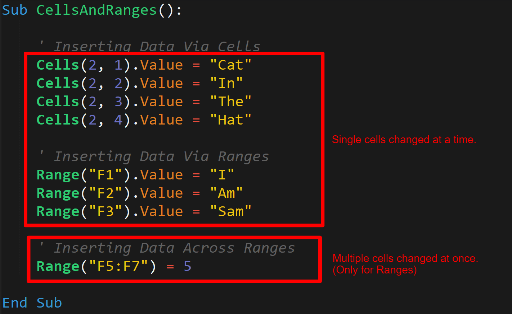

# Module 2 Class 1: Getting Started with VBA


## Overview

In today's class, the students will review how to create VBA macros to write data to cells, how to create variables and assign data types to variables with VBA, and how to implement logic and control programmatic flow using VBA. 

## Learning Objectives

By the end of class, students will be able to:
 
* Enable and create a simple macro in Excel
* Read and write data to cells and rows 
* Create variables and assign data types to variables
* Understand and write conditional statements
* Control programmatic flow with `for` loops. 

- - -

## Instructor Notes

* The activities in this class will complement Lessons **2.0.1 Make Your Way With VBA** through **2.2.4 Get DQ’s Yearly Return for 2018**.  The students will benefit from these activities if they‘ve progressed through these lessons, which cover the following concepts, techniques, and tasks: 

* Enable Macros
* Create a basic macro 
* Understand data types
* Demonstrate the use of variables and arrays in VBA
* Understand and create conditional `If-Then` and `If-ElseIf-Then` statements
* Understand and control programmatic flow using `for` loops
* Use logical and comparison operators in conditional statements 

## Slides

[VBA Day 1 slideshow](https://docs.google.com/presentation/d/1DsCujlDGCOooh3r5DW7rZmeCsCkOAOnYzss9sewZCHM/edit?ts=5faee0b3)

## Student Resources

Share the following [activity resources](https://2u-data-curriculum-team.s3.amazonaws.com/data-viz-online-lesson-plans/02-Lessons/2-1-Student-Resources.zip) with the students. 

- - - 

## Before Class 

### 0. Office Hours

| Activity Time: 0:30       |  Elapsed Time:     -0:30  |
|---------------------------|---------------------------|

<details>
  <summary><strong> 📣 0.1 Instructor Do: Office Hours</strong></summary>

* Before you begin class, hold office hours. Office hours should be driven by students. Encourage students to take full advantage of office hours by reminding them that this is their time to ask questions and get assistance from instructional staff as they learn new concepts.

* Expect that students may ask for assistance. For example: 

  * Further review on a particular subject
  * Debugging assistance
  * Help with computer issues
  * Guidance with a particular tool

</details>

- - - 

## During Class 

### 1. Getting Started

| Activity Time:       0:15 |  Elapsed Time:      0:15  |
|---------------------------|---------------------------|

<details>
  <summary><strong>📣 1.1 Instructor Do: Foundation Setting (0:10)</strong></summary>

* Welcome students to class.

* Direct students to post individual questions in Slack to be addressed by you and your TAs at the end of class.

* Open the slideshow and use slides 1-13 to walk through the foundation setting with your class. 

* **Big Picture:** This is an opportunity for students to zoom out and see the big picture of where they are in the program. Take a moment to mention some real-world examples that show the value of what they’re learning this week.

* **Boot Camp Pointers:** Talk through some of the key logistical items that will help students stay on track. This is an opportunity to speak to what students may need when they're at this particular point of the program. 

* **This Week - VBA and Stock Analysis:** Talk through the key skills that students will learn this week. 

  * Let the students know that they will set the foundation for core coding concepts that will help them perform more complex analyses down the road. During this week, they’ll learn how to programmatically analyze data by writing scripts that automate simple tasks. 

* **This Week's Challenge:** In this week's Challenge Assignment, students are asked to refactor code in order to make the VBA macro run more efficiently. Since many of our students do not have a background related to coding, the concept of refactoring will be new to them. 

   * We have explained that refactoring code is like rewriting the first draft of an essay. The first time the code is written, the focus should be on getting it to work correctly. After the first draft is complete, we can look to see how we could accomplish the same task with code that runs more quickly or is more easily understood. 
  
   * This is the first time in the course where we are asking the students to think outside of the box and evaluate their own decisions for improvements. Because this process is new to them, it can seem very daunting. We recommend taking the time to make them more comfortable with the idea of refactoring. 

* **Career Connection:** Let students know that many of them will use the skills covered this week throughout their careers. It's important for them to know the "why" behind what they’re doing. Provide examples of when these skills may be used in work or when you’ve used them in your workplace.

* **How to Succeed This Week:** Remind your students that they may have moments of frustration this week as they begin the course and learn new things, including how to budget their time. These moments are great for deepening their knowledge. Use the slide material to outline some of the topics they may find tricky in this module. Consider sharing something about your own learning journey. It helps students recognize that everyone starts somewhere and that they are not alone.

* **Today's Objectives:** Now, outline the concepts that will be covered in today's lesson. Remind students that they can find the relevant activity files in the Getting Ready for Class page of their course content. 

</details>

<details>
  <summary><strong>🎉 1.2 Everyone Do: Check-In (0:05)</strong></summary>

* Ask the class the following questions and call on students for the answers:

    * **Q:** How are you feeling about your progress so far?

    * **A:** Let them know that we are starting to build our skill set. It’s also okay to feel overwhelmed as long as you don’t give up.

    * **Q:** How comfortable do you feel with this topic? 

    * **A:** Let's do "fist to five" together. If you are not feeling confident, hold up a fist (0). If you feel very confident, hold up an open hand (5).

</details>

<sub>[Having issues with this section? Report a bug!](https://bit.ly/2Uib2Dp)</sub>

- - -

### 2. Cells and Ranges

| Activity Time:       0:10 |  Elapsed Time:      0:25  |
|---------------------------|---------------------------|

<details>
  <summary><strong>📣 2.1 Instructor Do: Cells And Ranges (0:10)</strong></summary>

* You may open up and use slides 14-21 to accompany the beginning of this next activity. 

* For the first demonstration, open [01-Ins_CellsAndRanges/Solved/cells_and_ranges.xlsm](Activities/01-Ins_CellsAndRanges/Solved/cells_and_ranges.xlsm) and run the `CellsAndRanges` macro; you can run it either by navigating to the Tools → Macro → Macros menu, or Developer → Macros from your workbook. Clear out the contents of `Sheet1` before you run the macro so everyone can see its effect. As you run the macro, explain to students that:

  * VBA provides two primary ways to modify the contents of a spreadsheet: `Cells` and `Ranges`.

  * `Cells` provide a numeric, coordinate-based method for referencing the cells of a spreadsheet. Point out to students that `Cells` are organized in a `(Row, Column)` format where integers 1, 2, 3 denote columns A, B, C, etc.

  * `Ranges` provide a more customary excel-based method for specifying cells of a spreadsheet. Ranges can be contiguous (e.g. `"F5:F7"`) or non-contiguous (e.g. `"R2,D2"`).

  * `.Value` is a method we add to the end of our `Cell` / `Range` references to specify that we want to change the content value of these cells. This is worth noting because it will ease the students’ realization that `Cells(X,X)` isn't just capturing the contents of the cell, but rather the entire "Cell Object," and with it, formatting, style, and other aspects of the cell beyond just its contents.

  * `Cells` only allow a developer to capture a single cell at a time, while `Ranges` allow us to capture multiple cells at once. For this reason, `Ranges` are used more often, but it can be especially useful to refer to Cells in "loop-based" programs because we can iterate the coordinates and manipulate the cells that are referenced. Let students know that they will get time to work on this concept as the week progresses.



* Send out the activity workbook [01-Ins_CellsAndRanges/Solved/cells_and_ranges.xlsm](Activities/01-Ins_CellsAndRanges/Solved/cells_and_ranges.xlsm) for students to refer to later.

* Ask the class the following questions and call on students for the answers:

    * **Q:** Where have we used this before?

    * **A:** We used the `Cells()` and `Range()` functions in Lesson 2.2.1 to create an analysis worksheet.

    * **Q:** How does this activity equip us for the Challenge?

    * **A:** We will need to use the `Cells()` and `Range()` functions to add data to a cell or to format cells.  

    * **Q:** What can we do if we don't completely understand this?

    * **A:** We can refer to the lesson plan and reach out to the instructional staff.

* Answer any questions before proceeding to the student activity.

</details>

<sub>[Having issues with this section? Report a bug!](https://bit.ly/3eRIWZ9)</sub>

- - - 


### 3. Variables

| Activity Time:       0:25 |  Elapsed Time:      0:50  |
|---------------------------|---------------------------|

<details>
  <summary><strong>📣 3.1 Instructor Do: Variables (0:05)</strong></summary>

* You may open up and use slides 22-35 to accompany the beginning of this next activity. 

* Next, transition to introducing variables. Begin your introduction by reminding students that variables are named items in programming: they can store strings (text), numerics (integers and doubles for decimals), booleans (true/false), and more. Then, open the Variables script in [02-Ins_Variables/Solved/variables.vbs](Activities/02-Ins_Variables/Solved/Variables.vbs).

* Walk students through each of the examples:

  * Point out that VBA uses the single quote (`'`) to denote a comment: everything that follows the single quote is a note added to describe what the code below the comment will accomplish.

    * Let the students know that this is a good time to begin practicing adding comments to code. Comments have two immediate benefits: 
      * First, they will help the students remember what the code does when they revisit it weeks or months from now. 
      * Second, if you share the code, it will let others know what each code segment accomplishes. 

  * Begin your discussion by breaking down the VBA syntax for creating variables. Explain that we create (declare) variables by using the `Dim` keyword followed by the name of the variable and the type `As String`.

  * Point out that we can then utilize these variables using their names.

  * We can "concatenate" strings by combining them, and we can perform mathematical functions by combining numeric variables with operators.

  * We can also use these variables to set the value of our cells.

  * Lastly, we can combine numerics and strings by first "casting" our numerics into string format using the `Str()` method (similarly, we can cast strings into integers using the `Int()` method).

  * See if there are any questions before running the script and then sharing it with students.

  

* Send out the activity files [02-Ins_Variables/Solved](Activities/02-Ins_Variables/Solved) for students to refer to later.

* Ask the class the following questions and call on students for the answers:

    * **Q:** Where have we used this before?

    * **A:** We covered variables and data types in Lesson 2.1.4.

    * **Q:** How does this activity equip us for the Challenge?

    * **A:** We will need to create variables and assign them a data type for the Challenge.

    * **Q:** What can we do if we don't completely understand this?

    * **A:** We can refer to the lesson plan and reach out to the instructional staff.

* Answer any questions before proceeding to the student activity.

</details>

<details>
  <summary><strong>🎉 3.2 Student Do: TypeRighter (0:15)</strong></summary>

* Next, proceed with the student exercise. In this exercise, the students will need to change the data types of variables so that the code runs without errors. 

* Open and run the [typerighter-solved.xlsm solution](Activities/03-Stu_TypeRighter/Solved/typerighter-solved.xlsm) to show the students the output before directing them to the instructions and starter files. 

* Make sure the students can download and open the [instructions](Activities/03-Stu_TypeRighter/README.md), the [starter Excel file](Activities/03-Stu_TypeRighter/Unsolved/typerighter-unsolved.xlsm), and the [starter VBA code](Activities/03-Stu_TypeRighter/Unsolved/typerighter.vbs) for this activity from the AWS link. 

  * Have them open the Visual Basic editor under the Developer Tab in the [starter file](Activities/03-Stu_TypeRighter/Unsolved/typerighter-unsolved.xlsm) or [starter VBA code](Activities/03-Stu_TypeRighter/Unsolved/typerighter.vbs) to see the code that they need to fix. 

* Answer any questions before breaking the students out in groups. 

* Divide students into groups of 3-5. They should work on the solution by themselves, but they can talk to others in their group to get tips.

* Let students know that they may be asked to share and walk through their work at the end of the activity.

</details>

<details>
  <summary><strong>⭐ 3.3 Review TypeRighter (0:05)</strong></summary>

* Once time is up, ask for volunteers to walk through their solution. 

* To encourage participation, you can open the [starter VBA code](Activities/03-Stu_TypeRighter/Unsolved/typerighter.vbs) and ask the students if each variable is the correct data type, and to explain why or why not.

* If there are no volunteers, open [03-Stu_TypeRighter/Solved/typerighter.vbs](Activities/03-Stu_TypeRighter/Solved/typerighter.vbs) and go through each line, explaining what the correct data type is for each variable.

* Send out the solution file [03-Stu_TypeRighter/Solved/typerighter.vbs](Activities/03-Stu_TypeRighter/Solved/typerighter.vbs) for students to refer to later.

* Ask the class the following questions and call on students for the answers:

    * **Q:** What data type would you give the following "Age" variable, `Age = '33'`? 

    * **A:** This would be a "String" variable because the number 33 is wrapped in single quotes. 

    * **Q:** What can we do if we don't completely understand this?

    * **A:** Practice creating variables and assigning them different data types.

* Answer any questions before proceeding to the next activity.

</details>

<sub>[Having issues with this section? Report a bug!](https://bit.ly/2IqbKMj)</sub>

### 4. Conditionals

| Activity Time:       0:25 |  Elapsed Time:      1:15  |
|---------------------------|---------------------------|

<details>
  <summary><strong> 📣 4.1 Instructor Do: Conditionals (0:05)</strong></summary>

* You may open up and use slides 36-46 to accompany the beginning of this next activity. 

* Next, open the files found in [04-Ins_Conditionals](Activities/04-Ins_Conditionals/Solved). Use these examples to walk students through the concept of conditionals as applied in VBA. As you do so, be sure to point out:

  * That VBA conditionals introduce a real benefit over traditional Excel formulas. Gone are the days of squeezing conditionals into a single Excel formula; with VBA, we have cleaner syntax and more nuanced conditionals.

  * In VBA, the syntax for conditionals involves `If`, `Then`, and `End If`. Additional keywords include `ElseIf` and `Else`.

  * In VBA, we can combine conditions by adding the keywords `And` and `Or`.

  * Finally, send these files to students so they can reference them for the final example:

    ```vb
      ' Simple Conditional Example
      ' ------------------------------------------
      If Range("A2").Value > Range("B2").Value Then
          MsgBox ("Num 1 is greater than Num 2")
      End If

      ' Simple Conditional with If, Else, and Elseif
      ' ------------------------------------------
      If Range("A5").Value > Range("B5").Value Then
          MsgBox ("Num 3 is greater than Num 4")

      ElseIf Range("A5").Value < Range("B5").Value Then
          MsgBox("Num 4 is greater than Num 3")

      Else
          MsgBox("Num 3 and Num 4 are equal")

      End If
    ```

* Send out the activity files [04-Ins_Conditionals](Activities/04-Ins_Conditionals/Solved) for students to refer to later.

* Ask the class the following questions and call on students for the answers:

    * **Q:** Where have we used this before?

    * **A:** We wrote a conditional statement to check if the value of the cell in the first column was "DQ" in Lesson 2.2.3.

    * **Q:** How does this activity equip us for the Challenge?

    * **A:** We will need to write a conditional statement to check if the row we are currently on is the last row with the current stock. 

    * **Q:** What can we do if we don't completely understand this?

    * **A:** We can refer to the lesson plan and reach out to the instructional staff.

* Answer any questions before proceeding to the student activity.


</details>

<details>
  <summary><strong> ✏️ 4.2 Students Do: Choose Your Story (0:15)</strong></summary> 

* In this exercise, students are tasked with creating a simple game that outputs a message box based on the user's input number.


* Open the [choose_your_story.xlsm solution](Activities/05-Stu_ChooseYourStory/Solved/choose_your_story.xlsm) and run the macro to show them what they will be creating.

* Make sure the students can download and open the [instructions](Activities/05-Stu_ChooseYourStory/README.md) and the [starter Excel file](Activities/05-Stu_ChooseYourStory/Unsolved/choose_your_story.xlsm) for this activity from the AWS link. 

* Answer any questions before breaking the students out in groups. 

* Divide students into groups of 3-5. They should work on the solution by themselves, but they can talk to others in their group to get tips.

* Let students know that they may be asked to share and walk through their work at the end of the activity.

</details>

<details>
  <summary><strong> ⭐ 4.3 Review: Choose Your Story (0:05)</strong></summary>

* Once time is up, ask for volunteers to walk through their solution. 

* To encourage participation, live code the solution and ask for volunteers to complete the conditional statements as you're writing the code. 

* If there are no volunteers, open the files found in [05-Stu_ChooseYourStory](Activities/05-Stu_ChooseYourStory) to guide students. Remind students about VBA conditional syntax and walk them through the simple logic.

* Answer any remaining questions before providing students with the solution.

```vb
  ' Use conditionals to change message box based on user input
  If (Range("B1").Value = 1) Then
      MsgBox("You choose to enter the wooded forest of doom!")

  Elseif (Range("B1").Value = 2) Then
      MsgBox("You choose to enter the fiery volcano of doom!")

  Elseif (Range("B1").Value = 3) Then
      MsgBox("You choose to enter the terrifying jungle of doom!")

  Elseif (Range("B1").Value = 4) Then
      MsgBox("You choose to enter the bathroom")

  Else
      MsgBox("Try following directions")

  End If
```

* Send out the solution files [05-Stu_ChooseYourStory](Activities/05-Stu_ChooseYourStory) for students to refer to later.

* Ask the class the following questions and call on students for the answers:

    * **Q:** Will the program run correctly if you don't add the `.Value` at the end of the `Range()` method? Why or why not?

    * **A:** Yes. Although we are changing the value in cell "B1," the conditional statement checks for the condition regardless. 

    * **Q:** What can we do if we don't completely understand this?

    * **A:** Practice removing the `.Value` at the end of the `Range()` method and running the program.

* Answer any questions before proceeding to the next activity.


</details>

<sub>[Having issues with this section? Report a bug!](https://bit.ly/2Ix9xyI)</sub>

### 5. For Loops

| Activity Time:       0:30 |  Elapsed Time:      1:45  |
|---------------------------|---------------------------|

<details>
  <summary><strong> 📣 5.1 Instructor Do: For Loop (0:05)</strong></summary>

* Next, you'll review `for` loops. You'll run a simple VBA script that inserts a series of numbers across rows and columns.  You may open up and use slides 47-53 to accompany the beginning of this next activity. 

* Open up the [basic_for_loop.xlsm solution](Activities/06-Ins_ForLoops/Solved/basic_for_loop.xlsm), then click on the Developer Tab and show the students the macro script. 

* When explaining the code, be sure to note the parts of a VBA `for` loop.

  * `For i = 1 to 20` specifies the range to loop through.

  * Subsequent uses of `i` change with the loop

  * `Next i` iterates to the next value of `i`.

* Next, run the macro script in the Developer Tab, then show the students the output in the [spreadsheet](Activities/06-Ins_ForLoops/Solved/basic_for_loop.xlsm).

* Take a few extra moments in your discussion to have students guess how the spreadsheet will look before running the code. In particular, challenge them to understand why `Cells(i, 1)` creates entries across rows and `Cells(1, i)` create entries across columns.


* Once you feel confident in their understanding, provide them with your code.

* Ask the class the following questions and call on students for the answers:

    * **Q:** Where have we used this before?

    * **A:** We used a `for` loop to calculate the daily volume in 2018 in Lesson 2.2.3.

    * **Q:** How does this activity equip us for the Challenge?

    * **A:** We will need to create `for` loops to iterate through the stock tickers to get the stock volume and the starting and ending stock prices.

    * **Q:** What can we do if we don't completely understand this?

    * **A:** We can refer to the lesson plan and reach out to the instructional staff.

* Answer any questions before proceeding to the student activity.

</details>

<details>
  <summary><strong>🎉 5.2 Everyone Do: Chicken Nugget Loop (0:25)</strong></summary>

* In this exercise, students are asked to create a VBA script with a `for` loop that prints "I will eat `i` Chicken Nuggets," where the value of `i` changes within the `for` loop. 

* The students will work independently for the first 10-15 minutes before participating in student-led live coding.

* Open the [chicken_nuggets.xlsm solution](Activities/07-Evr_ChickenNuggets/Solved) and run the macro to show them what everyone will be creating.

* Make sure the students can download and open the [instructions](Activities/07-Evr_ChickenNuggets/README.md) and the [starter Excel file](Activities/07-Evr_ChickenNuggets/Unsolved/chicken_nuggets.xlsm) for this activity from the AWS link. 

* Let the students work on their solution in the main classroom for 10 minutes, then open the [starter Excel file](Activities/07-Evr_ChickenNuggets/Unsolved/chicken_nuggets.xlsm), create a macro, and ask for volunteers to help you code the `for` loop for the range of the cells from 1 to 10. 

* Next, have another volunteer help you code to add `"I will eat "` in the first cell of each row.

* Continue this process until the solution is complete.

  

* Next, ask the class the following question: why would we want to use a `for` loop instead of the `Range()` function?

  * If time permits, instruct the students to use the `Range()` function instead of a `for` loop to solve the activity. Give the students a few minutes to work on this solution.
  
  * When time is up, or if you are short on time, open up the [chicken_ranges.vbs solution](Activities/07-Evr_ChickenNuggets/Solved/chicken_ranges.vbs) and show the students how this activity might be written using the `Range()` function. Go over the following answers if the students haven't answered already. 

  * Explain that with the `for` loop, we can control the programmatic flow much better than with the `Range()` function, where we  need to specify the cells and the values for each cell. For example, to add more rows on the spreadsheet, we only need to increase the counter of the `for` loop using the `Cells()` function, whereas we have to write out every additional row using the `Range()` function.
  
  * And, there is a greater chance for coding errors with the `Range()` function because there is more coding than with a `for` loop. Additionally, the script is longer with the `Range()` function, which makes this approach inefficient. 

* Send the students [chicken_ranges solution files](Activities/07-Evr_ChickenNuggets/Solved) so they can compare the differences between the two solutions.

* Answer any questions before ending class.

</details>

<sub>[Having issues with this section? Report a bug!](https://bit.ly/3kobTgg)</sub> 

### 6. Ending Class 

| Activity Time:       0:05 |  Elapsed Time:      1:50  |
|---------------------------|---------------------------|

<details>
  <summary><strong>📣  6.1 Instructor Do: Review (0:05)</strong></summary>

* Before ending class, review the skills that were covered today and mention where in the module these skills are introduced. 
  * Creating variables was covered in **Lesson 2.1.4**.
  * Adding values to cells using the `Cells()` and `Range()` functions was covered in **Lesson 2.2.1**.
  * Conditional statements and `for` loops were covered in **Lesson 2.2.3**.

* Answer any questions the students may have.

* Finally, encourage your class to begin the Challenge as soon as possible, if they have not already begun, and to use the Learning Assistants channel and pre-scheduled Office Hours with their instructional team for help as they progress through their work. If they feel like they need context to understand documentation or instructions throughout the week, this is where they can get it. 

</details>

---

© 2021 Trilogy Education Services, LLC, a 2U, Inc. brand.  Confidential and Proprietary.  All Rights Reserved.