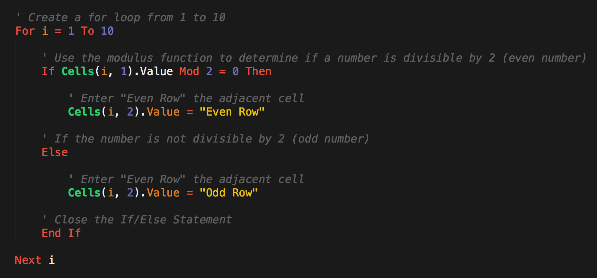
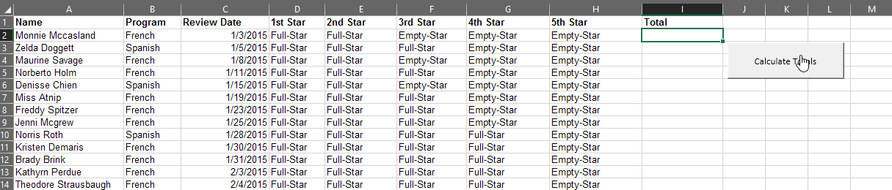

# Module 2 Class 2: Loops, Conditionals, and Interactive Buttons


## Overview

First, walk through this week's Challenge assignment in office hours, then in class the students will review `for` loops and conditionals, dive into nested `for` loops, create interactive buttons using a macro, and format cells based on conditions.  

## Learning Objectives

By the end of class, students will be able to:

* Analyze a problem and create VBA code to solve that problem
* Create nested `for` loops and/or conditionals
* Demonstrate the value of VBA ability to extend Excel’s functionality
* Create interactivity with buttons
* Format cells with VBA

- - -

## Instructor Notes

* The activities in this class will complement Lessons **2.3.1 Create a New Worksheet and Subroutine** through **2.5.1 Make a Run Button**.  The students will benefit from these activities if they‘ve progressed through these lessons, which cover the following concepts, techniques, and tasks: 

    * Understand and use arrays and indices
    * Use `for` loops to access data in nested arrays
    * Debug code 
    * Format cells based on a condition
    * Create interactive features like buttons


## Slides

[VBA Day 2 slideshow](https://docs.google.com/presentation/d/1VXO2t8Py1FV2FWHqcIsdWlGIfCmT9JwmOCpQ4MQ1g4Y/edit?usp=sharing)

## Student Resources

Share the following [activity resources](https://2u-data-curriculum-team.s3.amazonaws.com/data-viz-online-lesson-plans/02-Lessons/2-2-Student-Resources.zip) with the students. 


- - - 

## Before Class

### 0. Office Hours

| Activity Time: 0:30       |  Elapsed Time:     -0:30  |
|---------------------------|---------------------------|

Use the office hours content below to support student's mastery of this week's topics.

<details>
  <summary><strong>📣 0.1 Instructor Do: Challenge Instruction Walk-through</strong></summary>

Open the Challenge in Canvas and go through the high-level instructions and requirements with your class. Be sure to check for understanding.

Open the Rubric in Canvas, go through the Mastery column with your class, and show how it maps back to the requirements for each deliverable. Be sure to check for understanding.

Review the following tips to ensure clarity on the Challenge:

For **Deliverable 1: Refactor VBA Code and Measure Performance**, students will refactor the solution from Module 2 to make the code run faster and improve efficiency.

Go over the [Module 2 solution VBA script](../../../01-Assignments/02-Wall-Street/Solution/async_solution.vbs) and compare it to the [VBA Challenge starter code](../../../01-Assignments/02-Wall-Street/Resources/challenge_starter_code.vbs). There are commented sections where students will be adding the refactored code.

This will be the first time that students will need to refactor code. Let them know that they will be doing this a lot in the coming weeks and after they finish the course.

Let the students know that refactoring is common on the job, as first attempts at code won’t always be the best way to accomplish a task. Sometimes, refactoring code that was written by someone else will be your entry point to working with the existing code at a job.

Students can think of refactoring as rewriting a draft of an essay. The first time we write code, our focus is on getting it to work correctly. After we’re done with the first “draft” of code, we can look to see how we could have accomplished the same task with different code, which may run more quickly or be easier to understand. Therefore, refactoring is the process of accomplishing the same task with our code, just more efficiently.

For **Deliverable 2: Written Analysis of Results**, the learners will write an analysis report in the repository README.md file, just like they did in Module 1.

Encourage your class to begin the Challenge as soon as possible, if they haven’t already, and to use the Learning Assistants channel and prescheduled Office Hours with their instructional team for help as they progress through their work. If they feel like they need context throughout the week to understand documentation or instructions, this is where they can get it.

Open the floor to discussion and be sure to answer any questions that students may have about the Challenge requirements before moving on to other areas of interest.
</details>

<details>
  <summary><strong> 📣 0.2 Instructor Do: Office Hours</strong></summary>

* Before you begin class, hold office hours. Office hours should be driven by students. Encourage students to take full advantage of office hours by reminding them that this is their time to ask questions and get assistance from instructional staff as they learn new concepts.

* Expect that students may ask for assistance. For example: 

  * Further review on a particular subject
  * Debugging assistance
  * Help with computer issues
  * Guidance with a particular tool

</details>


- - -

## During Class 

### 1. Getting Started

| Activity Time:       0:10 |  Elapsed Time:      0:10 |
|---------------------------|---------------------------|


<details>
  <summary><strong>📣 1.1 Instructor Do: Foundation Setting (0:05)</strong></summary>

* Welcome students to class.

* Direct students to post individual questions in the Zoom chat to be addressed by you and your TAs at the end of class.

* You may open the slideshow and use slides 1-7 to assist you as you walk through the foundation setting with your class. 

* **This Week - Deeper Dive with Excel:** Talk through the key skills that students will learn this week, and let them know that they are continuing to build on their data analyst skills. 

* **Today's Objectives:** Now, outline the concepts covered in today's lesson. Remind students that they can find the relevant activity files in the “Getting Ready for Class” page in their course content. 

</details>

<details>
  <summary><strong>🎉 1.2 Everyone Do: Check-In (0:05)</strong></summary>

* Ask the class the following questions and call on students for the answers:

    * **Q:** How are you feeling about your progress so far?

    * **A:** Let them know that we are starting to build their skill set. It’s also okay to feel overwhelmed as long as you don’t give up.

    * **Q:** How comfortable do you feel with this topic? 

    * **A:** Let's do "fist to five" together. If you are not feeling confident, hold up a fist (0). If you feel very confident, hold up an open hand (5).

</details>

<sub>[Having issues with this section? Report a bug!](https://bit.ly/2JYNema)</sub>

- - -

### 2. Looped Conditionals 

| Activity Time:  0:30 |  Elapsed Time: 0:40  |
|----------------------|----------------------|

<details>
  <summary><strong> 📣  2.1 Instructor Do: Loop Conditionals (0:05)</strong></summary>

* Let the students know that you are going to review looped conditionals. As a proficient developer, you’ll be familiar with this simple concept, but do not underestimate how critical it is for students to grasp.

* You may open up and use slides 8-17 to accompany this activity. 

* Open [01-Ins_LoopConditionals/Solved/conditional_loops.vbs](Activities/01-Ins_LoopConditionals/Solved/conditional_loops.vbs) and walk students through the code. Have them guess what it will do before running the code.

* Then, explain it line by line.

  * Start by pointing out the basic `for` loop structure.

  * Then, introduce the concept of the modulus to determine remainder.

  * Point out that we are using `if-else` statements to route the flow of logic depending on whether `i` is even or odd.

  * Point out that we need to include the `End If` and also the `Next i` to close each respective block.

  

* Once finished, send your completed file to students in Slack.

* Ask the class the following questions and call on students for the answers:

    * **Q:** Where have we used this before?

    * **A:** We used a looped conditional to check if the value of a cell in the first column was "DQ" when we looped through all the rows in Lesson 2.2.3.

    * **Q:** How does this activity equip us for the Challenge?

    * **A:** We will need to create a looped conditional to check what rows contain a specific stock index when we loop over all the rows.

    * **Q:** What can we do if we don't completely understand this?

    * **A:** We can refer to the lesson plan and reach out to the instructional staff.

* Answer any questions before proceeding to the student activity.

</details>

<details>
  <summary><strong>👥  2.2 Partner Do: Fizz Buzz (0:20)</strong></summary>
 
* In this exercise, the students will work in pairs on a very popular logic problem in coding, Fizzbuzz, which is often given in technical interviews across all programming languages. 

* Open the [Activities/02-Par_FizzBuzz/Solved/fizzbuzz.xlsm](Activities/02-Par_FizzBuzz/Solved/fizzbuzz.xlsm) file and run the code once so that they can see how it works.

  

* Explain the rules of the exercise at a high level:

  * If a number is divisible by just 3, then the code should print Fizz.

  * If a number is divisible by just 5, then the code should print Buzz.

  * If a number is divisible by both 3 and 5, then the code should print FizzBuzz.

* Make sure the students can download and open the [instructions](Activities/02-Par_FizzBuzz/README.md) and the [starter Excel file](Activities/02-Par_FizzBuzz/Unsolved/fizzbuzz.xlsm) from the AWS link. 

* Answer any questions before breaking the students out in pairs. 

* Divide students into groups of two. 

* Let students know that their group may be asked to share and walk through their work at the end of the activity.

</details>

<details>
  <summary><strong> ⭐ 2.3 Review Fizz Buzz (0:05)</strong></summary>

* Once time is up, ask for a group to walk through their solution. 

* To encourage participation, you can live code the VBA script and ask for groups to help you complete the code as you write it out.  

* If there are no volunteers, open the solution files found in [02-Par_FizzBuzz/Solved](Activities/02-Par_FizzBuzz/Solved) to guide the students. 

* Walk the students through the solution. As you do, be sure to explain:

  * We started the exercise by creating a basic `for` loop.

  * We then created a variable to track the value of the number in column 1.

  * We then created a series of `If-Then` statements. 
  
    * First, we started by checking for numbers that are divisible by both 3 and 5. It is important to start here because `If-Then` statements move from least specific to most specific: if a number is divisible by both 3 and 5, it is also divisible by 3. 
    * Next, we have to make sure our code handles the more specific scenarios: if a number is divisible by 3, then if a number is divisible by 5. 
    * Let the students know that this isn't an obvious solution; instead, it’s something that emerges as you approach your code.
    * Each of our `If-Then` statements triggers a change to `Cells(i, 2)` (column 2).

    ```vb
      ' Loop through the values in Column 1
      For i = 2 To 100

          'Set cell value to variable
          num = Cells(i, 1).Value


          ' Check if the number is divisible by 3 and 5....
          If (num Mod 3 = 0 And num Mod 5 = 0) Then

              ' If so, print Fizzbuzz
              Cells(i, 2).Value = "Fizzbuzz"

          ' Check if the number is divisible by just 3...
          ElseIf (num Mod 3 = 0) Then

              ' If so, print "Fizz"
              Cells(i, 2).Value = "Fizz"

          ' Check if the number is divisible by just 5...
          ElseIf (num Mod 5 = 0) Then

              ' If so, print "Buzz"
              Cells(i, 2).Value = "Buzz"

          End If

      Next i
    ```
* Send out the files to the solution [02-Par_FizzBuzz/Solved](Activities/02-Par_FizzBuzz/Solved) for students to refer to later.

* Ask the class the following questions and call on students for the answers: 

    * **Q:** What can we do if we don't completely understand this?

    * **A:** Break up the code in chunks. First, write an `If-Then` statement that checks if a number is only divisible by 3 and 5. Then, write an `If-Then` statement that checks if a number is only divisible by 3, and so on. 

* Answer any questions before proceeding to the next activity.

</details>

<sub>[Having issues with this section? Report a bug!](https://bit.ly/2IrRjPk)</sub>


### 3. Nested For Loops

| Activity Time:  0:25 |  Elapsed Time: 1:05  |
|----------------------|----------------------|

<details>
  <summary><strong> 📣  3.1 Instructor Do: Nested For Loops (0:05)</strong></summary>

* Next, let the students know that they are going to continue working with `for` loops. For this demonstration, you'll review nested `for` loops. Like looped conditionals, this is an extremely important concept and one that can easily confuse students. Encourage them to focus on this section. 

* You may open up and use slides 18-25 to accompany this activity.

* Open the `vbs` code file and spreadsheet in the [Activities/03-Ins_NestedForLoops/Solved](Activities/03-Ins_NestedForLoops/Solved) folder and show both to the students. 

* Point out that in this example, we are looking to loop through both the rows and the columns of the spreadsheet. Try to highlight cells as you try to simulate the actions of each loop. Begin at the top left and move across the columns before proceeding to the next row.

  

* Once finished, send out the activity files [03-Ins_NestedForLoops/Solved](Activities/03-Ins_NestedForLoops/Solved) for students to refer to later.

* Encourage students to re-do the activity in their groups if they have time after the follwoing "Student Do" activity.

* Ask the class the following questions and call on students for the answers:

    * **Q:** Where have we used this before?

    * **A:** We created a nested `for` loop to loop through the tickers array and run the analysis with a `for` loop in Lesson 2.3.2.

    * **Q:** How does this activity equip us for the Challenge?

    * **A:** We won't need to create a nested `for` loop in the Challenge, but understanding the concepts of nested `for` loops is beneficial right now because we will use them later in modules using Python or JavaScript. 

    * **Q:** What can we do if we don't completely understand this?

    * **A:** We can refer to the lesson plan and reach out to the instructional staff.

* Answer any questions before proceeding to the student activity.
</details>

<details>
  <summary><strong>🎉 3.2 Everyone Do: Stars Counter (0:20)</strong></summary> 

* In this exercise, the students will have access to an Excel spreadsheet containing 50 rows of "review data" for two online language learning programs, Spanish and French. Using their knowledge of VBA, it is up to them to determine the total number of stars that each user gave their respective program, and then find the total number of stars both programs received.

  

* Open the [star_counter.xlsm solution](Activities/04-Evr_StarsCounter/Solved/star_counter_with_VBA.xlsm) and run the macro to show them what they will be creating.

* Next, go over the [instructions](Activities/04-Evr_StarsCounter/README.md) with the students and check for understanding.

* Make sure the students can download and open the [instructions](Activities/04-Evr_StarsCounter/README.md), the [starter Excel file](Activities/04-Evr_StarsCounter/Unsolved/star_counter.xlsm), and the [starter VBS file](Activities/04-Evr_StarsCounter/Unsolved/star_counter_starter.vbs) from the AWS link.

* Let the students work on their solution for 5 minutes, then open the [starter VBS file](Activities/04-Evr_StarsCounter/Unsolved/star_counter_starter.vbs) and ask for volunteers to code for the variable to hold the `StarCounter` and for the `for` loop. 

  * If students are stuck, explain that the first `for` loop loops through rows 2 to 51.

* Let students continue working on their solution. After 5 minutes, ask for volunteers to code for the next steps: initializing the `StarCounter` and the second `for` loop. 

  * If students are stuck, explain that the second `for` loop loops through each star column (4-8).

* Let students continue working on their solution. After 5 minutes, ask for volunteers for the solution to the conditional statement and the code to print the total in column I. 

  * If students are stuck, let the students know that every time we find a "Full-Star" value within a column, we add one to our `StarCounter`; and outside the conditional statement, the value of `StarCounter` is placed within a new cell after the conclusion of the second loop, and then we move onto the next value in the first loop.

  

* If time permits, go over the bonus, but first ask for volunteers to come forward to share their answers to the following questions: 

    * **Q:** Who used VBA to determine the last row automatically?
    * **Q:** Who created the bar and line charts?

* For the bonus, open up [04-Evr_StarsCounter/star_counter_bonus.vbs](Activities/04-Evr_StarsCounter/Solved/star_counter_bonus.vbs) and run through the code with your class, fielding whatever questions they may have.

  * Point out that this part of the code, 

  ```vb
  ' Loop through each row
  for i = 2 to 51

  ```

  * can be replaced with this code.

  ```vb
  'Counts the number of rows
  lastrow = Cells(Rows.Count, 1).End(xlUp).Row
 
  ' Loop through each row
  ' Use lastrow variable instead of 51
  For i = 2 To lastrow

  ```

* Next, walk through creating the line and bar charts for the class. 

* Send out the solution files to the students. Then, ask the class the following questions and call on students for the answers:

    * **Q:** What can we do if we don't completely understand nested `for` loops?

    * **A:** We can refer to the lesson plan and do the Skill Drill at the end of the page in Lesson 2.3.2, and we can reach out to the instructional staff.   

* Answer any questions before proceeding to the next activity.


</details>

<sub>[Having issues with this section? Report a bug!](https://bit.ly/3eQZrEJ)</sub>


### 4. Creating Buttons

| Activity Time:  0:25 |  Elapsed Time: 1:30  |
|----------------------|----------------------|

<details>
  <summary><strong> 📣 4.1 Instructor Do: Button Clicks (0:05)</strong></summary>

* For the next activity, let the students know that you are going to show them how to create form control buttons that will automate a macro when the button is clicked.

* You may open up and use slides 26-30 to accompany this activity.

* Open the spreadsheet in the [05-Ins_ButtonClicks](Activities/05-Ins_ButtonClicks/Solved) folder and show the students the VBS code and spreadsheet. 

* Next, return to the Developer tab to show students how to add a button to their spreadsheet. The Mac view is slightly different, so be sure to patiently support students on both operating systems. Click on the "Button" to create the button.

  

* Once the button is created, you will be asked to "Assign a Macro to the button.” You can choose to create a new macro or select an existing one. If you accidentally close this window, you can always return to it by right-clicking your button and selecting "Assign Macro." 

  

* After the button is created, click the button. You will see that the button is associated with a macro that simply prints "You clicked me" when pressed.

  

* Send out the activity files in the [05-Ins_ButtonClicks](Activities/05-Ins_ButtonClicks/Solved) folder for students to refer to later.

* Ask the class the following questions and call on students for the answers:

    * **Q:** Where have we used this before?

    * **A:** We created a form control button to clear the worksheet in Lesson 2.5.1.

    * **Q:** How does this activity equip us for the Challenge?

    * **A:** We will need to create form control buttons that ask us to clear the worksheet and run the analysis.

    * **Q:** What can we do if we don't completely understand this?

    * **A:** We can refer to the lesson plan and reach out to the instructional staff.

* Answer any questions before proceeding to the student activity.

</details>

<details>
  <summary><strong> ✏️ 4.2 Students Do: Choose Your Button (0:15)</strong></summary>

* In this exercise, the students will be running a subroutine of their own to trigger two buttons that elicit different messages when clicked.

* Next, open the Excel file in [06-Stu_ChooseYourButton/Solved/choose_your_button.xlsm](Activities/06-Stu_ChooseYourButton/Solved/choose_your_button.xlsm) and run the macro to show the students what they will be creating.

* Next, go over the [instructions](Activities/06-Stu_ChooseYourButton/README.md) with the students and check for understanding.

* Make sure the students can download and open the [instructions](Activities/06-Stu_ChooseYourButton/README.md) and the [starter Excel file](Activities/06-Stu_ChooseYourButton/Unsolved/choose_your_button.xlsm) for this activity from the AWS link. 

* Answer any questions before breaking the students out in groups.

* Divide students into groups of 3-5. They should work on the solution by themselves, but they can talk to others in their group to get tips.

* Let students know that they may be asked to share and walk through their work at the end of the activity. 

</details>

<details>
  <summary><strong> ⭐ 4.3 Review Choose Your Button  (0:05)</strong></summary>

* Once time is up, bring the students back from their groups and ask for a volunteer, or identify a group that can share their work for a walk-through. Remind them that it is perfectly alright if they didn't finish the activity.

* Open up [Activities/06-Stu_ChooseYourButton/Solved/choose_your_button.vbs](Activities/06-Stu_ChooseYourButton/Solved/choose_your_button.vbs) and walk the students through the VBA script. As you do, point out:

  * We created two VBA subroutines, one for each button.

  * Return to the Excel solution file and point out that each button is associated with a different subroutine.

  * Answer any questions before proceeding to the next example.

  

* Send out the solution files in the [06-Stu_ChooseYourButton/Solved](Activities/06-Stu_ChooseYourButton/Solved) folder for students to refer to later.

* Ask the class the following questions and call on students for the answers:

    * **Q:** What can we do if we don't completely understand this?

    * **A:** Practice creating simple buttons that do basic tasks such as addition or subtraction, and once the button is clicked the answer is returned in the message box.

* Answer any questions before proceeding to the next activity.


</details>

<sub>[Having issues with this section? Report a bug!](https://bit.ly/2IqixFN)</sub>

### 5. VBA Formatting

| Activity Time:  0:25 |  Elapsed Time: 1:55  |
|----------------------|----------------------|


<details>
  <summary><strong> 📣 5.1 Instructor Do: VBA Formatting (0:05)</strong></summary>

* For the last activity, let the students know that not only can we use VBA to change the values within cells, but we can also code in formatting fairly easily using a variety of functions.

* You may open up and use slides 31-36 to accompany this activity.

* Open the spreadsheet in the [07-Ins_Formatter/formatter.xlsm](Activities/07-Ins_Formatter/Solved/formatter.xlsm) within Excel and explain to your students how we will be using VBA to fill each of these cells with their respective colors.

  


  * Within the VBA editor, write the following code...

  ```vb
  Sub formatter()

    ' Set the Font color to Red
    Range("A1").Font.Color = vbRed

    ' Set the Cell Colors to Red
    Range("A2:A5").Interior.Color = vbRed

  ```

* Check to see if your students can guess what this code will do once run.

  

  * The text in cell A1 will be colored red.

  * The interiors of cells A2 to A5 will be filled with red as well.

* Now have your students help you create the code that will color columns B, C, and D.

  

  * Point out how the code is mostly the same as painting the cells red, with the only values changing being the cells referenced and the color value.

* Check with your students to see if they have any questions regarding VBA formatting.

* Send out the activity files in the [07-Ins_Formatter/Solved](Activities/07-Ins_Formatter/Solved) folder for students to refer to later.

* Ask the class the following questions and call on students for the answers:

    * **Q:** Where have we used this before?

    * **A:** We applied color to the cells based on conditions in Lesson 2.4.2.

    * **Q:** How does this activity equip us for the Challenge?

    * **A:** We will need to color the cells in the "Return" column based on a whether the total daily return is positive or negative.

    * **Q:** What can we do if we don't completely understand this?

    * **A:** We can refer to the lesson plan and reach out to the instructional staff.

* Answer any questions before proceeding to the student activity.

</details>

<details>
  <summary><strong> ✏️ 5.2 Students Do: VBA GradeBook (0:15)</strong></summary>

* In this exercise, the students are going to create an Excel application that checks a fictional student's grade and performs some actions based upon the grade.

  

* Open the Excel file in [08-Stu_Gradebook/Solved/grader.xlsm](Activities/08-Stu_Gradebook/Solved/grader.xlsm) and run the macro to show them what they will be creating.

* Next, go over the [instructions](Activities/08-Stu_Gradebook/README.md) with the students and check for understanding.

* Make sure the students can download and open the [instructions](Activities/08-Stu_Gradebook/README.md) and the [starter Excel file](Activities/08-Stu_Gradebook/Unsolved/grader.xlsm) for this activity from the AWS link.  

* Answer any questions before breaking the students out in groups.

* Divide students into groups of 3-5. They should work on the solution by themselves, but they can talk to others in their group to get tips.

* Let students know that they may be asked to share and walk through their work at the end of the activity. 


</details>

<details>
  <summary><strong> ⭐ 5.3 Review GradeBook (0:05)</strong></summary>

* Once time is up, bring the students back from their groups and ask for a volunteer, or identify a group that can share their work for a walk-through. Remind them that it is perfectly alright if they didn't finish the activity.

* Open up [08-Stu_Gradebook/Solved/grader.xlsm](Activities/08-Stu_Gradebook/Solved/grader.xlsm) and run through the code with your class, fielding whatever questions they may have.

* In your discussion of the solution, make sure to point out the following:

  * Point out how you are modifying the formatting/value of cells C2 and D2 based upon the value stored within B2. When the value of B2 changes, so too does the formatting/value of cells C2 and D2.

  * Due to the number of possible inputs, our code includes plenty of conditionals to account for every new letter grade.

  * For the bonus, the code only needs to collect the previous values of B2, C2, and D2 before moving them into three new cells, then clear the information held in row 2.

  

* Send out the solution files in the [08-Stu_Gradebook/Solved](Activities/08-Stu_Gradebook/Solved) folder for students to refer to later.

* Ask the class the following questions and call on students for the answers:

     * **Q:** Most grading standards consider Failing at `<= 59`, and grades between 60-69 are assigned a "D". How would you change the script to account for these standards? 

    * **A:** Open up the [grader_calculate_D.vbs solution](Activities/08-Stu_Gradebook/Solved/grader_calculate_D.vbs) and show the students how you would account for grades A, B, C, D, and F.
    
    * **Q:** What can we do if we don't completely understand this?

    * **A:** We can refer to the lesson plan and reach out to the instructional staff.

* Answer any questions before ending class.

</details>

<sub>[Having issues with this section? Report a bug!](https://bit.ly/2IthDby)</sub>


### 6. Ending Class 

| Activity Time:       0:05 |  Elapsed Time:      2:00  |
|---------------------------|---------------------------|

<details>
  <summary><strong>📣  6.1 Instructor Do: Review (0:05)</strong></summary>

* Before ending class, review the skills that were covered today and mention where in the module these skills are introduced. 
  * Conditional statements and `for` loops were covered in **Lesson 2.2.3**.
  * Nested `for` loops were covered in **Lesson 2.3.2**.
  * Adding color to cells using conditionals was covered in **Lesson 2.4.2**.
  * Form control buttons were covered in **Lesson 2.5.1**.

* Answer any questions the students may have.

</details>

- - -

© 2021 Trilogy Education Services, LLC, a 2U, Inc. brand.  Confidential and Proprietary.  All Rights Reserved.