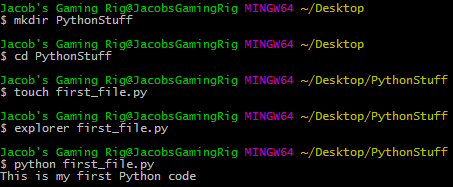
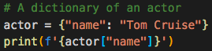

# Module 3 Class 1: Python Fundamentals

## Overview

This week, we will be introducing the Python programming language. In this unit, students will learn to use the core Python language  to store and manipulate data, how to read and write to files, and how to "translate" logical solutions to problems.

In today's class, students will make sure Python is installed correctly, then they'll review how to create and execute Python files, create variables and determine the data types of variables, perform calculations using Python, work with lists and dictionaries, and use the Python `print()` function to print information to the screen. 

## Learning Objectives

By the end of class, students will be able to:
 
* Verify that Python is installed correctly
* Understand Python data types
    * Variables
    * Lists
    * Dictionaries
* Understand printing formats


- - -

## Instructor Notes

* The activities in this class will complement Lessons **3.0.1 Power of Python** through **3.2.11 Printing Formats**.  The students will benefit from these activities if they‘ve progressed through these lessons, which cover the following concepts, techniques, and tasks: 

* Create a Python file
* Execute Python files 
* Assign variables
* Understand Python data types
* Perform calculations using Python
* Create and retrieve data from lists
* Create and retrieve data from tuples
* Create and retrieve data from dictionaries
* Use the `print()` function to print data to the screen 


## Slides

[Python Day 1 slideshow](https://docs.google.com/presentation/d/1JDUygDzA4knEBo6_KaXWAqsuYe9rSpsO0qQdv2HpVcQ/edit?usp=sharing)

## Student Resources

Share the following [activity resources](https://2u-data-curriculum-team.s3.amazonaws.com/data-viz-online-lesson-plans/03-Lessons/3-1-Student-Resources.zip) with the students. 


- - - 

## Before Class

### 0. Office Hours

| Activity Time: 0:30       |  Elapsed Time:     -0:30  |
|---------------------------|---------------------------|

<details>
  <summary><strong> 📣 0.1 Instructor Do: Office Hours</strong></summary>

* Before you begin class, hold office hours. Office hours should be driven by students. Encourage students to take full advantage of office hours by reminding them that this is their time to ask questions and get assistance from instructional staff as they learn new concepts.

* Expect that students may ask for assistance. For example: 

  * Further review on a particular subject
  * Debugging assistance
  * Help with computer issues
  * Guidance with a particular tool

</details>

- - - 

## During Class 

### 1. Getting Started

| Activity Time:       0:15 |  Elapsed Time:      0:15  |
|---------------------------|---------------------------|

<details>
  <summary><strong>📣 1.1 Instructor Do: Foundation Setting (0:10)</strong></summary>

* Welcome students to class.

* Direct students to post individual questions in the Zoom chat to be addressed by TAs and/or at the end of class.

* Open the slideshow and use slides 1-10 to walk through the foundation setting with your class.

* **Big Picture:** This is an opportunity to zoom out and see the big picture of where they are in the program. Take a moment to mention some real world examples illustrating the value of what they're learning this week.

* **Program Pointers:** Talk through some of the key logistical things that will help students stay on track. This is an opportunity to speak to what students may need when they're at this particular point of the program. 

* **This Week - Python Fundamentals:** Talk through the key skills students will be learning this week. Let the students know that they will be using Python for a majority of the course and that now is the time to cultivate their Python fundamentals. 

* **This Week's Challenge:** For this week's Challenge let the students know that they'll be creating variables to initialize vote counts, lists, and dictionaries, and to track the county with the largest voter turnout. The students will need to create lists and dictionaries to hold candidate and county names, and the number of votes for each candidate and county; the candidate and county names are the keys and the votes are the values. 

* **Career Connection:** Let students know how they will be using the skills covered this week throughout their careers. It's important for them to know the "why". Give examples of when they may be used in work or when you have used those skills in your workplace. 

* **How to Succeed This Week:** Remind your students that they may have moments of frustration this week as they learn something complex. These moments are great for deepening their knowledge. Use the side material to outline some of the topics that they may find tricky in this module. Consider sharing something about your personal learning journey. It helps students to recognize that everyone starts somewhere and that they are not alone.

* **Today's Objectives:** Now, outline the concepts that will be covered in today's lesson. Remind students that they can find the relevant activity files in the Getting Ready for Class page in their course content.  

</details>

<details>
  <summary><strong>🎉  1.2 Everyone Do: Check-In (0:05)</strong></summary>

* Ask the class the following questions and call on students for answers:

    * **Q:** How are you feeling about your progress so far?

    * **A:** Let them know that we are starting to build their skillset. It’s also okay to feel overwhelmed as long as you don’t give up.

    * **Q:** How comfortable do you feel with this topic? 

    * **A:** Let's do "fist to five" together. If you are not feeling confident, hold up a fist (0). If you feel very confident, hold up an open hand (5).

</details>

<sub>[Having issues with this activity? Report a bug!](https://bit.ly/2IPGDtS)</sub>


### 2. Intro to Python and Terminal 

| Activity Time:       0:20 |  Elapsed Time:      0:35  |
|---------------------------|---------------------------|

<details>
  <summary><strong>📣 2.1 Instructor Do: Intro to Python (0:05)</strong></summary>

* Open the slideshow and use slides 11-14 to facilitate welcoming the class while covering the following points:

  * Explain that the class is now going to move on to a more traditional programming language, Python. This will be the primary language used over the next several weeks and a majority of the course.

  * Explain to students that syntax is the most significant change from Visual Basic to Python; the fundamental concepts are the same.

* Make sure the students can download and open the [Python Resources](../Supplemental/Python_Resources.md) and the [Python CheatSheet](../Supplemental/Python_Reference_Guide.pdf) from the AWS link.

</details>

<details>
  <summary><strong>🎉  2.2 Everyone Do: Installation Check (0:05)</strong></summary>

* Complete a quick check to ensure all students have Python installed correctly. 

* Open up the console and have students follow along.

  * Enter `python --version`, which will display the version of Python that is installed.

    * Make sure that students have Python 3.6, or later, installed.

</details>

<details>
  <summary><strong>📣 2.3 Instructor Do: Terminal (0:10)</strong></summary>

* In this first demonstration, open slides 16-21 to accompany the beginning of this demonstration.

* Explain that all of the Python code will be executed through either `git-bash` or the Mac terminal. Windows users should always use `git-bash` while Mac users should use the terminal.

* Open up the terminal or `git-bash` and walk through the following commands:

  * `cd` (Changes the directory)

  * `cd ~` (Changes to the home directory)

  * `cd ..` (Moves up one directory)

  * `ls` (Lists files in the folder)

  * `pwd` (Shows the current directory)

  * `mkdir <FOLDERNAME>` (Creates a new directory with the FOLDERNAME)

  * `touch <FILENAME>` (Creates a new file with the FILENAME)

  * `rm <FILENAME>` (Deletes a file)

  * `rm -r <FOLDERNAME>` (Deletes a folder, make sure to note the -r)

  * `open .` (Opens the current directory on Macs)

  * `explorer .` (Opens the current directory on `git-bash`)

  * `code .` (Opens the current directory in VS Code)

  * `open <FILENAME>` (Opens a specific file on Macs)

  * `explorer <FILENAME>` (Opens a specific file on `git-bash`)

  

* Send out the [CommonCommands.txt](Activities/01-Ins_Terminal/Solved/CommonCommands.txt) file for students to use as a reference. Answer any questions up until this point.

* Ask the class the following questions and call on students for the answers:

    * **Q:** Where have we used this before?

    * **A:** We used the command line, or terminal, to navigate through directories in Lesson 3.1.1.

    * **Q:** How does this activity equip us for the Challenge?

    * **A:** We will need to navigate to a directory on our computer and then open the directory in VS Code to edit the code in the files.

    * **Q:** What can we do if we don't completely understand this?

    * **A:** We can refer to the lesson plan and look over the reference guide on common commands.

* Answer any questions before proceeding to the student activity.


</details>

<sub>[Having issues with this activity? Report a bug!](https://bit.ly/35JvaVo)</sub>


### 3. Hello Variable World!

| Activity Time:       0:25 |  Elapsed Time:      1:00  |
|---------------------------|---------------------------|

<details>
  <summary><strong>📣 3.1 Instructor Do: Variables (0:05)</strong></summary>

* In this demonstration, you'll be reviewing variables and creating print statements. You may use slides 22-29 to accompany this activity.

* Open up the file [variables.py](Activities/02-Ins_Variables/Solved/variables.py) and explain to students that variables let us store information that we can use later.

  * Remind students how VBA accessed certain values when they referred to a specific cell. This is essentially what a variable is doing in Python too. A value is stored there.

* Show the students the code and explain the following ...

  * Variables can store different data types, like strings, integers, and an entirely new data type called booleans, which hold `True` or `False` values.

    ```python
    # Creates a variable with a string "Frankfurter"
    title = "Frankfurter"

    # Creates a variable with an integer 80
    years = 80

    # Creates a variable with the boolean value of True
    expert_status = True
    ```

  * We can print statements that include variables, but traditional Python formatting won't concatenate strings with other data types. This means integers and booleans must be cast as strings using the `str()` function.

    ```python
    # Prints a statement adding the variable
    print("Nick is a professional " + title)

    # Convert the integer years into a string and prints
    print("He has been coding for " + str(years) + " years")

    # Converts a boolean into a string and prints
    print("Expert status: " + str(expert_status))
    ```

  * Alternatively, the "f-string" method of string interpolation allows strings to be formatted with different data types. Demonstrate the differences by refactoring the last print statement as an "f-string":

    ```python
    # An f-string accepts all data types without conversion
    print(f"Expert status: {expert_status}")
    ```

  * Remind the students that there is a reference for [Python 3's f-strings](https://realpython.com/python-f-strings/) in the [Python Resources](../Supplemental/Python_Resources.md).

* Send out the [variables.py](Activities/02-Ins_Variables/Solved/variables.py) file for students to refer to later.

* Ask the class the following questions and call on students for the answers:

    * **Q:** Where have we used this before?

    * **A:** We created variables using the command line in Lesson 3.2.3 Data Types and covered different printing formats in Lesson 3.2.11 Printing Formats.

    * **Q:** How does this activity equip us for the Challenge?

    * **A:** We will need to create variables to hold candidate names and vote counts, and to be able to print the variable values to the screen. 

    * **Q:** What can we do if we don't completely understand this?

    * **A:** We can refer to the lesson plan and look over the reference guide on Python f-strings.

* Answer any questions before proceeding to the student activity.

</details>

<details>
  <summary><strong>✏️ 3.2 Student Do: Hello Variable World (0:15)</strong></summary> 

* Next, proceed with the student exercise. In this exercise, the students will need to create variables with different data types and print them to the screen. 

* Open up [HelloVariableWorld.py](Activities/03-Stu_HelloVariableWorld/Solved/HelloVariableWorld.py) within the terminal and run the code to show students how the application should function.

  

* Make sure the students can download and open the [instructions](Activities/03-Stu_HelloVariableWorld/README.md) and the [starter code](Activities/03-Stu_HelloVariableWorld/Unsolved/HelloVariableWorld.py) from the AWS link.

* Go over the instructions with the students and answer any questions before breaking the students out in groups. 

* Divide students into groups of 3-5. They should work on the solution by themselves, but they can talk to others in their group to get tips.

* Let students know that they may be asked to share and walk through their work at the end of the activity.

</details>

<details>
  <summary><strong>⭐ 3.3 Review: Variable World (0:05)</strong></summary>

* Once time is up, ask for volunteers to walk through their solution. Remind them that it is perfectly alright if they didn't finish the activity. 

* To encourage participation, you can open the [starter code](Activities/03-Stu_HelloVariableWorld/Unsolved/HelloVariableWorld.py) and ask the students to help you create each variable, and then ask them how to write the print statements.

* If there are no volunteers, open up the [HelloVariableWorld.py solution](Activities/03-Stu_HelloVariableWorld/Solved/HelloVariableWorld.py) file and go over line by line with the class, answering whatever questions students may have.

* Key points to cover over the course of the discussion:

  * Each variable has to be declared individually but does not have to be cast at declaration. Python figures out the data type on its own.

  * Integer variables can easily be placed into calculations simply by using their name.

  * Even though booleans look like strings, they do not use quotation marks in their declaration.

    

    * When printing out integers and booleans with strings, the variables must be cast as strings. 

    ```python
    # Print out the user's age
    print("You are " + str(age) + " years old")
    ```


  * If you don't cast integers as strings, you will get the following error, `TypeError: must be str, not int`. And if you don't cast booleans as strings, you will get the following error, `TypeError: must be str, not bool`.

  * However, when using an f-string, integers and booleans do not need to be cast as strings. Also, the syntax is slightly different: variables are enclosed in curly braces, there are no plus signs, and there’s a single set of quotation marks around the entire string.


    ```python
    # With an f-string, print out the daily wage that was calculated
    print(f"You make {daily_wage} per day")

    # With an f-string, print out whether the users were satisfied
    print(f"Are you satisfied with your current wage? {satisfied}")
    ```

* Send out the [HelloVariableWorld.py solution](Activities/03-Stu_HelloVariableWorld/Solved/HelloVariableWorld.py) file for students to refer to later.

* Ask the class the following questions and call on students for the answers:

    * **Q:** What is the difference between an integer and string?

    * **A:** A string will be wrapped in single or double quotes; an integer won't. 

    * **Q:** If we wrap a number in single or double quotes, is it an integer or string?

    * **A:** It's a string.  

    * **Q:** What can we do if we don't completely understand this?

    * **A:** Practice initializing variables and use the `type()` function to check the data types like we did in Lesson 3.2.3.

* Answer any questions before proceeding to the next activity.

</details>

<sub>[Having issues with this activity? Report a bug!](https://bit.ly/2IPGYNa)</sub>


### 4. Grocery List

| Activity Time:       0:30 |  Elapsed Time:      1:30  |
|---------------------------|---------------------------|

<details>
  <summary><strong>📣 4.1 Instructor Do: Lists (0:10)</strong></summary>

* Let students know that they will be uncovering a new data type: lists.
    * Lists are the Python equivalent of arrays in VBA, functioning in much the same way by holding multiple pieces of data within one variable.
    * Lists can hold multiple data types, such as strings, integers, boolean values, and other lists.

* You may use slides 30-43 to accompany this activity.

* Open the [lists.py](Activities/04-Ins_List/Solved/lists.py) file and explain to students that variables let us store information that we can use later. Then, explain how a list called `myList`, containing a mix of data types, was created.


  ```python
  # Create a variable and set it as an list
  myList = ["Jacob", 25, "Ahmed", 80]
  print(myList)

  # Adds an element onto the end of a list
  myList.append("Matt")
  print(myList)

  # Returns the index of the first object with a matching value
  print(myList.index("Matt"))

  # Changes a specified element within a list at the given index
  myList[3] = 85
  print(myList)

  # Returns the length of the List
  print(len(myList))

  # Removes a specified object from a list
  myList.remove("Matt")
  print(myList)

  # Removes the object at the index specified
  myList.pop(0)
  myList.pop(0)
  print(myList)
  ```


* Let the students know that these are a few of the methods that we can use on a list. 
    * The `append` method can add elements to the end of a list.
    * The `index` method returns the numeric location of a given value within a list.
    * The `len` function returns the length of a list.
    * The `remove` method deletes a given value from a list.
    * The `pop` method can be used to remove a value by index.
    * Remind students that indexing in lists starts at 0.

* Show and explain to the students that they can see all the methods that can be applied to lists if they run the following code snippet after the Python prompt. 

  ```python
  dir(list)
  ``` 

* Python also has a data type called "tuple," which is similar to a list, but can't be altered. 
    * While lists in Python can be modified after their creation, tuples can never be modified after their declaration.
    * Tuples tend to be more efficient to navigate through than lists, and they also protect the data stored within from being changed.

* For more information on tuples, have your students check out this [quora question](https://www.quora.com/What-advantages-do-tuples-have-over-lists).

    ```python
    # Creates a tuple, a sequence of immutable Python objects that cannot be changed
    myTuple = ('Python', 100, 'VBA', False)
    print(myTuple)
    ```


* Send out the [lists.py](Activities/04-Ins_List/Solved/lists.py) file for students to refer to later.

* Ask the class the following questions and call on students for the answers:

    * **Q:** Where have we used this before?

    * **A:** We created a list of counties in Lesson 3.2.5.

    * **Q:** How does this activity equip us for the Challenge?

    * **A:** We will need to create lists to hold candidate and county names. 

    * **Q:** What can we do if we don't completely understand this?

    * **A:** We can refer to the lesson plan and practice creating lists with the command line or console.

* Answer any questions before proceeding to the student activity.

</details>

<details>
  <summary><strong>✏️ 4.2 Student Do: Grocery List (0:15)</strong></summary>

* In this exercise, the students will be creating a list of grocery store items as a list of strings that they will print out to the console. Once the list is created, it will need to be updated three times, and the updated list will be printed to the console. 

* Open up [grocery_list.py](Activities/05-Stu_GroceryList/Solved/grocery_list.py) within the terminal and run the application to show students what the initial and final lists will look like.

  

* Make sure the students can download and open the [instructions](Activities/05-Stu_GroceryList/README.md) and the [starter code](Activities/05-Stu_GroceryList/Unsolved/grocery_list.py) from the AWS link.

* Go over the instructions with the students and answer any questions before breaking the students out in groups. 

* Divide students into groups of 3-5. They should work on the solution by themselves, but can reach out to others in their group to get tips.

* Let students know that they may be asked to share and walk through their work at the end of the activity.

</details>

<details>
  <summary><strong>⭐ 4.3 Review: Grocery List (0:05)</strong></summary>

* Once time is up, ask for volunteers to walk through their solution. Remind them that it is perfectly alright if they didn't finish the activity. 

* To encourage participation, you can open the [starter code](Activities/05-Stu_GroceryList/Unsolved/grocery_list.py) and ask the students to help you write the code to create, print, and modify the list.

* If there are no volunteers, open up [grocery_list.py](Activities/05-Stu_GroceryList/Solved/grocery_list.py) and go over the solution file with the class, answering whatever questions students may have.

* Key points to cover when discussing this activity:

  * A list can be initialized with variables.
  
  * Items can be accessed by their index, and values can be changed just like variables.
  
  * Items can be added with `append()`
  
  * Items can be removed with `remove()` or `pop()`

* Send out the [grocery_list.py](Activities/05-Stu_GroceryList/Solved/grocery_list.py) file for students to refer to later.

* Ask the class the following questions and call on students for the answers:

    * **Q:** What is the difference between `remove()` and `pop()`?

    * **A:** The `remove()` method removes a specific object by its value from a list, whereas the `pop()` method removes an object by its index. 

    * **Q:** What can we do if we don't completely understand this?

    * **A:** Review the Lesson 3.2.5 Data Structures: Lists, where we went over list manipulation.

* Answer any questions before proceeding to the next activity.

</details>

<sub>[Having issues with this activity? Report a bug!](https://bit.ly/3nBz5Kb)</sub>


### 5. Hobby Book

| Activity Time:       0:30 |  Elapsed Time:      2:00  |
|---------------------------|---------------------------|

<details>
<summary><strong>📣 5.1 Instructor Do: Dictionaries (0:10)</strong></summary>

* For this activity, you may use slides 44-55.


* Another data type that is commonly used in Python is the dictionary.

  * Like lists and tuples, dictionaries can contain multiple values and types of data within them.

  * Unlike lists and tuples, however, dictionaries store data in key-value pairs. The key in a dictionary is a string that can be referenced in order to collect the value it is associated with.

* Open up [dictionaries.py](Activities/06-Ins_Dicts/Solved/dictionaries.py) and explain the code that is contained within. Make sure to explain the following:

  * A pair of curly braces is used to create a dictionary: `films = {}`

  * Values can be added to dictionaries at declaration by creating a key that is stored within a string, following it with a colon, and then placing the desired value after the colon.

  * Referencing a value within a dictionary is as simple as calling the dictionary and following it up with a pair of brackets containing the key for the desired value.

    

  * Dictionaries can hold multiple pieces of information by following up each key-value pairing with a comma and then placing another key-value pair after the comma.

  * Dictionaries can also store lists. They can be accessed by first calling the key and then indexing the list. Assure students they only need a basic understanding of this for now, and that when they get into APIs they will get a lot more practice.

  * Dictionaries can also contain other dictionaries. In order to access the values inside nested dictionaries, simply add another key to the reference.

    

  * It is important to note how dictionaries in Python will always auto-sort alphabetically. This means that the order in which key-value pairs were declared may not match the order in which they’ll be printed in the console.

* Ask the class the following questions and call on students for the answers:

    * **Q:** Why do dictionaries have keys?

    * **A:** The key in a dictionary can be referenced in order to collect its associated value.

    * **Q:** How does this activity equip us for the Challenge?

    * **A:** We will need to create a dictionary with candidate names as the keys and their votes as the values, and a dictionary with the counties as the keys and the number of votes for the county as the values.

    * **Q:** What can we do if we don't completely understand this?

    * **A:** We can refer to the lesson plan and practice creating a dictionary where the keys are your friends’ names and values are their phone numbers.

* Answer any questions before proceeding to the next activity.

</details>

<details>
  <summary><strong>🎉  5.2 Everyone Do: Hobby-Book - Dictionaries (0:20)</strong></summary>

* In this exercise, the students are asked to create a dictionary to store their pet’s name, age, and hobbies as a list, and what time their pet wakes up each day of the week in a dictionary format where the day of the week is the `key` and the time is the `value`. Then, they'll use f-strings to print the results stored in the dictionary.

* Open up the [HobbyBook_Solved.py](Activities/07-Evr_HobbyBook-Dictionaries/Solved/HobbyBook_Solved.py) file within the terminal and run the code to show the end results of the application.

  

* Make sure the students can download and open the [instructions](Activities/07-Evr_HobbyBook-Dictionaries/README.md) and the [starter code](Activities/07-Evr_HobbyBook-Dictionaries/Unsolved/HobbyBook_Unsolved.py) from the AWS link. 

* Review the instructions with the students, then let the students work on their solution for 10 minutes.

* When time is up, open the [starter code](Activities/07-Evr_HobbyBook-Dictionaries/Unsolved/HobbyBook_Unsolved.py), and ask for volunteers to help you create the dictionary about their pet.

* If there are no volunteers, open up the [HobbyBook_Solved.py](Activities/07-Evr_HobbyBook-Dictionaries/Solved/HobbyBook_Solved.py) file and walk through how the dictionary is created, making sure to explain the following:

  * A variable called `my_info` stores the primary dictionary, as noted by the curly braces.

  * The keys are "name", "age", "hobbies", and "wake-up". Their values are what is stored after the colons, with each new key-value pair separated by a comma.

    

* Once the dictionary is created, let the students continue working for 5 minutes. Encourage them to be creative in their print statements! 

* When time is up, ask for a volunteer to share their pet's story. If there are no volunteers, open up the [HobbyBook_Solved.py](Activities/07-Evr_HobbyBook-Dictionaries/Solved/HobbyBook_Solved.py) file and show the students the print statements, and then run the code and explain the following:

  * In order to find the number of values stored within the "hobbies" key, the `len()` function is used.

* Send out the [HobbyBook_Solved.py](Activities/07-Evr_HobbyBook-Dictionaries/Solved/HobbyBook_Solved.py) file for students to refer to later.

* Ask the class the following questions and call on students for the answers:

    * **Q:** How would you print two of the pet’s hobbies?

    * **A:** We would use the `{my_info["hobbies"][0]} and {my_info["hobbies"][1]}.`

    * **Q:** What can we do if we don't completely understand this?

    * **A:** Review the Lesson 3.2.7 Data Structures: Dictionaries, where we created a dictionary that had the counties as keys and the number of registered voters as values.

* Answer any questions before ending class.

</details>

<sub>[Having issues with this section? Report a bug!](https://bit.ly/3fhRuZi)</sub>

### 6. Ending Class 

<details>
  <summary><strong>📣  6.1 Instructor Do: Review </strong></summary>

* Before ending class, review the skills that were covered today and mention where these skills are taught in the module. 
  * Working with the terminal / command line to navigate directories was covered in **Lesson 3.1.1**.
  * Creating variables with a data type was covered in **Lesson 3.2.3**.
  * Printing formats were covered in **Lesson 3.2.11**.
  * Creating lists, retrieving data from lists, and modifying lists were all covered in **Lesson 3.2.5**.
  * Creating dictionaries and retrieving data from a dictionary were both covered in **Lesson 3.2.7**.

* Answer any questions the students may have.

* Finally, encourage your class to begin the Challenge as soon as possible, if they haven’t already, and to use the Learning Assistants channel and pre-scheduled Office Hours with their instructional team for help as they progress through their work. If they feel like they need context to understand documentation or instructions throughout the week, this is where they can get it. 

</details>

<sub>[Having issues with this section? Report a bug!](https://bit.ly/35Ilfzw)</sub>

---

© 2021 Trilogy Education Services, LLC, a 2U, Inc. brand.  Confidential and Proprietary.  All Rights Reserved.
