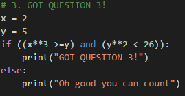
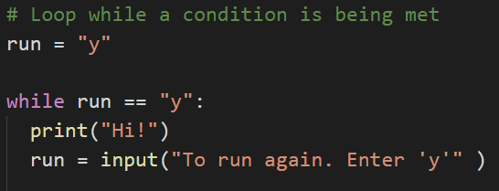

# Module 3 Class 2: Decision and Repetition Statements and File Handling

## Overview

Before class, walk through this week's Challenge assignment in office hours.  In class, the students will use Python to control program flow with conditionals and `for` loops, open a CSV file and retrieve data from a CSV file, and write data to a text file. 

## Learning Objectives

By the end of class, students will be able to:

* Control program flow with decision statements, boolean logic, and repetition statements
* Retrieve data from a CSV file
* Write data to a text file

- - -

## Instructor Notes

* The activities in this class will complement Lessons **3.3.1: Import and Inspect the Data** through **3.6.3: Write the Winning Candidate's Results to a Text File**.  The students will benefit from these activities if they‘ve progressed through these lessons, which cover the following concepts, techniques, and tasks: 

    * Open and read a CSV file
    * Write data to a text file
    * Create variables
    * Perform calculations
    * Use conditional statements  
    * Use repetition statements

## Slides

[Python Day 2 slideshow](https://docs.google.com/presentation/d/1I0efjbKYCWAvI71KUkaodMXYsJX3HBIygVSQE-x-L1A/edit?usp=sharing)

## Student Resources

Share the following [activity resources](https://2u-data-curriculum-team.s3.amazonaws.com/data-viz-online-lesson-plans/03-Lessons/3-2-Student-Resources.zip) with the students. 


- - - 

## Before Class

### 0. Office Hours

| Activity Time: 0:30       |  Elapsed Time:     -0:30  |
|---------------------------|---------------------------|

<details>
  <summary><strong>📣 Instructor Do: Challenge Instruction Walkthrough (0:10) </strong></summary>

Let the students know that you’ll walk through the Challenge requirements and rubric during the first few minutes of Office Hours, while also providing helpful tips to ensure they know exactly what they need in order to be successful.

Open the Challenge in Canvas and go through the high-level instructions and requirements with your class. Be sure to check for understanding.

Open the Rubric in Canvas, go through the Mastery column with the class, and show how it maps back to the requirements for each deliverable. Be sure to check for understanding.

Review the following tips to ensure clarity on the Challenge:

For **Deliverable 1: The Election Results Printed to the Command Line**, they will use their knowledge of `for loops`, `if` statements with membership and logical operators, and writing print statements using `f-strings` to print the candidate results from Module 3 and the county election results to the command line.

Go over the [Module 3 PyPoll solution](../../../01-Assignments/03-PyPoll/Solution/PyPoll_Async_solution.py) and compare it to the [PyPoll Challenge starter code](../../../01-Assignments/03-PyPoll/Resources/PyPoll_challenge_starter_code.py). Show the students the commented steps where they will be adding code to complete the challenge.

Tell the students that much of the code they’ll be adding will involve refactoring the Module 3 solution with some edits.

For **Deliverable 2: The Election Results Saved to a Text File,** they will use their knowledge of writing data to a file to add the winning candidate results from Module 3 and the county election results to the `election_analysis.txt` text file.

Compare the [Module 3 PyPoll solution](../../../01-Assignments/03-PyPoll/Solution/PyPoll_Async_solution.py) and the [PyPoll Challenge starter code](../../../01-Assignments/03-PyPoll/Resources/PyPoll_challenge_starter_code.py), and show the students the commented steps where they will need to add code to complete the challenge.

For **Deliverable 3: Written Analysis of the Election Audit**, the learners will be writing a report in the repository README.md file based on their analysis, just like they did in the previous modules.

For the **Election Audit Results**, the students need to address the election outcomes in bulleted statements.

For the **Election Audit Summary**, the students need to write a business proposal to the election commission detailing how this script can be modified for use in any election. We are asking them to apply some critical thinking in this last part: e.g., how can this code be more streamlined, what can be done to automate the script, etc.

**Hint:** Here are a few examples that will meet this requirement:

* Refactor the election script using functions. Although we haven't covered writing functions (D.R.Y.) in this module, the Day 2 Required Lesson Plan does have an activity.

* Adding a condition-controlled loop (`while` loop) to ask the user the name of the input file and the output file for saving the data, if given many files.

* Adding a repetition statement (`for` loop) to loop through many input files, and using the file name as a parameter for a function.

Encourage your class to begin the Challenge as soon as possible, if they haven’t already, and to use the Learning Assistants channel and the remainder of Office Hours with their instructional team for help as they progress through their work. If they feel like they need context to understand documentation or instructions throughout the week, this is where they can get it.

Open the floor to discussion and be sure to answer any questions they may have about the Challenge requirements before moving onto other areas of interest.

</details>

<details>
  <summary><strong>📣  Instructor Do: Office Hours (0:20)</strong></summary>

For the remaining time, remind the students that this is their time to ask questions and get assistance from their instructional staff as they’re learning new concepts and working on the Challenge assignment.

Expect that students may ask for assistance with the following: 

* Challenge assignment 
* Further review on a particular subject
* Debugging assistance
* Help with computer issues
* Guidance with a particular tool

</details>


- - - 

## During Class 

### 1. Getting Started

| Activity Time:       0:10 |  Elapsed Time:      0:10  |
|---------------------------|---------------------------|

<details>
  <summary><strong>📣 1.1 Instructor Do: Foundation Setting (0:05)</strong></summary>

* Welcome students to class.

* Direct students to post individual questions in the Zoom chat to be addressed by you and your TAs at the end of class.

* Open the slideshow and use slides 1-6 to walk through the foundation setting with your class.  

* **This Week - Python** Talk through the key skills that students will learn this week, and let them know that they are continuing to build on their data analyst skills. 

* **Today's Objectives:** Now, outline the concepts covered in today's lesson. Remind students that they can find the relevant activity files in the “Getting Ready for Class” page in their course content. 

</details>

<details>
  <summary><strong>🎉 1.2 Everyone Do: Check-In (0:05)</strong></summary>

* Ask the class the following questions and call on students for the answers:

    * **Q:** How are you feeling about your progress so far?

    * **A:** We are adding to our Python skill set. It's important to look back and see what we accomplished, and acknowledge that it's a lot! It’s also okay to feel overwhelmed as long as you don’t give up. The more you practice the more comfortable you'll be coding.
    
    * **Q:** How comfortable do you feel with this topic? 

    * **A:** Let's do "fist to five" together. If you are not feeling confident, hold up a fist (0). If you feel very confident, hold up an open hand (5).

</details>

<sub>[Having issues with this activity? Report a bug!](https://bit.ly/2II8V9T)</sub>

### 2. Conditional Conundrum

| Activity Time:       0:20 |  Elapsed Time:      0:30  |
|---------------------------|---------------------------|

<details>
  <summary><strong>📣 2.1 Instructor Do: Conditionals (0:05)</strong></summary>

* For the first demonstration, you may use slides 7-22 to accompany this activity and the following partner-do activity.

* Open [conditionals.py](Activities/01-Ins_Conditionals/Solved/conditionals.py) in a text editor and run through the code with the class.

* Students should be familiar with conditionals or decision statements after learning VBA, so explain to them that the logic in Python is nearly the same. 

* The students will have encountered conditionals in Lesson 3.2.8: Decision Statements in the module. 

* The primary difference between VBA and Python is the syntax and indentation. 

  * Python uses `if`, `elif`, and `else` for creating conditionals (pay attention to the letter case and spelling!).

  * Conditional statements are concluded with a colon, but all lines after the colon **must** be indented to be considered a part of that code block. This is because Python reads blocks of code based on indentation.

    

  * The following comparison operators, which are covered in Lesson 3.2.8, can be used to create logic tests for conditionals.

    * `>` is greater than

    * `>=` is greater than or equal to

    * `<` is less than

    * `<=` is less than or equal to

    * `==` is equal to

    * `!=` is not equal to

  * Multiple logic tests can be checked within a single conditional statement. Using the logical operator `and` means both statements are `True`, while `or` requires that only one statement is `True`. 
  
  * Remind the students that Lesson 3.2.9 covers membership and logical operators. 

  * Conditionals can even be nested in `if-elif-else` statements, which are similar to VBA's `If-Then-ElseIf-Then` statements, allowing programmers to run logic tests based on whether the original logic test returned as `True`.

    

* Send out the solution [conditionals.py](Activities/01-Ins_Conditionals/Solved/conditionals.py) file for students to refer to later.

* Ask the class the following questions and call on students for the answers:

    * **Q:** Where have we used this before?

    * **A:** We used conditionals with comparison, membership, and logical operators in Lessons 3.2.8 and 3.2.9.

    * **Q:** How does this activity equip us for the Challenge?

    * **A:** We'll need to use conditionals to test if a candidate or county appears in the list of candidates and counties. We’ll also need to use conditionals to determine the winning vote count, percentage, and candidate.

    * **Q:** What can we do if we don't completely understand this?

    * **A:** We can refer to the lesson plan and reach out to the instructional team for help.

* Answer any questions before moving on to the student activity.


</details>

<details>
  <summary><strong>🎉 2.2 Everyone Do: Conditional Conundrum (0:15)</strong></summary>

* In this exercise, the students will need to figure out what lines will be printed to the console with each conditional statement. 

* Open up the [conditionals_solved.py](Activities/02-Evr_ConditionalConundrum/Solved/conditionals_solved.py) file within the terminal, and let the students know that they'll be looking through some pre-written conditionals to try to figure out what lines will be printed to the console.

* Make sure the students can download and open the [instructions](Activities/02-Evr_ConditionalConundrum/README.md) and the [conditionals_unsolved.py file](Activities/02-Evr_ConditionalConundrum/Unsolved/conditionals_unsolved.py) from the AWS link. 

* Go over the instructions with the students, then let them work on their solution for 10 minutes. 

* When time is up, open the `conditionals_solved.py` file, and ask students to come forward and tell you what will be printed to the console for each conditional statement.

* If there are no volunteers, open up the `conditionals_solved.py` file and go over the solution file line by line with the class, answering whatever questions students may have.

* Key points to cover during this discussion:

  * The `if` statement for the first code chunk checks whether `10 > 10`, which is false. As such, the code will return "ooo needs some work".

    

  * The length of "Dog" is 3 and `x` is 5, making the statement for the second chunk of code true, so the code will return "Question 2 works!"

    

  * The addition of the `and` statement to the third chunk of code means that both logic tests need to return `True` to run. Thankfully, both do, so "GOT QUESTION 3!" is printed.

    

  * Conditionals work from the top down. The logic tests in the fourth chunk do not return as `True` until the third conditional, and, as such, "Dan is in group three" is printed.

    

  * Within the fifth chunk, one of the conditions is met in the third conditional, but it's not until getting into the `or` statement of the fourth conditional that the logic test finally returns as `True`.

    

* Send out the solution [conditionals_solved.py](Activities/02-Evr_ConditionalConundrum/Solved/conditionals_solved.py) file for students to refer to later.

  * Ask the class the following questions and call on students for the answers:

    * **Q:** What is the following code testing: `((height > 50) and (age >= 18)) or ((adult_permission) and (height > 50))`? 

    * **A:** It tests if a person can ride the bumper cars by evaluating if they are over 50 inches tall and 18 years of age or older; if one of those conditions is 'False', then it tests if the person has adult permission and is taller than 50 inches.  

    * **Q:** What can we do if we don't completely understand this?

    * **A:** We can refer to the lesson plan and reach out to the instructional team for help.

* Answer any questions before proceeding to the next activity.

</details>

<sub>[Having issues with this activity? Report a bug!](https://bit.ly/35NYcDA)</sub>


### 3. Rock, Paper, Scissors

| Activity Time:       0:20 |  Elapsed Time:      0:50  |
|---------------------------|---------------------------|

<details>
  <summary><strong>👥 3.1 Partners Do: Rock, Paper, Scissors (0:15)</strong></summary>

* In this exercise, the students will create a Rock, Paper, Scissors game that takes user input from the command line and plays against the computer. 

* Open the [RPS_Solved.py](Activities/03-Par_RockPaperScissors/Solved/RPS_Solved.py) file within the terminal and run the application to show students what the game will look like.

  

* Make sure the students can download and open the [instructions](Activities/03-Par_RockPaperScissors/README.md) and the [starter RPS file](Activities/03-Par_RockPaperScissors/Unsolved/RPS_Unsolved.py) from the AWS link. 

* Explain the rules of the exercise:
  * Using the terminal, take an input of `r`, `p`, or `s`, which will stand for rock, paper, or scissors.
  * Have the computer randomly pick one of these three choices.
  * Compare the user's input to the computer's choice to determine if the user won, lost, or tied.

* Answer any questions before breaking the students out in pairs. 

* Mention to the students that they'll import the `random` module for this activity, which they’ll use in a future module.

* Send the [random documentation](https://docs.python.org/3.6/library/random.html) link and explain how importing the `random` library will give them access to all these functions within their code.

* Let students know that their group may be asked to share and walk through their work at the end of the activity.

</details>

<details>
  <summary><strong>⭐ 3.2 Review: Rock, Paper, Scissors (0:05)</strong></summary>

* Once time is up, ask for a pair of students to walk through their solution. 

* To encourage participation, you can live-code each conditional in the [RPS_Unsolved.py](Activities/03-Par_RockPaperScissors/Unsolved/RPS_Unsolved.py) file and ask for groups to help you complete the code as you write it out.  

* Before live-coding, go over the following key points:

  * In the starter code, `random.choice` will pick a random choice from the `options` list for the computer and store its pick within a variable called `computer_choice`.

  * The application prompts the user for their option and stores it within a variable called `user_choice`.

  * Knowing that rock beats scissors, scissors beats paper, and paper beats rock, the code can be organized into a series of conditional statements to compare the user's choice to the computer's choice.

    

* Send out the [RPS_Solved.py](Activities/03-Par_RockPaperScissors/Solved/RPS_Solved.py) file for students to refer to later.

* Ask the class the following questions and call on students for the answers:

    * What does the logical operator `and` test? 

    * If both comparison tests are `True`, the algorithm will print the statement that follows the conditional statement; if either one of the comparison tests is `False`, the algorithm will move to the next conditional statement.  

    * What can we do if we don't completely understand this?

    * We can refer to the lesson plan and reach out to the instructional team for help.

* Answer any questions before proceeding to the next activity.

</details>

<sub>[Having issues with this section? Report a bug!](https://bit.ly/396038u)</sub>


### 4. Number Chain

| Activity Time:       0:25 |  Elapsed Time:      1:15  |
|---------------------------|---------------------------|

<details>
  <summary><strong> 📣  4.1 Instructor Do: Loops (0:05)</strong></summary>

* The next topic, loops or repetition statements, was also covered during VBA and in **Lesson 3.2.10: Repetition Statements** in the module, but students may still struggle with grasping the syntax in Python, so make sure to field questions as you proceed through the activity.

* You may use slides 23-28 to accompany this activity. 

* Open up [04-Ins_Loops](Activities/04-Ins_Loops/Solved/LoopDeeLoop.py) within a text editor and explain the following.

  * The variable `x` is created within the loop statement and could theoretically take on any name as long as it is unique.

  * When looping through a range of numbers, Python will halt the loop one number before the final number. For example, when looping from 0 to 5, the code will run five times, but `x` will only ever be printed as 0 through 4.

  * When provided with a single number, `range()` will always start the loop at 0. When provided with two numbers, however, the code will loop from the first number until it reaches one less than the second number.

    

  * Python can also loop through all of the letters within a string or all of the values stored within a list by using the syntax `for <variable> in <string or list>:`.

    

  * A `while` loop will run blocks of code just like a `for` loop does, but it will continue looping for as long as a condition is met.

    

* Once finished, send out the LoopDeeLoop.py file for students to refer to later.

* Ask the class the following questions and call on students for the answers:

    * **Q:** Where have we used this before?

    * **A:** We used condition-controlled and count-controlled loops with operators in Lesson 3.2.10.

    * **Q:** How does this activity equip us for the challenge?

    * **A:** We'll need to use condition-controlled loops to read the rows of the CSV file, get the county from the county dictionary, get the candidate from the candidate dictionary, and test if a candidate or county does not match any existing candidate or counties in the list of candidates and counties.

    * **Q:** What can we do if we don't completely understand this?

    * **A:** We can refer to the lesson plan and reach out to the instructional team for help.

* Answer any questions before moving on to the student activity.

</details>

<details>
  <summary><strong> ✏️ 4.2 Students Do: Number Chain (0:15)</strong></summary>

* Next, proceed with the student exercise. In this exercise, the students will use a `while` loop and ask a user "How many numbers?" They’ll then write an algorithm that prints out the numbers starting at 0.

* Open up [NumberChain_Solved.py](Activities/05-Stu_NumberChain/Solved/NumberChain_Solved.py) and run the code to show the result.

  

* Make sure the students can download and open the [instructions](Activities/05-Stu_NumberChain/README.md) and the [starter code](Activities/05-Stu_NumberChain/Unsolved/NumberChain_Unsolved.py) from the AWS link.

* Go over the instructions with the students and answer any questions before breaking the students out in groups. 

* Divide students into groups of 3 to 5. They should work on the solution by themselves but can reach out to others in their group for help.

* Let students know that they may be asked to share and walk through their work at the end of the activity.

* If time permits for the **Bonus*,* have the students modify their solution to display the numbers beginning at the end of the previous chain rather than just displaying numbers starting at 0.

</details>

<details>
  <summary><strong> ⭐ 4.3 Review Number Chain (0:05)</strong></summary>

* Once time is up, ask for volunteers to walk through their solution. Remind them that it is perfectly alright if they didn't finish the activity. 

* To encourage participation, you can open the [starter code](Activities/05-Stu_NumberChain/Unsolved/NumberChain_Unsolved.py) and ask the students to help you write the code for the first input statement and then the `for` loop. 

* If there are no volunteers, open up [NumberChain_Solved.py](Activities/05-Stu_NumberChain/Solved/NumberChain_Solved.py) and go over the solution file line by line with the class, answering whatever questions students may have.

* The key concepts for the regular solution are:

  * The initial value for `user_play` is set to "y" so that the `while` loop will run initially. This loop will continue to run as long as the value of `user_play` is "y" at the end of the code block.

  * An input number is asked for, then a `for` loop will run to count from 0 to that number.

  * The user is then prompted to enter "y" if they would like to create a new number chain or "n" if they would like to terminate the application.

    ```python
    # Initial variable to track game play
    user_play = "y"

    # While we are still playing...
    while user_play == "y":

        # Ask the user how many numbers to loop through
        user_number = input("How many numbers? ")

        # Loop through the numbers. (Be sure to cast the string into an integer.)
        for x in range(int(user_number)):

            # Print each number in the range
            print(x)

        # Once complete...
        user_play = input("Continue: (y)es or (n)o? ")
    ```

* Ask if any students were able to finish the **Bonus** and if they would be willing to share their solution. 

* If there are no volunteers, open the [bonus solution](Activities/05-Stu_NumberChain/Solved/NumberChainBonus_Solved.py) and go over the following: 

  * We add a variable called `start_number` whose initial value is 0 and whose value will be set to the last number used in the loop after the `for` loop has completed.

  * The `for` loop will now run from the range of `start_number` to `user_number` plus `start_number`. This means that the code will add the starting number to the last number from the users previous answer to "How many numbers?" as long as the user continues to the number chain. 

* Send out the [NumberChain solution](Activities/05-Stu_NumberChain/Solved) files for students to refer to later.

* Ask the class the following questions and call on students for the answers:

    * **Q:** What is the difference between a `while` loop and a `for` loop?

    * **A:** A `while` loop is a condition-controlled loop that uses a true or false condition to control the number of times that the loop repeats, whereas a `for` loop is a count-controlled loop that repeats a specific number of times depending on the conditions, like the number of items in a list. 

    * **Q:** What can we do if we don't completely understand this?

    * **A:** We can refer to the lesson plan and reach out to the instructional team for help.

* Answer any questions before proceeding to the next activity.

</details>

<sub>[Having issues with this section? Report a bug!](https://bit.ly/3pKBcgI)</sub>


### 5. Reading Netflix

| Activity Time:       0:25 |  Elapsed Time:      1:40  |
|---------------------------|---------------------------|

<details>
    <summary><strong>📣 5.1 Instructor Do: Reading In CSV Files (0:05)</strong></summary>

* For the next activity, you'll have the students use Python to open and read a CSV file. 

* You may use slides 29-39 to accompany this activity.

* Let the students know that while reading in text files can be useful in some circumstances, it is more likely within the data industry to run across CSV files.

  * CSV stands for **Comma** **Separated** **Values** and is essentially a table that has been converted into text format with each row and column being separated by specified symbols.

  * More often than not, each row is located on a new line, and each column is separated by a comma. Seems simple enough, and this is why the file type is called Comma Separated Values.

    

* Python has a module called `csv` that allows its users to easily pull in data from external CSV files and perform some operations upon them.

* Open up [read_csv.py](Activities/06-Ins_ReadCSV/Solved/read_csv.py) within the editor and go over the code it contains with the class.

  * The first major piece of code to point out is the importing and usages of the `os` module. This module allows Python programmers to easily create dynamic paths to external files that function across different operating systems.

    

  * This code uses `csv.reader()` to translate the object being opened by Python. It is critical to note the `delimiter=','` parameter being used, as this tells Python that each comma within the CSV should be seen as moving into a new column for a row.

  * Reiterate to students that the reading of the file must be done within the`with open()` statement. Outside of that block of code, the variable `csvreader` will not be useful because the file will be closed when the `with open()` block ends. 

    

  * The code then loops through each row of the CSV and prints out the contents. Make sure to point out how each value is being shown as a string and how all of the rows are lists.

    

* Ask the class the following questions and call on students for the answers:

    * **Q:** Where have we opened and read CSV files with Python?

    * ***A:** We opened and read a CSV file in Lessons 3.4.2 and 3.4.4.

    * **Q:** How does this activity equip us for the challenge?

    * **A:** We'll need to open and read the `election_data.csv` file to complete the activities in the module and the challenge.

    * **Q:** What can we do if we don't completely understand this?

    * **A:** We can refer to the lesson plan and reach out to the instructional team for help.

* Answer any questions before moving on to the student activity.

</details>

<details>
    <summary><strong>✏️ 5.2 Students Do: Reading Netflix (0:15)</strong></summary>

* In this exercise, the students will be provided with a CSV file containing data from Netflix. They will then create an algorithm that searches through the data for a specific movie/show and returns the name, rating, and review score for the show.

  * **Hint:** They should open the CSV file, look at the titles of the movies, and choose one for the activity.

    

* Open the [solved solution](Activities/07-Stu_ReadNetFlixCSV/Solved/netflix.py) and show students how their application should function.

* Make sure the students can download and open the [instructions](Activities/07-Stu_ReadNetFlixCSV/README.md), the [starter code](Activities/07-Stu_ReadNetFlixCSV/Unsolved/netflix.py), and the [bonus starter code](Activities/07-Stu_ReadNetFlixCSV/Unsolved/netflix_bonus.py) from the AWS link.

* Go over the instructions with the students and answer any questions before breaking the students out in groups. Let the students know that if they have time, they should try the **Bonus**.

* Divide students into groups of 3 to 5. They should work on the solution by themselves but can reach out to others in their group for help.

* Let students know that they may be asked to share and walk through their work at the end of the activity.

</details>

<details>
    <summary><strong>⭐ 5.3 Review: Reading Netflix (0:05)</strong></summary>

* Once time is up, ask for volunteers to walk through their solution. Remind them that it is perfectly alright if they didn't finish the activity. 

* To encourage participation, you can open the [starter code](Activities/07-Stu_ReadNetFlixCSV/Unsolved/netflix.py) and ask the students to help you write the code to set the path to the file, open the CSV file, write the `for` loop, and write the conditional statement. Make sure you cover the key topics below when you and the students build the algorithm. 

* If there are no volunteers, send out the [netflix solution](Activities/07-Stu_ReadNetFlixCSV/Solved/netflix.py) solution and the [bonus netflix solution](Activities/07-Stu_ReadNetFlixCSV/Solved/netflix_bonus.py), and go over the code with the class, answering whatever questions they may have.

* Key topics to cover when discussing this activity:

  * Before doing anything else, Python imports both the `os` and `csv` modules for use later on. It is common practice to import all modules at the start of an application.

  * When opening up the CSV file, the code dictates that each new line in the file should be viewed as a new line of data to be read in.

    

  * When reading the CSV file, the delimiter is set to `","` to ensure Python splits up the data into the proper columns whenever a comma is found.

  * The code loops through each row, searching for the row whose first value,  index 0, is equal to that of the search term entered.

  * The rating of a video is at the index of 1, and the review score is located at the index of 5. For the bonus, the `break` statement is added to end the loop once a movie is found.

    

  * The way in which the bonus operates is fairly simple. First, a variable is created that stores the value `False`. If a video matching the user's search is discovered, then this value is set to `True`. After the code loops through all of the data stored within the CSV, if the value is still equal to `False`, then the apology message is printed to the screen.

    

* Send out the [netflix solution](Activities/07-Stu_ReadNetFlixCSV/Solved) files for students to refer to later.

* Ask the class the following questions and call on students for the answers:

    * **Q:** Why do we use `csvpath = os.path.join("..", "Resources", "netflix_ratings.csv")` instead of `csv_file = ("Resources/netflix_ratings.csv")`?

    * **A:** Using `os.path.join` allows us to connect to a file without knowing the direct path to the file; we only know that it's in the "Resources" folder, and it prevents us from getting a `FileNotFoundError:`.

    * **Q:** What can we do if we don't completely understand this?

    * **A:** We can refer to the lesson plan and reach out to the instructional team for help.

* Answer any questions before proceeding to the next activity.

</details>

<sub>[Having issues with this activity? Report a bug!](https://bit.ly/2IUd3mE)</sub>


### 6. Writing Netflix Data

| Activity Time:       0:15 |  Elapsed Time:      1:55  |
|---------------------------|---------------------------|

<details>
  <summary><strong> 📣  6.1 Instructor Do: Writing to a Text File (0:05)</summary></strong>

* For the final demonstration, you will show the students how to write data to a text file. Not only can Python read data in from CSV files, it can also write data to files as well.

* You may use slides 40-43 to accompany this activity.

* While this may not seem handy at first, it allows Python users to easily modify and/or create text files while analyzing data from another source.

* Open up [08-Ins_WriteTextFile/write_text.py](Activities/08-Ins_WriteTextFile/Solved/write_text.py) within the editor, and go through the code with the class, explaining each line as you go along.

  * The syntax for writing into a text file is thankfully very similar to the syntax used to read data in from an external file.

  * First, the code references the path that will point into the CSV file the user would like to write to.

  * Next, the `with open()` statement is used once more but with one significant difference. Instead of the parameter `'r'` being passed and directing Python to read a file, the parameter `'w'` is passed instead to inform Python to write to the file.

  * Then, we create a variable that will hold long lines of text using f-strings inside parentheses. Tabs are created using `\t`, and we add the newline character, `\n`, to the end of each f-string so the next text will be added to a new line.  

  * Finally, we write the data to the text file using the `write()` method, then we print the data to the screen. 

    

* Run the code and then open up the new text file to show students that the application was successful. 

* Ask the class the following questions and call on students for the answers:

    * **Q:** Where have done this before?

    * **A:** We have written data to a text file in Lessons 3.6.1.

    * **Q:** How does this activity equip us for the challenge?

    * **A:** We'll need to write the election results to a text file.

    * **Q:** What can we do if we don't completely understand this?

    * **A:** We can refer to the lesson plan and reach out to the instructional team for help.

* Answer any questions before moving on to the student activity.

</details>

<details>
  <summary><strong>🎉 6.2 Everyone Do: Writing Netflix Data (0:10)</strong></summary>

* In this exercise, the students will use the solution to the [Netflix bonus](Activities/07-Stu_ReadNetFlixCSV/Solved/netflix_bonus.py), and they’ll write the title, rating level, and rating of a movie to a text file based on the user input and search.

* Open up the [write_netflix_solved.py](Activities/09-Evr_WritingNetflixData/Solved/write_netflix_solved.py) file within the terminal and run the code, then open up the text file to show students that the application was successful.

* Make sure the students can download and open the [instructions](Activities/09-Evr_WritingNetflixData/README.md) and the [write_netflix_unsolved.py file](Activities/09-Evr_WritingNetflixData/Unsolved/write_netflix_unsolved.py) from the AWS link. 

* Go over the instructions with the students, then let the students work on their solution for 5 to 7 minutes. 

* When time is up, open the `write_netflix_unsolved.py` file and ask students to help you write the code to specify the file to write to the movie data, open the file, create the variable to hold the movie data, and write the movie data to a text file.

* If there are no volunteers, open up the `write_netflix_solved.py` file and go over the solution with the class, answering whatever questions students may have.

* Key points to cover during this discussion:

  * We specify a file to write the movie data using `os.path.join`.

  * Inside the `for` loop we use another `with open()` statement with `'w'` parameter to write to the text file.

  * Then, we create the variable to hold the movie data.

  * The movie data is written to the file using f-strings, where the information from the CSV file that was retrieved in the previous activity is placed in brackets`{}` and a newline character, `\n`, is added to the end. This will save and print the movie data on a three separate lines. 

    ```python
      netflix_data = (
                    f"Title: {row[0]}\n"
                    f"Rating Level: {row[1]}\n"
                    f"Rated: {row[5]}\n"
                    )
    ```

  * Finally, the `write()` method is used to write the movie data to the text file and then we print the movie data to screen. 

* Answer any questions before ending class.

* Send out the [netflix solution](Activities/07-Stu_ReadNetFlixCSV/Solved) files for students to refer to later.

</details>

<sub>[Having issues with this section? Report a bug!](https://bit.ly/3pMRLIy)</sub>

### 7. Ending Class 

| Activity Time:       0:05 |  Elapsed Time:      2:00  |
|---------------------------|---------------------------|

<details>
  <summary><strong>📣  7.1 Instructor Do: Review </strong></summary>

* Before ending class, review the skills that were covered today and mention where in the module these skills are used. 
  * Using conditionals with comparison, membership, and logical operators was covered in **Lesson 3.2.9**.
  * Using condition-controlled and count-controlled loops with operators was covered in **Lesson 3.2.10**.
  * Opening and reading a CSV file was covered in **Lesson 3.4.4**.
  * Writing data to a text file was covered in **Lesson 3.6.1**.

* Answer any questions the students may have.

</details>

<sub>[Having issues with this section? Report a bug!](https://bit.ly/3kIv9Wd)</sub>

---

© 2021 Trilogy Education Services, LLC, a 2U, Inc. brand.  Confidential and Proprietary.  All Rights Reserved.
