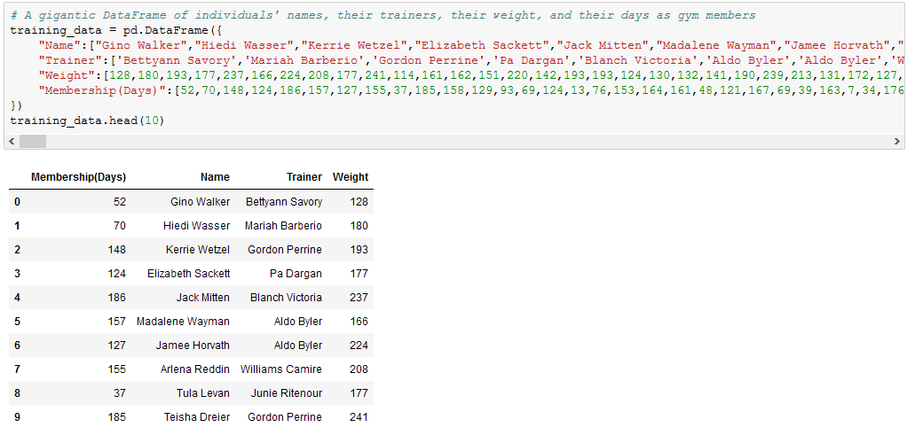
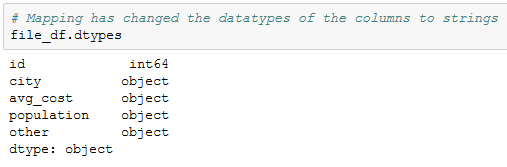

# Module 4 Class 1: Getting Started with Pandas and Jupyter Notebook

## Overview

This week, the students will be introduced to an open-source distribution software called Anaconda and Jupyter Notebook, a product of Anaconda, which allows you to use Python to create documents that contain live code. Although Jupyter Notebook supports over 40 different programming languages, the students will be using Python to learn the basics of the Pandas library, an open-source library that provides high-performance data analysis tools. 

In today's class, after ensuring that Anaconda is installed correctly, students will use Jupyter Notebook with Pandas to read raw data from CSV files, inspect and clean data, merge datasets, and apply their knowledge and skills of Python to perform mathematical calculations. They'll also work with lists and dictionaries, use repetition and decision statements, and apply formatting.

## Learning Objectives

By the end of class, students will be able to:
 
* Verify that they have installed Anaconda.
* Verify that they have created a working PythonData conda environment.
* Import and read a CSV into a DataFrame using Pandas
* Use a variety of Pandas methods and functions on a DataFrame
* Merge two DataFrames
* Format values in DataFrame columns


- - -

## Instructor Notes

* The activities in this class will complement Lessons **4.0.1: Using Pandas and Jupyter Notebook** through **4.8.1: Set the Index to the School Name**.  The students will benefit from these activities if they‘ve progressed through these lessons, which cover the following concepts, techniques, and tasks:  

* Create a conda environment
* Create a Jupyter Notebook file 
* Understand the difference between a data Series and a DataFrame
* Load and read a CSV file using Pandas
* Use Pandas functions and methods on DataFrames
* Merge DataFrames
* Format values in DataFrame columns


## Slides

[Pandas Day 1 slideshow](https://docs.google.com/presentation/d/1kyltYVDNkSf4I4dfS_sF-s9Uk7f1LCSl618pNPgKAY0/edit?usp=sharing)

## Student Resources

Share the following [activity resources](https://2u-data-curriculum-team.s3.amazonaws.com/data-viz-online-lesson-plans/04-Lessons/4-1-Student-Resources.zip) with the students. 


- - - 

## Before Class

### 0. Office Hours

| Activity Time: 0:30       |  Elapsed Time:     -0:30  |
|---------------------------|---------------------------|

<details>
  <summary><strong> 📣 0.1 Instructor Do: Office Hours</strong></summary>

* Before you begin class, hold office hours. Office hours should be driven by students. Encourage students to take full advantage of office hours by reminding them that this is their time to ask questions and get assistance from instructional staff as they learn new concepts.

* Expect that students may ask for assistance. For example: 

  * Further review on a particular subject
  * Debugging assistance
  * Help with computer issues
  * Guidance with a particular tool

</details>

- - - 

## During Class 

### 1. Getting Started

| Activity Time:       0:15 |  Elapsed Time:      0:15  |
|---------------------------|---------------------------|

<details>
  <summary><strong>📣 1.1 Instructor Do: Foundation Setting (0:10)</strong></summary>

* Welcome students to class.

* Direct students to post individual questions in the Zoom chat to be addressed by you or your TAs at the end of class.

* Open the slideshow and use slides 1-12 to walk through the foundation setting with your class.

* **Big Picture:** This is an opportunity to zoom out and see the big picture of where they are in the program. Take a moment to mention some real world examples that show the value of what they're learning this week.

* **Program Pointers:** Talk through some of the key logistical things that will help students stay on track. This is an opportunity to speak to what students may need when they're at this particular point of the program. 

* **This Week - Pandas:** Talk through the key skills students will be learning this week. Let the students know that they will be using Jupyter Notebook and Pandas for a majority of the course. This is the time to ensure that their Anaconda is installed correctly, they have created the PythonData environment, and they are comfortable using the environments in Jupyter Notebook.  

* **This Week's Challenge:** For this week's Challenge, let the students know that they'll be replacing the math and reading scores for one of the high schools with NaNs while keeping the rest of the ninth grade data intact. After they’ve replaced the math and reading scores, they need to repeat the school district analysis that they did in this module and write up a report to describe how these changes affected the overall analysis. 

* **Career Connection:** Let students know how they will be using the skills covered this week throughout their careers. It's important for them to know the "why." Give examples of when they may be used in work or when you have used those skills in your workplace. 

* **How to Succeed This Week:** Remind your students that they may have moments of frustration this week as they learn something so complex. These moments are great for deepening their knowledge. Use the side material to outline some of the topics that they may find tricky in this module. Consider sharing something about your personal learning journey. It helps students to recognize that everyone starts somewhere and that they are not alone.

* **Today's Objectives:** Now, outline the concepts that will be covered in today's lesson. Remind students that they can find the relevant activity files in the Getting Ready for Class page in their course content.  

</details>

<details>
  <summary><strong>🎉  1.2 Everyone Do: Check-In (0:05)</strong></summary>

* Ask the class the following questions and call on students for answers:

    * **Q:** How are you feeling about your progress so far?

    * **A:** Let them know that we are starting to build their Pandas skillset. It’s also okay to feel overwhelmed as long as you don’t give up.

    * **Q:** How comfortable do you feel with this topic? 

    * **A:** Let's do "fist to five" together. If you are not feeling confident, hold up a fist (0). If you feel very confident, hold up an open hand (5).

</details>

<sub>[Having issues with this activity? Report a bug!](https://bit.ly/3mxixTf)</sub>

---

### 2. Intro to Pandas and Jupyter Notebook

| Activity Time:       0:15 |  Elapsed Time:      0:30  |
|---------------------------|---------------------------|

<details>
    <summary><strong>🎉 2.1 Everyone Do: Conda Environment Creation Check (0:05)</strong></summary>

Have students open a Terminal (on Mac) or Anaconda Prompt (on Windows) and run `conda --version` to verify that Anaconda is installed correctly. Help any students who do not have Anaconda installed correctly.

Check to make sure students have created the `PythonData` environment by having them type and run either of the following two commands in Terminal or Anaconda Prompt:

  ```python
    conda env list
    # Or,
    conda env --info
  ```
If they have created the `PythonData` environment, have students run `conda activate PythonData` in Terminal or Anaconda Prompt to verify that they have created a virtual environment correctly. Help any students who have not been able to create a virtual environment.

Finally, have students run `jupyter notebook` to ensure that Jupyter is running correctly. Help any students who are not able to run a Jupyter Notebook server.

</details>

<details>
    <summary><strong>📣  2.2 Instructor Do: Creating DataFrames (0:10)</strong></summary>

* For the first demonstration, students will code along with you to create a Series and DataFrames using Pandas. You can use slides 13-18 to introduce these concepts before beginning the demonstration.

* Make sure the students can download and open the [creating_data_frames_unsolved.ipynb](Activities/01-Ins_CreateDataFrames/Unsolved/creating_data_frames_unsolved.ipynb) file from the AWS link. 

* Open the [creating_data_frames_unsolved.ipynb](Activities/01-Ins_CreateDataFrames/Unsolved/creating_data_frames_unsolved.ipynb) file and go over the instructions in each cell with the students.

* **Q:** Ask the students what is the Pandas syntax for creating a Series?

* **A:** We use the `pandas.Series()` function, or if you have imported pandas as an alias `pd`, we use `pd.Series()`. 

* Walk through how to create a Series using the first option by adding the list of universities inside the `pd.Series()` parentheses.

  ```python
  data_series = pd.Series(["UCLA", "UC Berkeley", "UC Irvine",
                          "University of Central Florida", "Rutgers University"])

  ```

* Next, have the students substitute the list of universities with the name of the list, `bootcamp_univ` to illustrate the second option by passing the variable for the list inside the `pd.Series()` parentheses.

  ```python

  data_series_2 = pd.Series(bootcamp_univ)

  ```

* Point out that by simply using the `pd.Series()` function, we have created a one-dimensional array that has a numeric index of the initial list that acts as a key in a dictionary.
 
    

* Let the students know that creating a Pandas Series can be reviewed in Lesson 4.3.5. Once the students feel comfortable creating a Pandas Series, move on to creating DataFrames. 

* A DataFrame is a two-dimensional labeled data structure, like a dictionary, with rows and columns of potentially different data types such as strings, integers, and floats, where data is aligned in a table, much like a spreadsheet.

* **Q:** Ask the students what the Pandas syntax is for creating a DataFrame.

* **A:** We use the `pandas.DataFrame()` function, or if you have imported pandas as an alias `pd`, we use `pd.DataFrame()`. 

* Mention there are multiple ways to create DataFrames from scratch. One way is to add a list of dictionaries inside the `pd.DataFrame()` function. Each dictionary will represent a new row where the keys become column headers and the values will be placed inside the table.

* Have the students code along with you while you add the `movie_dicts` file in the `pd.DataFrame()` function.

  ```python
  movie_df = pd.DataFrame(movies_dicts)

  ``` 

* Before moving on, go over the following:

  * Creating DataFrames can be reviewed in Lesson 4.3.5 of the module.

  * It is important to save the Series and DataFrames you create to a variable, or else they will only be printed to the screen and will not be available for use later on.  

* Mention that in the previous code, each dictionary in the list has the same two keys, "Title" and "Year Released".  In situations like this, instead of creating dictionaries with the same keys, you can create a dictionary of lists, where the keys of the dictionary will be the column headers and the listed values will be placed into their respective rows.

  * Although you can create a DataFrame from a list of dictionaries, it takes far longer to write the code since the keys have to be re-written each time. However, it does allow the programmer to better understand what each row in their DataFrame will look like.

  * The better option is to use the dictionary of lists. This method is much more time effective, since the keys only need to be written once. It can be harder to read through, however, as if even one of the lists contains fewer values than the others, then an error will be returned.

    

* Have the students code along while you create the `movie_df` DataFrame by editing the `movie_dicts` list of dictionaries to create a dictionary of lists.  

* Once the students feel comfortable creating DataFrames, have them briefly work independently on the last exercise to create a DataFrame using a dictionary of lists.
    
  

* When time is complete, go over the solution in the last cell and answer any questions the students may have before proceeding to the next activity.

</details>

<sub>[Having issues with this activity? Report a bug!](https://bit.ly/3oeOcJM)</sub>


### 3. DataFrame Training

| Activity Time:       0:25 |  Elapsed Time:      0:55  |
|---------------------------|---------------------------|

<details>
    <summary><strong>📣 3.1 Instructor Do: DataFrame Functions (0:05)</strong></summary>

* The benefit of using Pandas DataFrames is not solely its visualization of tables. There are also many functions/methods that come packaged with Pandas that allow for quick and easy analysis of large datasets.

* Open up [02-Ins_DataFunctions](Activities/02-Ins_DataFunctions/Solved/data_functions.ipynb) within Jupyter Notebook and make sure to remind the students that an external CSV file is being imported. Students will do this later in today's lesson. You can also use slides 19-29 to explain the following points. 

  * The first method to describe is `head()`, which takes a DataFrame and shows only its first five rows of data. This number can be increased or decreased by placing an integer within the parentheses.

  * The `head()` method is helpful because it allows the programmer to look at a minified version of a much larger table, thus allowing them to make informed changes without having to search through the entire dataset.

  * Multiple columns can be referenced, too, by placing all of the column headers desired within a pair of double brackets. If two sets of brackets are not used, then Pandas will return an error.

    

  * Another useful method is `describe()`, which will print out a DataFrame containing summary statistics on the table and its columns. It also helpfully shows what other data functions can be performed on a DataFrame or Series.

    

  * Most data functions can also be performed on a Series by referencing a single column within the whole DataFrame. This is done in a similar way to referencing a key within a dictionary by following the DataFrame with brackets containing the desired columns, like a key.

    

  * There are situations where it is helpful to list out all of the unique values stored within a column. This is precisely what the `unique()` function does, by looking into a Series and returning all of the different values within.

    

  * Another method with similar functionality is `value_counts()`, which not only returns a list of all unique values within a series but also counts how many times a value appears.

    

  * Calculations can also be performed on columns and then added back into a DataFrame as a new column by referencing the DataFrame, placing the desired column header within brackets, and then setting it equal to a Series.

    

* Send out the [data_functions.ipynb](Activities/02-Ins_DataFunctions/Solved/data_functions.ipynb) file for students to refer to later.

* Ask the class the following questions and call on students for the answers:

    * **Q:** Where have we used this before?

    * **A:** These Pandas methods and functions are covered in Lessons 4.4.3, 4.7.3-4.7.5, 4.8.2, 4.8.3, and 4.11.1.

    * **Q:** How does this activity equip us for the Challenge?

    * **A:** We'll need to use many of these methods and functions throughout the Challenge.

    * **Q:** What can we do if we don't completely understand this?

    * **A:** We can refer to the lesson plan and reach out to the instructional team for help.

* Answer any questions before moving on to the student activity.

</details>


<details>
    <summary><strong>✏️ 3.2 Students Do: Training Grounds (0:15)</strong></summary>

* In this exercise, the students will take a large DataFrame with 200 rows, analyze it using data functions, and then add a new column into the DataFrame. 

* Make sure the students can download and open the [instructions](Activities/03-Stu_TrainingGrounds-DataFunctions/README.md) and the [unsolved TrainingGrounds.ipynb](Activities/03-Stu_TrainingGrounds-DataFunctions/Unsolved/TrainingGrounds_unsolved.ipynb) files from the AWS link. 

* Go over the instructions in the README, then open up the [TrainingGrounds.ipynb solution](Activities/03-Stu_TrainingGrounds-DataFunctions/Solved/TrainingGrounds.ipynb) file within the Jupyter Notebook and run the code to show the end results of the application.

    

* Divide students into breakout groups of 3-5. They should work on the solution by themselves but can reach out to others in their group for tips.

* Let students know that they may be asked to share and walk through their work at the end of the activity.

</details>

<details>
    <summary><strong>⭐ 3.3 Review: Training Grounds (0:05)</strong></summary>

* Once time is complete, ask for volunteers to walk through their solutions. Remind them that it is perfectly alright if they didn't completely finish the activity. 

* To encourage participation, you can open the [unsolved TrainingGrounds.ipynb](Activities/03-Stu_TrainingGrounds-DataFunctions/Unsolved/TrainingGrounds_unsolved.ipynb) file and ask the students to help you write the code for each cell. 

* If there are no volunteers, open up the solved `TrainingGrounds.ipynb` file and walk through the code with the class, answering whatever questions students have.

* Key points to tackle when discussing this activity:

  * By collecting the unique values for the "Trainer" column, it’s far easier to see what employees are currently with the "Training Grounds" gym.

  * In order to convert "Membership (Days)" into "Membership (Weeks)", the code simply takes the values stored within the initial column, divides them by seven, and then adds this edited series into a newly created column.

    

* Send out the [TrainingGrounds.ipynb solution](Activities/03-Stu_TrainingGrounds-DataFunctions/Solved/TrainingGrounds.ipynb) for students to refer to later.

* Ask the class the following questions and call on students for the answers:

    * **Q:** How would you get the number of unique trainers?

    * **A:** You would add `training_df["Trainer"].unique()` inside the parentheses of the `len()` function. 

    * **Q:** What can we do if we don't completely understand this?

    * **A:** We can refer to the lesson plan and reach out to the instructional team for help.

* Answer any questions before proceeding to the next activity.

</details>

<sub>[Having issues with this activity? Report a bug!](https://bit.ly/33AwGb9)</sub>


### 4. GoodReads - Reading CSVs and Column Manipulation

| Activity Time:       0:25 |  Elapsed Time:      1:20  |
|---------------------------|---------------------------|

<details>
    <summary><strong>📣 4.1 Instructor Do: Reading CSV and Column Manipulation (0:05)</strong></summary>

* In the previous exercise, the students manually created DataFrames using the `pd.DataFrame()` method, but this becomes challenging if you are manually creating a DataFrame with many rows and columns. Use slides 31-33 to pose a question. 

* **Q:** Ask the students, if you are given data that is in an `.xlsx` or `.csv` format, how do you create a DataFrame? 

  * **A:** You can import the `.xlsx` or `.csv` file using `pd.read_excel()` or `pd.read_csv()`, respectively. 

* Open up [04-Ins_ReadingCSV-ColumnManipulation](Activities/04-Ins_ReadingCSV-ColumnManipulation/Solved/pandas_reading_files.ipynb) within Jupyter Notebook and walk through the code with the class. 

  * Create a reference to the CSV file's path and pass it in into the `pd.read_csv()` method, making sure to store the returned DataFrame within a variable. From then on, the DataFrame can be altered and manipulated like normal.

  * In most cases, it is not important to use or define the encoding of the base CSV file, but if the encoding is different from UTF-8, then it may become necessary so the CSV can be translated correctly.

    

* Next, show the difference in the syntax when retrieving information from one column versus two or more columns. 

  

* Sometimes, columns within a DataFrame are not always placed within the desired position by default, or the headers of the `.xlsx` or `.csv` files may not have a descriptive or concise enough name.

  * Thankfully, it is very easy to modify the names or placement of columns using the `rename()` function.

  * In order to collect a list of all the columns contained within a DataFrame, simply use the `df.columns` call, and an object containing the column headers will be printed to the screen.

  * To rename the columns within a DataFrame, use the `df.rename()` method and place `columns={}` within the parentheses. Inside of the dictionary, the keys should be references to the current columns, and the values should be the desired column names.

    

* It’s also possible to create a new DataFrame with specific columns from an existing DataFrame by referencing the column names in double brackets on the existing DataFrame and using the `.copy()` method.

  

* Send out the [pandas_reading_files.ipynb](Activities/04-Ins_ReadingCSV-ColumnManipulation/Solved/pandas_reading_files.ipynb) file for students to refer to later.

* Ask the class the following questions and call on students for the answers:

    * **Q:** Where have we used this before?

    * **A:** The `pd.DataFrame()` method was covered in Lessons 4.4.3 and 4.7.7. The `rename()` function and the `.copy()` method are covered in later modules, but they may be useful to you when learning to use Pandas.

    * **Q:** How does this activity equip us for the Challenge?

    * **A:** We'll need to use the `pd.DataFrame()` method in the Challenge.

    * **Q:** What can we do if we don't completely understand this?

    * **A:** We can refer to the lesson plan and reach out to the instructional team for help.

* Answer any questions before moving on to the student activity.

</details>


<details>
    <summary><strong>✏️ 4.2 Students Do: GoodReads CSV (0:15)</strong></summary>

* In this exercise, students will now take a large CSV of books, read it into Jupyter Notebook using Pandas, and clean up the columns.

* Make sure the students can download and open the [instructions](Activities/05-Stu_GoodReadsCSV/README.md), the [books.csv](Activities/05-Stu_GoodReadsCSV/Unsolved/Resources/books.csv), and the [unsolved GoodReads.ipynb](Activities/05-Stu_GoodReadsCSV/Unsolved/GoodReads_unsolved.ipynb) from the AWS link. 

* Go over the instructions in the README and then open up the [books.csv](Activities/05-Stu_GoodReadsCSV/Solved/Resources/books.csv) to show students the data set they'll be using, and then open up the [solution](Activities/05-Stu_GoodReadsCSV/Solved/GoodReads.ipynb) and show students the final DataFrame they'll be creating.

  

* Divide students into breakout groups of 3-5. They should work on the solution by themselves but can reach out to others in their group for tips.

* Let students know that they may be asked to share and walk through their work at the end of the activity.

</details>

<details>
    <summary><strong>⭐ 4.3 Review: GoodReads CSV (0:05)</strong></summary>

* Once time is complete, ask for volunteers to walk through their solutions. Remind them that it is perfectly alright if they didn't finish the activity. 

* To encourage participation, you can open the [unsolved GoodReads.ipynb](Activities/05-Stu_GoodReadsCSV/Unsolved/GoodReads_unsolved.ipynb) file and ask the students to help you write the code for each cell. 

* If there are no volunteers, open up the solved `GoodReads.ipynb` and walk through the code with the class, answering whatever questions students have.

* Key points to tackle when discussing this activity:

  * The initial CSV file is encoded using UTF-8, so it should be read using this encoding as well to ensure there are no strange characters hidden within the dataset.

  * There are a lot of columns that are being modified within this code, so it is useful to get all the columns in an array using the `.columns` attribute. This helps to make sure that all references are made accurately so as to avoid any potential errors.

    

* Send out the [GoodReads.ipynb solution](Activities/05-Stu_GoodReadsCSV/Solved/GoodReads.ipynb) file for students to refer to later.

* Answer any questions before proceeding to the next activity.

</details>

<sub>[Having issues with this activity? Report a bug!](https://bit.ly/3oia3A8)</sub>

### 5. Merging DataFrames

| Activity Time:       0:15 |  Elapsed Time:      1:35  |
|---------------------------|---------------------------|

<details>
    <summary><strong>📣 5.1 Instructor Do: Merging DataFrames (0:15)</strong></summary>

* Occasionally data analysts will need to use data from multiple CSV files for their analysis. This, of course, is not an ideal situation as it is far more preferable to work with a single data set than it is to work with a bunch of different datasets. 

* This is where the concept of merging comes into play, as Pandas allows its users to easily combine separate DataFrames on similar column names using the `pd.merge()` method to create one table.  

* When we merge DataFrames we are "joining" them on a column that is common to both DataFrames. You may use slides 36-39 to accompany this part of the lesson.

* Make sure the students can download and open the two CSV files [bitcoin_cash_price.csv](Activities/06-Ins_MergingDataFrames/Unsolved/Resources/bitcoin_cash_price.csv) and [dash_price.csv](Activities/06-Ins_MergingDataFrames/Unsolved/Resources/dash_price.csv), and the [unsolved Merging.ipynb](Activities/06-Ins_MergingDataFrames/Unsolved/Merging_unsolved.ipynb) files from the AWS link.

* Have everyone open the [unsolved Merging.ipynb](Activities/06-Ins_MergingDataFrames/Unsolved/Merging_unsolved.ipynb) file, and let the students create the two DataFrames. 

* Walk through how to merge the DataFrames with the different join options,  asking for volunteers to help you write the code. You may also use slides 40-43 for this part of the lesson. 

* As you complete each merge, make sure to discuss the following points for merging and each join:

  * The first chunks of code are used to create two DataFrames that contain information about customers and the purchases they have made.

  * Make sure to point out how these two DataFrames share the "customer_id" column. This will be very important soon.

  * In the final chunk of code, the `pd.merge()` method is used and three parameters are passed into it: references to both of the DataFrames and the value `on="customer_id"`.

  * This code tells the computer to combine the two DataFrames together, so that whenever the "customer_id" column matches, the rows containing the matching data are joined.

    

  * This is what is known as an inner join. Inner joins are the default means through which DataFrames are combined using the `pd.merge()` method and will only return data whose values match. Any rows that do not include matching data will be dropped from the combined DataFrame.

  * The opposite of an inner join is an outer join. Outer joins will combine the DataFrames regardless of whether any of the rows match and must be declared as a parameter within the `pd.merge()` method using the syntax `how="outer"`.

    

  * Any rows that do not include matching data will have the values within replaced with `NaN` instead.

  * There are also right and left joins. These joins will protect the data contained within one DataFrame, like an outer join does, while also dropping the rows with null data from the other DataFrame.

    

  * Next, merge the two cryptocurrency DataFrames on the "Date" column. Point out that the column headers are incorrect. This is because the columns within the first DataFrame match those that are in the second DataFrame. Pandas automatically does this in order to differentiate them. This also means the columns need to be renamed manually.

    

  * Ask the class the following question and call on students for the answers:

    * **Q:** How would you rename the columns of this DataFrame?

    * **A:** You would use the `rename()` function and pass in the old and new column names within the `columns={}` parameter.

  * While you write the code to rename the columns, ask the students to assist you. 

  * Let the students know that you can skip having to rename the columns by creating custom suffixes by adding a `suffixes = (_x,_y)` argument to `pd.merge`.  `_x` and `_y` can be replaced with any text.

    

* Answer any questions that the students have and the send out the [Merging.ipynb](Activities/06-Ins_MergingDataFrames/Solved/Merging.ipynb) solution file for students to refer to later.

* Ask the class the following questions and call on students for the answers:

    * **Q:** What can we do if we don't completely understand this?

    * **A:** Review the Lesson 4.7.1: Merge DataFrames, where we merged the students and schools DataFrame, and reach out to the instructional staff.


</details>

<sub>[Having issues with this activity? Report a bug!](https://bit.ly/3oh2E41)</sub>


### 6. Formatting and Mapping

| Activity Time:       0:20 |  Elapsed Time:     1:55  |
|---------------------------|---------------------------|

<details>
  <summary><strong> 📣 6.1 Instructor Do: Formatting and Mapping (0:05)</strong></summary>

* To format numbers in Pandas, we need to use the `map()` method to apply a string format function. First, review string formats with the students.

* Open up [07-Ins_FormatMapping](Activities/07-Ins_FormatMapping/Solved/Formatting.ipynb) within Jupyter Notebook, and run through the code with the class, discussing it cell by cell. You can also use slides 45-53 to discuss the following points. 

* Show that f-strings allow number formatting of expressions. Go through the examples. Answer any questions students might have.

* Move on to creating an empty format string and calling the `.format` method on `pi`. Then format `pi` to two decimal places. 

  ```python
    "{:.2f}".format(pi)
  ```

* Students may recall how Excel's number formats allow its users to easily change the styling of columns. Pandas also includes this functionality through its `.map()` method, which allows users to style columns wholesale.

* Open up the [Format_Mapping.ipynb](Activities/07-Ins_FormatMapping/Solved/Format_Mapping.ipynb) file within Jupyter Notebook and run through the code with the class, discussing it cell by cell.

  * `df[<COLUMN>].map("{<FORMAT STRING>}".format)` is the method by which users can modify the styling of an entire column.

  * The formatting syntax used for mapping is confusing. It uses strings containing curly brackets to determine how to style columns, and this can make it rather difficult to understand at a glance.

  * A somewhat easy way to understand mapping strings is that it is similar to concatenating strings. Whatever is outside of the curly brackets is added before/after the initial value, which is modified by whatever is contained within the curly brackets.

  * So, to convert values into a typical dollar format, one would use `"${:.2f}"`. This places a dollar sign before the value that has been rounded to two decimal points.

  * Using `"{:,}"` will split a number up so that it uses comma notation. For example: the value `2000` would become `2,000` using this format string.

    

  * Format mapping only really works once and will return errors if the same code is run multiple times without restarting the kernel. Therefore, formatting is usually applied near the end of an application.

  * Format mapping also can change the datatype of a column. As such, all calculations should be handled before modifying the formatting.

    

* Send out the [07-Ins_FormatMapping](Activities/07-Ins_FormatMapping/Solved) files for students to refer to later.

* Ask the class the following questions and call on students for the answers:

    * **Q:** Where have we used this before?

    * **A:** The `.format` and `.map()` methods were covered in Lesson 4.7.8. 

    * **Q:** How does this activity equip us for the Challenge?

    * **A:** We'll need to format numbers in the DataFrames in the Challenge.

    * **Q:** What can we do if we don't completely understand this?

    * **A:** We can refer to the lesson plan and reach out to the instructional team for help.

* Answer any questions before moving on to the student activity.

</details>

<details>
  <summary><strong>🎉 6.2 Everyone Do: Formatting and Mapping (0:15)</strong></summary>

* In this exercise, the students will read sales data into a DataFrame and are asked to format the columns that are `int64` or `float64` datatypes with comma notation, a dollar sign, and to two decimal places.  

* Make sure the students can download and open the [instructions](Activities/08-Evr_FormatMapping/README.md), the [sales_data.csv](Activities/08-Evr_FormatMapping/Unsolved/Resources/sales_data.csv), and the [unsolved Format_Mapping](Activities/08-Evr_FormatMapping/Unsolved/Format_Mapping_unsolved.ipynb) files from the AWS link. 

* Review the instructions with the students, then let the students work on their solution for 10 minutes.

* When time is complete, open the [unsolved Format_Mapping](Activities/08-Evr_FormatMapping/Unsolved/Format_Mapping_unsolved.ipynb) file, read in the `sales_data.csv` using Pandas, and ask for volunteers to help you format the necessary columns.

* If there are no volunteers, open up the [Format_Mapping.ipynb solution](Activities/08-Evr_FormatMapping/Solved/Format_Mapping.ipynb) file and walk through how we apply the `map()` and `.format` methods to format the columns that have `int64` or `float64` datatypes, making sure to explain the following:

  * To format each column, we set the column that will be formatted equal to itself.
  
  ```python
   sales_data_df["<COLUMN>"] = sales_data_df["<COLUMN>"]

  ```
  
  * Then we apply the `.map()` method to the column, and inside the parentheses of the`.map()` method, we apply the necessary formatting with the `.format` method.
  
  ```python
  sales_data_df["<COLUMN>"] = sales_data_df["<COLUMN>"].map("{<FORMAT STRING>}".format)

  ```

* Answer any questions before ending class.


</details>

<sub>[Having issues with this section? Report a bug!](https://bit.ly/36woFWr)</sub>


### 7. Ending Class 

| Activity Time:       0:05 |  Elapsed Time:      2:00  |
|---------------------------|---------------------------|

<details>
  <summary><strong>📣  7.1 Instructor Do: Review </strong></summary>

* Before ending class, review the skills that were covered today and mention where in the module these skills are used. 
  * The `pd.DataFrame()`, `read_csv()`, and `head()` methods were covered in **Lessons 4.4.3**.
  * The `pd.merge()` method was covered in **Lesson 4.7.1**.
  * The `unique()` function was covered in **Lesson 4.7.3**.
  * The `.format` and `.map()` methods were covered in **Lesson 4.7.8**.
  * The `value_counts()` method was covered in **Lesson 4.8.2**.
  * The `describe()` method was covered in **Lesson 4.11.1**.
  * The `rename()` function and the `.copy()` method are covered in later modules.

* Answer any questions the students may have.

</details>

<sub>[Having issues with this section? Report a bug!](https://bit.ly/3gchg1X)</sub>

---

© 2021 Trilogy Education Services, LLC, a 2U, Inc. brand.  Confidential and Proprietary.  All Rights Reserved.