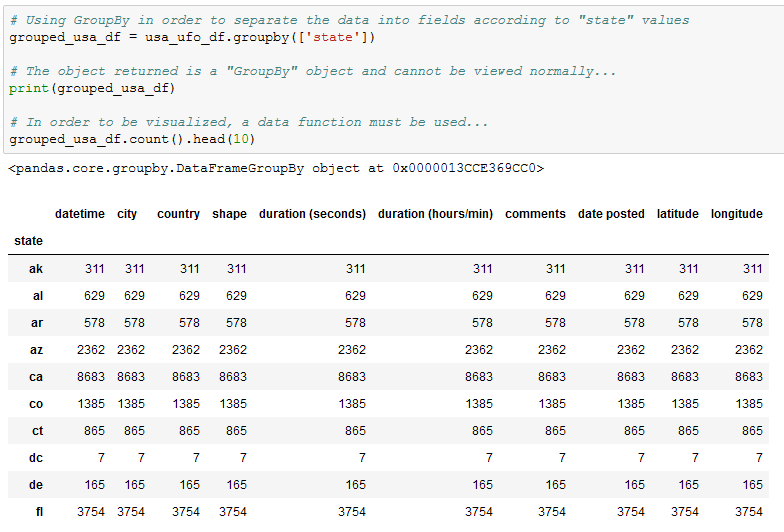
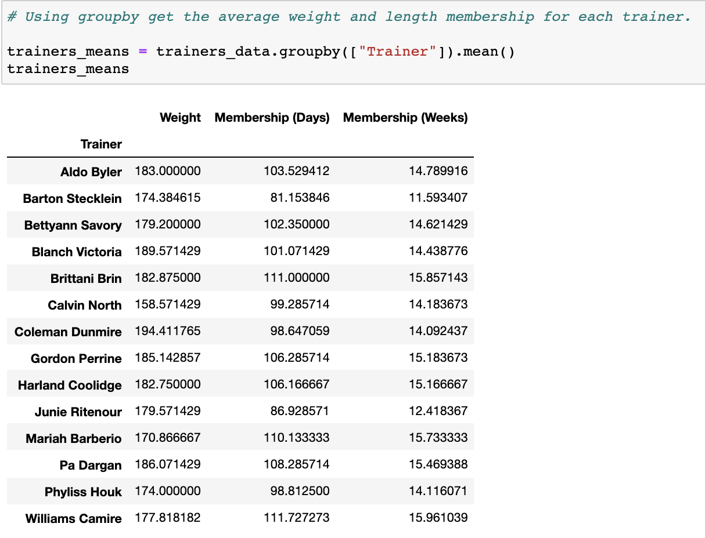

# Module 4 Class 2: Data Munging and Manipulation

## Overview

Before class, walk through this week's Challenge assignment in office hours; then, in class, the students will use Pandas to perform data munging operations and manipulate DataFrames to modify columns, remove or fill in missing data, group data into similar records to get sums and averages, and bin data. 

In today's class, students will clean data, filter data based on conditions or values, group data into similar records to perform calculations on columns, create new DataFrames, and segment and sort values into bins. 

## Learning Objectives

By the end of class, students will be able to:

* Drop missing values
* Delete and replace columns in a DataFrame
* Filter DataFrames based on a column or values in a column
* Segment and sort values into discrete bins

- - -

## Instructor Notes

* The activities in this class will complement Lessons **4.8.1: Set the Index to the School Name** through **4.13.2: Create a DataFrame for the Scores by School Type**.  The students will benefit from these activities if they‘ve progressed through these lessons, which cover the following concepts, techniques, and tasks:  

* Group data into similar records and perform calculations on the grouped data
* Filter a DataFrame based on a condition using logical operators
* Combine series to create a DataFrame
* Segment and sort values into discrete bins
* Format values in DataFrame columns

## Slides

[Pandas Day 2 slideshow](https://docs.google.com/presentation/d/11y5nViOJ4e7Plb4U5WWqDy49-nSIYHBd_ubp2LlIQG0/edit?usp=sharing)

## Student Resources

Share the following [activity resources](https://2u-data-curriculum-team.s3.amazonaws.com/data-viz-online-lesson-plans/04-Lessons/4-2-Student-Resources.zip) with the students. 

- - - 

## Before Class

### 0. Office Hours

| Activity Time: 0:30       |  Elapsed Time:     -0:30  |
|---------------------------|---------------------------|

  
<strong>📣 Instructor Do: Challenge Instruction Walkthrough (0:10) </strong>

Let the students know that the first few minutes of Office Hours will include a walkthrough of the Challenge requirements and rubric, as well as helpful tips to ensure they know exactly what they need to successfully complete the Challenge.

Open the Challenge in Canvas and go through the high-level instructions and requirements with your class. Be sure to check for understanding.

Open the Rubric in Canvas, go through the Mastery column with your class, and show how it maps back to the requirements for each deliverable. Be sure to check for understanding.

Review the following tips to ensure clarity on the Challenge:

For **Deliverable 1: Replace ninth grade reading and math scores:** they will be using the `loc` method with conditional statements and comparison or logical operators to retrieve the reading and math scores of the ninth graders at Thomas High School. Once they retrieve the scores, they will need to replace the scores with `NaN` using `np.nan`.

We have provided the [PyCitySchools Challenge starter code](../../../01-Assignments/04-PyCitySchools/Resources/PyCitySchools_Challenge_starter_code.ipynb) that goes through the data cleaning process of the student names. After that, there are commented sections where students will need to add code to complete this part of the challenge.

To help students with this part of the challenge, go over any activity in the lesson plans that uses the `loc` method.  We have also provided a video on using the `loc` method with conditional statements and comparison or logical operators to retrieve the passing grades for all the students.

For **Deliverable 2: Repeat the school district analysis:** they will need to repeat the school district analysis they did in the module. Let the students know that re-analyzing data that has been changed is a common task for data analysts, and it will likely be something that they have to do in the future.

We suggest that the students make a copy of the `PyCitySchools.ipynb` file, rename it `PyCitySchools_Challenge.ipynb`, and then copy the code from the `PyCitySchools Challenge starter code` and paste into the top of the `PyCitySchools_Challenge.ipynb`file. This will make it easier for them to complete Deliverable 2.

For this deliverable, they'll have to do more data munging to recreate the district and school summary DataFrames. 

* For the district summary, they'll need to recalculate the total student count by subtracting the number of ninth grade students in Thomas High School from the total student count. Then, they'll recalculate the passing math and passing reading percentages, and the overall passing percentage with the recalculated total student count. 

* For the school summary, they'll execute the code from this module that creates and formats the School Summary DataFrame, then they'll need to update the school summary using the 10th-12th graders from Thomas High School as follows:

    * First, they’ll calculate the number of 10th-12th graders in Thomas High School.
    * Next, they'll need to create three new DataFrames for the 10th-12th graders from Thomas High School: students who passed math, students who passed reading, and students who passed both math and reading. 
    * Using these DataFrames, they'll calculate the percentage of students that passed math, passed reading, and passed both math and reading by using the number of students in the 10th-12th grade.
    * Finally, they'll replace the `% Passing Math`, `% Passing Reading`, and `% Overall Passing` scores with the new passing percentages.

In the [starter code](../../../01-Assignments/04-PyCitySchools/Resources/PyCitySchools_Challenge_starter_code.ipynb), we have added code that creates the District Summary and School Summary, and has comments indicating where the learners will need to add code to complete this part of the challenge.

After they reanalyze the District Summary and School Summary, they'll need to reanalyze the remaining metrics that they analyzed in this module.

For **Deliverable 3: Write a report for the school district analysis in the repository README.md**, the students will be writing a report in the repository README.md file based on their analysis, just like they did in the previous modules.

For the **Results**, the students need to address the following questions using images and examples of code as needed to support their evidence.

* How is the district summary affected?
* How is the school summary affected?
* How does replacing the ninth graders’ math and reading scores affect Thomas High School’s performance, relative to the other schools?
* How does replacing the ninth grade scores affect the following:

  * Math and Reading Scores by Grade
  * Scores by School Spending
  * Scores by School Size
  * Scores by School Type

For the **Summary**, students need to provide a high-level summary of the three to four most striking changes to the school district analysis after the reading and math scores for the ninth grade at Thomas High School have been replaced with NaNs.

Encourage your class to begin the Challenge as soon as possible, if they haven’t already, and to use the Learning Assistants and the remainder of Office Hours with their instructional team for help as they progress through their work. If they feel like they need context to understand documentation or instructions throughout the week, this is where they can get it.

Open the floor to discussion and be sure to answer any questions they may have about the Challenge requirements before moving onto other areas of interest.

  
<strong>📣  Instructor Do: Office Hours (0:20)</strong>

For the remaining time, remind the students that this is their time to ask questions and get assistance from their instructional staff as they’re learning new concepts and working on the challenge assignment.

Expect that students may ask for assistance in areas such as the following: 

* Challenge assignment 
* Further review on a particular subject
* Debugging assistance
* Help with computer issues
* Guidance with a particular tool

- - - 

## During Class 

### 1. Getting Started

| Activity Time:       0:10 |  Elapsed Time:      0:10  |
|---------------------------|---------------------------|

  
<strong>📣 1.1 Instructor Do: Foundation Setting (0:05)</strong>

* Welcome students to class.

* Direct students to post individual questions in the Zoom chat to be addressed by you and your TAs at the end of class.

* Open the slideshow and use slides 1-5 to walk through the foundation setting with your class.

* **This Week - Pandas** Talk through the key skills that students will learn this week, and let them know that they are continuing to build on their data analyst skills. 

* **Today's Objectives:** Now, outline the concepts covered in today's lesson. Remind students that they can find the relevant activity files in the “Getting Ready for Class” page in their course content. 

  
<strong>🎉 1.2 Everyone Do: Check-In (0:05)</strong>

* Ask the class the following questions and call on students for the answers:

    * **Q:** How are you feeling about your progress so far?

    * **A:**  We are adding to our Pandas skill set. It's important to look back and see what we accomplished, and acknowledge that it's a lot! It’s also okay to feel overwhelmed as long as you don’t give up. The more you practice, the more comfortable you'll be coding.
    
    * **Q:** How comfortable do you feel with this topic? 

    * **A:** Let's do "fist to five" together. If you are not feeling confident, hold up a fist (0). If you feel very confident, hold up an open hand (5).

[Having issues with this section? Report a bug!](https://bit.ly/377c6B8)

### 2. Cleaning Crime Data

| Activity Time:       0:20 |  Elapsed Time:      0:30  |
|---------------------------|---------------------------|

  
<strong>📣 2.1 Instructor Do: Cleaning Data (0:05)</strong>

* When dealing with massive datasets, it is almost inevitable that duplicate rows, inconsistent spelling, and missing values will crop up.

  * While these issues may not seem significant in the grand scheme of things, they can interfere with the analysis and visualization of a dataset by skewing the data one way or another.

  * Thankfully, Pandas includes methods through which its users can remove missing values, replace duplicates, and change values with relative ease.

* You may use slides 7-14 to accompany this activity.

* Open up [01-Ins_CleaningData](Activities/01-Ins_CleaningData/Solved/CleaningData.ipynb) within Jupyter Notebook and run through the code line by line with the class.

  * To delete a column of extraneous information from a DataFrame: `del <DataFrame>[<Column>]`

  * To figure out if any rows are missing data, simply run the `count()` method on the DataFrame and check that all columns contain equal values.

  * To drop rows with missing information from a DataFrame: `<DataFrame>.dropna(how="any")`

    

  * Sometimes the rows containing "NaN" values should not be removed and should instead be filled with another value. In cases like these, simply use the `<DataFrame>.fillna(value=<Value>)` method and pass the desired value into the parentheses.

  * To find values that have similar or misspelled values, simply run the `value_counts()` method on the column in question and look through the values that are returned.

  * To replace similar or misspelled values, simply run the `replace()` method on the column in question and pass a dictionary into it, with the keys being those values to replace and the value to replace them with.

    

* Send out the [CleaningData.ipynb](Activities/01-Ins_CleaningData/Solved/CleaningData.ipynb) file for students to refer to later.

* Ask the class the following questions and call on students for the answers:

    * **Q:** Where have we used this before?

    * **A:** The `count()` method was covered in Lessons 4.5.2 and 4.7.2. The `replace()` method was covered in Lesson 4.5.5, `dropna()` and `fillna()` were covered in Lesson 4.5.2, and `value_counts()` was covered in Lesson 4.8.2.

    * **Q:** How does this activity equip us for the Challenge?

    * **A:** We'll need to use the `count()`, `replace()`, and the `value_counts()` methods in the Challenge.

    * **Q:** What can we do if we don't completely understand this?

    * **A:** We can refer to the lesson plan and reach out to the instructional team for help.

* Answer any questions before moving on to the student activity.

  
<strong>🎉 2.2 Everyone Do: Portland Crime (0:15)</strong>

* In this exercise, we will import the Portland crime dataset into a DataFrame and clean it up so the DataFrame has no missing data, there are no misspelled values, and similar offenses are combined.

* Open up [02-Evr_PortlandCrime](Activities/02-Evr_PortlandCrime/Solved/PortlandCrime.ipynb) within the Jupyter Notebook and run the code to show the end results of the application.

  

* Make sure the students can download and open the [instructions](Activities/02-Evr_PortlandCrime/README.md), the [books.csv](Activities/02-Evr_PortlandCrime/Unsolved/Resources/crime_incident_data2017.csv), and the [PortlandCrime_unsolved.ipynb](Activities/02-Evr_PortlandCrime/Unsolved/PortlandCrime_unsolved.ipynb) files from the AWS link. 

* Go over the instructions with the students, then give them 5 minutes to work on their solution to import the data and look for missing values. 

* When time is complete, ask students for volunteers to come forward and assist you in writing out the solutions for the next steps. If there are no volunteers, then have them code along with you as you cover the following points:

  * To look for missing values, we use the `count()` method on the DataFrame.

  * To drop rows with null values, we use `dropna(how="any")`, then verify the counts.

  * To look for any misspelled offenses and to find if similar offenses can be combined, we use `value_counts()` on the `Offense Type` column. 

  * We combine similar offenses using the `replace()` method on the column in question and pass a dictionary into it, with the keys being those values to replace and the value being a common offense in the column.

* Send out the [PortlandCrime.ipynb solution](Activities/02-Evr_PortlandCrime/Solved/PortlandCrime.ipynb) file for students to refer to later.

* Ask the class the following questions and call on students for the answers:

    * **Q:** How would we get the number of crimes against property, society, and person? 
    
    * **A:** We use `value_counts()` on the `Crimes Against` column of the DataFrame. 

    * **Q:** What can we do if we don't completely understand this?

    * **A:** Review Lessons 4.5 and 4.7 and reach out to the instructional staff.

[Having issues with this activity? Report a bug!](https://bit.ly/3oJmHs5)

### 3. Good Movies

| Activity Time:       0:30 |  Elapsed Time:      1:00  |
|---------------------------|---------------------------|

  
<strong>📣 3.1 Instructor Do: Exploring Data With Loc and Iloc (0:10)</strong>

* You may use slides 15-20 while covering the following points:

* One of the most powerful aspects of Pandas is how easily programmers can collect specific rows or columns of data from a DataFrame using the `loc[]` and `iloc[]` methods.

* Open up [03-Ins_LocAndIloc](Activities/03-Ins_LocAndIloc/Solved/LocAndIloc.ipynb) within Jupyter Notebook and run through the code line by line with the class.

  * The `loc[]` method allows its users to select data using label-based indexes. In other words, it takes in strings as the keys and returns data based upon them.

  * Using `loc[]` to get a specific value from a row is really useful when the index of a DataFrame is a collection of strings. Our DataFrame index is a number; to change it to a string, we can use the `df.set_index()` function and pass in the desired column header for the index.

    

  * Now, we can get the data of a specific person using their last name in the `loc[]` method. First, we add the last name from the index, "Berry", and then we add the column header of the data we want, "Phone Number", `loc["Berry","Phone Number"]`.

  * The `iloc[]` method also allows its users to select data, but instead of using labels, it uses integer-based indexing for selection by position. In other words, it selects data  the same way as one would select data from a list, using a numeric index.

  * To retrieve Berry's phone number using the `iloc[]` method, we add the index for "Berry" in the 2nd column, which is "1" followed by the index of the phone number, which is in the 3rd column, or "2". For example, `iloc[1, 2]`.

    

  * It is also possible to select a range of data using `loc[]` and `iloc[]` by placing all of the values within brackets. For example, `loc[["Richardson", "Berry", "Hudson", "Mcdonald", "Morales"],["id", "first_name", "Phone Number"]]` or `iloc[0:4, 0:3]`.

    

  * And it is possible to select a range of data using `iloc[]` by using list indexing to tell Pandas to look for a range. For example, `iloc[0:4, 0:3]`.

    

  * By passing in a colon by itself, `loc[]` and `iloc[]` will select all rows or columns depending on where it is placed in relation to the comma. For example: `loc[:, ["first_name", "Phone Number"]` will select all rows of data but will only return the "first_name" and "Phone Number" columns.

    

* Another exciting feature of `loc[]` and `iloc[]` is that these methods can be used to conditionally filter rows of data based upon the values contained within a column.

  * This is done by calling `loc[]` or `iloc[]` on a DataFrame and passing a logic test in place of the rows section of the call. For example, `loc[df["id"] >= 10, :]` will return all rows of data with a value greater than or equal to 10 within the "id" column.

  * It is possible to then select which columns to return by adding their references into the columns section of the `loc[]` or `iloc[]` expression.

  * If there are multiple conditions that should be checked for, `&` and `|` may also be added into the logic test as representations of `and` and `or`. This allows for a great amount of customization.

    

* Send out the [LocAndIloc.ipynb](Activities/03-Ins_LocAndIloc/Solved/LocAndIloc.ipynb) file for students to refer to later.

* Ask the class the following questions and call on students for the answers:

    * **Q:** Where have we used this before?

    * **A:** The `loc[]` and `iloc[]` methods are not covered in the lessons, but they will help you in the Challenge.

    * **Q:** How does this activity equip us for the Challenge?

    * **A:** We'll need to use the `loc[]` method in the Challenge.

    * **Q:** What can we do if we don't completely understand this?

    * **A:** We can reach out to the instructional team for help.

* Answer any questions before moving on to the student activity.

  
<strong>✏️ 3.2 Students Do: Good Movies (0:15)</strong>

* Now that the class has covered exploring and filtering DataFrames using `loc[]` and `iloc[]`, students will now create an application that looks through IMDB data in order to find the best movies.

* Make sure the students can download and open the [instructions](Activities/04-Stu_GoodMovies-Loc/README.md), the [movie_scores.csv](Activities/04-Stu_GoodMovies-Loc/Unsolved/Resources/movie_scores.csv), and the [good_movies_unsolved.ipynb](Activities/04-Stu_GoodMovies-Loc/Unsolved/good_movies_unsolved.ipynb) files from the AWS link. 

* Go over the instructions in the README, then open up [good_movies_unsolved.ipynb](Activities/04-Stu_GoodMovies-Loc/Unsolved/good_movies_unsolved.ipynb) within the Jupyter Notebook and show the results of the application.

  

* Divide students into groups of 3-5. They should work on the solution by themselves but can reach out to others in their group for tips.

* Let students know that they may be asked to share and walk through their work at the end of the activity.

  
<strong>⭐ 3.3 Review: Good Movies (0:05)</strong>

* Once time is complete, ask for volunteers to walk through their solutions. Remind them that it is perfectly alright if they didn't finish the activity. 

* To encourage participation, you can open the [good_movies_unsolved.ipynb](Activities/04-Stu_GoodMovies-Loc/Unsolved/good_movies_unsolved.ipynb) file and ask the students to help you write the code for each cell. 

* If there are no volunteers, open up the solved [good_movies.ipynb](Activities/04-Stu_GoodMovies-Loc/Solved/good_movies.ipynb) file and walk through the code with the class, answering whatever questions students have.

* Some key bits of information to cover during this review:

  * Since the user is only interested in data that pertains to IMDB, all rows that contain review information outside of IMDB are filtered out manually by dropping those rows.

  * To collect the films with a score greater than or equal to 7, a conditional `loc[]` filter is used that looks into the "IMDB" column and only collects those rows that pass through the logic test with a `True` value.

  * To collect the films that have less than 20K votes, another conditional `loc[]` filter is used that searches through the "IMDB_user_vote_count" column and only collects those rows that pass through the logic test with a True value.

    

* Send out the [good_movies.ipynb](Activities/04-Stu_GoodMovies-Loc/Solved/good_movies.ipynb) file for students to refer to later.

* Answer any questions before proceeding to the next activity.

[Having issues with this activity? Report a bug!](https://bit.ly/3oJEr6u)

### 4. Training Groupby

| Activity Time:       0:25 |  Elapsed Time:      1:25  |
|---------------------------|---------------------------|

  
<strong>📣 4.1 Instructor Do: Pandas Grouping (0:05)</strong>

* You may use slides 21-30 while covering the following talking points:

* Another powerful Pandas function is the `.groupby()` function. With the `.groupby()` function, you can group Pandas objects based on a common record. 

* Open up [05-Ins_GroupBy](Activities/05-Ins_GroupBy/Solved/GroupBy.ipynb) within Jupyter Notebook and run through the code with the class, explaining it cell by cell.

  * The start of the code is much the same as earlier. Import in dependencies and remove all rows with missing data. 

    
    
  * Point out that the country and state columns have common records. Let's determine the sum of the duration of UFO sightings by country and state by using the `.groupby()`function to accomplish this task. 
  
  * Before grouping the data by the country and state and summing the duration for each state, we need to convert the "duration (seconds)" column to numeric because it is currently an object. 
  
    
  
  * To convert the "duration (seconds)" column's values to numeric, we filter the DataFrame using the `loc[]` method on the `"duration (seconds)"` column, apply the `.astype()` method, and pass in the new data type, `float`, to convert the values in the column. 
  
  * Then, we filter the new DataFrame using the `loc[]` method so only US info is shown, and count the number of sightings per state.

  * The `df.groupby([<Columns>])` function is then used in order to split the DataFrame into multiple groups, with each group being a different state within the US.

  * The object returned by the `.groupby()`function is a GroupBy object and cannot be accessed like a normal DataFrame. In fact, one of the only ways to access values within a GroupBy object is by using a data function on it.

    

  * It is possible to create new DataFrames using only GroupBy data. This can be done by taking the `pd.DataFrame()` method and passing the desired GroupBy data in as the parameter.

  * A DataFrame can also be created by selecting a single series from a GroupBy object and passing it in as the values for a specified column.

    

  * It is possible to perform a `df.groupby()` method on multiple columns as well. This can be done by passing two or more column references into the list parameter.

    

  * Finally, a new DataFrame can be created from a GroupBy object.

    

* Send out the [GroupBy.ipynb](Activities/05-Ins_GroupBy/Solved/GroupBy.ipynb) solution file for students to refer to later.

* Ask the class the following questions and call on students for the answers:

    * **Q:** Where have we used this before?

    * **A:** The `groupby()` function was covered in Lessons 4.8.4, 4.11.1, 4.11.4, 4.12.3, and 4.13.1.

    * **Q:** How does this activity equip us for the Challenge?

    * **A:** We'll need to use the `groupby()` function in the Challenge.

    * **Q:** What can we do if we don't completely understand this?

    * **A:** We can reach out to the instructional team for help.

* Answer any questions before moving on to the student activity.

    
<strong>👥 4.2 Partners Do: Training Groupby (0:15)</strong>

* In this exercise, the students will work in pairs and use `groupby()` to get the average weight and length of membership of the gym members for each trainer. 

* Make sure the students can download and open the [instructions](Activities/06-Par_TrainingGroupby/README.md) and the [TrainingGroupby_unsolved.ipynb](Activities/06-Par_TrainingGroupby/Unsolved/TrainingGroupby_unsolved.ipynb) files from the AWS link. 

* Go over the instructions in the README, then open up [TrainingGroupby_unsolved.ipynb](Activities/06-Par_TrainingGroupby/Unsolved/TrainingGroupby_unsolved.ipynb) within the Jupyter Notebook and show the results of the application.

* Answer any questions before breaking the students out in pairs. 

* Let students know that their group may be asked to share and walk through their work at the end of the activity.

    
<strong>⭐ 4.3 Review: Training Groupby (0:05)</strong>

* Once time is complete, ask for a group to walk through their solution. Remind them that it is perfectly alright if they didn't complete the activity. 

* To encourage participation, you can open the [TrainingGroupby_unsolved.ipynb](Activities/06-Par_TrainingGrounds/Unsolved/TrainingGroupby_unsolved.ipynb) file and ask the students to help you write the code for each cell. 

* If there are no volunteers, open up the solved [TrainingGroupby.ipynb](Activities/06-Par_TrainingGroupby/Solved/TrainingGroupby.ipynb) file and walk through the code with the class, answering any student questions.

* Key points to tackle when discussing this activity:

  * After creating the DataFrame that has the Trainer, Weight, and Membership in days and weeks, we apply the `groupby()` function to the DataFrame and group the data by each Trainer, and then  apply the `mean()` to the grouped DataFrame to get the averages for each trainer.

    

* Send out the [TrainingGroupby.ipynb](Activities/06-Par_TrainingGroupby/Solved/TrainingGroupby.ipynb) solution file for students to refer to later.

* Ask the class the following questions and call on students for the answers:

    * **Q:** How would we sort the DataFrame from longest to shortest length of membership in days? 
    
    * **A:** We use `sort_values(by='Membership (Days)', ascending=False)` on the `trainers_means` DataFrame.

    * **Q:** What can we do if we don't completely understand how the `groupby()` function works?

    * **A:** Review the Lessons 4.8.4, 4.11.1, 4.11.4, 4.12.3, and 4.13.1, and reach out to the instructional staff.

* Answer any questions before moving on to the student activity.

[Having issues with this activity? Report a bug!](https://bit.ly/2W5F7XH)

### 5. Binning TED

| Activity Time:       0:30 |  Elapsed Time:      1:55  |
|---------------------------|---------------------------|

  
<strong>📣 5.1 Instructor Do: Binning Data (0:05)</strong>

* You may use slides 31-38 while covering the following talking points:

* Not everyone is a numbers person, and sometimes there are so many values within a DataFrame that it becomes difficult to comprehend what exactly is going on. Grouping these values in bins can make it easier to visualize large datasets. Using the Pandas `pd.cut()` function will allow us to "bin" values into groups, which enables more vigorous customization of datasets.

* Open up [07-Ins_Binning](Activities/07-Ins_Binning/Solved/Binning.ipynb) within Jupyter Notebook and run through the code with the class, discussing it cell by cell.

  * When using the `pd.cut()` function, three parameters must be passed in. The first is the Series that is going to be cut. The second is a list of the bins that the Series will be sliced into. The last is a list of the names/values that will be given to the bins.

  * It is important to note how, when creating the list for bins, Pandas will automatically determine the range between values. This means that, when given the list `[0, 59, 69, 79, 89, 100]`, Pandas will create bins with ranges between those values in the list.

  * The labels for the `pd.cut()` function must have an equal length to the number of bins. If there are too many or too few, an error will be returned.

    

  * What makes binning so powerful is that, after creating and applying these bins, the DataFrame can be grouped according to those values and thus a higher-level analysis can be conducted, such as getting the summary statistics with the `describe()` function.

    

* Send out the [Binning.ipynb](Activities/07-Ins_Binning/Solved/Binning.ipynb) solution file for students to refer to later.

* Ask the class the following questions and call on students for the answers:

    * **Q:** Where have we used this before?

    * **A:** The `cut()` function was covered in Lessons 4.11.2 and 4.12.2.

    * **Q:** How does this activity equip us for the Challenge?

    * **A:** We'll need to use the `cut()` function in the Challenge.

    * **Q:** What can we do if we don't completely understand this?

    * **A:** We can reach out to the instructional team for help.

* Answer any questions before moving on to the student activity.

  
<strong>✏️ 5.2 Students Do: Binning TED (0:20)</strong>

* The class will now put their binning skills to the test by creating bins for TED Talks based on their viewership. After creating the bins, they will group the DataFrame based on those bins, and then perform some analysis on them.

* Make sure the students can download and open the [instructions](Activities/08-Stu_TedTalks-Binning/README.md), the [ted_talks.csv](Activities/08-Stu_TedTalks-Binning/Unsolved/Resources/ted_talks.csv), and the [BinningTed_unsolved.ipynb](Activities/08-Stu_TedTalks-Binning/Unsolved/BinningTed_unsolved.ipynb) files from the AWS link. 

* Go over the instructions in the README, then open up the solved version of [08-Stu_TedTalks-Binning](Activities/08-Stu_TedTalks-Binning/Solved/BinningTed.ipynb) within Jupyter Notebook to show students how the final version of their application should look.

  

* Divide students into groups of 3-5. They should work on the solution by themselves but can reach out to others in their group for tips.

* Let students know that they may be asked to share and walk through their work at the end of the activity.

  
<strong>⭐ 5.3 Review: Binning TED (0:05)</strong>

* Once time is complete, ask for a group to walk through their solution. Remind them that it is perfectly alright if they didn't complete the activity. 

* To encourage participation, you can open the [BinningTed_unsolved.ipynb](Activities/08-Stu_TedTalks-Binning/Unsolved/BinningTed_unsolved.ipynb) file and ask the students to help you write the code for each cell. 

* If there are no volunteers, open up the solved [BinningTed.ipynb](Activities/08-Stu_TedTalks-Binning/Solved/BinningTed.ipynb) file within Jupyter Notebook and run through the code with the class, discussing it cell by cell.

  * Since the values contained within the "views" column are so widespread, there are several ways to split up the data that would be acceptable. This particular code uses a variable scale that attempts to look at every 200k-view difference until reaching the millions, at which point it switches to look at every 1-mil difference.

    

  * The bins are added into the DataFrame by placing them within a new column. The DataFrame is then grouped on this new column in order to perform all of the data functions.

* Send out the [BinningTed.ipynb](Activities/08-Stu_TedTalks-Binning/Solved/BinningTed.ipynb) solution file for students to refer to later.

* Ask the class the following questions and call on students for the answers:

    * **Q:** What can we do if we don't completely understand how the `cut()` function works?

    * **A:** Review the Lessons 4.11.2 and 4.12.2, and reach out to the instructional staff.

* Answer any questions before ending class.

[Having issues with this activity? Report a bug!](https://bit.ly/3m4DdkE)

### 6. Ending Class 

| Activity Time:       0:05 |  Elapsed Time:      2:00  |
|---------------------------|---------------------------|

  
<strong>📣  6.1 Instructor Do: Review (0:05)</strong>

* Before ending class, review the skills that were covered today and mention where in the module these skills are used. 
  * The `dropna()` and `fillna()` methods were covered in **Lesson 4.5.2**.
  * The `replace()` method was covered in **Lesson 4.5.5**.
  * The `count()` method was covered in **Lesson 4.7.2**.
  * The `value_counts()` method was covered in **Lesson 4.8.2**.
  * The `groupby()` function was covered in **Lesson 4.8.4**.
  * The `cut()` function was covered in **Lesson 4.11.2**.

* Answer any questions the students may have.

[Having issues with this section? Report a bug!](https://bit.ly/3qQO8BZ)

---

© 2021 Trilogy Education Services, LLC, a 2U, Inc. brand.  Confidential and Proprietary.  All Rights Reserved.
