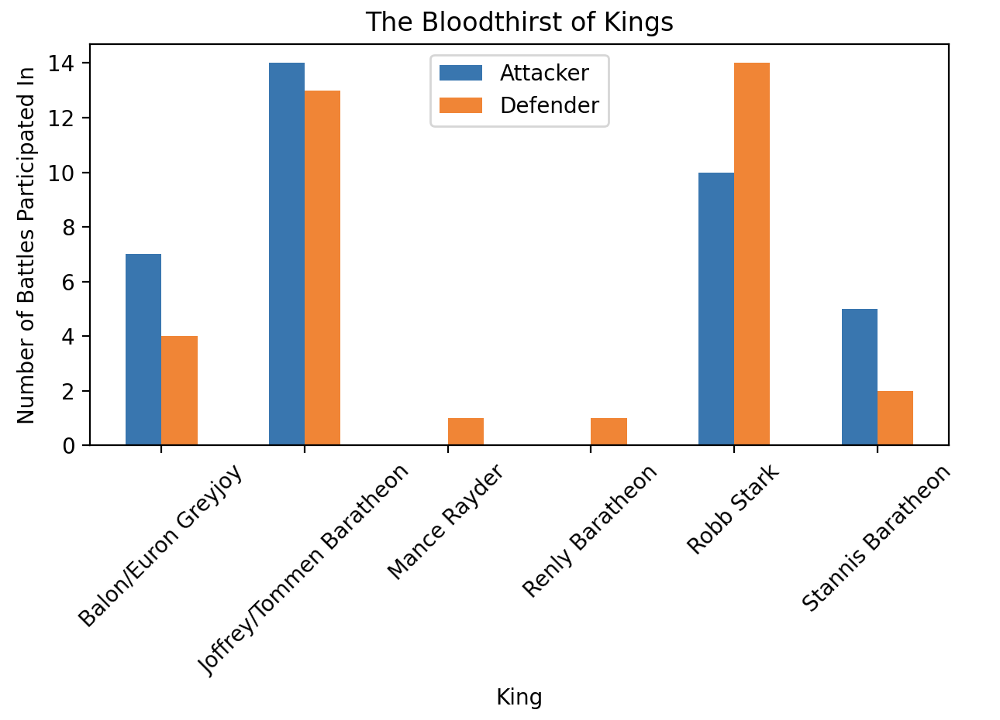
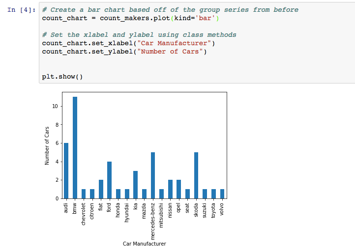
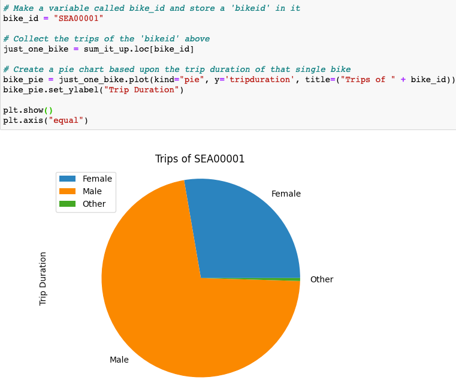

# Module 5 Class 2: DataFrame Visualizations

## Overview

Before class, walk through this week's Challenge assignment in office hours; then, in class, the students will learn how to graph data from Pandas DataFrames after performing data munging operations to modify columns, remove missing data, fill in missing data, and group data into similar records to get sums and averages.

The main focus of today's class is graphing data from DataFrames. Today’s activities require the students to perform data munging tasks such as using `value_counts()`, `groupby()` with `count()`, `mean()`, and `sum()`, and the `loc[]` method to filter data before they create charts. Students will also be introduced to the `pivot()` and `resample()` functions, which will help them with the Challenge. The `resample()` function can order the time series data by hour, day, week, month, or year depending on the desired output to showcase the data in a chart.  

## Learning Objectives

By the end of class, students will be able to:

* Create line, bar, pie, and scatter charts from Pandas DataFrames
* Add and modify chart features 


- - -

## Instructor Notes

The activities in this class will complement Lessons **5.5.1: Get the Percentage of Fares for Each City Type** through **5.7.2: Pie Chart for the Percentage of Drivers for Each City Type**.  The students will benefit from these activities if they‘ve progressed through these lessons, which cover the following concepts, techniques, and tasks:  

* Use Pandas functions and methods on DataFrames
* Group data into similar records and perform calculations on the grouped data
* Filter a DataFrame based on a condition using logical operators
* Create pie and bubble charts
* Add and modify chart features 


## Slides

[Matplotlib Day 2 slideshow](https://docs.google.com/presentation/d/1vAmYdFWHFnxMB49ZPVyrzEC4ZcXkfcMABCLwXKzNZSg/edit?usp=sharing)

## Student Resources

Share the following [activity resources](https://2u-data-curriculum-team.s3.amazonaws.com/data-viz-online-lesson-plans/05-Lessons/5-2-Student_Resources.zip) with the students. 

- - - 

## Before Class

### 0. Office Hours

| Activity Time: 0:30       |  Elapsed Time:     -0:30  |
|---------------------------|---------------------------|

<details>
  <summary><strong>📣 Instructor Do: Challenge Instruction Walkthrough</strong></summary>

Let the students know that the first few minutes of Office Hours will include a walkthrough of the Challenge requirements and rubric, as well as helpful tips they need in order to be successful.

Open the Challenge in Canvas and go through the high-level instructions and requirements with your class. Be sure to check for understanding.

Open the Rubric in Canvas and go through the Mastery column with your class and show how it maps back to the requirements for each deliverable. Be sure to check for understanding.

Review the following tips to ensure clarity on the Challenge:

The first part of the assignment, **Deliverable 1: A Summary Ride-sharing DataFrame by City Type**, should not be too challenging, as it will draw on their Pandas skills and knowledge that they learned and used in "Module 4: PyCitySchools". They'll use the Pandas `groupby()` function with the `count()` and `sum()` methods on DataFrame columns to get the total number of rides, drivers and fares for each city type. Then, they’ll use data munging to calculate the average fare per ride and average fare per driver for each city type. Finally, they'll add this data to a new DataFrame and format the columns.

We have provided the [PyBer Challenge starter code](../../../01-Assignments/05-PyBer/Resources/PyBer_Challenge_starter_code.ipynb) that has comments indicating where the learners will need to add code to complete this part of the Challenge.

The second part of the Challenge, **Deliverable 2: A Multiple-line Chart of Total Fares for each City Type** will feel more challenging because we are asking them to use two new Pandas functions to produce a multiple-line graph in Matplotlib "fivethirtyeight" graph style that shows the total fares for each week by city type.

This second part of the Challenge may be harder than Deliverable 1. In the [starter code](../../../01-Assignments/05-PyBer/Resources/PyBer_Challenge_starter_code.ipynb), there are commented sections for the learners to add their code to complete this part of the Challenge. In addition, we have provided two videos to assist them, one on how to use the `pivot()` function and another on how to use the `resample()` function.

* First, they'll need to use the `groupby()` function to create a multi-index DataFrame on the city "type" and "date" columns, and apply the `sum()` method on the "fare" column to get the total fare amount.

* Next, they'll use the `reset_index()` method to place all the data in columns.

* Then, they'll use the `pivot()` function to reshape the data where the index is the `date`, the columns are the `'type'` of city, and the values are `fare`.

* Next, they'll need to use the `loc` method on a date range to filter the data. Remind them that they have already used the `loc` method in the "Module 4: PyCitySchools" Challenge.

* Then, they'll convert the date, which will be the index, to a `datetime` datatype and confirm that the datatype has been changed.

* Then, they'll use the `resample()` function to reshape the data in weekly bins, i.e., `('W')`, and then apply the `sum()` method to get the total fares for each week.

  * When using the `resample()` method on a DataFrame, they should be aware that they can resample time series data by day, week, month, or any other time increment as long as the DataFrame has a datetime-like index (`DatetimeIndex`).

* Finally, they'll use the object-oriented interface method to plot the resampled DataFrame using `df.plot()` and the Matplotlib `"fivethirtyeight"` style.

For **Deliverable 3: Written Report for the PyBer Analysis**, the students will write a report in the repository README.md file based on their analysis, just like they did in the previous modules.

For the **Results** section of Deliverable 3, the students need to describe the differences in ride-sharing data among the different city types. They are encouraged to use images from the summary DataFrame and multiple-line chart to support their results.

For the **Summary** section of Deliverable 3, the students need to provide the CEO with three business recommendations for addressing any disparities among the city types.

Encourage your class to begin the Challenge as soon as possible, if they haven’t already, and to use the Learning Assistants channel and the remainder of Office Hours with their instructional team for help as they progress through their work. If they feel like they need context to understand documentation or instructions throughout the week, this is where they can get it.

Open the floor to discussion and ensure to answer any questions they may have about the Challenge requirements before moving onto other areas of interest.

</details>

<details>
  <summary><strong>📣  Instructor Do: Office Hours</strong></summary>

For the remaining time, remind the students that this is their time to ask questions and get assistance from their instructional staff as they’re learning new concepts and working on the Challenge assignment.

Expect that students may ask for assistance. For example: 

* Challenge assignment 
* Further review on a particular subject
* Debugging assistance
* Help with computer issues
* Guidance with a particular tool

</details>


- - - 

## During Class 

### 1. Getting Started

| Activity Time:       0:10 |  Elapsed Time:      0:10  |
|---------------------------|---------------------------|

<details>
  <summary><strong>📣 1.1 Instructor Do: Foundation Setting (0:05)</strong></summary>

* Welcome students to class.

* Direct students to post individual questions in the Zoom chat to be addressed by you and your TAs at the end of class.

* Open the slideshow and use slides 1-7 to walk through the foundation setting with your class.

* **This Week - Matplotlib** Talk through the key skills that students will learn this week, and let them know that they are continuing to build on their data analyst skills. 

* **Today's Objectives:** Now, outline the concepts covered in today's lesson. Remind students that they can find the relevant activity files in the “Getting Ready for Class” page in their course content. 

</details>

<details>
  <summary><strong>🎉 1.2 Everyone Do: Check-In (0:05)</strong></summary>

* Ask the class the following questions and call on students for the answers:

    * **Q:** How are you feeling about your progress so far?

    * **A:** We are adding to our Matplotlib skill set. It's important to look back and see what we accomplished, and acknowledge that it's a lot! It’s also okay to feel overwhelmed as long as you don’t give up. The more you practice, the more comfortable you'll be coding.
    
    * **Q:** How comfortable do you feel with this topic? 

    * **A:** Let's do "fist to five" together. If you are not feeling confident, hold up a fist (0). If you feel very confident, hold up an open hand (5).

</details>


<sub>[Having issues with this section? Report a bug!](https://bit.ly/3aeWfTh)</sub>

- - - 

### 2. PyPlot Warmup

| Activity Time:       0:20 |  Elapsed Time:      0:30  |
|---------------------------|---------------------------|

<details>
  <summary><strong>📣  2.1 Instructor Do: PyPlot Warmup (0:20)</strong></summary>

* Before diving into the meat and potatoes of today's lesson, we will spend some time warming up our minds with some PyPlot drilling exercises. 
 
* In this activity, you will guide the students on how to use PyPlot to create the most effective visualizations for a variety of data sets. This activity should be a review of the students’ skills at creating plots, but it will also make them think about what type of plot best fits a data set.

* Have the students open the [plot_drills_unsolved.ipynb](Activities/01-Ins_PlotsReview/Solved/plot_drills.ipynb) file within the Jupyter Notebook. 

* **Q1:** Ask the students what type of graph would work for "Data Set 1"?

    ```python
    # Data Set 1
    gyms = ["Crunch", "Planet Fitness", "NY Sports Club", "Rickie's Gym"]
    members = [49, 92, 84, 53]
    
    ```

* **A1:** The first data set can be used to create a pie chart, but it may be more ideal for a bar chart since the programmer is provided only with a list of strings—gym names—and a list of integers—gym memberships—that should be compared against each other.  

* **Q2:** Ask the students what the syntax is for creating a basic bar chart?

* **A2:** Let the students know that the basic syntax is as follows and is covered in Lesson 5.1.5. 

  


* Have the students create the basic bar chart and remind them that this bar chart doesn't provide enough information for the viewer to able to understand the what is being analyzed, therefore we need to add annotations. 
    
* Ask the students what annotations would make the gym bar chart easier to understand.

* Open [01-Ins_PlotsReview](Activities/01-Ins_PlotsReview/Solved/plot_drills.ipynb) within the Jupyter Notebook and show the students the output for the more understandable bar chart and explain the following modifications: 
  * The tick locations for the x-axis are modified so that they fall in the center of their associated bar when the bars are aligned to the edge of the chart. 
  * A title is added, and the limits of the x- and y-axes are then also modified to ensure there is some separation between the bars and the edge of the chart.
  * The bar color can be changed using the `facecolor="red"` parameter.
  
    

  * Since pie charts are helpful when comparing parts of a whole, using a pie chart to graph the gym data provides a different perspective from the bar chart.
    
  * Ask the students how they would create a simple pie chart with the gym data. When you have an answer, or if they are struggling, run the following cell to create a basic pie chart without adding colors, text, values, or the `explode()` tuple. 

    

  * Then, show them how to make the pie chart easier to interpret by adding colors, values, popping out the percentage for the most popular gym , and orienting the pie chart with `startangle=90`. 

    

* Move on to "Data Set 2" and ask the students the following questions. 

* **Q3:** Ask the students what type of graph would be best for "Data Set 2"?

    ```python
    # Data Set 2
    seconds = [0,  10,  20,  30,  40,  50,  60,  70,  80,  90, 100, 110, 120, 130, 140, 150]
    coaster_speed = [0, 10, 15, 65, 75, 70, 60, 68, 55, 70, 70, 55, 50, 30, 10, 0]
    
    ```

* **A3:** The second data set fits a line chart because the values within the lists change over time in relation to one another.  

* Run the code to create a simple line chart and show the students the output, and point out that `plt.plot()` needs the data for the x- and y-axes.  
  
  
  
* Run the code for the second bar chart in the [01-Ins_PlotsReview](Activities/01-Ins_PlotsReview/Solved/plot_drills.ipynb) file and show the students the output. 

  * This line chart doesn't provide enough information to the viewer. In order to do that we need to add annotations. 
  
  * Ask the students what annotations would make the gym bar chart easier to interpret.
  
  * Run the code to create the aesthetically pleasing rollercoaster visualization in the [01-Ins_PlotsReview](Activities/01-Ins_PlotsReview/Solved/plot_drills.ipynb) file, then show the students the code and output and answer any questions. 

* Move on to "Data Set 3" and ask the students the following questions. 

* **Q4:** Ask the students what type of graph would be best for "Data Set 3"?

    ```python
    # Data Set 3
    mpg = [18, 15, 18, 16, 17, 15, 14, 14, 14, 15, 15, 14, 15, 
       14, 24, 22, 18, 21, 27, 26, 25, 24, 25, 26, 21, 10, 10, 11, 9]
       
    horsepower = [130, 165, 150, 150, 140, 198, 220, 215, 225, 190, 170, 160, 150, 
              225, 95, 95, 97, 85,88, 46, 87, 90, 95, 113, 90, 215, 200, 210, 193]
    
    ```

* **A4:** Since the data set compares 2 lists with unique values, a scatter plot is the ideal method for visualizing the relationship.

  * Explain that scatter plots require very little styling to make them easy to interpret, so the chart really only needs to be drawn. 

    

  * Scatter plots allow you to modify the size of the marker on the scatter plot to create a relationship between the two sets of data by adjusting the size of each marker using the `s=` parameter. 

* For our chart, we can create a relationship between horsepower and mpg by adding the number of cylinders of the engine for each data.
   * Run the code to create the annotated scatter plot in the [01-Ins_PlotsReview](Activities/01-Ins_PlotsReview/Solved/plot_drills.ipynb) file and review the following points:

    * We are provided with a list of the number of cylinders for each vehicle, and we can adjust the values by a factor of 10, `cylinders_adj = [item * 10 for item in cylinders]` and add these values to the `s=` parameter. 

    * Next, we add the `label="No. Cylinders"` parameter for the legend.

        

* Send out the [plot_drills.ipynb solution](Activities/01-Ins_PlotsReview/Solved/plot_drills.ipynb) file for students to refer to later.

* Answer any questions before proceeding to the next activity.


</details>

<sub>[Having issues with this activity? Report a bug!](https://bit.ly/3a9BkAW)</sub>

- - - 

### 3. Battling Kings - Plotting Pandas Data

| Activity Time:       0:30 |  Elapsed Time:      1:00  |
|---------------------------|---------------------------|

<details>
  <summary><strong>📣 3.1 Instructor Do: Plotting Pandas Data (0:10)</strong></summary>

* You can use slides 8-20 for the following activity. 

* The plots within the previous activity were generated using mock data. In real applications, data could be messy, incomplete, or in strange formats.

* When dealing with real data, analysts will typically spend a lot of time "cleaning" it prior to generating any graphics. Once the data is clean, they can create an accurate and effective plot.

* Last week, we learned how to clean up and preprocess data sets using Pandas. Most likely,  real-world data that we’ll want to analyze and create visualizations will be in a CSV file which will have to be read into a Pandas DataFrame.

* The creators of Pandas realized that most people using Pandas would move on to visualize their plots using Matplotlib. In a moment of pure genius, they built Matplotlib methods into their library to allow data analysts to quickly and easily generate complex charts.

* Open and run [02-Ins_PandasPlot](Activities/02-Ins_PandasPlot/Solved/avg_state_rain.ipynb) within Jupyter Notebook to show students how Pandas can be used to create intricate plots and data visualizations using the values stored in DataFrames. Cover the following talking points:

  * Using PyPlot, it took a lot of code to create a bar chart of average rainfall by state.

  * Scroll down to the "Using Pandas to Chart a DataFrame" section of the application. See how the original DataFrame is being cut down to only those values that the application should chart. The index for the DataFrame is then set to the "State" column so that Pandas will use these values later on.

  * `DataFrame.plot()` is called and the parameters `kind="bar"` and `figsize=(20,3)` are passed into it. This tells Pandas to create a new bar chart using the values stored within the DataFrame. The values stored within the index will be the labels for the x-axis, while the values stored within the other column will be used to plot the y-axis.

  * The bar chart produced is automatically styled. The header for the index is now the label for the x-axis, while the header for the other column has been placed inside a legend.

  * The chart can also still be edited just like any other kind of PyPlot. For example, the title for the chart can still be set using `plt.title()`.

    

  * Pandas will plot multiple columns so long as the DataFrame contains multiple columns of data.

  * It is also possible to modify a specific Pandas plot by storing the plot within a variable and then using built-in methods to modify it. For example, `PandasPlot.set_xticklabels()` will allow the user to modify the tick labels on the x-axis without having to manually set the DataFrame's index.

    

  * To use a different plotting type, simply change the "kind" that is being passed as a parameter.

* Send out the [avg_state_rain.ipynb](Activities/02-Ins_PandasPlot/Solved/avg_state_rain.ipynb) file for students to refer to later.

* Ask the class the following questions and call on students for the answers:

    * **Q:** Where have we used this before?

    * **A:** Plotting Pandas DataFrames and Series was covered in Lesson 5.1.10.

    * **Q:** How does this activity equip us for the Challenge?

    * **A:** We'll need to plot a DataFrame in the Challenge.

    * **Q:** What can we do if we don't completely understand this?

    * **A:** We can refer to the lesson plan and reach out to the instructional team for help.

* Answer any questions before moving on to the student activity.


</details>

<details>
  <summary><strong>✏️ 3.2 Student Do: Battling Kings (0:15)</strong></summary>

* In this activity, students will create a bar chart that visualizes which kings in the Game of Thrones universe have participated in the most battles. This means that students will need to clean up and analyze a Pandas DataFrame before creating their plot.

* Make sure the students can download and open the [instructions](Activities/03-Stu_BattlingKings-PlottingPandas/README.md) and the [unsolved battling_kings.ipynb](Activities/03-Stu_BattlingKings-PlottingPandas/Unsolved/battling_kings_unsolved.ipynb) files from the AWS link. 

* Go over the instructions in the README, then open up the [battling_kings solution](Activities/03-Stu_BattlingKings-PlottingPandas/Solved/battling_kings.ipynb) file within the Jupyter Notebook and run the code to show the end results of the application.

    

* Divide students into breakout groups of 3-5. They should work on the solution by themselves but can reach out to others in their group for tips.

* Let students know that they may be asked to share and walk through their work at the end of the activity.

</details>

<details>
  <summary><strong>⭐ 3.3 Review: Battling Kings (0:05)</strong></summary>

* Once time is complete, ask for volunteers to share their solution. Remind them that it is perfectly alright if they didn't complete the activity. 

* To encourage participation, you can open the [battling_kings_unsolved.ipynb](Activities/03-Stu_BattlingKings-PlottingPandas/Unsolved/battling_kings_unsolved.ipynb) file and ask the students to help you write the code for each cell. 

* If there are no volunteers, open up the [battling_kings solution](Activities/03-Stu_BattlingKings-PlottingPandas/Solved/battling_kings.ipynb) within the Jupyter Notebook and go through the code line by line with the class, answering whatever questions they have and discussing the following points:

  * Since the primary purpose of this chart will be to uncover which kings have participated in the most battles, it is crucial to collect the `value_counts()` of both the "attacking_king" and "defending_king" columns.

  * The values contained in these 2 Pandas series should be added together to calculate the total battles each king participated in. This should be done using `Series.add(OtherSeries, fill_value=0)` so that the 2 kings who have only been on the defending sides of battles will be added properly.

  * From this point, all that needs to be done is use `Series.plot(kind="bar")` to create the desired plot.

    


* Ask the class the following questions and call on students for the answers:

  * **Q:** How would you separate out the attacking and defending data for each king and plot the results?

  * **A:** You would create a new DataFrame where one column is the `attacker_data` and one column is the `defender_data`, and then fill in the `NaN` with "0".  

    

  * And you would remove the `facecolor="red"` parameter in the `plot()` function to generate the following plot. 

    
    
  * **Q:** What can we do if we don't completely understand this?

  * **A:** You can reach out to the instructional staff.

* Send out the [battling_kings solution](Activities/03-Stu_BattlingKings-PlottingPandas/Solved/) files for students to refer to later.

* Answer any questions before proceeding to the next activity.

</details>

<sub>[Having issues with this activity? Report a bug!](https://bit.ly/38bKOJr)</sub>

- - - 

### 4. Bike Trippin'

| Activity Time:       0:30 |  Elapsed Time:      1:30  |
|---------------------------|---------------------------|

<details>
  <summary><strong>📣 4.1 Instructor Do: Plotting Groups (0:05)</strong></summary>

* You can use slides 21-29 for the following activity.

* Ask the students if they remember how to group data using Pandas. Then, remind the students of the following:

  * We can group and summarize data using the Pandas `groupby()` function. The output of this is a GroupBy object.

  * A DataFrame is returned when a method, like `mean()`, is called on a GroupBy object.

    ```python
    # Returns a DataFrame from a GroupBy object
    df.groupby('state').mean()
    ```

  * If the method is called on a specific column of a GroupBy object, then a series is returned.

    ```python
    # Returns a Series from a GroupBy object
    states = df.groupby('state')
    states['city'].mean()
    ```

  * Then, either the`DataFrame.plot()` or `Series.plot()` can be used to quickly create charts based on summary data.

* Open [04-Ins_GroupPlots](Activities/04-Ins_GroupPlots/Solved/plotting_groups.ipynb) within the Jupyter Notebook and run through the code with the class.

  * This example takes used car data from Germany and allows users to determine what categories influence the pricing of a car.

  * Within this application, the original DataFrame is grouped by the values of the `"maker"` column and returned as a GroupBy object.

  * Those values are then counted on the column `"maker"`, returning a Series with the count of each `"maker"`.

  * This Series is then charted using Pandas.

    

* Send out the [plotting_groups.ipynb solution](Activities/04-Ins_GroupPlots/Solved/plotting_groups.ipynb) file for students to refer to later.

* Ask the class the following questions and call on students for the answers:

    * **Q:** Where have we used this before?

    * **A:** We have not plotted data created from a GroupBy object.

    * **Q:** How does this activity equip us for the Challenge?

    * **A:** We will need to be familiar with how to create a GroupBy object in the Challenge.  

    * **Q:** What can we do if we don't completely understand this?

    * **A:** We can refer to the lesson plan and reach out to the instructional team for help.

* Answer any questions before moving on to the student activity.

</details>

<details>
  <summary><strong>✏️ 4.2 Student Do: Bike Trippin' - Grouped Charts (0:20)</strong></summary>

* In this activity, students will create a pair of charts based on community bike data collected from Seattle. This activity will require them to create and analyze GroupBy objects before printing some visualizations of their findings to the screen.

* Make sure the students can download and open the [instructions](Activities/05-Stu_BikeTrippin-Groupby/README.md) and the [bike_trippin_unsolved.ipynb](Activities/05-Stu_BikeTrippin-Groupby/Unsolved/bike_trippin_unsolved.ipynb) files from the AWS link. 

* Go over the instructions in the README, then open up the [bike_trippin.ipynb](Activities/05-Stu_BikeTrippin-Groupby/Solved/bike_trippin.ipynb) file within the Jupyter Notebook and run the code to show the bar chart and pie chart that they'll create. 

* Divide students into breakout groups of 3-5. They should work on the solution by themselves but can reach out to others in their group for tips.

* Let students know that they may be asked to share and walk through their work at the end of the activity.


</details>


<details>
  <summary><strong>⭐ 4.3 Review: Bike Trippin' (0:05)</strong></summary>

* When time is complete, open the [bike_trippin_unsolved.ipynb](Activities/05-Stu_BikeTrippin-Groupby/Unsolved/bike_trippin_unsolved.ipynb) file and ask for volunteers to help you write the code for each cell.

* If there are no volunteers, begin adding the code for each cell and make sure to discuss the following points:

  * For the bar chart, the original DataFrame is grouped by the values within the "gender" column and then counted.

  * After splitting the data into groups based on gender, and getting the number of bike trips per gender, there is an extra row, called "stoptime." This row must be dropped so the data can be charted accurately.

    

  * After dropping the extra row, the title for the chart is set within the `Series.plot()` method, while the x-axis and y-axis labels are set using Matplotlib's `Axes.set_xlabel()` and `Axes.set_ylabel()` methods.

    

  * For the pie chart, the original DataFrame is grouped by both the "bikeid" and "gender" columns, and a GroupBy object is returned. When the sum analysis is performed, a DataFrame containing multiple indexes is returned so that the duration is calculated per gender per bike.

    

  * To create a chart based on one bike only, the `loc[]` method must be used on the multi-index DataFrame and the `bikeid` must be passed inside the `loc[]` method. This returns a DataFrame with only the "gender" column as the index and "tripduration" as the value.

    

  * When creating a pie chart, a Y value must be passed into the `DataFrame.plot()` method. This lets Pandas know what label or position of the column to plot. Here we are plotting `tripduration`.

  * The title for the pie chart is set dynamically by concatenating strings.

    

* Ask the class the following questions and call on students for the answers:

  * **Q:** What can we do if we don't completely understand this?

  * **A:** You can reach out to the instructional staff for assistance.

* Send out the [bike_trippin.ipynb](Activities/05-Stu_BikeTrippin-Groupby/Solved/bike_trippin.ipynb) file for students to refer to later.

* Answer any questions before proceeding to the next activity.

</details>

<sub>[Having issues with this activity? Report a bug!](https://bit.ly/2K95xoX)</sub>

- - - 

### 5. Plotting Time Series Data with Resample

| Activity Time:       0:25 |  Elapsed Time:      1:55  |
|---------------------------|---------------------------|


<details>
  <summary><strong>🎉 5.1 Everyone Do: Plotting Time Series Data with Resample (0:25)</strong></summary>

* For the final activity of the day, tell the students that everyone will work together on an activity that will help them with the PyBer Challenge. You can use slides 30-32 to start the following activity.

* In this activity, you will guide students in the creation of a multiple-line graph to show the number of bike trips for each gender for a selected year from the bike trip data they used in the previous activity.

  

* Make sure the students can download and open the [instructions](Activities/06-Evr_BikeTrippin-Pivot_Resample/README.md) and the [bike_trippin_resample_unsolved.ipynb](Activities/06-Evr_BikeTrippin-Pivot_Resample/Unsolved/bike_trippin_resample_unsolved.ipynb) files from the AWS link. 

* Open the [bike_trippin_resample_unsolved.ipynb](Activities/06-Evr_BikeTrippin-Pivot_Resample/Unsolved/bike_trippin_resample_unsolved.ipynb) file within the Jupyter Notebook and walk through the instructions in each cell. 

* Have the students import the `trip.csv` file, get the columns from the DataFrame, and create the GroupBy object with "gender" and "stoptime".

  * Remind the students that they'll need to use brackets when creating a GroupBy object with two more columns, just like they did when they created the GroupBy object for the pie chart in the previous activity.

  * Then, show them how to get the number of trips on the GroupBy object by chaining the `.count()['tripduration']` to the GroupBy object to get the following Pandas Series. 

    
  

* To convert this Series to a DataFrame, we use the `reset_index()` method. Send out and review the [Pandas Series reset_index documentation](https://pandas.pydata.org/pandas-docs/stable/reference/api/pandas.Series.reset_index.html). 

  ```python
    # Reset the index of the Pandas Series to convert to a DataFrame.
    gender_stoptime = gender_stoptime.reset_index()
    gender_stoptime.head(10)
  ```

* Pause for a moment and inform the students that in order to create the multiple-line graph, the index of the final DataFrame needs to be the `stoptime` column with a `datetime` datatype, as shown below:

  

* Currently, the datatype for the `stoptime` column is an `object` where the values have the following format, `1/4/2015`, which is indicative of a datetime object. 

* To convert the `stoptime` column to a `datetime` datatype, we use the following code snippet:

  ```python
    #  Convert the 'stoptime' column to a datetime object.
    gender_stoptime['stoptime']= pd.to_datetime(gender_stoptime['stoptime'])
  ```

* After re-checking the datatypes of our columns, the `stoptime` is now a `datetime` datatype. 

  

* Let the students know that the next steps are to convert the `stoptime` column to the index and to make columns for each gender.

* Fortunately, Pandas has the `pivot()` function that can do all of the above. 

* Share the documentation for the [pivot()](https://pandas.pydata.org/pandas-docs/stable/reference/api/pandas.pivot.html) function and go over the following:

  * The Pandas `pivot()` function is a powerful function that is often used in the exploratory data analysis phase of a data science project; it allows you to reshape your data based on column values for a specified index. 

  * The `pivot()` function requires four parameters, data or a DataFrame, an index, columns, and values. For our purposes, we will only need set the index, columns, and values of our pivot table by using the following code:

    ```python
      gender_stoptime_pivot = gender_stoptime.pivot(index="stoptime", columns="gender", values="tripduration")
    ```

  * Let the students know that whether they use the `pivot()` function or the `pivot_table()` function, they will create the same DataFrame. There are slight differences between the two functions, and if time allows you can compare [pivot()](https://pandas.pydata.org/pandas-docs/stable/reference/api/pandas.pivot.html) with [pivot_table()](https://pandas.pydata.org/pandas-docs/stable/reference/api/pandas.pivot_table.html).

* Make sure everyone has been able to create the pivot table DataFrame where the index is the `stoptime` column, the columns are the three genders, and the rows contain a number of trips. Let the students know that the stray `stoptime` column will need to be dropped. 

  

* Next, have the students drop the stray `stoptime` column using the following code snippet:

  ```python
    gender_stoptime_pivot.drop('stoptime', axis=1, inplace=True)
  ```

  * Point out that we use the `axis=1` parameter to reference columns, whereas `axis=0` references rows. 
  
  * The `inplace=True` parameter replaces the current DataFrame with the changes you are making, i.e., dropping the `stoptime` column.  If you don't use `inplace=True`, then the changes won't be applied.

  * However, you can set the current operation to a new DataFrame and avoid using the `inplace=True` parameter. The final result will be the same as above. 

    ```python
    new_df = gender_stoptime_pivot.drop('stoptime', axis=1)
    ```

* Before moving on, make sure the students’ pivot table DataFrame looks similar to the following:

  

* Point out that some rows have `NaN`. Let the students know that these `NaNs` will not affect the output of our final DataFrame. 

* Next, have the students filter the pivot table DataFrame using the `loc[]` method on the specified dates `2015-01-01':'2015-12-31` to create a new DataFrame. 

* Before the students resample the previous DataFrame by the week, open the [resample_practice.ipynb](Activities/06-Evr_BikeTrippin-Pivot_Resample/Solved/resample_practice.ipynb) file and walk through how the `resample()` function can resample time series data into monthly or weekly bins while performing analysis using `sum()`, `count()`, and `mean()` for the resampled time period.  

* Send out the [Pandas resample() function documentation](https://pandas.pydata.org/pandas-docs/stable/reference/api/pandas.DataFrame.resample.html) for students to reference. 

* Finally, have the students resample the previous DataFrame by the week to get the number of trips for each gender, then plot the resampled DataFrame. 

* Answer any questions before ending class, and then send out the [06-Evr_BikeTrippin-Pivot_Resample](Activities/06-Evr_BikeTrippin-Pivot_Resample/Solved/) solutions. 

</details>

<sub>[Having issues with this activity? Report a bug!](https://bit.ly/2IQMjDZ)</sub>

- - - 

### 6. Ending Class 

| Activity Time:       0:05 |  Elapsed Time:      2:00  |
|---------------------------|---------------------------|

<details>
  <summary><strong>📣  6.1 Instructor Do: Review </strong></summary>

* Before ending class, review the skills that were covered today and mention where in the module these skills are used. 
  * Plotting Pandas DataFrames and Series was covered in **Lesson 5.1.10**.
  * The `groupby()` function was covered in the previous module. 
  * The `pivot()` and `resample()`functions were covered in the **06-Evr_BikeTrippin-Pivot_Resample** activity and will be needed to complete the Challenge.

* Let the students know that they should complete up to "Register for an API Key" in **Lesson 6.2.2 Get Started with OpenWeatherMap API** before next week so they don't have to spend time registering for an API key in class. In addition, this will allow them to participate in the activities that use the OpenWeatherMap API.

* Answer any questions the students may have.

</details>

<sub>[Having issues with this section? Report a bug!](https://bit.ly/3npTbY1)</sub>

---

© 2021 Trilogy Education Services, LLC, a 2U, Inc. brand.  Confidential and Proprietary.  All Rights Reserved.
