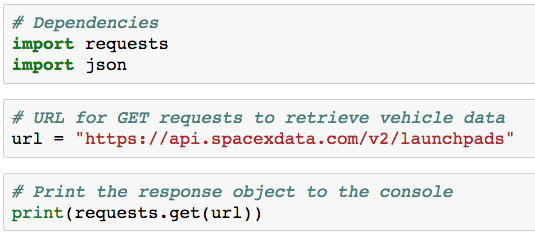
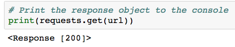
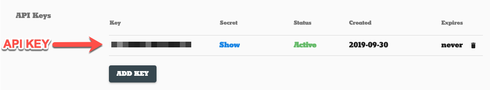
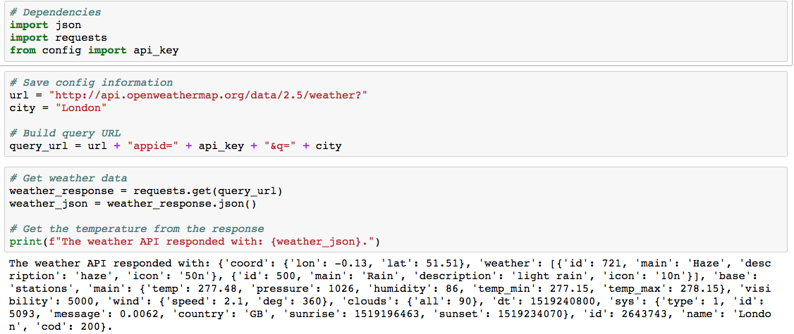

# Module 6: Getting Started with APIs

## Overview

This week, we will be introducing APIS. In this unit, students will learn how to use Python to retrieve data from APIs, parse the responses, and use the data to create maps and charts.

In today's class, students will review how to use the Python request library to make requests to APIs, how to traverse JSON objects, and how to handle errors in their code.

## Learning Objectives

By the end of class, students will be able to:

* Obtain and store API keys in a config file
* Make API calls using the Python requests library
* Parse and traverse through JSON objects
* Handle errors by using try-except blocks

- - -

## Instructor Notes

* The activities in this class will complement lessons **6.2.1 Understanding APIs** through **6.2.7 Create a DataFrame of City Weather Data**. The students will benefit from these activities if they've progressed through these lessons, which cover the following concepts, techniques, and tasks:

 * Making API calls using Python's request library
 * Traversing JSONs
 * Using try-except blocks for error handling
 * Making calls to different APIs
 * Storing API data in Pandas DataFrames

## Slides
[Python APIs Day 1 slideshow](https://docs.google.com/presentation/d/1QCkmr1oyfhoaurWZ1ziVsRyrET-ZSfvgW2biYQyMUhw/edit?usp=sharing)

## Student Resources

Share the following [activity resources](https://2u-data-curriculum-team.s3.amazonaws.com/data-viz-online-lesson-plans/06-Lessons/6-1-Student_Resources.zip) with the students.

- - -

## Before Class

### Office Hours

| Activity Time:       0:30 |  Elapsed Time:      -0:30  |
|---------------------------|---------------------------|

<details>
  <summary><strong> 📣 0.1 Instructor Do: Office Hours</strong></summary>

* Before you begin class, hold office hours. Office hours should be driven by students. Encourage students to take full advantage of office hours by reminding them that this is their time to ask questions and get assistance from instructional staff as they learn new concepts.

* Expect that students may ask for assistance. For example:

  * Further review on a particular subject
  * Debugging assistance
  * Help with computer issues
  * Guidance with a particular tool

</details>

- - -

## During Class

### 1. Getting Started

| Activity Time:       0:15 |  Elapsed Time:      0:15  |
|---------------------------|---------------------------|

<details>
 <summary><strong>📣 1.1 Instructor Do: Foundation Setting (0:10)</strong></summary>

* Welcome students to class.

* Direct students to post individual questions in Slack to be addressed by you and/or your TAs at the end of class.

* Open the slideshow and use slides 1-11 to walk through the foundation setting with your class.

* **Big Picture:** This is an opportunity for students to zoom out and see the big picture of where they are in the program. Take a moment to mention some real-world examples that show the value of what they’re learning this week.

* **Boot Camp Pointers:** Talk through some of the key logistical items that will help students stay on track. This is an opportunity to speak to what students may need when they're at this particular point of the program.

* **This Week - Python APIs:** Talk through the key skills that students will learn this week.

 * Let the students know that they will set the foundation for an important skill: using third-party resources, such as the New York Times API and the OpenWeatherMap API, for data analysis.

* **This Week's Challenge:** Students will use the weather data they retrieve throughout this module to help update an application currently in beta testing. Students will add weather descriptions to the existing data, then ask beta testers to use input statements to filter data for their weather preferences; then, these preferences will be used to identify potential travel destinations and nearby hotels, which will be used to create a travel itinerary. Students will use the Google Maps Directions API to create a travel route and marker layer map for their users.

* **Career Connection:** Let students know that many of them will use the skills covered this week throughout their careers. It's important for them to know the "why." Give examples of when they may be used in work or when you’ve used those skills in your workplace.

* **How to Succeed This Week:** Remind your students that they may have moments of frustration this week as they begin the course, learn something new, and learn how to budget their time. These moments are great for deepening their knowledge. Use the slide material to outline some of the topics that they may find tricky in this module. Consider sharing something about your personal learning journey. It helps students recognize that everyone starts somewhere and that they are not alone.

* **Today's Objectives:** Now, outline the concepts that will be covered in today's lesson. Remind students that they can find the relevant activity files in the Getting Ready for Class page of their course content.

</details>

<details>
 <summary><strong>🎉  1.2 Everyone Do: Check-In (0:05)</strong></summary>

* Ask the class the following questions and call on students for answers:

   * **Q:** How are you feeling about your progress so far?

   * **A:** Let them know that we are starting to build their skillset. It’s also okay to feel overwhelmed as long as you don’t give up.

   * **Q:** How comfortable do you feel with this topic?

   * **A:** Let's do "fist to five" together. If you are not feeling confident, hold up a fist (0). If you feel very confident, hold up an open hand (5).

</details>

<sub>[Having issues with this section? Report a bug!](https://bit.ly/38pCoPK)</sub>

- - -

### 2. Requests

| Activity Time:       0:30 |  Elapsed Time:      0:45  |
|---------------------------|---------------------------|

<details>
 <summary><strong>📣 2.1 Instructor Do: Intro to Requests (0:05)</strong></summary>

* You can use slides 13-15 to accompany the beginning of this activity.

* Explain that for this class, we will use Python's `requests` library to interact with web servers.

* The `requests.get()` function is used to interact with a URL-based API query. It navigates to the URL and then attempts to retrieve the response from the webpage.

* In most cases, we can expect the `requests.get()` function to return a `response` object that contains the JSON (or some other highly parsable text format) response from the API.

* In order to interpret and analyze the `response` object, we will use the `.json()` function to interact with our other Python libraries.

* For this demonstration, open up [01-Ins_RequestsIntro/Ins_Requests_Demo.ipynb](Activities/01-Ins_RequestsIntro/Solved/Ins_Requests_Demo.ipynb) in Jupyter Notebook. As you go through the code, explain to the students:

   * `import requests` to pull the Requests library into Python. This will allow the code to make API calls and collect data from a server.

   * `import json` allows Python to pull in and parse JSON objects.

   * The `url` variable contains the SpaceX URL that the class visited within a string.

* Explain that `requests.get(url)` sends a `GET` request to the URL passed as a parameter. Remind students that this means that the program is _requesting_ the information stored at this URL.

   

* Explain that `requests.get(url)` returns a response object containing a lot of information about the server's response, but it does not seem to include the JSON requested.

   

* The `.json()` call must be used to convert that response object into the JSON format.

* Point out how the JSON response is contained within one massive block of text, which makes it very hard to understand or read through. We can address this by using the `json.dumps()` method to "pretty print" the response.

   

* Send out the notebook [01-Ins_RequestsIntro/Ins_Requests_Demo.ipynb](Activities/01-Ins_RequestsIntro/Solved/Ins_Requests_Demo.ipynb) for students to refer to later.

* Ask the class the following questions:

   * **Q:** Where was this used before?

   * **A:** Retrieving a response with the `get()` method was used in Lesson 6.2.4.

   * **Q:** How does this activity equip us for the Challenge?

   * **A:** We will need to perform an API call to the OpenWeatherMap API to retrieve information.

   * **Q:** What can we do if we don't completely understand this?

   * **A:** We can refer to the lessons and reach out to the instructional staff.

* Answer any questions before proceeding to the student activity.

</details>

<details>
 <summary><strong>📣 2.2 Instructor Do: NYT API (0:05)</strong></summary>

* Use slides 16-20 to accompany the beginning of this demonstration.

* Explain that this exercise explores a full-featured, "real-world" API: the New York Times article API.

* **Note:** The New York times API requires users to register for an API key. Students should have signed up for an API key prior to class because it may take a bit of time to receive one. You can walk through the process of acquiring an API key if some students still need to do so.

* First, create an account with NYT by filling out this [form](https://developer.nytimes.com/accounts/create).

   

* Navigate to the index of the email used to sign up, and activate the account.

* **Note:** Make sure that students check their spam folder for the email from The New York Times article API.

* Navigate back to the [sign-in page](https://developer.nytimes.com/accounts/login) and log in with the newly created account.

* Once students have successfully made a NYT account and logged in, it's time to create an app and obtain an API key.

* From the drop down on the top right next to their email, click on **Apps**.

   

* Click on **+New App**.

* This will bring you to the app creation page. Give the app any name.

   

* Scroll down to the **Article Search API** and select it.

   

* Scroll back up to the top and click **Create**.

* After the app is created, you will be redirected to the app page, which contains the API key. Explain to students that they will use this key to interact with the NYT API.

   

* Send out the [documentation](https://developer.nytimes.com/docs/articlesearch-product/1/overview) for the NYT API, and briefly review some of its features.

   

* Try not to delve too deeply into the documentation at this point; part of the next activity should have students reading through it in order to uncover the query strings that they need to create.

* Explain that it is always a better idea to save your API keys in a separate config file from the scripts that use them.

* This adds security to your scripting/programming by dissociating your personal information from your analysis.

* As an added bonus, you can add all of your API keys from different sites into a single config file that your different API query scripts point to.

* Point out that it is critical that you **never** publish your config files/API keys on Github.

* Many sites have a bandwidth limit that can easily be exceeded if more than one user uses the same API key. Additionally, some sites charge the user for each query.

* Open the [02-Ins_NYTAPI/Ins_NYT_API.ipynb](Activities/02-Ins_NYTAPI/Solved/Ins_NYT_API.ipynb) demo within an IDE, then run the application while explaining each part of the code.

* Highlight the use of the `config.py` file to store the `api_key` and reiterate that API keys should not be uploaded to GitHub. Although this API key is free, some services charge past a certain usage point. Therefore, students should protect them from public view. Instruct students to add `config.py` to their `.gitignore` file, or create environment variables for all homework and projects they will be saving to a repo.

 

* Answer any questions before proceeding to the student activity.

</details>

<details>
 <summary><strong>🎉 2.3 Everyone Do: Retrieving Articles (0:20)</strong></summary>

* In this activity, the students are asked to create an application that grabs articles from the NYT API, stores them within a list, and prints snippets of the articles to the screen.

* Open up [03-Evr_RetrieveArticles/Stu_Retrieve_Articles.ipynb](Activities/03-Evr_RetrieveArticles/Solved/Stu_Retrieve_Articles.ipynb) within the console and run the application, showing students what they will be attempting to create.

   

* Make sure students can download and open the [instructions](Activities/03-Evr_RetrieveArticles/README.md) and the [starter notebook](Activities/03-Evr_RetrieveArticles/Unsolved/Evr_Retrieve_Articles.ipynb) for this activity.

* Review the instructions with the students, then let them work on their solutions for 10 minutes.

* When time is complete, open the [starter notebook](Activities/03-Evr_RetrieveArticles/Unsolved/Evr_Retrieve_Articles.ipynb) and ask for volunteers to help you write the code to retrieve article snippets and the `web_url`. If there are no volunteers, open [Evr_Retrieve_Articles.ipynb](Activities/03-Evr_RetrieveArticles/Solved/Evr_Retrieve_Articles.ipynb) in Jupyter Notebook, then walk through how to retrieve article snippets and print the results, making sure to explain the following:

* We use various query parameters to build the query URL, including  the `api-key` that allows the code to query the server and  `q` for the keyword to **q**uery on `begin_date` and `end_date`, both with format YYYYMMDD.

* Retrieve articles using a `GET` request and convert to a json. Then parse the JSON to get the article list.

   ```python
   # Retrieve articles
   articles = requests.get(query_url).json()
   articles_list = articles["response"]["docs"]
   ```

* Use a `for` loop to loop through the articles and print out the snippets.

   ```python
   for article in articles_list:
      print(f'A snippet from the article: {article["snippet"]}')
      print('---------------------------')
   ```

* Use a `for` loop again, but this time access the key `web_url` to print out the `web_url` for each article.

   ```python
   # Print the web_url of each stored article
   print("Your Reading List")
   for article in articles_list:
      print(article["web_url"])
   ```

* Once the article snippets have been printed, let the students continue for 5 minutes to try to retrieve 30 results for the bonus.

* When time is up, ask for a volunteer to share how they were able to print and retrieve 30 results. If there are no volunteers, open [Evr_Retrieve_Articles.ipynb](Activities/03-Evr_RetrieveArticles/Solved/Evr_Retrieve_Articles.ipynb) and explain the following:

* Explain that each API call retrieves 10 articles by default. Each group of articles is called a _page_.

* If we want more articles, we need to tell the API to respond with _different pages_.

* To do this, we simply append a `page` parameter, which is equal to the number of the page we want to retrieve.

* We build out our query string as before, but this time we add a new parameter for the page.

   ```python
   # loop through pages 0-2
   for page in range(0, 3):
      query_url = f"{url}api-key={api_key}&q={query}&begin_date={begin_date}&end_date={end_date}"
      # create query with page number
      query_url = f"{query_url}&page={str(page)}"
      articles = requests.get(query_url).json()
   ```

* We use `time.sleep(1)` to create an interval between queries to stay within the API limits and print out the results.

   ```python
   # Add a one second interval between queries to stay within API query limits
      time.sleep(1)
      # loop through the response and append each article to the list
      for article in articles["response"]["docs"]:
         articles_list.append(article)
   ```

* Send out the [Evr_Retrieve_Articles.ipynb](Activities/03-Evr_RetrieveArticles/Solved/Stu_Retrieve_Articles.ipynb) file for students to refer to later.

* Answer any questions before moving on to the next activity.

</details>

<sub>[Having issues with this section? Report a bug!](https://bit.ly/3i2qfDB)</sub>

### 3. JSON Traversal and Error Handling

| Activity Time:  0:40 |  Elapsed Time: 1:25  |
|----------------------|----------------------|

<details>
   <summary><strong>🎉 3.1 Everyone Do: JSON Traversal (0:15)</strong></summary>

* Use slides 1-5 to introduce the class to the activity.

* In this exercise, students will load in a JSON response file from YouTube and retrieve information related to the video by traversing the JSON.

* The students will work independently for the first 5-10 minutes before participating in student-led live coding.

* Open [04-Evr_JSONTraversalReview/youtube_response.json](Activities/04-Evr_JSONTraversalReview/Resources/youtube_response.json) with a text editor to show the class what JSON file they will be working with.

   

* Make sure students can download and open the [instructions](Activities/04-Evr_JSONTraversalReview/README.md), [JSON file](Activities/04-Evr_JSONTraversalReview/Resources/youtube_response.json), and the [starter notebook](Activities/04-Evr_JSONTraversalReview/Unsolved/Stu_JSON_Traversal.ipynb).

* Let students work on their solution in the main classroom for 5 minutes, then open up the [starter notebook](Activities/04-Evr_JSONTraversalReview/Unsolved/Stu_JSON_Traversal.ipynb) and ask for volunteers to help you code to retrieve the video's title.

* Next, have another volunteer help you code to retrieve the video's rating.

* Continue this process until the solution is complete.

   

* Send the students the [Stu_JSON_Traversal solution file](Activities/04-Evr_JSONTraversalReview/Solved/Evr_JSON_Traversal.ipynb) for them to review later.

* Answer any question before proceeding to the next activity.

</details>

<details>
   <summary><strong>📣 3.2 Instructor Do: Exception Handling (0:05)</strong></summary>

* Ask a student to explain what would happen if an application tried to look up a key within a dictionary that doesn't exist.

* If a simple key lookup is performed, such as `data["temp"]`, and the `"temp"` key doesn't exist, Python will throw an exception and terminate the program.

* Explain that this behavior makes sense in a basic application or script because the program may have incorrect/missing inputs.

 * However, when it comes to databases and API requests, missing values are very common. In these cases, our applications and scripts that use API calls are at risk of terminating prematurely.

* Point out that it does not make sense for an application to terminate itself just because a dictionary key doesn't exist. It would be much better to simply deal with the error than crash the app.

* Dealing with these kinds of errors is called exception handling, and thankfully Python has built-in tools to resolve these errors.

* Open [Ins_Exception.ipynb](Activities/05-Ins_ExceptionHandling/Solved/Ins_Exception.ipynb) within Jupyter Notebook to show how an exception error can be created.

* Point out that the `students` dictionary does not have a key for `"Jezebel"`. When the application tries to print `students["Jezebel"]`, Python will complain that the key doesn't exist.

* Run the code within the terminal to demonstrate the error.

   

* Open [Ins_ExceptionHandling.ipynb](Activities/05-Ins_ExceptionHandling/Solved/Ins_ExceptionHandling.ipynb) within Jupyter Notebook to show the class how to handle exception errors.

* Before discussing the code in detail, simply point out the `try`/ `except` keywords to the class. Briefly explain that these keywords let the application recover from errors like the one that killed the program before.

* Run the file to demonstrate that the final print statement executes, even though the `students["Jezebel"]` line throws an exception.

   

* Explain that `try` and `except` statements, like `for` and `if` statements, create new indented blocks.

* Python will try to run code in the `try` block, but if an exception arises, Python will then run the code inside the `except` block.

   

* Take a moment to emphasize how powerful this is: `try-except` allows programmers to anticipate and recover from errors.

* Although optional, it is generally best practice to specify the exact errors to handle.

* In cases where the programmer wants to handle an error in a particular fashion, specifying the exception type is best practice.

* Especially in cases where a programmer wants to intercept any error, like for logging purposes, it is fine to catch a general exception.

* Students will know what exceptions to handle because the name of the exception that killed the program will be printed to the command line.

</details>

<details>
   <summary><strong>🎉 3.3 Everyone Do: API Call Exceptions (0:15)</strong></summary>

* In this exercise, as students make API calls, they’ll implement `try-except` blocks to narrow down a list of fictional characters to include only characters from Star Wars.

* The students will work independently for the first 5 minutes before participating in student-led live coding.

* Make sure the students can download and open the [instructions](Activities/06-Evr_API_Exceptions/README.md) and [starter notebook](Activities/06-Evr_API_Exceptions/Unsolved/api_exceptions.ipynb).

* Let the students work on their solution in the main classroom for 10 minutes, then open the [starter notebook](Activities/06-Evr_API_Exceptions/Unsolved/api_exceptions.ipynb) and ask for volunteers to help you code the `for` loop for each character and to create a search query.

* If there are no volunteers, open up [api_exceptions.ipnyb](Activities/06-Evr_API_Exceptions/Solved/api_exceptions.ipynb) in Jupyter Notebook, making sure to explain the following:

* Loop through each character in the list.

   ```python
   # Loop through each character
   for character in search_characters:
   ```

   * Make an API call for each character by appending the character to the URL.

   ```python
   # Create search query, make request and store in json
   query = url + character
   response = requests.get(query)
   response_json = response.json()
   ```

* Once the query has been created, let the students continue working for 5 minutes.

* When time is complete, ask for a volunteer to share their try-except blocks. If there are no volunteers, open up [api_exceptions.ipnyb](Activities/06-Evr_API_Exceptions/Solved/api_exceptions.ipynb) and run the code, making sure to explain the following:

* Use `try` to attempt to retrieve the height and mass of the character.

   ```python
   try:
      height.append(response_json['results'][0]['height'])
      mass.append(response_json['results'][0]['mass'])
      starwars_characters.append(character)
      print(f"{character} found! Appending stats")
   ```

* Use `except` to “pass” on characters that would return an error because they do not exist in the Star Wars Universe.

   ```python
   # Handle exceptions for characters not available in the Star Wars API
      except:
         # Append null values
         print("Character not found")
         pass
   ```

* Store the results in a DataFrame.

   ```python
   # Create DataFrame
   character_height = pd.DataFrame({
      'character': starwars_characters,
      'height': height,
      'mass': mass
   })
   character_height
   ```

* Send out the [api_exceptions.ipnyb](Activities/06-Evr_API_Exceptions/Solved/api_exceptions.ipynb) for students to refer to later.

* Ask the class the following questions and call on students for the answers:

   * **Q:** What would happen if every character was found in the API call?

   * **A:** The `except` block would not need to be run, since no error would have been triggered.

   * **Q:** What can we do if we don't completely understand this?

   * **A:** Review Lesson 6.3.6 Get the City Weather Data, where we use `try-except` blocks to handle invalid weather requests.

* Answer any question before proceeding to the next activity.

</details>

<sub>[Having issues with this section? Report a bug!](https://bit.ly/39kqcPM)</sub>

### 4. Open Weather Map API

| Activity Time:  0:30 |  Elapsed Time: 1:55  |
|----------------------|----------------------|

<details>
   <summary><strong>📣 4.1 Instructor Do: OpenWeatherMap API (0:05)</strong></summary>

* Explain that the next API that students will work with is the [OpenWeatherMap API](https://openweathermap.org/api), which provides various meteorological data for developers to use.

* Explain that, like the New York Times API, the OpenWeatherMap API requires users to [register](https://home.openweathermap.org/users/sign_up) for an API key.

* Briefly walk students through the [sign-up](https://home.openweathermap.org/users/sign_up) steps and make sure everyone has their API key in hand before moving on to the demonstration. **Note** Students should have signed up for an API key prior to class because it may take a bit of time to receive one. You can walk through the process of acquiring an API key if some students still need to do so.


   

* Remind students that it is good practice to use the `config.py` file to keep their api_keys private.

* Point out that the workflow for OpenWeatherAPI is the same as the other APIs we have previously covered.

* Open [Ins_OpenWeatherRequest.ipynb](Activities/07-Ins_OpenWeatherRequest/Solved/Ins_OpenWeatherRequest.ipynb) with Jupyter Notebook to show students what the application does.

   

* Ask a student to explain what the question mark in the URL indicates, before explaining how the question mark represents the beginning of the query string.

* Ask a student to explain what they think the `query_url` is requesting before discussing how the `q` parameter allows the application to search for weather by city name.

* Ask a student to explain the logic of the rest of the file, and then explain how the rest of the file simply sends a `GET` request to the query URL, converts the response to JSON, and prints the result.

   

* Ask the class the following questions:

   * **Q:** Where was this used before?

   * **A:** Interacting with the OpenWeatherMap API was used in Lesson 6.2.6.

   * **Q:** How does this activity equip us for the Challenge?

   * **A:** We will need to perform an API call to the OpenWeatherMap API to retrieve information.

   * **Q:** What can we do if we don't completely understand this?

   * **A:** We can refer to the lesson plan and reach out to the instructional staff.

</details>

<details>
   <summary><strong>✏️ 4.2 Students Do: Weather in Burundi (0:20)</strong></summary>

* **File:** [Stu_Burundi.ipynb](Activities/08-Stu_BurundiWeatherApp/Unsolved/Stu_Burundi.ipynb)

* **Instructions:** [README.md](Activities/08-Stu_BurundiWeatherApp/README.md)

* In this exercise, the students will be working with the OpenWeather API to create an application that provides the user with the current temperature in the largest city of Burundi.

* Before students complete this activity, show them the following image or [Stu_Burundi.ipynb](Activities/08-Stu_BurundiWeatherApp/Solved/Stu_Burundi.ipynb) in Jupyter Notebook so that students understand the expected output.

   

* Make sure the students can download and open the [instructions](Activities/08-Stu_BurundiWeatherApp/README.md) and [starter notebook](Activities/08-Stu_BurundiWeatherApp/Unsolved/Stu_Burundi.ipynb).

* Answer any questions before breaking the students out in groups.

* Divide students into groups of 3-5. They should work on the solution by themselves, but they can talk to others in their group to get tips.

* Let students know that they may be asked to share and walk through their work at the end of the activity.

</details>

<details>
   <summary><strong>⭐ 4.3 Review: Burundi  (0:05)</strong></summary>

* Once time is up, ask for volunteers to walk through their solution. Remind them that it is perfectly alright if they didn't finish the activity.

* To encourage participation, you can open the [starter notebook](Activities/08-Stu_BurundiWeatherApp/Unsolved/Stu_Burundi.ipynb) and ask students to help build the request URL.

* If there are no volunteers, open up [Stu_Burundi.ipynb](Activities/08-Stu_BurundiWeatherApp/Solved/Stu_Burundi.ipynb) in Jupyter Notebook and go over the solution file with the class, answering whatever questions students may have.

* Key points to cover when discussing this activity:

* When building the query URL, remind students that this is the most important part of making an API call because it determines what information will be returned by the request.

* The `units` query parameter: Remind students that they simply need to dig through documentation to find "options" like this. Encourage them to spend a lot of time reading the documentation of an API before writing code, as this will save them time.

   

* Send out [Stu_Burundi.ipynb](Activities/08-Stu_BurundiWeatherApp/Solved/Stu_Burundi.ipynb) for students to refer to later.

* Ask the class the following questions and call on students for the answers:

   * **Q:** How can we get the temperature in both Fahrenheit _and_ Celsius?

   * **A:** We create a list of units and loop through them while making a different API for each one and storing the results in a list. Then, we can access the list to print the results.

   * **Q:** What can we do if we don't completely understand this?

   * **A:** Review the Lesson 6.2.6 Get the City Weather Data.

* Answer any questions before ending class.


</details>

<sub>[Having issues with this section? Report a bug!](https://bit.ly/3q2PPLo)</sub>

### 5. Ending Class

| Activity Time:       0:05 |  Elapsed Time:      2:00  |
|---------------------------|---------------------------|

<details>
 <summary><strong>📣  6.1 Instructor Do: Review (0:05)</strong></summary>

* Before ending class, review the skills that were covered today and mention where in the module these skills are introduced.
 * Using the Python request library to make API calls was covered in **Lesson 6.2.3**.
 * Retrieving a response and getting data were covered in **Lesson 6.2.4**.
 * Parsing JSONS was covered in **Lesson 6.2.5**.
 * Try-except blocks were covered in **Lesson 6.2.6**.

* Answer any questions the students may have.

</details>

<sub>[Having issues with this section? Report a bug!](https://bit.ly/3pYAwDF)</sub>

- - -

© 2021 Trilogy Education Services, LLC, a 2U, Inc. brand.  Confidential and Proprietary.  All Rights Reserved.
