# Module 6: Working with Google APIs

## Overview

Before class, walk through this week's Challenge assignment in office hours. In class, the students will use the Google Maps API to plot locations on a map and create directions between multiple points.

## Learning Objectives

*By the end of this lesson, students should be able to:*

* Connect to the Google Maps API
* Use the Python library `gmaps` to plot points on a map
* Create directions between multiple points on a map

- - -

## Instructor Notes

* The activities in this class will complement Lessons **6.5.1: Set Up Google Maps and Places API** through **6.5.4: Map Vacation Criteria**. The students will benefit from these activities if they‘ve progressed through these lessons, which cover the following concepts, techniques, and tasks:

 * Making API calls to the Google Maps and Places API
 * Using Pandas DataFrames to store data from API calls
 * Plotting with Jupyter Gmaps
 * Creating Heatmaps with Jupyter Gmaps

## Slides

[APIs Day 2 slideshow](https://docs.google.com/presentation/d/1s5I8Ds7OpN7kSuEc-cNmcScFFuroiNHActRIXav9TaE/edit?usp=sharing)

## Student Resources

Share the following [activity resources](https://2u-data-curriculum-team.s3.amazonaws.com/data-viz-online-lesson-plans/06-Lessons/6-2-Student_Resources.zip) with the students.

- - -

## Before Class

### 0. Office Hours

| Activity Time: 0:30       |  Elapsed Time:     -0:30  |
|---------------------------|---------------------------|

<details>
  <summary><strong>📣 Instructor Do: Challenge Instruction Walkthrough </strong></summary>

Let the students know that the first few minutes of Office Hours will include a walkthrough of the Challenge requirements and rubric, including helpful tips to ensure they have what they need to succeed.

Open the Challenge in Canvas and go through the high-level instructions and requirements with your class. Be sure to check for understanding.

Scroll down to the Rubric in Canvas, go through the Mastery column with your class, and show how it maps back to the requirements for each deliverable. Be sure to check for understanding.

Review the following tips to ensure clarity on the Challenge:

For **Deliverable 1: Retrieve Weather Data**, they will be using their knowledge of APIs, GET requests, try-except blocks, and JSON traversal to retrieve weather information for a list of cities, and then store the result in a DataFrame.

To create the cities DataFrame, the students will perform a series of API calls to the OpenWeatherMap API. They will then use try-except blocks to traverse the JSON response and store the results in a DataFrame.

Students will use the Pandas `to_csv` method to export the resulting DataFrame to a CSV.

For **Deliverable 2: Create a Customer Travel Destinations Map**, they will be using their knowledge of Google Maps API with `gmaps`, the Python `input` and `iterrows` methods, and the Pandas `loc`  method, to find and plot the nearest hotel for each city in a list.

Go over the [Module 6 Vacation Search solution](../../../01-Assignments/06-WeatherPy/Challenge_Solution/Vacation_Search_Challenge.ipynb) solution and compare it to the [Vacation Search Challenge starter code](../../../01-Assignments/06-WeatherPy/Resources/Vacation_Search_starter_code.ipynb). Show the students the commented steps where they will be adding code to complete the Challenge.

For **Deliverable 3: Create a Travel Itinerary Map**, they will be using their knowledge of the Google Maps API and the ability to add pop-up makers and direction layers to a map.

Go over the [Module 6 Vacation Itinerary solution](../../../01-Assignments/06-WeatherPy/Challenge_Solution/Vacation_Search_Challenge.ipynb) solution and compare it to the [Vacation Itinerary Challenge starter code](../../../01-Assignments/06-WeatherPy/Resources/Vacation_Itinerary_starter_code.ipynb). Show the students the commented steps where they will be adding code to complete the Challenge.

Let students know that adding a direction layer with waypoints to a map was not covered in this module,  but the Day 2 Required Lesson Plan does have an activity that includes this step.

Encourage your class to begin the Challenge as soon as possible, if they haven’t already, and to use the Learning Assistants and the remainder of Office Hours with their instructional team for help as they progress through their work. If they feel like they need more context to understand documentation or instructions throughout the week, this is where they can get it.

Open the floor to discussion and answer any questions they may have about the Challenge requirements before moving onto other areas of interest.

</details>

<details>
  <summary><strong>📣  Instructor Do: Office Hours</strong></summary>

In the remaining time, remind the students that now is the time to ask questions and get assistance from their instructional staff, as they’re learning new concepts and working on the challenge assignment.

Expect that students may ask for assistance with the following:

* Challenge assignment
* Further review of a particular subject
* Debugging
* Help with computer issues
* Guidance on a particular tool

</details>


- - -
## During Class

### 1. Getting Started

| Activity Time:       0:10 |  Elapsed Time:      0:10  |
|---------------------------|---------------------------|

<details>
 <summary><strong>📣 1.1 Instructor Do: Foundation Setting (0:05)</strong></summary>

* Welcome students to class.

* Direct students to post individual questions in Slack to be addressed by you and/or your TAs at the end of class.

* Open the slideshow and use slides 1-7 to walk through the foundation setting with your class.

* **Big Picture:** This is an opportunity for students to zoom out and see the big picture of where they are in the program. Take a moment to mention some real-world examples that show the value of what they’re learning this week.

* **This Week - Python APIs:** Talk through the key skills that students will learn this week.

* Let the students know that they will set the foundation for an important skill: integrating third-party resources, such as the New York Times API and the OpenWeatherMap API, for data analysis.

* **This Week's Challenge:** Students will use the weather data students they retrieved throughout this module to help update an application currently in beta testing. Students will add weather descriptions to the existing data, then ask beta testers to use input statements to filter data for their weather preferences; then, these preferences will be used to identify potential travel destinations and nearby hotels, which will be used to create a travel itinerary. Students will use the Google Maps Directions API to create a travel route and marker layer map for their users.

* **Today's Objectives:** Now, outline the concepts that will be covered in today's lesson. Remind students that they can find the relevant activity files in the Getting Ready for Class page of their course content.

</details>

<details>
 <summary><strong>🎉  1.2 Everyone Do: Check-In (0:05)</strong></summary>

* Ask the class the following questions and call on students for answers:

  * **Q:** How are you feeling about your progress so far?

  * **A:** Let them know that we are starting to build their skillset. It’s also okay to feel overwhelmed as long as you don’t give up.

   * **Q:** How comfortable do you feel with this topic?

   * **A:** Let's do "fist to five" together. If you are not feeling confident, hold up a fist (0). If you feel very confident, hold up an open hand (5).

</details>

<sub>[Having issues with this section? Report a bug!](https://bit.ly/2XoJkGM)</sub>

- - -

### 2. Google API

| Activity Time:       0:35 |  Elapsed Time:      0:45  |
|---------------------------|---------------------------|

<details>
 <summary><strong>🎉 2.1 Everyone Do: Google Maps API (0:10)</strong></summary>

* The Google Maps API requires users to register for an API key. ***Note:** Students should have signed up for an API key prior to class because it may take a bit of time to receive one. You can walk through the process of acquiring an API key if some students still need to do so.

 * First, click the `Get Started` button on the [Google Maps Platform](https://cloud.google.com/maps-platform/) webpage.

 * Select the boxes for the `Maps` and `Places` products.

 * At this point, click **Create a New Project** and give the project a name. Once that has been done, click **Create Billing Account**. Explain that although Google now charges for services, a $200 credit is provided for these API services.

 * Warn students that any API usage beyond the $200 credit will be charged to their personal accounts. Send out a link to Google's billing page as a reference, and explain that API usage limits and billing alerts can be set up so that the free credit is not exceeded.

   * Navigate through the `Acceptances` to try the cloud platform, then complete the next form to establish a Google Cloud Platform account.

   * The next few windows will automatically enable the Google Maps Platform. Once complete, a window containing a unique API key will appear. Copy this key for use in Python.

 * Send out the [Capping Queries](Activities/Resources/Capping_Queries.md) document to set query limits for API usage.

   * You can begin following the document from step 3 if you haven’t already navigated away from your list of active APIs.

   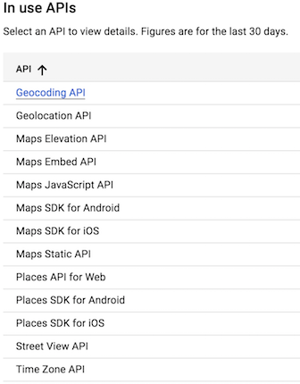

</details>
<details>
 <summary><strong>📣 2.2 Instructor Do: Google Geocode (0:05)</strong></summary>

* For this first demonstration, you may use slides 7–10 to accompany the beginning of this demonstration.

* To begin, show students how to utilize the Google Maps Geocoding API to turn addresses into latitudinal and longitudinal coordinates.

 * This process of converting an address to coordinates is called **geocoding**.

 * Because many APIs only understand locations formatted in terms of latitude and longitude, geocoding will be very valuable in translating addresses into data that APIs, like the Google Places API,can understand.

* Open [Google_Geocode.ipynb](Activities/01-Ins_Google_Geocode/Solved/Google_Geocode.ipynb) in Jupyter Notebook.

* Students should be pretty familiar with making API calls. Explain that the process is very similar to what they saw in the previous class when we made API calls with the New York Times and OpenWeatherMap APIs, but the responses will be different. Walk through the code, explaining:

 * Utilize the API key from  `config.py`.

 * **Note:** Google's API is not free and if credit card information is provided, they charge past a certain usage point. This is a good time to remind  students to avoid pushing their API key to github by adding the `config.py` to their `.gitignore` file or using environment variables.

 * Build the endpoint URL.

   * Remind students that printing the URL will also expose their key. While it is useful for demonstration purposes here, it should be avoided in projects and homework.

 * Run a Python request on the URL.

 * Explore the resulting JSON in a pretty-printed format.

 * Extract the desired components of the JSON: the latitude and longitude.

 * Format the results for printing.


   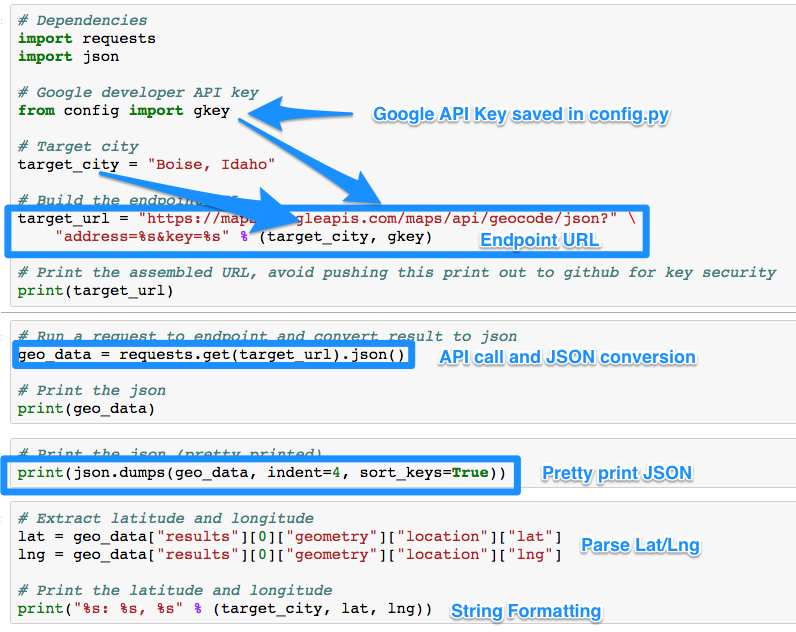

* Once complete, take a moment to visit the [Google Maps Geocoding API](https://developers.google.com/maps/documentation/geocoding/start) documentation page and show students that the code created is effectively the same as what's expressed in the documentation.

 * Let them know that it's easy to be intimidated by code documentation, but it becomes easier to comprehend with a little practice.

* Ask the class the following questions and call on students for the answers:

   * **Q:** Where have we used this before?

   * **A:** We created a Google API key in Lesson 6.5.1 and made calls using the API in 6.5.2.

   * **Q:** How does this activity equip us for the Challenge?

   * **A:** We'll use the Google Maps API to plot points on a map by retrieving the latitude and longitude of locations.

   * **Q:** What can we do if we don't completely understand this?

   * **A:** We can refer to the lesson plan and reach out to the instructional team for help.

* Answer any questions before moving on to the student activity.

</details>

<details>
 <summary><strong>📣 2.3 Instructor Do: Google Places (0:05)</strong></summary>

* Use slides 11–13 to accompany the beginning of this demonstration.

* Feel free to open up the [Google Places API](https://developers.google.com/maps/documentation/javascript/places#place_searches) and walk students through the documentation for a few minutes.

* The points to emphasize are [Nearby Search](https://developers.google.com/places/web-service/search#PlaceSearchRequests), [Text Search](https://developers.google.com/places/web-service/search#TextSearchRequests), and [Place Search](https://developers.google.com/places/web-service/search#RadarSearchRequests).

* For each type of search, there are expected inputs, such as ‘latitude’, ‘longitude`, or `radius`. Additionally, there are various optional parameters, including keyword, minPrice, maxPrice, and type.

* It may also be beneficial to point out the various [types](https://developers.google.com/places/supported_types) Google categorizes by default.

* Once students have a decent-enough understanding of the API, open up [Google_Places.ipynb](Activities/02-Ins_Google_Places/Solved/Google_Places.ipynb) in Jupyter Notebook and explain the code.

* For the most part, the code is similar to the earlier example. The base URL, however, has changed because the class is now using the Google Place Search API.

* In this example, we are using a feature of the [requests library](http://docs.python-requests.org/en/master/user/quickstart/#passing-parameters-in-urls) to easily construct our URL by passing in a dictionary of parameters.

* During the discussion of this example, point out the various URL parameters, like `keyword`, `location`, and `types`. Also, point out that a different JSON structure is provided back to the user.


   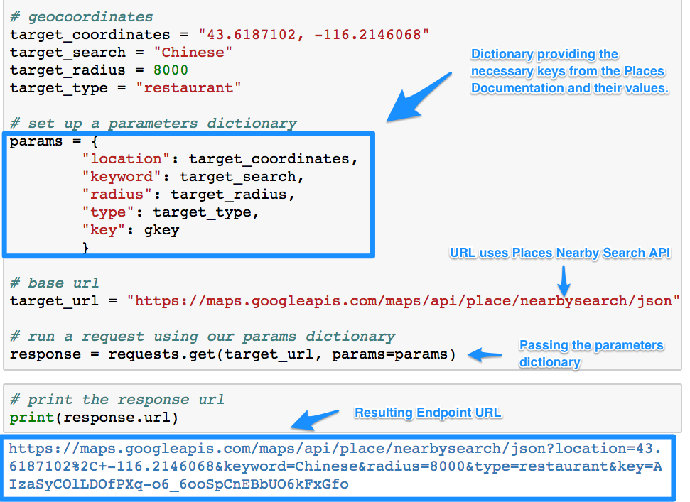

* Answer any questions before moving on to the student activity.

</details>

<details>
 <summary><strong>🎉 2.4 Everyone Do: Google Drills (0:15)</strong></summary>

* In this exercise, the students will make calls to both the Google Places and Google Geocoding APIs.

* Make sure the students can download and open the [instructions](Activities/03-Evr_Google_Drills/README.md) and [starter notebook](Activities/03-Evr_Google_Drills/Unsolved/Google_That.ipynb).

* Go over the instructions with the students, then let them work on their solutions for 5 minutes.

* When time is up, open the [Google_That.ipynb](Activities/03-Evr_Google_Drills/Solved/Google_That.ipynb) notebook, and ask for volunteers to go over questions 1 and 2.

* If there are no volunteers, go over questions 1 and 2 in [Google_That.ipynb](Activities/03-Evr_Google_Drills/Solved/Google_That.ipynb), explaining along the way:

* We build a URL like we did in the previous activity, but this time only a `target_city` is passed in, and not the coordinates.

* We make a call to the API, get the response, and parse the JSON to get our coordinates.

   ```python
   # 1. What are the geocoordinates (latitude and longitude) of Seattle,
   # Washington?
   target_city = "Seattle, Washington"

   params = {"address": target_city, "key": gkey}

   # Build URL using the Google Maps API
   base_url = "https://maps.googleapis.com/maps/api/geocode/json"

   print("Drill #1: The Geocoordinates of Seattle, WA")

   # Run request
   response = requests.get(base_url, params=params)

   # Convert to JSON
   seattle_geo = response.json()

   # Extract lat/lng
   lat = seattle_geo["results"][0]["geometry"]["location"]["lat"]
   lng = seattle_geo["results"][0]["geometry"]["location"]["lng"]

   # Print results
   print(f"{target_city}: {lat}, {lng}")
   ```

* We repeat the same process for question 2, changing only the `target_city`.

* Answer any questions, then give the students another 5 minutes to answer the remaining questions.

* When time is up, open the [Google_That.ipynb](Activities/03-Evr_Google_Drills/Solved/Google_That.ipynb) notebook and ask for volunteers to go over each of the questions.

* If there are no volunteers, go over question 3 in [Google_That.ipynb](Activities/03-Evr_Google_Drills/Solved/Google_That.ipynb), explaining along the way:

 * For questions 3 and 4, the process is very similar, but this time we are supplying the coordinate obtained in the first two questions, and passing in the type of store to look for.

   ```python
   #    Hint: See https://developers.google.com/places/web-service/supported_types
   target_type = "bicycle_store"
   seattle_coords = "47.6062095,-122.3320708"
   radius = 8000

   # rewrite params dict

   params = {
      "location": seattle_coords,
      "types": target_type,
      "radius": radius,
      "key": gkey
   }

   # Build URL using the Google Maps API
   base_url = "https://maps.googleapis.com/maps/api/place/nearbysearch/json"

   print("Drill #3: A Bike Store in Seattle, WA")

   # Run request
   response = requests.get(base_url, params)

   # print the response URL, avoid doing for public GitHub repos in order to avoid exposing key
   # print(response.url)

   seattle_bikes = response.json()

   # Print the JSON (pretty printed)
   # print(json.dumps(seattle_bikes, indent=4, sort_keys=True))

   # Print the name and address of the first bike shop to appear
   print(seattle_bikes["results"][0]["name"])
   print(seattle_bikes["results"][0]["vicinity"])
   ```

* For the remaining questions, we make two calls to the API: the first one to get the coordinates for our house, and a second to find the nearest dentist by using the `rankby` parameter for distance.

   ```python
   # 5. Find the nearest dentist to your house.
   # Hint: Use Google Maps to find your latitude and Google Places to find
   # the dentist. You may also need the rankby property.

   # Google geocode to find lat, lng
   my_address = "151 Sip Ave"


   params = {
      "address": my_address,
      "key": gkey
   }

   base_url = "https://maps.googleapis.com/maps/api/geocode/json"

   print("Drill #5: A Dentist Near My House")

   my_geo = requests.get(base_url, params).json()

   lat = my_geo["results"][0]["geometry"]["location"]["lat"]
   lng = my_geo["results"][0]["geometry"]["location"]["lng"]


   # Use lat, lng to use places API to find nearest dentist
   target_search = "dentist"

   params = {
      "location": f"{lat},{lng}",
      "types": target_search,
      "rankby": "distance",
      "key": gkey
   }

   base_url = "https://maps.googleapis.com/maps/api/place/nearbysearch/json"


   # Run request
   response = requests.get(base_url, params)

   # print the response URL, avoid doing for public GitHub repos in order to avoid exposing key
   # print(response.url)
   my_dentist = response.json()

   # Print the JSON (pretty printed)
   # print(json.dumps(my_dentist, indent=4, sort_keys=True))

   # Print the name and address of the first dentist that appears
   print(my_dentist["results"][0]["name"])
   print(my_dentist["results"][0]["vicinity"])
   ```

* Answer any questions before moving on to the next activity.

</details>

<sub>[Having issues with this activity? Report a bug!](https://bit.ly/3hXUQCs)</sub>

### 3. Pandas with the Google API

| Activity Time:  0:25 |  Elapsed Time: 1:10  |
|----------------------|----------------------|

<details>
 <summary><strong>📣 3.1 Instructor Do: Nearest Restaurants (0:05)</strong></summary>

* Use slides 17–19 to accompany the beginning of this demonstration.

* Remind students that, during the last class, we learned how to make multiple queries and handle missing data using try-except and list comprehension. Tell them that Pandas is another way to build out an API dataset.

* Open [NearestRestr.ipynb](Activities/04-Ins_NearestRestr/Solved/NearestRestr.ipynb) and explain the code to students, highlighting the following:

* Set up empty columns for values retrieved from API.

   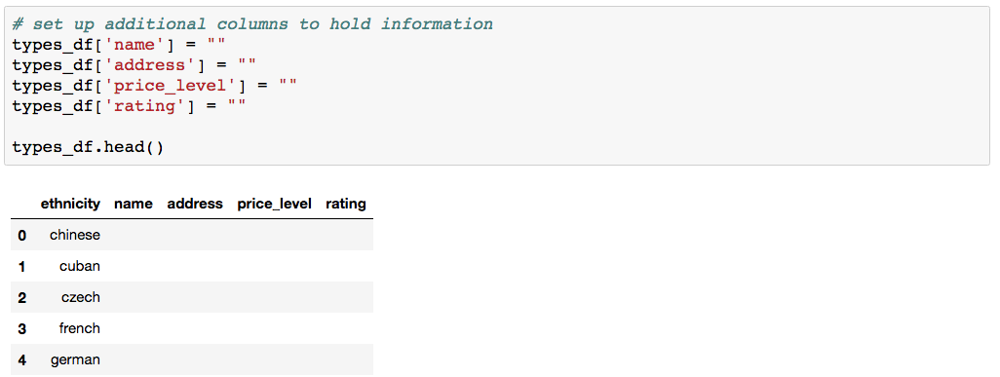

* Pandas `iterrows()` iterates through each row of the DataFrame, returning an index number and the contents of each row. Those row values can then each be accessed using the column label,  like so: `row['column label']`.

   ```python
   # use iterrows to iterate through pandas dataframe
   for index, row in types_df.iterrows():
   ```

   * In each iteration, the `keyword` value is overwritten to be the new target.

   ```python
   # get restaurant type from df
   restr_type = row['ethnicity']

   # add keyword to params dict
   params['keyword'] = restr_type
   ```

* To retrieve `results`, if it exists, we use `requests.get`.  When making the `GET` request to the API, the following arguments need to be passed in for the request to work: the `base_url` and an optional parameter, `params`. This `params` parameter will then take the dictionary and send it to the query string for the request. The result of the request is then converted to a JSON.

   ```python
   # assemble url and make API request
   print(f"Retrieving Results for Index {index}: {restr_type}.")
   response = requests.get(base_url, params=params).json()

   # extract results
   results = response['results']
   ```

* We use a try-except block to attempt to retrieve the `name`, `vicinity`, `price_level`, and `rating` from the request results. If the results don't contain any of these values, a KeyError or IndexError will occur and trigger the except clause to run but allow the code to keep running.

* If no error occurs, then `.loc` is used to update the cells with the desired information from the results.

   ```python
   try:
      print(f"Closest {restr_type} restaurant is {results[0]['name']}.")

      types_df.loc[index, 'name'] = results[0]['name']
      types_df.loc[index, 'address'] = results[0]['vicinity']
      types_df.loc[index, 'price_level'] = results[0]['price_level']
      types_df.loc[index, 'rating'] = results[0]['rating']

   except (KeyError, IndexError):
      print("Missing field/result... skipping.")

   print("------------")
   ```

* Finally, we display our newly created Pandas DataFrame.

* Ask the class the following questions and call on students for the answers:

   * **Q:** Where have we used this before?

   * **A:** We made calls using the Google API in Lesson 6.5.2 and stored in DataFrames in Lesson 6.2.7.

   * **Q:** How does this activity equip us for the Challenge?

   * **A:** We'll be storing data from API calls for cities into a DataFrame, then creating a map from that DataFrame.

   * **Q:** What can we do if we don't completely understand this?

   * **A:** We can refer to the lesson plan and reach out to the instructional team for help.

* Answer any questions before moving on to the next activity.

</details>

<details>
 <summary><strong>✏️ 3.2 Students Do: Google Complex (Airport) (0:15)</strong></summary>

* In this exercise, students will be tasked with obtaining the user rating for every airport in the top 100 metropolitan areas. They will be given a list of airports and cities, and will need to use the Google Geocoding API and Google Places API to obtain the rating information.

* Open up the solved version [05-Stu_Google_Complex/Airport_Ratings.ipynb](Activities/05-Stu_Google_Complex/Solved/Airport_Ratings.ipynb) and show students the ending DataFrame.

   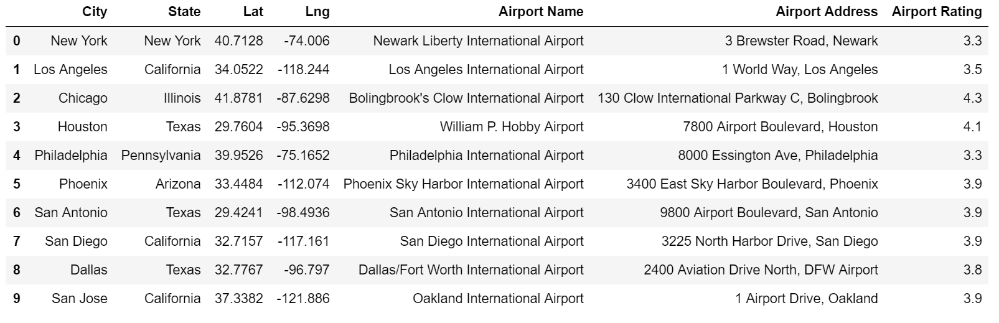

* Make sure the students can download and open the [instructions](Activities/05-Stu_Google_Complex/README.md), the [starter code](Activities/05-Stu_Google_Complex/Unsolved/Airport_Ratings.ipynb), and the [dataset](Activities/05-Stu_Google_Complex/Resources/Cities.csv).

* Divide students into breakout groups of 3 to 5. They should work on the solution by themselves but can reach out to others in their group for help.

* Let students know that they may be asked to share and walk through their work at the end of the activity.

</details>

<details>
 <summary><strong>⭐ 3.3 Review: Google Complex (Airport) (0:05)</strong></summary>

* Once time is up, ask for volunteers to walk through their solution. Remind them that it is perfectly alright if they didn't finish the activity.

* To encourage participation, you can open the [starter code](Activities/05-Stu_Google_Complex/Unsolved/Airport_Ratings.ipynb) and ask students how they went about making the DataFrame with data from the API call.

* If there are no volunteers, open up [airport solution](Activities/05-Stu_Google_Complex/Solved/Airport_Ratings.ipynb) within Jupyter Notebook and run through the code line by line with the class, explaining the following points.

 * `iterrows()` is used to loop through each city in the DataFrame to obtain the geocoordinates for each airport.

 * `.loc` sets the value of lat/lng columns to match the coordinates retrieved by Google Geocoder API.

   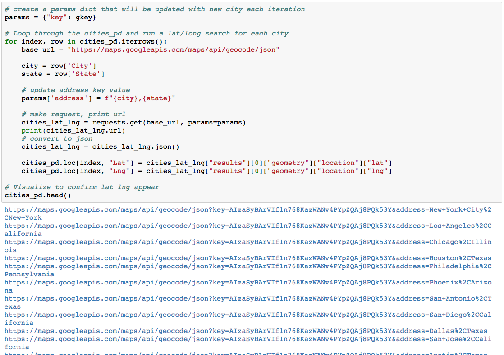

   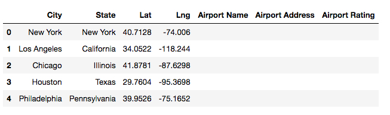

 * The iteration is repeated utilizing the newfound lat/lng to obtain the airport information from Google Places.

 * Also, point out that the application uses a try-except block to avoid situations where Google Places is missing review information.

   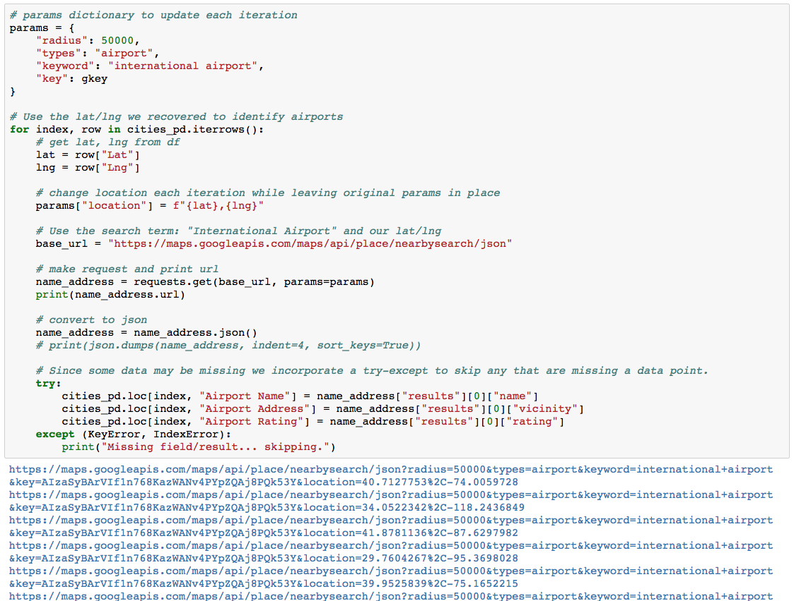

   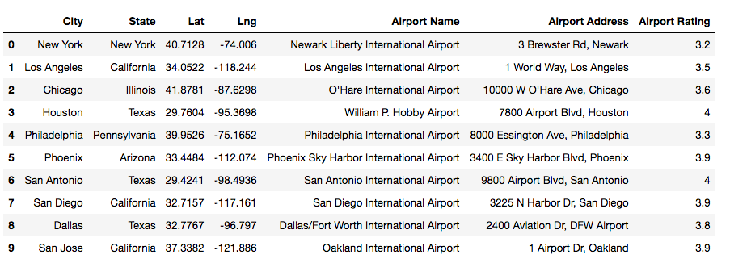

* Send out the [airport solution](Activities/05-Stu_Google_Complex/Solved/Airport_Ratings.ipynb) notebook for students to refer to later.

* Answer any questions before moving on to the next activity.

</details>

<sub>[Having issues with this activity? Report a bug!](https://bit.ly/2LigXau)</sub>

### 4. Jupyter Gmaps

| Activity Time:  0:30 |  Elapsed Time: 1:40  |
|----------------------|----------------------|

<details>
 <summary><strong>🎉 4.1 Everyone Do: Jupyter Gmaps (0:10)</strong></summary>

* For this next activity, students will plot directly to Google Maps inside a Jupyter Notebook.

* Before beginning, the students will need to have gmaps installed. Have the students run the following command in their environment.

```shell
conda install -c conda-forge gmaps
```

* Alternatively, you can have students install gmaps using `pip` by running the following commands in their environment:

  * Enable "ipywidgets": `jupyter nbextension enable --py --sys-prefix widgetsnbextension`

  * Install gmaps: `pip install gmaps`

  * Tell Jupyter to load the `widgetsnbextension`: `jupyter nbextension enable --py --sys-prefix gmaps`

* Use slides 24–28 to accompany the beginning of this demonstration.

* **Note:** If you are having trouble displaying the maps, try running `jupyter nbextension enable --py gmaps` in your environment, then try to display the maps again.

* Explain the use case for [Jupyter Gmaps](http://jupyter-gmaps.readthedocs.io/en/latest/tutorial.html)::

* _gmaps_ is a plugin for Jupyter that allows users to embed Google maps directly into their notebooks.

* This grants the ability to visualize multiple layers of data and to customize the appearance of the map.

* Before beginning the installation:

 * First, revisit the steps to enable a Google API.

 * Direct the students to return to the [Google API Console](https://console.developers.google.com/) and ensure that the project created earlier is selected.

   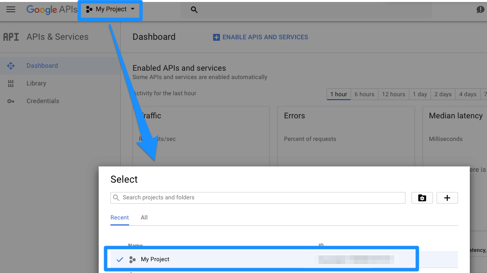

* Click the library on the side panel and search for _Maps JavaScript API_.

* Direct the students to enable the API.

* After the API is enabled, run these commands either in a Jupyter Notebook or terminal/git-bash.

* **Note:** The Jupyter Notebook server may need to be restarted for the changes to take place.

   ```python
   # enable jupyter extensions
   jupyter nbextension enable --py --sys-prefix widgetsnbextension

   # install gmaps
   conda install -c conda-forge gmaps

   # enable gmaps
   jupyter nbextension enable --py --sys-prefix gmaps
   ```

* Before moving on to the demonstration, address questions and troubleshoot any installation issues.

* Once all students have their API keys and tools installed, send out the notebook file [gmap.ipynb](Activities/06-Evr_Jupyter_Gmaps/Unsolved/gmaps.ipynb). Live code and explain along the way:

 * Configuring Gmaps by passing in their unique API key

 * While building a base map, explain to the students that this is the foundation of creating visualizations with Gmaps.

   ```python
   import gmaps
   from config import gkey

   gmaps.configure(api_key=gkey)

   fig = gmaps.figure()
   ```

   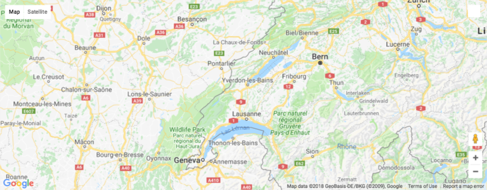

* **Note**: Some students may encounter an error with Jupyter Widgets when displaying the first figure. Reference the [Jupyter Widget documentation](http://ipywidgets.readthedocs.io/en/latest/user_install.html) for additional instructions.

* Adding layers to the map: Demonstrate a `marker_layer` by creating a list of tuples in the kernel. Each tuple contains a pair of coordinates for a US city.

   ```python
   coordinates = [
      (40.71, -74.00),
      (30.26, -97.74),
      (46.87, -96.78),
      (47.60, -122.33),
      (32.71, -117.16)
   ]

   fig = gmaps.figure()
   markers = gmaps.marker_layer(marker_locations)
   fig.add_layer(markers)
   fig
   ```

* Adjusting the viewport: Note how the map automatically adjusts the view as data is added. The zoom and map center but can be manually adjusted within `gmaps.figure()`, although both parameters must be met to apply the adjustment.

* Explain that the figure can also be centered within the user's output cell by setting the left and right margins to auto:

   ```python
   figure_layout = {'width': '400px', 'margin': '0 auto 0 auto'}

   gmaps.figure(layout=figure_layout)
   ```

* Next, demonstrate map customization by adding width and height attributes. Margin and padding can also be specified.

   ```python
   import gmaps
   gmaps.configure(api_key="your_key")

   figure_layout = {
   'width': '400px',
   'width': '300px',
   'border': '1px solid black',
   'padding': '1px'
   }

   fig = gmaps.figure(layout=figure_layout)
   fig
   ```

   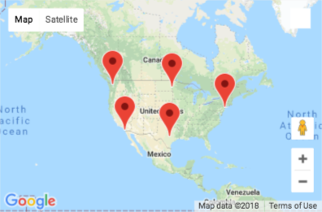

* Finally, demonstrate exporting the completed figure as a .png file via the download button.

   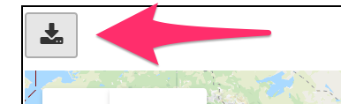

* Discuss that Gmaps accepts coordinates from several different forms: the list of tuples as demonstrated, a dictionary of lists, and from a DataFrame containing a column each for latitude and longitude.

</details>

<details>
 <summary><strong>✏️ 4.2 Student Do: Hot Airports (0:15)</strong></summary>

* In this exercise, students will be tasked with creating a heat map based on the airport ratings achieved in a previous activity.

* Open up the solved version [05-Stu_Google_Complex/Airport_Ratings.ipynb](Activities/05-Stu_Google_Complex/Solved/Airport_Ratings.ipynb) and show students the ending DataFrame.

   

* Make sure the students can download and open the [instructions](Activities/07-Stu_Airport_Map/README.md), the [starter code](Activities/07-Stu_Airport_Map/Unsolved/airport_heatmap.ipynb), and the [dataset](Activities/07-Stu_Airport_Map/Resources/Airport_Output.csv).

* Divide students into breakout groups of 3 to 5. They should work on the solution by themselves but can reach out to others in their group for help.

* Let students know that they may be asked to share and walk through their work at the end of the activity.

</details>

<details>
 <summary><strong>⭐ 4.3 Review: Hot Airports (0:05)</strong></summary>

* Open [airport_heatmap.ipynb](Activities/07-Stu_Airport_Map/Solved/airport_heatmap.ipynb) in Jupyter Notebook, explaining as you progress through the code.

* Start by configuring Gmaps by loading in an API key, then reading in the CSV and storing it as a DataFrame.

* The Airport Rating column contains `NaN` values and strings. Using Pandas methods `fillna` and `astype`, the column will be cleaned and usable.

   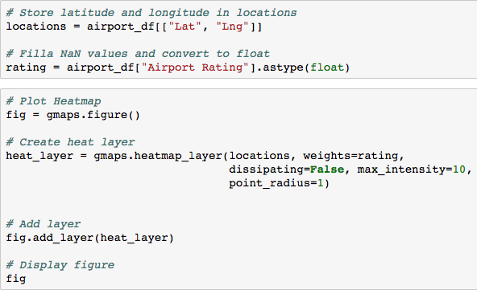

* At minimum, two things are needed for a heatmap: locations and a weight. The `"Lat"` and `"Lng"` columns are pulled out for locations and the `"Airport Rating"` for the weight.

* For the bonus, the arguments `dissipating=False`, `max_intensity=10`, and `point_radius=1` allow the map to handle being zoomed.

* Finally, a Gmap figure is created. Create the `heat_layer` by passing in locations and ratings, then the layer is added and the figure is displayed.

* For the bonus, `map_type` can be changed by being passed in as an argument to `gmaps.figure()`

</details>

<sub>[Having issues with this activity? Report a bug!](https://bit.ly/3nnNAR7)</sub>

### 5. Creating Direction Maps

| Activity Time:  0:15 |  Elapsed Time: 1:55  |
|----------------------|----------------------|

<details>
 <summary><strong>🎉 Everyone Do: Itinerary (0:15)</strong></summary>

* Explain that this exercise will use Google's Directions API, which will allow us to plot routes on maps. Students should be familiar with this if they have ever used Google Maps to get directions.

* This exercise is not covered in the module content but is very important for the Challenge.

* To enable the "Directions API" in your Google account for your API key, follow these steps:

   * On the Google Cloud Platform, select "APIs & Services" from the left-hand side.

      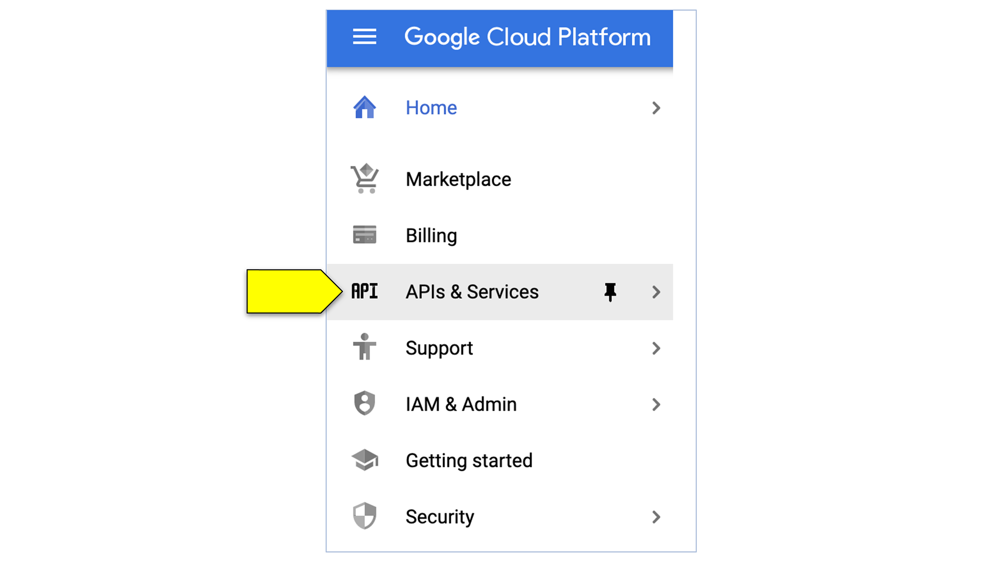

   * Then, select "Library".

      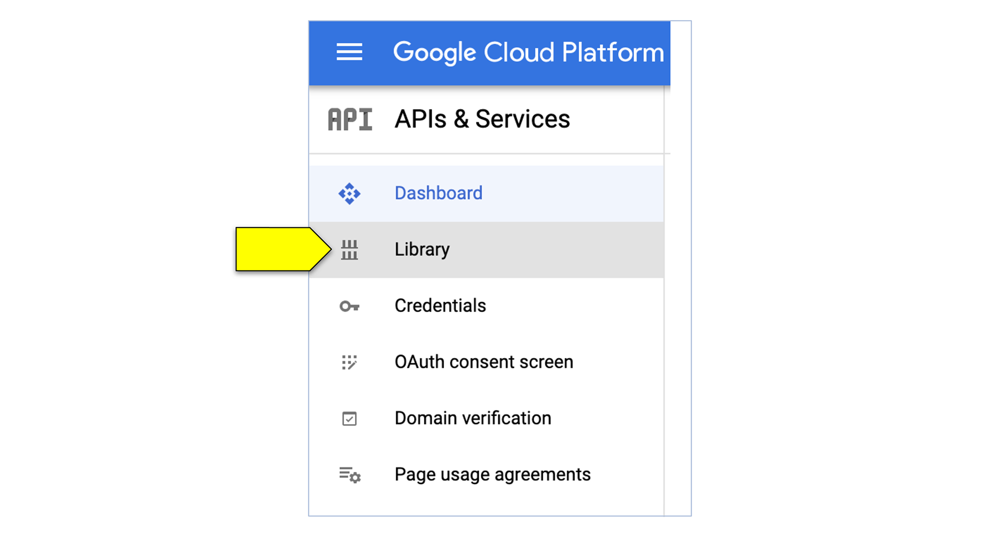

   * In the Search field, type "Directions".

      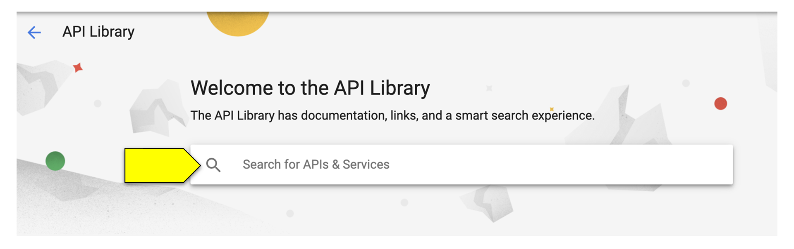

   * Select "Directions API".

      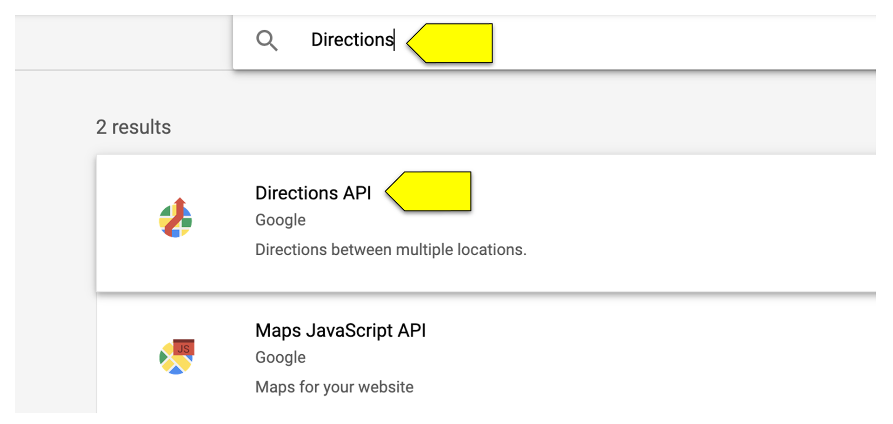

   * Click "Enable" to activate the Directions API.

      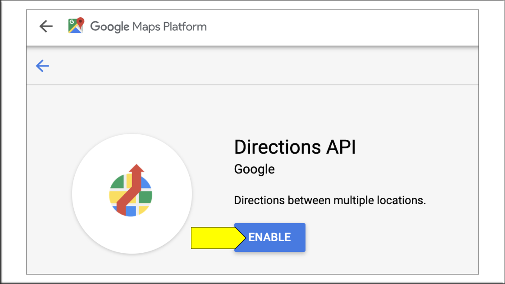

   * Students will now be able to plot routes on their maps.

* Open the [unsolved notebook](Activities/08-Evr_Itinerary/Unsolved/Ins_Itinerary.ipynb) and, using the [solved notebook](Activities/08-Evr_Itinerary/Unsolved/Ins_Itinerary.ipynb) as a guide demo, encourage students to code along with you. Explain the following points as you go through the exercise:

* Import our dependencies, including our `api_key` that was stored  in a config file.

* Configure Gmaps to use the `api_key`.

* Use Pandas to load in the dataset with the included cities and their respective coordinates.

* We use the Pandas `loc` method to select our starting and ending city, which here is Boston.

   ```python
   # Set the city to start and end your trip
   city_start = cities_df.loc[cities_df["City"] == "Boston"]
   city_end = cities_df.loc[cities_df["City"] == "Boston"]
   ```

   * Using the `loc` method again, we grab the cities where we will create stops.

   ```python
   # Set the cities to stop at
   city_stop1 = cities_df.loc[cities_df["City"] == "New York"]
   city_stop2 = cities_df.loc[cities_df["City"] == "Chicago"]
   ```

* Next, we grab the coordinate for our starting city as well as the cities we plan to stop in.

   ```python
   # Get the lat and lng for the start and end of the trip
   start = city_start["Lat"].to_numpy()[0], city_start["Lng"].to_numpy()[0]
   end = city_start["Lat"].to_numpy()[0], city_start["Lng"].to_numpy()[0]
   print(f'Start: {start}, End: {end}')

   # Get the lat and lng for the stops
   coords_stop_1 = city_stop1["Lat"].to_numpy()[0], city_stop1["Lng"].to_numpy()[0]
   coords_stop_2 = city_stop2["Lat"].to_numpy()[0], city_stop2["Lng"].to_numpy()[0]
   print(f'Stop 1: {coords_stop_1}, Stop 2: {coords_stop_2}')
   ```

* We create a `gmaps.figure()`, then we create a `city_itinerary` by creating a direction layer. This layer takes in the coordinates for the start of our trip, the end of our trip, and each waypoint, or stop, we wish to visit. Finally, it takes in `travel_mode`, or how we plan on traveling to each spot. Here, we use 'DRIVING'.

* Then we add the layer to our figure and display the results.

   ```python
   # Create Map with route
   fig = gmaps.figure()
   city_itinerary = gmaps.directions_layer(
         start, end, waypoints=[coords_stop_1, coords_stop_2],
         travel_mode='DRIVING')

   fig.add_layer(vacation_itinerary)
   fig
   ```

   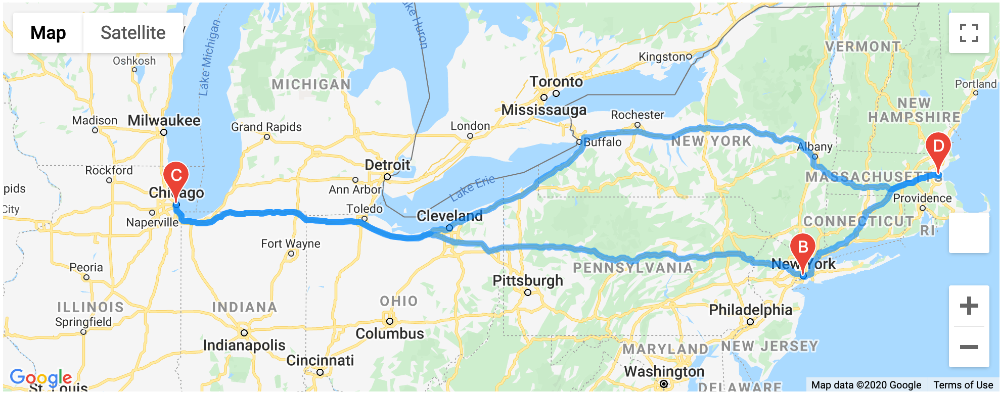

* Answer any questions before ending class.

</details>

<sub>[Having issues with this activity? Report a bug!](https://bit.ly/2Lz1ZwQ)</sub>

### 6. Ending Class

| Activity Time:       0:05 |  Elapsed Time:      2:00  |
|---------------------------|---------------------------|

<details>
 <summary><strong>📣  6.1 Instructor Do: Review (0:05)</strong></summary>

* Before ending class, review the skills that were covered today and mention where in the module these skills are introduced.
* Google Maps and Places API was covered in **Lesson 6.5.1**.
* Using Pandas with the Google Maps API was covered in **Lesson 6.5.2**.
* Nearby search and map plotting was covered in **Lesson 6.5.4**.

* Answer any questions the students may have.

</details>

<sub>[Having issues with this activity? Report a bug!](https://bit.ly/2K1whb8)</sub>

- - -

© 2021 Trilogy Education Services, LLC, a 2U, Inc. brand.  Confidential and Proprietary.  All Rights Reserved.
