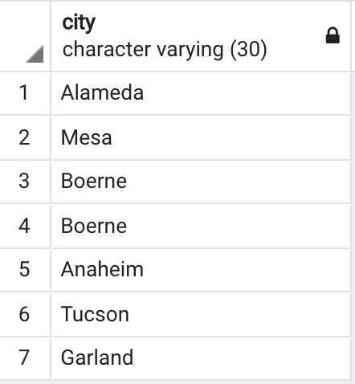

## Creating Tables

In this activity, you will use pgAdmin to recreate and query a table based on image provided to you.

### Instructions

1. Create a new database in pgAdmin named `city_info`.

2. Using the query tool, create an empty table named `cities`. Be sure to match the data types!

3. Insert data into the new table. The result should match the following image.

    

4. Query the table to view the cities.

    

5. Filter the table to view only cities in Texas.

6. Filter the table to view only cities with a population of less than 100,000.

7. Filter the table to view California cities with a population of less than 100,000.

8. Update the table to correct the state for the city of "Anaheim".  

9. Remove the duplicate entry of `('Boerne', 'Texas', 16056)` using the unique "id". 

### Hints

* For the second bonus question, you will need to use a [`WHERE` clause](https://www.tutorialspoint.com/sql/sql-where-clause.htm) to filter the original query.

* For the third bonus question, an [`AND` clause](https://www.tutorialspoint.com/sql/sql-and-or-clauses.htm) will also be necessary.

---

© 2021 Trilogy Education Services, LLC, a 2U, Inc. brand.  Confidential and Proprietary.  All Rights Reserved.