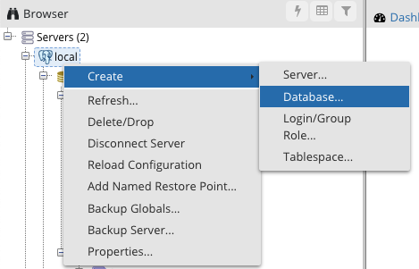
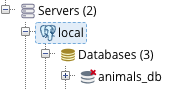

# Module 7 Class 1: Getting Started with pgAdmin and SQL

## Overview

This week, we will be introducing a new programming language, Structured Query Language, or SQL. With SQL, students will learn to use the PostgreSQL management system to search for and retrieve data from a variety of tables in a pgAdmin database. 

In today's class, students will make sure PostgreSQL and pgAdmin are installed correctly, then they’ll create a database, create tables in the database, import data into the tables from CSV files, and perform queries to retrieve data from the tables. 


## Learning Objectives

By the end of class, students will be able to:
 
* Verify that PostgreSQL and pgAdmin are installed correctly
* Create a database
* Import CSVs into database tables
* Perform simple queries
* Combine data using joins


- - -

## Instructor Notes

* The activities in this class will complement Lessons **7.0.1: Exploring Databases with SQL** through **7.3.3: Joins in Action**.  The students will benefit from these activities if they‘ve progressed through these lessons, which cover the following concepts, techniques, and tasks:  

* Create an ERD from CSV files
* Create a database on pgAdmin
* Create tables in a database using the ERD
* Import CSV files into database tables
* Create and run queries
* Use joins to combine records from two or more tables
* Create a new table from a query
* Export data from a table into a CSV file


### What might learners struggle with? 
Learners have historically enjoyed the shift to SQL, but you may have some folks who have trouble tying this technology together with what they have already learned. Be prepared to talk through the connective tissue between databases and what they've already learned by providing context and examples. 

### What's the relevance of PostgreSQL?
Databases will be crucial to your work as data professionals, and PostgreSQL, or Postgres, is a free, open-source object-relational database management system that is very popular in some data careers.


## Slides

[SQL Day 1 slideshow](https://docs.google.com/presentation/d/1HzCOAfhUik-mbi4qmJ1mnR_29QkK4QrigOngGComBVI/edit#slide=id.gab17893448_0_2766)

## Student Resources

Share the following [activity resources](https://2u-data-curriculum-team.s3.amazonaws.com/data-viz-online-lesson-plans/07-Lessons/7-1-Student_Resources.zip) with the students. 


- - - 

## Before Class

### 0. Office Hours

| Activity Time: 0:30       |  Elapsed Time:     -0:30  |
|---------------------------|---------------------------|

<details>
  <summary><strong> 📣 0.1 Instructor Do: Office Hours</strong></summary>

* Before you begin class, hold office hours. Office hours should be driven by students. Encourage students to take full advantage of office hours by reminding them that this is their time to ask questions and get assistance from instructional staff as they learn new concepts.

* Expect that students may ask for assistance. For example: 

  * Further review on a particular subject
  * Debugging assistance
  * Help with computer issues
  * Guidance with a particular tool

</details>

- - - 

## During Class 

### 1. Getting Started

| Activity Time:       0:15 |  Elapsed Time:      0:15  |
|---------------------------|---------------------------|

<details>
  <summary><strong>📣 1.1 Instructor Do: Foundation Setting (0:10)</strong></summary>

* Welcome students to class.

* Direct students to post individual questions in the Zoom chat to be addressed by you or your TAs at the end of class.

* Open the slideshow and use slides 1-12 to walk through the foundation setting with your class.

* **Big Picture:** This is an opportunity to zoom out and see the big picture of where they are in the program. Take a moment to mention some real-world examples that show the value of what they’re learning this week.

* **Program Pointers:** Talk through some of the key logistical things that will help students stay on track. This is an opportunity to speak to what students may need when they're at this particular point of the program. 

* **This Week - SQL:** Talk through the key skills that students will be learning this week. Let students know that they will be learning a new programming language, SQL, and although SQL is easy to understand, it may take time to become comfortable with SQL after 4 weeks of working with Python. The primary focus of Day 1 activities is to review the fundamentals of SQL: create a database, create tables in the database, import data into the tables, and create and run basic queries. On Day 2, the students will create and run more complex queries that are in parallel with the module contents and help them with the Employee Database Challenge. 

* **This Week's Challenge:** For this week's challenge, let the students know that they'll create two tables that will be exported as CSV files. The first table will contain the number of retiring employees based on their most recent job title, and the second table will contain employees who are eligible to participate in a mentorship program based on their birthdate. Then, you’ll write a report that summarizes your analysis. 

* **Career Connection:** Let students know how they will be using the skills covered this week throughout their careers. It's important for them to know the "why". Provide examples of when they may be used in work or when you have used those skills in your workplace. 

* **How to Succeed This Week:** Remind your students that they may have moments of frustration this week because they will be learning something complex. These moments are great for deepening their knowledge. Use the side material to outline some of the topics that they may find tricky in this module. Consider sharing something about your personal learning journey. It helps students to recognize that everyone starts somewhere and that they are not alone.

* **Today's Objectives:** Now, outline the concepts that will be covered in today's lesson. Remind students that they can find the relevant activity files in the Getting Ready for Class page in their course content.  

</details>

<details>
  <summary><strong>🎉  1.2 Everyone Do: Check-In (0:05)</strong></summary>

* Ask the class the following questions and call on students for answers:

    * **Q:** How are you feeling about your progress so far?

    * **A:** Let them know that we are starting to build their skillset. It’s also okay to feel overwhelmed as long as you don’t give up.

    * **Q:** How comfortable do you feel with this topic? 

    * **A:** Let's do "fist to five" together. If you are not feeling confident, hold up a fist (0). If you feel very confident, hold up an open hand (5).

</details>

<sub>[Having issues with this activity? Report a bug!](https://bit.ly/35nivH3)</sub>

### 2. Installation Check

| Activity Time:       0:10 |  Elapsed Time:      0:25  |
|---------------------------|---------------------------|

<details>
  <summary><strong> 📣 2.1 Instructor Do: Installation Check (0:05)</strong></summary>

* Have students open and run `pgAdmin` to ensure that it is working correctly. 

* For any students who were not able to install PostgreSQL or pgAdmin from **Lesson 7.1.1: Download and Install Your Tools**, let them know that a set of instructions was provided in the Student Resources in the AWS link. For those who don't have them, send out the [instructions](../Supplemental/InstallationGuides) via Slack.

</details>


<details>
  <summary><strong>📣 2.2 Instructor Do: Introduction to SQL (0:05)</strong></summary>

* Before diving into the lesson's activities, take some time to go over the purpose of SQL. You can use slides 13-21 to introduce these concepts before beginning the demonstration.

  * SQL (often pronounced "sequel") stands for Structured Query Language. It is a powerful programming tool designed to allow programmers to create, populate, manipulate, and access databases, while also providing an easy method for dealing with server-side storage. 

  * Data using SQL is stored in tables on the server, much like spreadsheets you would create in Microsoft Excel. This makes the data easy to visualize and search.

  * PostgreSQL, usually referred to as "Postgres", is an object-relational database system that uses the SQL language. 

  * pgAdmin is the management tool used for working with Postgres. It simplifies creation, maintenance, and use of database objects. 

* Make sure that the students can download and open the [Student Guide](../StudentGuide.md) and the [SQL Reference Guide](../Supplemental/SQL_reference_guide.pdf) from the AWS link. If not, then send out the resources over Slack. 

</details>


<sub>[Having issues with this activity? Report a bug!](https://bit.ly/2XqCBfb)</sub>

- - - 

### 3. Creating a Database and Tables

| Activity Time:       0:15 |  Elapsed Time:      0:40  |
|---------------------------|---------------------------|

<details>
  <summary><strong>🎉 3.1 Everyone Do: Create a Database (0:05)</strong></summary>

 * You can use slides 22-25 to show students the steps in creating a database in pgAdmin before demonstrating it yourself.

* After verifying that everyone has successfully installed pgAdmin and Postgres, launch pgAdmin in a new browser window, then ensure that everyone is able to follow along and view their new server in the browser.

  

* Walk the class through the steps to create a database using pgAdmin.

  * In the pgAdmin editor, right-click the newly established server to create a new database.

  * From the menu, select **Create**, and then select **Database** to create a new database.

    

  * Enter **animals_db** as the database name. Make sure the owner is set as the default Postgres, and then click **Save**.

    

* At this point, show students that there is a new database listed in the left-hand menu. Explain that the new database, `animals_db`, is not yet connected to the server. By simply clicking on the database, we will create a connection to Postgres.

  

* Answer any questions before moving on.

</details>

<details>
  <summary><strong>🎉 3.2 Everyone Do: Create Tables (0:10)</strong></summary>

* Now that there is a database on the server, it's time to dig into the real meat of SQL and start creating tables within the new database!  You can use slides 26-37 for creating the tables.

* Make sure the students can download and open the [instructions](Activities/02-Evr_Creating_Tables/README.md), the [create_people_table.sql](Activities/02-Evr_Creating_Tables/Unsolved/create_people_table.sql), and the [create_cities_table.sql](Activities/02-Evr_Creating_Tables/Unsolved/create_cities_table.sql) files from the AWS link.  

* From the left-hand menu in pgAdmin, right-click **animals_db** and select **Query Tool**.

  **Note:** You can also select **Query Tool** from the Tools drop-down menu at the top of the screen (see second screenshot below).

  

  

* Explain to students that this is how to access the code editor.

* Have everyone open the `create_people_table.sql` file, copy the following lines of code, and paste them into the "Query Editor" of pgAdmin, explaining each line:

  ```sql
  CREATE TABLE people (
    name VARCHAR(30) NOT NULL,
    has_pet BOOLEAN DEFAULT false,
    pet_type VARCHAR(10) NOT NULL,
    pet_name VARCHAR(30),
    pet_age INT
  );
  ```

  * `CREATE TABLE people (<COLUMNS>);` creates a table called `people` with the columns listed within the parentheses.

  * `name VARCHAR(30) NOT NULL` creates a `name` column, which can hold character strings of up to 30 characters and will not allow null fields.

    * The `NOT NULL` constraint requires the name field to have a value specified.

  * `pet_type VARCHAR(10) NOT NULL` creates a `pet_type` in the same manner that the `name` column is created. The only difference is the number of characters allowed in the column.

  * `has_pet BOOLEAN DEFAULT false` creates a `has_pet` column that holds either `true` or `false` values, although the default value is set to `false`.

  * `pet_name VARCHAR(30)` creates a `pet_name` column, which can hold character strings of up to 30 characters and will allow null fields.

  * `pet_age INT` creates a `pet_age` column, which can hold whole numbers.

  * **Note:** Be sure to point out the semicolon at the end of the statement, which tells pgAdmin that this line of code has concluded.

* After reviewing the code, have everyone click the triangle button to run the script. Make a note of the Messages tab at the bottom of the screen.

  

* **Q:** Ask the students what code allows us to visualize the structure of the table. 

* **A:** The structure of the table can be visualized using `SELECT * FROM <table name>;`.  

  * Explain that using the asterisk in this manner tells pgAdmin to select all fields from the table.

  * In the future, students will be able to view the structure of their table, and all of the values contained within it, using this same line of code.

* Before moving on, explain that SQL data is persistent; it is not deleted or overwritten when identical commands are run unless specifically commanded. This means that if you try to create a database or table with a name identical to one that already exists, an error will occur telling the user that the database or table already exists.

  * Re-run the code to create the `people` table to show the students that the following error message will appear in the "Messages" field in the output area. 
  
    

* Ask the class how they could avoid this kind of error. Students may respond that they can simply delete the offending line of code and then run the commands again. Explain that while this method would work, deleting working code is not a best practice.

* Show the class an alternative method: Highlight the lines of code to run, and then click the triangle button to run only the highlighted selection. This method of running SQL code is preferable to deleting working code.

  

* Next, have everyone open the `create_people_table.sql` file, have them copy the following lines of code, and paste them into the "Query Editor" of pgAdmin, while explaining what it does line by line:

  ```sql
  INSERT INTO people (name, has_pet, pet_type, pet_name, pet_age)
  VALUES ('Jacob', true, 'dog', 'Misty', 10),
    ('Ahmed', true, 'rock', 'Rockington', 100),
    ('Peter', true, 'cat', 'Franklin', 2),
    ('Dave', true, 'dog', 'Queso', 1);

  SELECT *
  FROM people;
  ```

  * This code does the following: 

    * It inserts data into the `people` table and then specifies the columns in which data will be entered.

    * The `VALUES` line places the data contained in the parentheses into the corresponding columns listed after the `INSERT INTO` statement.

    * **Note:** Single quotation marks must be used for insert strings; otherwise, an error will result.

* Have the students code along with you by typing the following query to extract data from one column, `pet_name`.

  ```sql
  SELECT pet_name
  FROM people;
  ```

* Explain that specifying a column name in the `SELECT` statement will return only the data contained in that field.

* Next, show the students how to filter the table to extract only dogs younger than 5 years. Then, have them copy and paste the code from their `create_people_table.sql` file. 

  ```sql
  SELECT pet_type, pet_name
  FROM people
  WHERE pet_type = 'dog'
  AND pet_age < 5;
  ```

* Explain the following points:

  * The `SELECT` clause can specify more than one column.

  * Data is filtered by using additional clauses such as `WHERE` and `AND`.

  * The `WHERE` clause will extract only the data that meets the condition specified. `AND` adds a second condition to the original clause, further refining the query.

* Next, have the students open up the [02-Evr_Creating_Tables/README.md instructions](Activities/02-Evr_Creating_Tables/README.md), let them know that they'll use pgAdmin to create a table in a new database, and then query the table to get the data shown in the images in the instructions.

* First, have the students create a new database named `city_info` in pgAdmin. Then, live code or use the query tool to copy and paste the solution to create the `cities` table from `create_cities_table.sql` file.

   * To create a new table, remind students to specify the data type for each column.

    ```sql
    CREATE TABLE cities (
      id SERIAL PRIMARY KEY,
      city VARCHAR(30) NOT NULL,
      state VARCHAR(30) NOT NULL,
      population INT
    );
    ```

* Next, insert multiple rows of data into the new table by live coding with the students.

  * Point out to students that each column is specified in the `INSERT INTO` clause, and the values are inserted in the same order.

  * To make the code easier to read, each row of values is on its own line, separated by a comma.

    ```sql
    INSERT INTO cities (city, state, population)
    VALUES ('Alameda', 'California', 79177),
    ('Mesa', 'Arizona', 496401),
    ('Boerne', 'Texas', 16056),
    ('Boerne', 'Texas', 16056),
    ('Anaheim', 'Texas', 352497),
    ('Tucson', 'Arizona', 535677),
    ('Garland', 'Texas', 238002);
    ```

  * **Note:** Let the students know that we will handle the duplicate and incorrect data later in this activity.

* Once we have created a table, let the students know that it is customary to write a few queries to make sure the data is in the table. 

* First, we write a query to view **all** the data in the table. 

  ```sql
  SELECT *
  FROM cities;
  ```

  * **Note:** Point out the syntax here. Even though the code can fit on a single line, it's good practice to split it up over two lines instead. This way, the code is easier to read when more advanced queries are created.

* Then, we may want to retrieve all the data from a specific column from the `cities` in the table.

  ```sql
  SELECT city
  FROM cities;
  ```

* Answer any questions before moving on to the bonus queries. 

* Next, we can search for specific data within a database.

  * Using the `WHERE` clause, we can extract only the records that meet the specified condition.

  * In the line `WHERE state = 'Texas';`, we are specifying Texas in the state column. 

    ```sql
    SELECT city, state
    FROM cities
    WHERE state = 'Texas';
    ```

* Next, point out to students that the `WHERE` clause is highly customizable, such as with the use of the `<` operator.

  ```sql
  SELECT *
  FROM cities
  WHERE population < 100000;
  ```

* Explain to students that queries can be filtered even further with the `AND` clause. This clause allows users to specify more than one condition in their query.

  ```sql
  SELECT *
  FROM cities
  WHERE population < 100000
  AND state = 'California';
  ```

* We can also use the `WHERE` clause to update a table and delete rows from a table. Using the `UPDATE` statement, we can update the state for the city of "Anaheim".  

    ```sql
    UPDATE cities
    SET state = 'California'
    WHERE city = 'Anaheim';
    ```

* Duplicate data is easy to remove with the `WHERE` clause. Using the `DELETE FROM` statement we can remove the duplicate entry of `('Boerne', 'Texas', 16056)` with the unique "id" of 4 with the following code.

    ```sql
    DELETE FROM cities
    WHERE id = 4;
    ```

  * This does precisely what was desired: duplicate data is deleted, and original data is preserved. 

  * Let the students know that deleting the duplicate by the specific value for the city, state, or population will delete *all* data that have those values. 

* Answer any questions before moving on.

</details>

<sub>[Having issues with this activity? Report a bug!](https://bit.ly/3hZlcnA)</sub>

- - -

### 4. Hide and Seek

| Activity Time:       0:25 |  Elapsed Time:      1:05  |
|---------------------------|---------------------------|

<details>
  <summary><strong>📣 4.1 Instructor Do: Import Data (0:05)</strong></summary>

* So far, the class has created their own tables and values by manually using SQL code. As one might imagine, this process can be tedious when translating large datasets from external sources. Thankfully, pgAdmin includes a built-in import tool that can take CSV files and easily import their data into tables.  

* Send out the [resources](Activities/03-Ins_Importing_Data/Resources) files and the [bird_song_query.sql](Activities/03-Ins_Importing_Data/Solved/bird_song_query.sql) file for students so they can follow along.

* Return to pgAdmin and create a new database called `Miscellaneous_DB`.

* Open the CSV file within an integrated development environment, such as Excel, to show the dataset that will be imported. Be sure to point out that the first row of this dataset includes headers.

  * Open a query tool within `Miscellaneous_DB` and create a table named `bird_song` using the code from `bird_song_query.sql`. Point out that the columns created match the data in the CSV file.

  * Once the table and columns have been created, right-click **Miscellaneous_DB** from the left-hand menu and select **Refresh**.

  * Scroll down to Schemas and expand that menu, and then expand the Tables menu.

    

  * Right-click on the `bird_song` table and select **Import/Export** from the menu.

    

* In the Options tab, complete the following steps:

  * Toggle the tab to slide the Import/Export tab to **Import**.

  * Click on the dot menu to navigate to the `birdsong.csv` file on your computer.

  * Slide the Header tab to **Yes**.

  * Select the comma from the drop-down menu to set it as the Delimiter.

  * Leave the other fields as they are, and then click **OK**.

  

* In the query tool, re-run `SELECT * FROM birdsong` to verify that data has been imported.

* Let the class know that the bigger the dataset, the longer it will take for pgAdmin to import values.

* Ask the class the following questions and call on students for the answers:

    * **Q:** Where have we used this before?

    * **A:** We created a database and tables, and imported a CSV file in Lessons 7.2.1 through 7.2.3.

    * **Q:** How does this activity equip us for the Challenge?

    * **A:** We won't need to do these tasks in the Challenge, but they are standard practice for creating a database with tables and importing data into the table.

    * **Q:** What can we do if we don't completely understand this?

    * **A:** We can refer to the lesson plan and reach out to the instructional team for help.

* Answer any questions before moving on to the student activity.

</details>

<details>
  <summary><strong>✏️ 4.2 Student Do: Hide and Seek (0:15)</strong></summary>

 * You can use slides 41-43 to present this activity to the class. 

* In this exercise, the students will create a new table in the `Miscellaneous_DB` database and import data into the table from a CSV file.  

* Make sure the students can download and open the [instructions](Activities/04-Stu_Hide_and_Seek/README.md), the CSV files in the [resources](Activities/04-Stu_Hide_and_Seek/Resources) folder, and the [hide_seek_query_unsolved.sql](Activities/04-Stu_Hide_and_Seek/Unsolved/hide_seek_query_unsolved.sql) file from the AWS link. 

* Go over the instructions in the README, and then divide students into breakout groups of 3-5. They should work on the solution by themselves but can reach out to others in their group for tips.

* Let students know that they may be asked to share and walk through their work at the end of the activity.

</details>

<details>
  <summary><strong>⭐ 4.3 Review: Hide and Seek (0:05)</strong></summary>

* Once time is complete, ask for volunteers to share their solution. Remind them that it is perfectly alright if they didn't complete the activity. 

* To encourage participation, you can ask the students to help you write the queries to extract the data from the table.  

* If there are no volunteers, open pgAdmin and paste the code from `hide_seek_query.sql` into the editor. Explain the following:

  * To view a specific data range, we can use a combination of `WHERE` and `AND` statements.

  * To collect data that exists in either one column or another, the `OR` statement is included in the query.

* Walk through the solutions to the bonus questions, touching on the following points:

  * After importing the second table, we can specify a source with the `WHERE` statement.

  * `AND` statements can be used more than once for more specific results.

* Ask the class the following questions and call on students for the answers:
    
    * **Q:** How would you make a new table, "wordassociation_BC", where the source is "BC" from the "wordassociation" table?

    * **A:** You would use the `INTO` statement as shown in the following query.

        ```sql
        SELECT *
        INTO wordassociation_BC
        FROM wordassociation
        WHERE source = 'BC';
        ```
  
    * **Q:** What can we do if we don't completely understand this?

    * **A:** Review Lesson 7.3.1 and you can reach out to the instructional staff.

* Send out the [hide_seek_query.sql](Activities/04-Stu_Hide_and_Seek/Solved/hide_seek_query.sql) file for students to refer to later.

* Answer any questions before proceeding to the next activity.

</details>

<sub>[Having issues with this activity? Report a bug!](https://bit.ly/3osOv4n)</sub>

- - -

### 5. Using CRUD

| Activity Time:       0:25 |  Elapsed Time:      1:30  |
|---------------------------|---------------------------|

<details>
  <summary><strong>📣 5.1 Instructor Do: CRUD (0:05)</strong></summary>

* Use slides 44-51 to introduce CRUD operations to the class.

  * CRUD, although an unusual acronym, is a set of tools that are consistently used throughout programming. CRUD stands for Create, Read, Update, and Delete.

* Engage the class in a discussion by asking them to provide examples of CRUD operations.

* In today's class, each of the CRUD operations has been used. Students have:

  * Created data in a table with the `INSERT` statement.

  * Read data with the use of `SELECT`.

  * Updated a table's data using `UPDATE`.

  * Deleted data using `DELETE`.

* Introduce the class to an additional method of reading the data: wildcards.

  * A wildcard is a character, either a percentage sign or an underscore, that takes the place of one or more characters in a query.

  * The keyword `LIKE` indicates the use of a wildcard in a query.

  * The percentage sign (%) signifies that zero, one, or multiple characters will be substituted in a query.

    * For example, in the query `WHERE last_name LIKE 'Will%';`, all names in the database beginning with "Will" will be returned no matter the length.

  * When using the underscore as a wildcard, only a single character is replaced in the query.

  * In the line `WHERE first_name LIKE '_AN';`, only three-lettered names ending with "an" will be returned.

* Answer any questions before moving on.

</details>

<details>
  <summary><strong>🎉 5.2 Everyone Do: Using CRUD (0:20)</strong></summary>

* In this activity, students will utilize CRUD operations (Create, Read, Update, Delete) on the Global Firepower data set provided. This activity will require students to do some research. Links are provided in the instructions to help them search for solutions to problems they are likely to encounter.

* Make sure the students can download and open the [instructions](Activities/05-Evr_CRUD/README.md), the [GlobalFirePower.csv](Activities/05-Evr_CRUD/Resources/GlobalFirePower.csv) file, and the [schema.sql](Activities/05-Evr_CRUD/Resources/schema.sql) file from the AWS link. 

* Open the [instructions](Activities/05-Evr_CRUD/README.md) and have everyone create the `GlobalFirePower` database in pgAdmin.

* Next, have everyone create a table by copying the code provided in `schema.sql` into a new query window in pgAdmin. Then, have them import the data from `GlobalFirePower.csv` using the Import/Export tool.

* Check to see if everyone was able to to create the table and import the CSV file, then have them type and run `SELECT * FROM firepower;`.  

* Pause for any questions or troubleshooting. 

* Next, let everyone know that we need to add an `id` as a Primary Key to the table. Have everyone code along with you as you type the following code: 

  ```sql
  -- Add primary key
  ALTER TABLE firepower
  ADD COLUMN id SERIAL PRIMARY KEY;
  ```

  * Have everyone check the table for the applied changes by typing and running, `SELECT * FROM firepower;`. The new column should be added to the end of the table. 

  * Let the students know that with this code, we are making a change to the table with the `ALTER TABLE` statement and creating a new column with the `ADD COLUMN` statement. Explain that adding the column name and data type is completed in the same manner as creating a new table.


* Next, ask for a volunteer to help you delete the rows that have a `ReservePersonnel` equal to "0". If no one volunteers, copy and paste the code from the `query.sql` file.

  ```sql
  -- Delete and update data
  DELETE FROM firepower
  WHERE ReservePersonnel = 0;
  ```

* Next, have the students update the table so that all `FighterAircraft` columns have at least "1" fighter aircraft.

  * **Q1:** Ask the students how can we make sure that all the rows where `FighterAircraft=0` are updated to `FighterAircraft=1`? 
  
  * **A1:** We type and run the following query. 

    ```sql
    SELECT * FROM firepower
    WHERE FighterAircraft = 1;
    ```

* Let the students know that since we have updated the `FighterAircraft` columns from "0" to "1", we also need to increase the `TotalAircraftStrength` column by "1" for those countries. 

* Have everyone code along with you as you type and run the following code that adds "1" to the `TotalAircraftStrength` columns where `FighterAircraft = 1`. 

  ```sql
   -- Delete and update data
  UPDATE firepower
  SET TotalAircraftStrength = TotalAircraftStrength + 1
  WHERE FighterAircraft = 1;
  ```

    * Make sure everyone is able to complete this task before moving on. 

* Next, have the students work on retrieving the averages for `TotalMilitaryPersonnel`, `TotalAircraftStrength`, `TotalHelicopterStrength`, and `TotalPopulation`, and rename the columns with their designated average for a few minutes.

* When time is complete, ask for a volunteer to assist you in writing the code for the finding-averages query. If there are no volunteers, copy and paste the code from the `query.sql` file.

  ```sql
  -- Select averages and rename columns
  SELECT AVG(TotalMilitaryPersonnel) AS AvgTotMilPersonnel,
    AVG(TotalAircraftStrength) AS AvgTotAircraftStrength,
    AVG(TotalHelicopterStrength) AS AvgTotHelicopterStrength,
    AVG(TotalPopulation) AS AvgTotalPopulation
  FROM firepower;
  ```

  * Let the students know that with this code, we are selecting multiple averages at once and creating new columns in the output window. 

  * **Q2:** Ask the students how you would create a new table with the calculating averages query.

  * **A2:** You would add the following line `INTO firepower_averages` between the `SELECT` and `FROM` statements. 

      ```sql
      -- Select averages and rename columns and place them into a new table. 
      SELECT AVG(TotalMilitaryPersonnel) AS AvgTotMilPersonnel,
        AVG(TotalAircraftStrength) AS AvgTotAircraftStrength,
        AVG(TotalHelicopterStrength) AS AvgTotHelicopterStrength,
        AVG(TotalPopulation) AS AvgTotalPopulation
      INTO firepower_averages
      FROM firepower;
    ```

* For the last query, send out the following information and give the students a few minutes to add the data into the following columns of the `firepower` table with the name of a new country of their choice.

  > Country, TotalPopulation, TotalMilitaryPersonnel, TotalAircraftStrength, TotalHelicopterStrength
  > 'country_name', 60069024, 524358, 457, 183

* After time is complete, ask for a volunteer to help add the new data to the `firepower` table. If there are no volunteers, copy and paste the code from the `query.sql` file.

  ```sql
  -- Insert new data
  INSERT INTO firepower(Country, TotalPopulation, TotalMilitaryPersonnel, TotalAircraftStrength, TotalHelicopterStrength)
  VALUES ('GlobalLand', 60069024, 524358, 457, 183);
  ```

  * Make sure everyone is able to complete this task. 

* Congratulate the students on performing CRUD operations on the Global Firepower data set! 

* Send out the [CRUD_query.sql](Activities/05-Evr_CRUD/Solved/CRUD_query.sql) file for students to refer to later.

* Answer any questions before moving on to the next activity. 


</details>

<sub>[Having issues with this activity? Report a bug!](https://bit.ly/3nq9wen)</sub>

- - -

## 6. Joining the NBA

| Activity Time:       0:25 |  Elapsed Time:      1:55  |
|---------------------------|---------------------------|

<details>
  <summary><strong>📣 6.1 Instructor Do: Joins (0:05)</strong></summary>

* You can use slides 52-57 to introduce joins to the class.

* Students may recall working with merges and joins to combine datasets during the Pandas module. Although SQL is a vastly different language from Python, it also includes the functionality to merge tables.

* Create two new tables in `Miscellaneous_DB` in pgAdmin, naming the tables `players` and `matches`.

  * Copy the code from [query.sql](Activities/06-Ins_Joins/Solved/query.sql) file to create the tables, and then import the corresponding data from `players.csv` and `matches.csv`.

  * Remember to refresh the database; newly created tables will not immediately appear.

  * Point out that both tables have matching values within the `player_id` column of the `players` table and the `loser_id` and `winner_id` columns of the `matches` table.

    

    

  * Because there are common values, it is possible to join these tables together. For example:

    ```sql
    INNER JOIN players ON
    players.player_id=matches.loser_id;
    ```

  * From the `query.sql` file, copy and paste the code performing an `inner join` on the two tables:

    ```sql
    SELECT players.first_name, players.last_name, players.hand, matches.loser_rank
    FROM matches
    INNER JOIN players ON
    players.player_id=matches.loser_id;
    ```

  * Note: Some students may have advanced knowledge of SQL queries and use aliases in their solutions. Using aliases is not necessary for today's activities; they will be covered more comprehensively in the next class.

    ```sql
    -- Advanced INNER JOIN solution
    SELECT p.first_name, p.last_name, p.hand, m.loser_rank
    FROM matches AS m
    INNER JOIN players AS p ON
    p.player_id=m.loser_id;
    ```

  * Point out one significant difference between SQL joins and Python joins: in SQL joins, the columns that should be viewed after the join must be declared in the initial `SELECT` statement.

    

* There are five primary types of joins that can be used with PostgreSQL. 

  * `INNER JOIN` returns records that have matching values in both tables.

  * `LEFT JOIN` returns all records from the left table and the matched records from the right table.

  * `RIGHT JOIN` returns all records from the right table and the matched records from the left table.

  * `CROSS JOIN` returns records that match every row of the left table with every row of the right table. This type of join has the potential to make very large tables.

  * `FULL OUTER JOIN` places null values within the columns that do not match between the two tables after an inner join is performed.

* Send out the link to this explanation of Postgres [joins](https://www.tutorialspoint.com/postgresql/postgresql_using_joins.htm) for students to study.

* Demonstrate a couple of different joins that can be performed. Then, ask the class the following questions and call on students for the answers:

    * **Q:** Where have we used this before?

    * **A:** Joining tables was covered in Lesson 7.3.2. `INNER JOIN`, `LEFT JOIN`, and `RIGHT JOIN` were covered in the Pandas module. 

    * **Q:** How does this activity equip us for the Challenge?

    * **A:** We will have to write queries using joins. 

    * **Q:** What can we do if we don't completely understand this?

    * **A:** We can refer to the lesson plan and reach out to the instructional team for help.

* Send out the [query.sql](Activities/06-Ins_Joins/Solved/query.sql) file for students to refer to later.

* Answer any questions before moving on to the student activity.

</details>

<details>
  <summary><strong>✏️ 6.2 Student Do: Joining the NBA (0:15)</strong></summary>

* You can use slides 58-62 to present this activity to the class.

* In this activity, students will be using joins to query season stats for NBA players.

* Make sure the students can download and open the the following files from the AWS link: 
  * The [instructions](Activities/07-Stu_Joins/README.md)
  * The [Seasons_Stats.csv](Activities/07-Stu_Joins/Resources/Seasons_Stats.csv)
  * The [Players.csv](Activities/07-Stu_Joins/Resources/Players.csv)
  * The [schema.sql](Activities/07-Stu_Joins/Resources/schema.sql) 

* Go over the instructions in the README and then divide students into breakout groups of 3-5. They should work on the solution by themselves but can reach out to others in their group for tips.

* Let students know that they may be asked to share and walk through their work at the end of the activity.

</details>

<details>
  <summary><strong>⭐ 6.3 Review: Joining the NBA (0:05)</strong></summary>

* Once time is complete, ask for volunteers to share their solution. Remind them that it is perfectly alright if they didn't complete the activity. 

* Using the schema.sql file and the query tool, create two new tables named `players` and `seasons_stats` using the data in `Players.csv` and `Seasons_Stats.csv`.

* Then, you can ask the students to help you write the queries to create the joins.  

* If there are no volunteers, open a new query tool and paste the solution from `Joins_query.sql` into the editor. Review the solution, explaining the following:

  * Since the selected data comes from two different tables, the naming convention is `table_name.column_name`.

  * Next, determine which table to select from and which table to `INNER JOIN` with. Remember, the inner join only selects data that has matching values in both tables.

  * Finally, determine the key that both tables will join on. For both tables, you can join the two tables using the `id` and an `INNER JOIN`, select the data columns to be viewed from both tables, and then specify which columns the tables will be connected by.

    ```sql
    -- Join players with seasons_stats
    SELECT players.id,
      players.player,
      players.height,
      players.weight,
      players.college,
      players.born,
      seasons_stats.position,
      seasons_stats.tm
    FROM players
    INNER JOIN seasons_stats ON
    players.id = seasons_stats.player_id;

    -- Join seasons_stats with players
    SELECT seasons_stats.player_id,
      players.college,
      seasons_stats.year,
      seasons_stats.position,
      seasons_stats.Two_Point_Percentage,
      seasons_stats.FG_Percentage,
      seasons_stats.FT_Percentage,
      seasons_stats.TS_Percentage
    FROM seasons_stats
    INNER JOIN players ON
    players.id = seasons_stats.player_id;
    ```

* Send out the [Joins_query.sql](Activities/07-Stu_Joins/Solved/Joins_query.sql) file for students to refer to later.

* Answer any questions before ending class.

</details>

<sub>[Having issues with this activity? Report a bug!](https://bit.ly/3bn78mg)</sub>

- - -
  
### 7. Ending Class 

| Activity Time:       0:05 |  Elapsed Time:      2:00  |
|---------------------------|---------------------------|

<details>
  <summary><strong>📣  7.1 Instructor Do: Review </strong></summary>

* Before ending class, review the skills that were covered today and mention where these skills are used in the module. 
  * Creating a database was covered in **Lesson 7.2.1**.
  * Creating tables in a database was covered in **Lesson 7.2.2**.
  * Importing data into tables was covered in **Lesson 7.2.3**.
  * The `DROP TABLE` statement was covered in **Lesson 7.2.4** and **Lesson 7.3.2**.
  * The `SELECT` statement was covered in **Lesson 7.3.1**.
  * Creating a new table from a query was covered in **Lesson 7.3.1**.
  * The `WHERE` clause was covered in **Lesson 7.3.1**.
  * Using joins was covered in **Lesson 7.3.3**.

* Answer any questions the students may have.

</details>

<sub>[Having issues with this section? Report a bug!](https://bit.ly/2XqCQXD)</sub>

---

© 2021 Trilogy Education Services, LLC, a 2U, Inc. brand.  Confidential and Proprietary.  All Rights Reserved.
