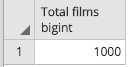
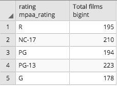

# Module 7 Class 2: Filtering with Joins

## Overview

Before class, walk through this week's Challenge assignment in office hours; then, in class, the students will dive deeper into queries with aggregates, grouping, and ordering. 

The main focus of today's class is performing more complex SQL queries that use joins with `GROUP BY` and `ORDER BY` clauses, that are filtered with the `WHERE` clause, and that apply aggregate functions to group records and filtered tables. Students will also be introduced to the `DISTINCT ON` clause, which will help them with the Challenge. The `DISTINCT ON` clause will return non-duplicate or distinct values from a SQL query.  

## Learning Objectives

By the end of class, students will be able to:

* Perform SQL queries using `GROUP BY` and `ORDER BY`
* Perform SQL queries using aggregate functions 
* Perform SQL queries using multiple joins to filter data

- - -

## Instructor Notes

The activities in this class will complement Lessons **7.3.4: Use Count, Group By, and Order By** through **7.3.6: Create a Tailored List**.  The students will benefit from these activities if they‘ve progressed through these lessons, which cover the following concepts, techniques, and tasks:  

* Use the `COUNT()` function in a SQL query
* Group and order data in a SQL query
* Use joins to combine records from two or more tables
* Filter SQL queries using multiple joins with the `WHERE` clause


## Slides

[SQL Day 2 slideshow](https://docs.google.com/presentation/d/1AlwTfIojjdYlO_w6tYZRI9id9-UM1RqsEa3w61hsWPM/edit?usp=sharing)

## Student Resources

Share the following [activity resources](https://2u-data-curriculum-team.s3.amazonaws.com/data-viz-online-lesson-plans/07-Lessons/7-2-Student_Resources.zip) with the students. 

- - - 

## Before Class

### 0. Office Hours

| Activity Time: 0:30       |  Elapsed Time:     -0:30  |
|---------------------------|---------------------------|

<details>
  <summary><strong>📣 Instructor Do: Challenge Instruction Walkthrough</strong></summary>

Let the students know that the first few minutes of Office Hours will include a walkthrough of the Challenge requirements and rubric, as well as helpful tips they need in order to be successful.

Open the Challenge in Canvas and go through the high-level instructions and requirements with your class. Be sure to check for understanding.

Open the Rubric in Canvas and go through the Mastery column with your class and show how it maps back to the requirements for each deliverable. Be sure to check for understanding.

Review the following tips to ensure clarity on the Challenge:

The first part of the assignment, **Deliverable 1: The number of retiring employees by title**, requires them to create three tables and may be a bit challenging.

* For the first table:
  * They'll need to retrieve the `emp_no`, `first_name`, and `last_name` columns from the employees table, and the `title`, `from_date`, and `to_date` columns from the titles table.

  * Then, they'll need to join the two tables on the primary key.

  * Filter the data for those employees born between January 1, 1952, and December 31, 1955, and export the table as a CSV file.

* Since there are duplicate entries for some employees, they'll need to create a second table that has only the most recent title for each employee.

  * For this table, we have provided the learners with [starter code](../../../01-Assignments/07-Employee_Database/Resources/Employee_Challenge_starter_code.sql) to help them get started.

  * First, they'll need to retrieve the `emp_no`, `first_name`, `last_name`, and `title` columns from the first table.

  * Then, they'll need to get the first occurrence of the employee number for each set of rows defined by the `ON ()` clause by using the `DISTINCT ON` statement. We have provided a hint that links to documentation on how to use the `DISTINCT ON` statement.

  * After sorting the data in ascending order by the employee number and descending order by the last date (i.e., `to_date`) of the most recent title, the table should be exported as a CSV file.

* For the last table, they'll need to retrieve the number of titles from the second table, group the data by titles, sort by the number of titles in descending order, and export the table as a CSV file.

The second part of the challenge, **Deliverable 2: The eligible employees for the mentorship program** requires learners to use two `INNER JOIN` statements and the `DISTINCT ON` statement.

* First, they'll need to retrieve the `emp_no`, `first_name`, `last_name`, and `birth_date` columns from the employees table, the `from_date` and `to_date` columns from the department employee table, and the `title` column from the titles table.

* They'll need to use the `DISTINCT ON` statement to get the first occurrence of the employee number for each set of rows defined by the `ON ()` clause.

* Next, they'll need to use two `INNER JOIN` statements. The first will join the employees and the department employee tables on the primary key, and the second will join the employees and the titles tables on the primary key.

* After joining the tables, they'll need to filter the data on the `to_date` column to get current employees, and then filter again for employees whose birth dates are between January 1, 1965 and December 31, 1965.

* Finally, they'll need to order the table by the employee number and export the table as a CSV file.

For **Deliverable 3: A written report for the employee database analysis**, the students will be writing a report in the repository README.md file based on their analysis, just like they did in the previous modules.

In the **Results** section, the students need to provide a bulleted list with four major points from the retirement titles and the mentorship eligibility tables. They are encouraged to use images of their tables to support their results.

In the **Summary** section, the students need to provide a high-level summary that addresses the questions below, and then provide two additional queries or tables that can be created that will provide more insight for the upcoming "silver tsunami".

  * How many roles will need to be filled as the "silver tsunami" begins to make an impact?
  * Are there enough retirement-ready employees who are qualified to mentor the next generation of Pewlett Hackard employees in their department?

Encourage your class to begin the Challenge as soon as possible, if they haven’t already, and to use the Learning Assistants channel and the remainder of Office Hours with their instructional team for help as they progress through their work. If they feel like they need context to understand documentation or instructions throughout the week, this is where they can get it.

Open the floor to discussion and ensure to answer any questions they may have about the Challenge requirements before moving onto other areas of interest.

</details>

<details>
  <summary><strong>📣  Instructor Do: Office Hours</strong></summary>

For the remaining time, remind the students that this is their time to ask questions and get assistance from their instructional staff as they’re learning new concepts and working on the Challenge assignment.

Expect that students may ask for assistance. For example: 

* Challenge assignment 
* Further review on a particular subject
* Debugging assistance
* Help with computer issues
* Guidance with a particular tool

</details>


- - - 

## During Class 

### 1. Getting Started

| Activity Time:       0:10 |  Elapsed Time:      0:10  |
|---------------------------|---------------------------|

<details>
  <summary><strong>📣 1.1 Instructor Do: Foundation Setting (0:05)</strong></summary>

* Welcome students to class.

* Direct students to post individual questions in the Zoom chat to be addressed by you and your TAs at the end of class.

* Open the slideshow and use slides 1-7 to walk through the foundation setting with your class.

* **This Week - SQL:** Talk through the key skills that students will learn this week, and let them know that they are continuing to build on their data analyst skills. 

* **Today's Objectives:** Now, outline the concepts covered in today's lesson. Remind students that they can find the relevant activity files in the “Getting Ready for Class” page in their course content. 

</details>

<details>
  <summary><strong>🎉 1.2 Everyone Do: Check-In (0:05)</strong></summary>

* Ask the class the following questions and call on students for the answers:

    * **Q:** How are you feeling about your progress so far?

    * **A:** We are adding to our SQL skill set. It's important to look back and see what we accomplished, and acknowledge that it's a lot! It’s also okay to feel overwhelmed as long as you don’t give up. The more you practice, the more comfortable you'll be coding.
    
    * **Q:** How comfortable do you feel with this topic? 

    * **A:** Let's do "fist to five" together. If you are not feeling confident, hold up a fist (0). If you feel very confident, hold up an open hand (5).

</details>


<sub>[Having issues with this section? Report a bug!](https://bit.ly/3osCfkf)</sub>


### 2. Import Pagila Database

| Activity Time:       0:15 |  Elapsed Time:      0:25  |
|---------------------------|---------------------------|

<details>
  <summary><strong>📣 2.1 Instructor Do: Pagila Database Setup (0:15)</strong></summary>

* Explain to the class that today's activities will require a few tables to be imported into a database. The data is taken from the [MySQL Sakila Database](https://dev.mysql.com/doc/sakila/en/). There is the [Pagila database](https://github.com/devrimgunduz/pagila) that is similar to Sakila but is compatible with PostgreSQL. There are two options for importing the tables, the schema or CSV options. Use the schema option first, and if any students run into issues, have them use the CSV option.

* Make sure the students have downloaded and can open the [Resources](Activities/01-Evr_Import_Data/Resources) folder from the AWS link, which includes the following:
  * The [Database CSVs](Activities/01-Evr_Import_Data/Resources/CSVs)
  * The [schema.sql](Activities/01-Evr_Import_Data/Resources/schema.sql) code to create the tables using the CSV option
  * The [pagila-schema.sql](Activities/01-Evr_Import_Data/Resources/pagila-schema.sql) code to create the tables using the schema option 
  * The [pagila-insert-data.sql](Activities/01-Evr_Import_Data/Resources/pagila-insert-data.sql) to add the data to the tables using the schema option.

#### Using the schema option to create the database
 
* Walk through the following steps with the students:

  * From pgAdmin, create a database named `rental_db`.

  * Open the Query Tool for the newly created `rental_db`.

  * Have the students copy the [pagila-schema.sql](Activities/01-Evr_Import_Data/Resources/pagila-schema.sql) and run the code to create the needed tables.

  * Next, have the students copy the [pagila-insert-data.sql](Activities/01-Evr_Import_Data/Resources/pagila-insert-data.sql). **Note:** This may take a few minutes due to the amount of data. As long as no errors pop up, the data will be uploaded.

* While the database is being created and the data is uploading, the TAs should check-in on students and assist them with any issues. 

* If any students have trouble or encounter any problems creating the database using the schema option, have them use the CSV option.

#### Using the CSV option option to create the database

* Walk through the following steps with the students:

  * From pgAdmin, create a database named `rental_db`.

  * Open the Query Tool for the newly created `rental_db`.

  * Have the students copy the [schema.sql](Activities/01-Evr_Import_Data/Resources/schema.sql) and run the code to create the needed tables.

  * Next, have the students right-click the **actor** table on the right-hand side, and then select **Import/Export**.

  * Import `actor.csv`.

  * Have the students repeat this process for the remaining tables.

#### Confirm that the tables are populated

* Run `SELECT * FROM <table> LIMIT 100;` to confirm that the import was successful.
Optional: Right-click the **actor** table and view the first 100 rows to check that the data was imported correctly.

</details>

<sub>[Having issues with this activity? Report a bug!](https://bit.ly/3ntaBCq)</sub>

- - -

### 3. Gregarious Aggregates

| Activity Time:       0:30 |  Elapsed Time:      0:55  |
|---------------------------|---------------------------|

<details>
  <summary><strong>📣 3.1 Instructor Do: Aggregate Functions, Aliases, and Grouping (0:10)</strong></summary>

 * You can use slides 9-14 to introduce the aggregate functions with aliases and grouping.

* First, you will demonstrate to the students how to use aggregate functions in SQL. As in Pandas, aggregate functions allow for calculations on a set of values and return a singular value. 

* Some of most commonly used aggregates are `AVG`, `COUNT`, `MIN`, `MAX`, and `SUM`. 

* Aggregates are often combined with `GROUP BY`, `HAVING`, and `SELECT`. 

* Use the code from the [02-Ins_Aggregates/Solved/query.sql](Activities/02-Ins_Aggregates/Solved/query.sql) file for this demonstration. 

* First, demonstrate how to use the `COUNT()` function. 
  
  * Select the `rental_db` database in pgAdmin and open a Query window.

  * Run `SELECT * FROM film;` and count the number of rows.

  * Run `SELECT COUNT(film_id) FROM film;` and explain the following:

    * Using `COUNT()` is an easier way to count the rows.

    * The `COUNT()` function is an aggregate.

      

* Now that the number of `film_id` entries has been counted, it's easy to see a total of 1,000 films.

* Point out that the name of the field returned is `count bigint`, which doesn't describe the column accurately, but Postgres has a way to change the column names and make them more descriptive:

  * Run the following:

    ```sql
    SELECT COUNT(film_id) AS "Total films"
    FROM film;
    ```

* Explain the following:

  * `AS 'Total films'` is a technique called *aliasing*.

  * Aliasing creates an `alias`, or a new name for the column.

  * Using an alias does not change the table or the database in any way. Aliasing is only a measure taken for convenience, used to view a column or to create shortcuts for columns or other data.

    

* The `COUNT()` function is great to see the number of movies, but it isn't informative enough when searching for the number of specific ratings, like G or PG-13. This is where `GROUP BY` comes into play.

* Run the following code:

  ```sql
  SELECT rating, COUNT(film_id) AS "Total films"
  FROM film
  GROUP BY rating;
  ```

* Explain the following:

  * The `GROUP BY` method will first group by the column indicated.

  * Aggregates are used to get the values for any columns not included in the `GROUP BY` clause.

  * Here, the `COUNT()` function will count the `film_id` for each `rating`.

    

* Explain that we can aggregate data in other ways besides counting. For example, *sum*, *average*, *min*, and *max* are all valid aggregate functions to apply to the data.

* **Q:** Ask the class how to query the average rental period for *all* movies. 

* **A:** You can run the following query to demonstrate:

  ```sql
  SELECT AVG(rental_duration)
  FROM film;
  ```

* To demonstrate how to add an alias to the `AVG()` function, run the following:

  ```sql
  SELECT AVG(rental_duration) AS "Average rental period"
  FROM film;
  ```

* To put it all together, run the following query, showing how to `GROUP BY` rental duration, get the average `rental_rate`, and give it an alias.

  ```sql
  SELECT  rental_duration, AVG(rental_rate) AS "Average rental rate"
  FROM film
  GROUP BY rental_duration;
  ```

    

  * **Q:** Ask for a student volunteer to explain the query.

  * **A:** Movies that can be rented for three days cost an average of $2.82 to rent, movies that can be rented for four days cost an average of $2.97 to rent, and so on.

* SQL can also return the rows that contain the minimum values and maximum values in a column using `MIN()` and `MAX()`, respectively.

```sql
  -- Find the rows with the minimum rental rate
  SELECT  rental_duration, MIN(rental_rate) AS "Min rental rate"
  FROM film
  GROUP BY rental_duration;

  -- Find the rows with the maximum rental rate
  SELECT  rental_duration, MAX(rental_rate) AS "Max rental rate"
  FROM film
  GROUP BY rental_duration;
```

* Mention that these aggregate functions calculate and retrieve data, but they do not *alter* the data. That is, they do not modify the database.

* Explain that there are many other aggregate functions students can research. Send out [Postgres functions](https://www.tutorialspoint.com/postgresql/postgresql_useful_functions.htm) to the class for future reference.

* Send out the [02-Ins_Aggregates/Solved/query.sql](Activities/02-Ins_Aggregates/Solved/query.sql) file for students to refer to later.

* Ask the class the following questions and call on students for the answers:

    * **Q:** Where have we used this before?

    * **A:** The `COUNT` function was covered in Lesson 7.2.4. The other aggregate functions haven't been covered in this module, but you may see them later. 

    * **Q:** How does this activity equip us for the Challenge?

    * **A:** We will have to use the `COUNT` function in the Challenge.

    * **Q:** What can we do if we don't completely understand this?

    * **A:** We can refer to the lesson plan and reach out to the instructional team for help.

* Answer any questions before moving on to the student activity.
</details>

<details>
  <summary><strong>✏️ 3.2 Student Do: Gregarious Aggregates (0:15)</strong></summary>

* You can use slides 15-17 to introduce this activity.

* In this exercise, the students will practice writing queries that use aggregate functions, grouping, and aliases.

* Make sure the students can download and open the [instructions](Activities/03-Stu_GregariousAggregates/README.md) and the [aggregate_queries_starter.sql](Activities/03-Stu_GregariousAggregates/Unsolved/aggregate_queries_starter.sql) file from the AWS link. 

* Go over the instructions in the README and then divide students into breakout groups of 3-5. They should work on the solution by themselves but can reach out to others in their group for tips.

* Let students know that they may be asked to share and walk through their work at the end of the activity.


</details>

<details>
  <summary><strong>⭐ 3.3 Review: Gregarious Aggregates (0:05)</strong></summary>

* Once time is complete, ask for volunteers to share their solution. Remind them that it is perfectly alright if they didn't complete the activity. 

* To encourage participation, you can ask the students to help you write the queries to extract the data from the table.  

* If there are no volunteers, open pgAdmin, paste the code from `aggregate_queries.sql` into the editor, and explain the following:

  * Postgres uses double quotes for table and column names, and single quotes for string constants.

  * `GROUP BY` is similar to the `groupby` operation in Pandas.

  * `SELECT` without aggregates can only choose the columns in the `GROUP BY` clause.

* Send out the [aggregate_queries.sql](Activities/03-Stu_GregariousAggregates/Solved/aggregate_queries.sql) file for students to refer to later.

* Answer any questions before proceeding to the next activity.

</details>

<sub>[Having issues with this activity? Report a bug!](https://bit.ly/3ntYViA)</sub>

- - -

### 4. Movies Ordered By

| Activity Time:       0:30 |  Elapsed Time:      1:25  |
|---------------------------|---------------------------|

<details>
  <summary><strong>📣 4.1 Instructor Do: Order By Aggregates (0:10)</strong></summary>

 * You can use slides 18-23 to introduce this activity.

* In this demonstration, you will show students how to order the results when using aggregate functions.  

* Explain that aggregate functions return the results in a random order. This can be tough when trying to find the top or bottom numerical results.

* Use the code from the [04-Ins_Order_By/Solved/query.sql](Activities/04-Ins_Order_By/Solved/query.sql) file for this demonstration. 

* Open pgAdmin and explain the following:

  * Postgres has a clause or statement called `ORDER BY` that will resolve the random order of the results when using aggregate functions. When `ORDER BY` is added at the end of a query, the results will be sorted in ascending order by default. 

    ```sql
    SELECT rental_rate, AVG(length) AS "avg length"
    FROM film
    GROUP BY rental_rate
    ORDER BY "avg length";
    ```

  * Postgres will add a lot of digits after the decimal. 

    
  
  * To reduce the numbers of digits after the decimal, we can use the `ROUND()` function. This takes the parameters, `ROUND(<value>, <number of decimal places>)`, which round the value down to the specified number of decimal places.

    ```sql
    SELECT rental_rate, ROUND(AVG(length),2) AS "avg length"
    FROM film
    GROUP BY rental_rate
    ORDER BY "avg length";
    ```

  * To organize the results in descending order, we can add the `DESC` command after the `ORDER BY` statement.  

    ```sql
    SELECT rental_rate, ROUND(AVG(length),2) AS "avg length"
    FROM film
    GROUP BY rental_rate
    ORDER BY "avg length" DESC;
    ```

  * By using the `LIMIT` clause, we can specify the number of records to be displayed. 

    ```sql
    SELECT rental_rate, ROUND(AVG(length),2) AS "avg length"
    FROM film
    GROUP BY rental_rate
    ORDER BY "avg length" DESC
    LIMIT 5;
    ```

* Send out the [04-Ins_Order_By/Solved/query.sql](Activities/04-Ins_Order_By/Solved/query.sql) file for students to refer to later.

* Ask the class the following questions and call on students for the answers:

    * **Q:** Where have we used this before?

    * **A:** The `ORDER BY` statement was covered in Lesson 7.3.4.

    * **Q:** How does this activity equip us for the Challenge?

    * **A:** We will have to use the `ORDER BY` statement and `DESC` command in the Challenge.

    * **Q:** What can we do if we don't completely understand this?

    * **A:** We can refer to the lesson plan and reach out to the instructional team for help.

* Answer any questions before moving on to the student activity.

</details>

<details>
  <summary><strong>🎉  4.2 Everyone Do: Movies Ordered By (0:20)</strong></summary>

* You can use slides 24-25 to introduce this activity.

* In this activity, students will use `ORDER BY` in combination with other SQL methods to query and order the tables.

* Make sure the students can download and open the [instructions](Activities/05-Evr_Order_By/README.md) and the [pagila_orderby_starter.sql](Activities/05-Evr_Order_By/Unsolved/pagila_orderby_starter.sql) file from the AWS link. 

* Open the [instructions](Activities/05-Evr_Order_By/README.md) and open pgAdmin.

* Have the students begin working on the first query for a few minutes. 

* Once time is up, ask for volunteers to help you write the query to get the number of actors’ first names in descending order.

* If there are no volunteers, begin writing the query, asking for assistance along the way, and make sure to discuss the following point:

  * The `actor` table is grouped by `first_name`, with an aggregate taking the count, and then given an alias of `actor count`. The query is then ordered in descending order by the count.

* Next, give the students a few minutes to attempt to write a query to select the average duration of movies by rating. 

* When time is up, ask for volunteers to share their query. If there are no volunteers, begin writing the query, asking for assistance along the way, and make sure to discuss the following point:

  * The `ROUND` function is used to limit the results to two decimal places.

* Let the students continue to work on writing a query to select the top-ten movie replacement costs and group by the length of the movie in minutes. 

* Ask for volunteers to share their query. If there are no volunteers, begin writing the query, asking for assistance along the way, and make sure to cover the following point:

  * `LIMIT 10` is added to the end of the query to return the top 10 results.

* Finally, let the students work on the bonus for a few minutes. If students are struggling, point out the following: 

  * We can use the following query to get all the cities based on `country_id`. 

    ```sql
    SELECT *
    FROM city
    WHERE country_id = 44;
    ```

* When time is up, ask for volunteers to help you write the query to get the number of cities in each country in descending order.

* If there are no volunteers, begin writing the query, asking for assistance along the way, and make sure to cover the following points:

  * First, we count the number of times a country appears in the `city` table. 
  * Next, we `JOIN` the `country` and `city` tables on the `country_id`.  
  * Then, we `GROUP BY` the `country` from the `country` table.
  * Finally, the results are sorted by the count of countries in descending order.

* Ask the class the following questions and call on students for the answers:
    
    * **Q:** What can we do if we don't completely understand this?

    * **A:** You can reach out to the instructional staff for assistance.

* Send out the [pagila_orderby_query.sql](Activities/05-Evr_Order_By/Solved/pagila_orderby_query.sql) file for students to refer to later.

* Answer any questions before proceeding to the next activity.


</details>

<sub>[Having issues with this activity? Report a bug!(https://bit.ly/35mJqmx)</sub>

- - -


### 5. Distinct Queries 

| Activity Time:       0:30 |  Elapsed Time:      1:55  |
|---------------------------|---------------------------|

<details>
  <summary><strong>📣 5.1 Instructor Do: Introduction to Distinct Queries (0:10)</strong></summary>
  
* **Important:** Let the students know that the SQL statements covered in this demonstration and student activity will help them with the Employee Database Challenge.

 * You can use slides 26-28 to introduce this activity.

* Explain that, in a supply chain database, you will often have more than one order for each customer, and you may be asked to retrieve the details of the latest order for each customer. 

* Use the code from the [06-Ins_Distinct_Queries/Solved/distinct_query.sql](Activities/06-Ins_Distinct_Queries/Solved/distinct_query.sql) file for this demonstration. 

* For example, we can retrieve all the movies a customer rented and when they rented them, and then order them so we get the latest rental date. However, we retrieved 16,044 rows and many orders for each customer.

  ```sql
  SELECT customer_id, inventory_id, rental_date
  FROM rental
  ORDER BY customer_id, rental_id DESC;
  ```

  

* Using the `DISTINCT` statement, which returns the different values in the `ORDER BY` statement, we still retrieve 16,044 rows.

  ```sql
  SELECT DISTINCT customer_id, inventory_id, rental_date
  FROM rental
  ORDER BY rental_date;
  ```

  

  * We can check to see if there are unique customers by adding a `WHERE` clause for a specific `customer_id`. 

* Run the following query to show the students that using the `DISTINCT` statement above doesn't help us get the lastest rental for each customer, even though it may look like it does. 

  ```sql
  SELECT DISTINCT customer_id, inventory_id, rental_date
  FROM rental
  WHERE customer_id = 130
  ORDER BY rental_date;
  ```

* However, Postgres has a statement called `DISTINCT ON ()` that allows us to retrieve distinct values in an `ORDER BY` statement. 

* When we run the following query, we can retrieve the latest rental for each customer by passing `customer_id` in the parentheses of the `DISTINCT ON ()` statement. 

  ```sql
  SELECT DISTINCT ON (customer_id) customer_id, rental_date
  FROM rental
  ORDER BY customer_id, rental_date DESC;
  ```

  

  * The results of the query returns 599 rows, which is the number of customers in the customer table.  We can confirm that there are 599 customers by running the following query:

  ```sql
  SELECT COUNT(*) 
  FROM customer;
  ```

* Let the students know that `DISTINCT ON ()` is specific to PostgreSQL and is not compatible with other databases, like MySQL.  

* Send out the [06-Ins_Distinct_Queries/Solved/distinct_query.sql](Activities/06-Ins_Distinct_Queries/Solved/distinct_query.sql) file for students to refer to later.

* Ask the class the following questions and call on students for the answers:

    * **Q:** Where have we used this before?

    * **A:** `DISTINCT` and `DISTINCT ON ()` were not covered in the module. 

    * **Q:** How does this activity equip us for the Challenge?

    * **A:** We will need to use the `DISTINCT ON ()` statement in the Challenge.

    * **Q:** What can we do if we don't completely understand this?

    * **A:** We can refer to the lesson plan and reach out to the instructional team for help.

* Answer any questions before moving on to the student activity.

</details>

<details>
  <summary><strong>✏️ 5.2 Student Do: Distinct Queries (0:15)</strong></summary>

 * You can use slides 30-32 to introduce this activity.

* In this exercise, the students will practice writing queries using `DISTINCT ON ()` with joins and filtering with the `WHERE` clause.

* Make sure the students can download and open the [instructions](Activities/07-Stu_Distinct_Queries/README.md) and the [distinct_on_queries_starter.sql](Activities/07-Stu_Distinct_Queries/Unsolved/distinct_on_queries_starter.sql) file from the AWS link. 

* Go over the instructions in the README and then divide students into breakout groups of 3-5. They should work on the solution by themselves but can reach out to others in their group for tips.

* Let students know that they may be asked to share and walk through their work at the end of the activity.


</details>

<details>
  <summary><strong>⭐ 5.3 Review: Distinct Queries (0:05)</strong></summary>

* Once time is complete, ask for volunteers to share their solution. Remind them that it is perfectly alright if they didn't complete the activity. 

* To encourage participation, you can ask the students to help you write the queries to extract the data from the table.  

* If there are no volunteers, open pgAdmin, paste the code from [distinct_on_queries.sql](Activities/07-Stu_Distinct_Queries/Solved/distinct_on_queries.sql) into the editor, and explain the following:

  * For the first query, we select the unique `customer_id` from the `rental` table in the `DISTINCT ON ()` statement, and the first and last name and email from the `customer` table, and the `rental_date` from the rental table.

  * We join the `rental` and `customer` tables on the `customer_id`. 

  * Finally, we `ORDER BY` the `customer_id` and `rental_date` and sort in descending order. 

  * For the second query, we select the unique film `title` from the `film` table in the `DISTINCT ON ()` statement and select the film `title` and `rental_date`. 

  * We join the `inventory` and `rental` table on the `inventory_id`, and then join the `film` and `inventory` table on the `film_id`. 

  * Finally, we `ORDER BY` the `title` and `rental_date` and sort in descending order.

  * For the bonus, we select the `film_id` and `title` from the `film` table, then use the `WHERE` clause to find the `film_id` that is **NOT IN** the selection of the `film_id` in the `inventory` table query. 

* Send out the [distinct_on_queries.sql](Activities/07-Stu_Distinct_Queries/Solved/distinct_on_queries.sql) file for students to refer to later.

* Answer any questions before ending class.

</details>

<sub>[Having issues with this activity? Report a bug!](https://bit.ly/2XlchmV)</sub>

- - -

### 6. Ending Class 

| Activity Time:       0:05 |  Elapsed Time:      2:00  |
|---------------------------|---------------------------|

<details>
  <summary><strong>📣  6.1 Instructor Do: Review </strong></summary>

* Before ending class, review the skills that were covered today and mention where in the module these skills are used. 
  * Creating a database was covered in **Lesson 7.2.1**.
  * Creating tables in a database was covered in **Lesson 7.2.2**.
  * Importing data into tables was covered in **Lesson 7.2.3**.
  * The `COUNT` function was covered in **Lesson 7.2.4**.
  * The `DISTINCT ON ()` statement was covered in the **07-Stu_Distinct_Queries** activity and will be needed to complete the Challenge.

* Answer any questions the students may have.

</details>

<sub>[Having issues with this section? Report a bug!](https://bit.ly/35EOCT5)</sub>

- - - 

---
© 2021 Trilogy Education Services, LLC, a 2U, Inc. brand.  Confidential and Proprietary.  All Rights Reserved.
