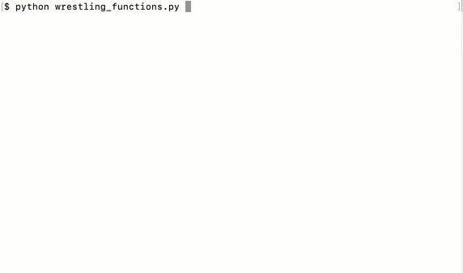

# Module 8 Class 1: Extract, Transform, Load

## Overview

This week, we will be introducing the Extract, Transform, Load (ETL) process. In this unit, students will learn to use Python functions, list comprehensions, and regular expressions, as well as how to move data through a pipeline.

In today's class, students will learn about Python functions and more advanced lambda functions. They will then learn how to create lists from list comprehensions before getting an introduction to regular expressions (RegEx).

## Learning Objectives

By the end of class, students will be able to:

* Create functions to avoid repeated code.
* Create lambda functions and use them to replace regular functions.
* Expand on list comprehensions by adding in conditional statements.
* Use basic regular expressions to pull apart certain text.

- - -

## Instructor Notes

* The activities in this class will complement Lessons **8.1.1 Extract, Transform, Load** through **8.3.9 Write Regular Expressions**.  The students will benefit from these activities if they‘ve progressed through these lessons, which cover the following concepts, techniques, and tasks:

* Overview of ETL
* Loading in JSON files
* Reading in CSV files
* Overview of data cleaning
* Overview of the iterative process of cleaning data
* List comprehensions
* Python functions
* Lambda functions
* Pattern matching with regular expressions


## Slides

[ETL Day 1 slideshow](https://docs.google.com/presentation/d/1s3EkD9fX44cbN52XX2HNTJoLstPMcOig7vVcFG3g7eM/edit#slide=id.gab17893448_0_2766)

## Student Resources

Share the following [activity resources]( https://2u-data-curriculum-team.s3.amazonaws.com/data-viz-online-lesson-plans/08-Lessons/8-1-Student_Resources.zip) with the students.


- - -

## Before Class

### 0. Office Hours

| Activity Time: 0:30       |  Elapsed Time:     -0:30  |
|---------------------------|---------------------------|

<details>
 <summary><strong> 📣 0.1 Instructor Do: Office Hours</strong></summary>

* Before you begin class, hold office hours. Office hours should be driven by students. Encourage students to take full advantage of office hours by reminding them that this is their time to ask questions and get assistance from instructional staff as they learn new concepts.

* Expect that students may ask for assistance. For example:

 * Further review on a particular subject
 * Debugging assistance
 * Help with computer issues
 * Guidance with a particular tool

</details>

- - -

## During Class

### 1. Getting Started

| Activity Time:       0:15 |  Elapsed Time:      0:15  |
|---------------------------|---------------------------|

<details>
 <summary><strong>📣 1.1 Instructor Do: Foundation Setting (0:10)</strong></summary>

* Welcome students to class.

* Direct students to post individual questions in the Zoom chat to be addressed by you and/or TAs at the end of class.

* Open the slideshow and use slides 1-9 to walk through the foundation setting with your class.

* **Big Picture:** This is an opportunity to zoom out and see the big picture of where they are in the program. Take a moment to mention some real world examples illustrating the value of what they're learning this week.

* **Program Pointers:** Talk through some of the key logistical things that will help students stay on track. This is an opportunity to speak to what students may need when they're at this particular point of the program.

* **This Week - ETL:** Talk through the key skills that students will be learning this week. Let the students know that they will be using Python for a majority of the course and that now is the time to cultivate their ETL skills.

* **This Week's Challenge:** For this week's Challenge, let the students know that they'll be performing the ETL process across three different data files. The students will need to use functions, list comprehension, and regular expressions during the cleaning portion of the challenge.

* **Career Connection:** Let students know how they will be using the skills covered this week throughout their careers. It's important for them to know the "why". Give examples of when they may be used in work or when you have used those skills in your workplace.

* **How to Succeed This Week:** Remind your students that they may have moments of frustration this week as they learn something complex. These moments are great for deepening their knowledge. Use the side material to outline some of the topics that they may find tricky in this module. Consider sharing something about your personal learning journey. It helps students to recognize that everyone starts somewhere and that they are not alone.

* **Today's Objectives:** Now, outline the concepts that will be covered in today's lesson. Remind students that they can find the relevant activity files in the “Getting Ready for Class” page in their course content.

</details>

<details>
 <summary><strong>🎉  1.2 Everyone Do: Check-In (0:05)</strong></summary>

* Ask the class the following questions and call on students for answers:

   * **Q:** How are you feeling about your progress so far?

   * **A:** We are starting to build your skillset, and it’s okay to feel overwhelmed as long as you don’t give up.

   * **Q:** How comfortable do you feel with this topic?

   * **A:** Let's do "fist to five" together. If you are not feeling confident, hold up a fist (0). If you feel very confident, hold up an open hand (5).

</details>

<sub>[Having issues with this activity? Report a bug!](https://bit.ly/3nHLKuL)</sub>

- - -

### 2. Functions

| Activity Time:       0:55 |  Elapsed Time:      1:10  |
|---------------------------|---------------------------|

<details>
 <summary><strong>📣  2.1 Instructor Do: Functions (0:05)</strong></summary>

* In this demonstration, you'll be reviewing functions. Open the slideshow and use slides 10-17 to facilitate welcoming class and accompany this activity.

* Open up [functions.py](Activities/01-Ins_Functions/Solved/functions.py) and explain to students that functions let us reuse blocks of code.

* Show the code to students and explain the following:

 * A function in Python begins with the keyword **def**, a uniques name for the function, and the a colon (:). You can add parameters for the function inside the parentheses, or you can leave the parentheses empty.

 * You can run a function by calling the name of the function with parentheses.

```python
# Basic Definition
def name(parameters):
   # code goes here
   return


# Simple Function with no parameters
def show():
   print(f"Hi!")


# You use parentheses to run the code in a function
show()
```

 * The parameter can be viewed as a variable that is passed to the function, and you can have more than one parameter.

 * It is important to note that the order of parameters is significant.

```python
# Functions can have more than one parameter
def make_quesadilla(protein, topping):
   quesadilla = f"Here is a {protein} quesadilla with {topping}"
   print(quesadilla)


# Supply the arguments (values) when calling the function
make_quesadilla("beef", "guacamole")
make_quesadilla("chicken", "salsa")

# @NOTE: Order is important when supplying arguments!
make_quesadilla("sour cream", "beef")
```

 * We can also specify default parameters for the function to use if none is passed in when the function is called.

```python
# We can also specify default values for parameters
def make_quesadilla(protein, topping="sour cream"):
   quesadilla = f"Here is a {protein} quesadilla with {topping}"
   print(quesadilla)


# Make a quesadilla using the default topping
make_quesadilla("chicken")

# Make a quesadilla with a new topping
make_quesadilla("beef", "guacamole")
```

 * The function can return a value that can be saved and used.

```python
# Functions can return a value
def square(number):
   return number * number


# You can save the value that is returned
squared = square(2)
print(squared)
```

 * You can also print the return value of a function.

```python
# You can also just print the return value of a function
print(square(2))
print(square(3))
```

* Send out [functions.py](Activities/01-Ins_Functions/Solved/functions.py) for students to refer later.

* Ask the class the following questions and call on the students for answers:

 * **Q:** What would happen if no argument is given when calling the `square()` function?

 * **A:** The function would return an error asking for an argument named `number`.

 * **Q:** How does this activity equip us for the Challenge?

 * **A:** We'll be creating functions to perform steps of the ETL process that will allow us to replicate the process across different sets of data files.

 * **Q:** What can we do if we don't completely understand this?

 * **A:** We can refer to the lesson plan and reach out to the instructional team for help.

</details>

<details>
 <summary><strong>🎉  2.2 Everyone Do: Wrestling With Functions (0:15)</strong></summary>

* In this activity, students are asked to create a function to search through a list of wrestlers, and to determine their win, loss, and draw percentages.

* Open the [wrestling_functions.py](Activities/02-Evr_WrestlingWithFunctions/Solved/wrestling_functions.py) file within the terminal and run the code to show the end result of the application.



* Make sure the students can download the [instructions](Activities/02-Evr_WrestlingWithFunctions/README.md), [starter code](Activities/02-Evr_WrestlingWithFunctions/Unsolved/wrestling_functions.py), and [data](Activities/02-Evr_WrestlingWithFunctions/Resources/WWE-Data-2016.csv)

* Review the instructions with the students, then let them work on their solution for 10 minutes.

* When time is up, open the [starter code](Activities/02-Evr_WrestlingWithFunctions/Unsolved/wrestling_functions.py) and ask for volunteers to help you write the function.

* If there are no volunteers, open the [wrestling_functions.py](Activities/02-Evr_WrestlingWithFunctions/Solved/wrestling_functions.py) file and walk through how to create this function, making sure to explain the following:

 * Before trying to create the function, students should start by looking through the CSV data to figure out how to calculate the total number of matches wrestled. While looking through the CSV, they should see what each index within a row refers to.

 * Get a path to the data file and store in a variable.

 ```python
 # Path to collect data from the Resources folder
 wrestling_csv = os.path.join('..', 'Resources', 'WWE-Data-2016.csv')
 ```

 * Create our function, then add variables to line up with the values we are looking for in the data.

 ```python
 # Define the function and have it accept the 'wrestler_data' as its sole parameter
 def print_percentages(wrestler_data):
    # For readability, it can help to assign your values to variables with descriptive names
    name = str(wrestler_data[0])
    wins = int(wrestler_data[1])
    losses = int(wrestler_data[2])
    draws = int(wrestler_data[3])
 ```

 * Then, use the variable to figure out the `total_wins`, `win_percent`, `loss_percent`, and `draw_percent`.

 ```python
    # Total matches can be found by adding wins, losses, and draws together
    total_matches = wins + losses + draws

    # Win percent can be found by dividing the the total wins by the total matches and multiplying by 100
    win_percent = (wins / total_matches) * 100

    # Loss percent can be found by dividing the total losses by the total matches and multiplying by 100
    loss_percent = (losses / total_matches) * 100

    # Draw percent can be found by dividing the total draws by the total matches and multiplying by 100
    draw_percent = (draws / total_matches) * 100
 ```

 * Then, print out the results.

* Ask for volunteers for how to apply the function to the file; if there are no volunteers, continue to explain the following:

 * Start by opening the data file and skipping the header.

 * Then, create a variable that asks for input of the name of the wrestler.

 ```python
    # Prompt the user for what wrestler they would like to search for
    name_to_check = input("What wrestler do you want to look for? ")
 ```

 * Once we have the input, we can loop through the data and apply our function.

 ```python
    # Loop through the data
    for row in csvreader:

        # If the wrestler's name in a row is equal to that which the user input, run the 'print_percentages()' function
        if name_to_check == row[0]:
            print_percentages(row)
 ```

* Answer any questions before moving on to the next exercise.

</details>

<sub>[Having issues with this section? Report a bug!](https://bit.ly/3cAfDsh)</sub>

<details>
 <summary><strong> 📣 2.3 Instructor Do: Lambda Functions (0:10)</strong></summary>

* In this demonstration, you'll be covering lambda functions. You may use slides 20-23 to accompany this activity.

* Another way functions can be applied is with lambda functions.

 * Lambda functions let you create functions without giving them a name; therefore, they are referred to as anonymous functions.

* Open [LambdaFunctions.ipynb](Activities/03-Ins_LambdaFunctions/Solved/LambdaFunctions.ipynb) in Jupyter Notebook and go through the code with the class.

 * Demonstrate that `square()` and `f` perform the same function. Point out that `square()` has four parts: name, parameter, code block, and a return statement, and all but name are optional. Show that the lambda function doesn’t have a name, just a parameter and return expression.

 * Show that functions can be sent as parameters to another function with `apply_function_twice`.

 * Demonstrate how lambda functions can be used on DataFrames with the `apply()` method on the `candy_df` DataFrame.

  * Boolean values can also be numerical. If a value is `False` then that is the equivalent to 0, and if a value is `True` then that is equivalent to a value of 1. So for example `row['is_fruity'] * 1` equals `True * 1` equals `1 * 1` when `row['is_fruity']` is True.

* Answer any questions before moving on to the next activity.

</details>

<details>
 <summary><strong> ✏️2.4 Students Do: Lambda Functions (0:20)</strong></summary>

* In this activity, the students will be taking pre-made functions and replicating the results using lambda functions instead.

* Make sure the students can download and open the [instructions](Activities/04-Stu_LambdaFunctions/README.md), [starter code](Activities/04-Stu_LambdaFunctions/Unsolved/LambdaFunctions.ipynb), the  [movies_metadata.csv](Activities/04-Stu_LambdaFunctions/Resources/movies_metadata.csv) file, and the [words.txt](Activities/04-Stu_LambdaFunctions/Resources/words.txt) file.

* Divide students into groups of 3-5. They should work on the solutions by themselves but can reach out to others in their group to get tips.

* Let students know that they may be asked to share and walk through their work by the end of the activity.

</details>

<details>
 <summary><strong> ⭐ 2.5 Review: Lambda Functions (0:05)</strong></summary>

* Once time is up, ask for volunteers to walk through their solution. Remind them that it is perfectly alright if they didn't finish the activity.

* To encourage participation, you can open the [starter code](Activities/04-Stu_LambdaFunctions/Unsolved/LambdaFunctions.ipynb) and ask the students to help you convert the functions to lambda functions.

* If there are no volunteers, open up [LambdaFunctions.ipynb](Activities/04-Stu_LambdaFunctions/Solved/LambdaFunctions.ipynb) in Jupyter Notebook and run through the code with the class line by line, making sure to hit upon the following points:

   * If you have time, live code how to condense the `more_than_15_words` function line by line until it’s just a function taking in a parameter and returning an expression; then, explain how to make that condensed function into a lambda function by using `lambda x: len(x.split())>15)` inside the map method.

   * Do the same for `hundredfold_return`.

   * Point out that because `contains_x` is being applied to a Pandas Series, we can use the `map()` method instead of `apply()`.

* Send out the [LambdaFunctions.ipynb](Activities/04-Stu_LambdaFunctions/Solved/LambdaFunctions.ipynb) notebook for students to refer to later.

* Answer any questions before moving on to the next activity.

</details>

<sub>[Having issues with this activity? Report a bug!](https://bit.ly/3bD8fi6)</sub>

- - -

### 3. Advanced List Comprehensions

| Activity Time:       0:25 |  Elapsed Time:      1:35  |
|---------------------------|---------------------------|

<details>
 <summary><strong> 📣 3.1 Instructor Do: Conditional List Comprehensions (0:05)</strong></summary>

* In this activity, students will expand on their knowledge of list comprehensions by adding conditional statements. You may use slides 26-30 to accompany this activity.

* Open up [ConditionalComprehensions.ipynb](Activities/05-Ins_ConditionalListComprehensions/Solved/ConditionalComprehensions.ipynb) in Jupyter Notebook and recap to students how list comprehensions work.

* Then, break down an example list comprehension that uses a conditional expression into four parts:
   * Expression
   * Element
   * Source list
   * Filter expression

* Show that we can use a conditional in the filter expression to filter the list. For example, to create a list of even numbers.

 ```python
 even_numbers = [x for x in range(100) if x % 2 == 0]
 ```

* Show that we can also use a conditional in the expression, for example, to output whether a number is even or odd.

 ```python
 ['Even' if x %2 == 0 else 'Odd' for x in range(20)]
 ```

* Show how list comprehensions can be used to filter a list of dictionaries by accessing values inside the dictionaries.

 ```python
 [candy for candy in candies if candy['has_nuts'] == False]
 ```

* We can make it easier to read by selecting the name of the value in the dictionary.

 ```python
 [candy['name'] for candy in candies if candy['has_nuts'] == False]
 ```

* Answer any questions before moving on to the student activity.

</details>

<details>
 <summary><strong> ✏️ 3.2 Students Do: Conditional List Comprehensions (0:10)</strong></summary>

* In this exercise, students will be creating lists with different conditions using list comprehensions.

* Make sure the students can download the [instructions](Activities/06-Stu_ConditionalListComprehensions/README.md) and the [starter code](Activities/06-Stu_ConditionalListComprehensions/Unsolved/ConditionalComprehensions_Unsolved.ipynb).

* Go over the instructions with the students and answer any questions before breaking the students out into groups.

* Divide students into groups of 3-5. They should work on the solution by themselves but can reach out to others in their group to get tips.

* Let students know that they may be asked to share and walk through their work at the end of the activity.

</details>

<details>
 <summary><strong> ⭐ 3.3 Review: Conditional List Comprehensions (0:05)</strong></summary>

* Once time is up, ask for volunteers to walk through their solution. Remind them that it is perfectly alright if they didn't finish the activity.

* To encourage participation, you can open the [starter code](Activities/06-Stu_ConditionalListComprehensions/Unsolved/ConditionalComprehensions_Unsolved.ipynb) and ask the students to help you write the different conditional list comprehensions.

* If there are no volunteers, open up [ConditionalComprehensions.ipynb](Activities/06-Stu_ConditionalListComprehensions/Solved/ConditionalComprehensions_Solved.ipynb) in Jupyter Notebook and run through the code with the class line by line, making certain to hit upon the following points:

 * Show students that `[x for x in range(100)]` would just return the original list. Add in the conditional `x % 3 == 0` and explain how the conditional is filtering the list comprehension.

 * Point out that in the pets example, the value returned is not necessarily the value being compared in the condition

 * Conditions can use logical operators like `and` and `or`

 * For the bonus, go through how nested inline `if` statements work.

 ```python
 ['FizzBuzz' if x % 3 == 0 and x % 5 == 0 else
    'Fizz' if x % 3 == 0 else
        'Buzz' if x % 5 == 0 else ''
            for x in range(100) if x % 3 == 0 or x % 5 == 0]
 ```

* Send out the [ConditionalComprehensions.ipynb](Activities/06-Stu_ConditionalListComprehensions/Solved/ConditionalComprehensions.ipynb) for students to refer to later.

* Answer any questions before moving on to the next activity.

</details>

<sub>[Having issues with this section? Report a bug!](https://bit.ly/39srDf0)</sub>

- - -

### 4. Basic Regex Matches

| Activity Time:       0:20 |  Elapsed Time:      1:55  |
|---------------------------|---------------------------|

<details>
 <summary><strong> 📣 4.1 Instructor Do: Basic Regex Matches (0:05 mins)</strong></summary>

* In this demonstration, let students know that they will touch on the basics of using regular expressions to find text that contains matching patterns. You may use slide 33-36 to accompany the activity.

* Open [BasicRegex.ipynb](Activities/07-Ins_BasicRegex/Solved/BasicRegex.ipynb) and go through the code with students.

 * After loading a text file into a DataFrame, we set the term to search for and store it in a variable.

 * Then, we use the method `str.contains()` to search the 'text' column for any string that contains the word 'Watson'.

 ```python
 p = 'Watson'
 sherlock_df[sherlock_df['text'].str.contains(p)]
 ```

 * We can also get more specific with our regex by searching for lines that contain a space after the word 'Watson'.

 ```python
 p = 'Watson\s'
 sherlock_df[sherlock_df['text'].str.contains(p)]
 ```

 * We can also search for a non-word character after 'Watson'.

 ```python
 p = 'Watson\W'
 sherlock_df[sherlock_df['text'].str.contains(p)]
 ```

* Answer any questions before moving on to the next activity.

</details>

<details>
 <summary><strong> 🎉  4.2 Everyone Do: Basic Regex Matches (0:15)</strong></summary>

* In this activity, the students will load in a text data set from *Alice in Wonderland* and use regex expressions to find matching text.

* Make sure the students can download and open the [instructions](Activities/08-Evr_BasicRegex/README.md), [starter code](Activities/08-Evr_BasicRegex/Unsolved/RegexMatching_Unsolved.ipynb), and [data set](Activities/08-Evr_BasicRegex/Resources/alice.txt) from the AWS link.

* Review the instructions, then let the students work on their solution for 10 minutes.

* When time is up, open up the [starter code](Activities/08-Evr_BasicRegex/Unsolved/RegexMatching_Unsolved.ipynb) and ask for volunteers to create the regex strings.

* If there are no volunteers, open up [RegexMatching.ipynb](Activities/08-Evr_BasicRegex/Solved/RegexMatching.ipynb) in Jupyter Notebook and run through the code with the class line by line, making sure to hit upon the following points:

   * `'cat'` as a regular expression will find any word containing `'cat'`, not just the word `'cat'` or words that start with `'cat'`.

   * To find words that start with `'cat'`, we need to add a space at the beginning. Just adding a space will only find the space character, whereas `'\s'` will find any whitespace character, like spaces or tabs.

   * To find just the word `'cat'`, we need to start with a space and end with a non-word character. Point out that `'\W'` with a capital W is for *non*-word characters.

* Answer any questions before ending class.

</details>

<sub>[Having issues with this section? Report a bug!](https://bit.ly/39uLwSv)</sub>

- - -

### 5. Ending Class

| Activity Time:       0:05 |  Elapsed Time:      2:00  |
|---------------------------|---------------------------|

<details>
 <summary><strong>📣  5.1 Instructor Do: Review </strong></summary>

* Before ending class, review the skills that were covered today and mention where these skills are taught in the module:
 * Working with functions and lambda functions was covered in **Lesson 8.3.4**.
 * Applying functions to the data-cleaning process was covered in **Lesson 8.3.5** through **Lesson 8.3.6**.
 * List comprehensions were covered in **Lesson 8.3.7**.
 * Applying lambda functions to the data-cleaning process was covered in **Lesson 8.3.8**.
 * Regular expressions were covered in **Lesson 8.3.9**.

* Answer any questions the students may have.

* Finally, encourage your class to begin the Challenge as soon as possible, if they haven’t already, and to use the Learning Assistants channel and pre-scheduled Office Hours with their instructional team for help as they progress through their work. If they feel like they need context to understand documentation or instructions throughout the week, this is where they can get it.

</details>

<sub>[Having issues with this section? Report a bug!](https://bit.ly/39tqNyn)</sub>

---

© 2021 Trilogy Education Services, LLC, a 2U, Inc. brand.  Confidential and Proprietary.  All Rights Reserved.
