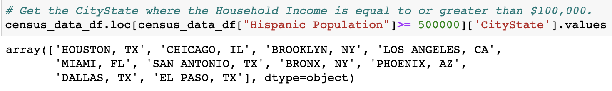
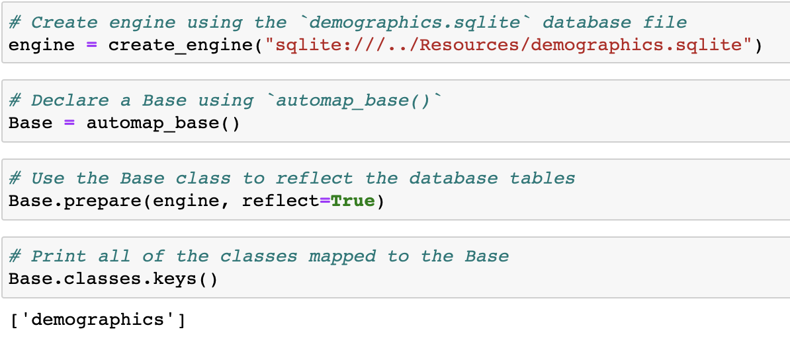

# Module 9 Class 1: Querying Databases with SQLAlchemy

## Overview

This week, we will be using the Python library SQLAlchemy to connect to a SQL database, retrieve data into Python objects, create a Flask API web app, and connect to the app to render data on a webpage. 

In today's class, students will use SQLAlchemy to connect to a database, inspect the table to get the table schema, write queries using SQL commands and Python, convert a SQLite table into a Pandas DataFrame, and plot results of a SQL query with Matplotlib.  

## Learning Objectives

By the end of class, students will be able to:

* Connect to a SQLite database using SQLAlchemy
* Perform basic SQL queries using `engine.execute()`
* Reflect existing databases
* Use the SQLAlchemy Inspector to view table names and metadata in the SQLite file
* Plot the query results from the SQLAlchemy object relational mapper (ORM)


- - -

## Instructor Notes

* The activities in this class will complement Lessons **9.0.1: Exploring Databases with SQL** through **9.3.4: Plot the Highest Number of Observations**.  The students will benefit from these activities if they‘ve progressed through these lessons, which cover the following concepts, techniques, and tasks:  

* Connect to a SQLite database using the `create.engine()` function
* Create classes using the `automap_base()` function
* Retrieve the table schema using the `prepare()` function
* Access database classes or tables with `Base.classes`
* Retrieve the table information using `Base.classes.keys()`
* Create a session to a database using `Session(engine)`
* Write SQL queries to use aggregate functions, filter, and retrieve data from a table 
* Save a SQLAlchemy query to a Pandas DataFrame 


## Slides

[SQLAlchemy Day 1 slideshow](https://docs.google.com/presentation/d/1UaT82bjYjVGkW0IQ0MqiJ6te4Hcf_LUWRQQ44fo_zKQ/edit?usp=sharing)

## Student Resources

Share the following [activity resources](https://2u-data-curriculum-team.s3.amazonaws.com/data-viz-online-lesson-plans/09-Lessons/9-1-Student_Resources.zip) with the students. 


- - - 

## Before Class

### 0. Office Hours

| Activity Time: 0:30       |  Elapsed Time:     -0:30  |
|---------------------------|---------------------------|

<details>
  <summary><strong> 📣 0.1 Instructor Do: Office Hours</strong></summary>

* Before you begin class, hold office hours. Office hours should be driven by students. Encourage students to take full advantage of office hours by reminding them that this is their time to ask questions and get assistance from instructional staff as they learn new concepts.

* Expect that students may ask for assistance. For example: 

  * Further review on a particular subject
  * Debugging assistance
  * Help with computer issues
  * Guidance with a particular tool

</details>

- - - 

## During Class 

### 1. Getting Started

| Activity Time:       0:25 |  Elapsed Time:      0:25  |
|---------------------------|---------------------------|

<details>
  <summary><strong>📣 1.1 Instructor Do: Foundation Setting (0:10)</strong></summary>

* Welcome students to class.

* Direct students to post individual questions in the Zoom chat to be addressed by you or your TAs at the end of class.

* Open the slideshow and use slides 1-12 to walk through the foundation setting with your class.

* **Big Picture:** This is an opportunity to zoom out and see the big picture of where they are in the program. Take a moment to mention some real-world examples that show the value of what they’re learning this week.

* **Program Pointers:** Talk through some of the key logistical things that will help students stay on track. This is an opportunity to speak to what students may need when they're at this particular point of the program. 

* **This Week - SQLAlchemy:** Talk through the key skills students will be learning this week. Let the students know that they will be learning a new Python library, SQLAlchemy, that uses SQL queries to facilitate the communication between Python programs and databases.. The primary focus of the Day 1 activities is to review how to connect to a SQLite database, interact with the database, and write SQL queries to retrieve data. On Day 2, the students will work on creating Python web applications using the Flask framework to connect and retrieve data from a database using SQL queries.   

* **This Week's Challenge:** For this week's Challenge, let the students know that they'll query a SQLite database table, retrieve all the temperatures for the months of June and December, create DataFrames from these queries, and then generate summary statistics.

* **Career Connection:** Let students know how they will use the skills covered this week throughout their careers. It's important for them to know the "why." Give examples of when they may be used in work or when you have used those skills in your workplace. 

* **How to Succeed This Week:** Remind your students that they may have moments of frustration this week as they learn something complex. These moments are great for deepening their knowledge. Use the side material to outline some of the topics that they may find tricky in this module. Consider sharing something about your personal learning journey. It helps students to recognize that everyone starts somewhere and that they are not alone.

* **Today's Objectives:** Now, outline the concepts that will be covered in today's lesson. Remind students that they can find the relevant activity files in the “Getting Ready for Class” page in their course content.  

</details>

<details>
  <summary><strong>🎉  1.2 Everyone Do: Check-In (0:05)</strong></summary>

* Ask the class the following questions and call on students for answers:

    * **Q:** How are you feeling about your progress so far?

    * **A:** We are starting to build your skillset. It’s also okay to feel overwhelmed as long as you don’t give up.

    * **Q:** How comfortable do you feel with this topic? 

    * **A:** Let's do "fist to five" together. If you are not feeling confident, hold up a fist (0). If you feel very confident, hold up an open hand (5).

</details>

<details>
  <summary><strong>📣 1.3 Instructor Do: Introduction to SQLAlchemy (0:10)</strong></summary>

* You can use slides 13-16 to accompany this activity. Be sure to cover the following talking points:

* Explain that SQLAlchemy is a Python library designed to work with SQL databases.

  * SQLAlchemy bridges the differences among the various dialects of SQL.

  * This means that a single Python script can use SQLAlchemy to perform the same query across the different SQL dialects, such as PostgreSQL, MySQL, SQLite, Oracle, and Microsoft SQL Server.

* Send out the link to the [SQLAlchemy](https://www.sqlalchemy.org/features.html) “Features” page, and tell the students they can refer to this page if they are interested in just how flexible and robust SQLAlchemy can be.

* Explain that SQLAlchemy is able to query a SQL database with SQL or Python:

  * When can use SQL to create a simple query, like `SELECT * FROM icecreamstore;`.

  * And, we can use Python to query a database table called `Salaries` to get the all the jobs using the dot notation, `Salaries.JobTitle`, where `JobTitle` is a column in the table. 

* Finally, explain that an ORM can also provide greater security against malicious queries such as SQL injections. Feel free to send a [link](https://www.w3schools.com/sql/sql_injection.asp) on injections, but do not dwell on the topic.

* Send the class the link to the [SQLAlchemy Documentation](http://docs.sqlalchemy.org/en/latest/dialects).

  * The page lists SQL dialects that are compatible with SQLAlchemy.

  * On the left side of the page, students can find the complete documentation of the SQLAlchemy library.

  * Students should consult this documentation to clarify any questions they may have before consulting the instructional team. They should be able to fix most bugs that they encounter by checking the documentation.

</details>

<sub>[Having issues with this activity? Report a bug!](https://bit.ly/39rpcKF)</sub>

- - -

### 2. Reading SQLite and Converting SQL to Pandas

| Activity Time:       0:10 |  Elapsed Time:      0:35  |
|---------------------------|---------------------------|

<details>
  <summary><strong>🎉 2.1 Everyone Do: Building a SQLAlchemy Connection (0:10)</strong></summary>

* In this activity, you will walk through how to create a connection to a database; to retrieve the table name, the table schema, and column names; to query all the records or a single record from a table; and, finally, to convert the SQLite table into a Pandas DataFrame. 

* Make sure the students can download and open the [Read_Census_Data_starter.ipynb](Activities/01-Evr_BasicSQL_Connection/Unsolved/Read_Census_Data_starter.ipynb) and the [Resources](Activities/01-Evr_BasicSQL_Connection/Resources) from the AWS link.  

* You can use slides 18-24 to accompany this activity. Otherwise, be sure to cover the following:

* Let the class know that, for today's class, they will only be working with SQLite databases.

  * SQLite is a SQL dialect that shares much of the same syntax as PostgreSQL, but it is entirely serverless.

  * How can a database be serverless? Well, SQLite reads and writes directly to ordinary disk files that can in turn be stored on a computer's hard drive. This makes it amazingly easy to perform tests with and to share between users.

  * SQLite is one of the packages that comes with the Anaconda installation. Have students run `sqlite3 --version` in the Terminal/GitBash to check if they have SQLite installed. If they don't have SQLite, then have them run `conda install -c anaconda sqlite` within their Terminal/GitBash.

* Once everyone has installed SQLite, have them open up [Read_Census_Data_starter.ipynb](Activities/01-Evr_BasicSQL_Connection/Unsolved/Read_Census_Data_starter.ipynb) within Jupyter Notebook and begin adding the code from the [Read_Census_Data.ipynb](Activities/01-Evr_BasicSQL_Connection/Solved/Read_Census_Data.ipynb) file for each cell, and explain the following: 

  * In order to use SQLAlchemy, certain modules from the library must be imported. For example, to create a connection to a SQL database, the `create_engine` module will need to be imported.

  * After importing in all of the necessary libraries/modules, the connection engine can finally be created using the `create_engine()` method and passing a connection string into it.

    ```python
    engine = create_engine(f"sqlite:///{database_path}")
    ```

  * Connection strings can also include the database username, password, or database name. Students can refer to the SQLAlchemy documentation to determine how to connect to other databases, but today's class will focus on SQLite.

* Once a connection engine has been created, we can get the name of the table by using the `inspect()` function and passing in the connection engine, `engine`; then, we use the `get_table_names()` method on the inspector object. 

  ```python
  inspector = inspect(engine)
  inspector.get_table_names()
  ```

* To get the table columns, we use the `get_columns()` method on the inspector object and pass in the table name, and use a `for` loop to iterate through the columns. This returns a list of dictionaries where each dictionary is the schema of a column. 

  ```python
  columns = inspector.get_columns('Census_Data')
  for column in columns:
    print(column)
  ```

    

  
  * **Q:** How would we iterate through the list of dictionaries to get the column name? 
  
  * **A:** We can write a `for` loop and get the column name from the `'name'` key.  

    

* Next, we can query the table by using the `execute()` method on the engine connection and passing in SQL commands as a string, and SQLAlchemy will pass the request onto the database. 

  * For example, to collect all of the data stored within a table on a database, simply pass `SELECT * FROM Census_Data` into the `engine.execute()` method to return all the Census data. 

    

  * Point out how the data being returned is stored within a variable and then looped through in order to print out the rows from `Census_Data`.

* We can also write a SQL query to get specific information based on a condition.

  ```python
  data = engine.execute("SELECT CityState FROM Census_Data WHERE Population >= 1000000;")
  for record in data:
    print(record)
  ```

  

* Point out that if a column name has a space, then using SQL queries will return an `OperationalError`. 

  ```python
  data = engine.execute("SELECT Household Income FROM Census_Data;")
  for record in data:
    print(record)
  ```

  

* However, we can avoid this issue by pulling the data into a Pandas DataFrame. Having SQLAlchemy integrate with Pandas allows us to perform exploratory analysis and data wrangling more efficiently. 

* First, we create a connection to our SQL database. 

  ```python
  conn = engine.connect()
  ```

* Then, we can use Pandas to pull data directly into a DataFrame with the `read_sql()` method. 

* When using the `read_sql()` method, a query string and a connection variable must be passed in. The query string is the same as the one written for SQL, while the connection variable, `conn`, can be declared using `engine.connect()`.

  ```python
  census_data_df = pd.read_sql("SELECT * FROM Census_Data", conn)
  census_data_df.head()
  ```

  

* Retrieving data using Pandas is easier when column names contain spaces. 

  

* Although SQL can always be used for basic analysis, it is often easier to use Pandas for exploratory analysis and data wrangling, such as getting summary statistics. 

  

* Answer whatever questions the class may have before moving on to the next activity.

</details>


<sub>[Having issues with this activity? Report a bug!](https://bit.ly/3t7QXQa)</sub>

- - - 

### 3. Reflecting on SQL

| Activity Time:       0:30 |  Elapsed Time:      1:05  |
|---------------------------|---------------------------|

<details>
  <summary><strong>📣 3.1 Instructor Do: Reflections (0:10)</strong></summary>

* You can use slides 25-28 to introduce the next activity. Be sure to cover the following: 

* Point out that, as data analysts, developers often need to analyze existing data sources, meaning we would need to create SQLAlchemy classes according to a table's columns by hand every single time.

  * **Note:** For brevity, and to keep the activities aligned with the module content, we are not covering how to create and use Python classes with SQLAlchemy and its class-based methodology.  

  * However, you can open this [Object Relational Tutorial link](https://docs.sqlalchemy.org/en/13/orm/tutorial.html) and show the students how to create SQLAlchemy classes according to a table's columns. 

* Instead, we will be using SQLAlchemy tools that automatically create the ORM classes from an existing database.

  * Explain that these tools will load the data from an existing database and use that data to infer how to write ORM classes for use "automagically."

  * Explain that this process is called **reflection**.

* Open up [02-Ins_Reflection/Solved/Ins_Reflection.ipynb](Activities/02-Ins_Reflection/Solved/Ins_Reflection.ipynb) within Jupyter Notebook and explain that reflecting an existing database is a simple, four-step process:

  * First, import `automap_base` from the SQLAlchemy library.

  * Then, create an `engine` against the existing database that should be reflected.

  * Next, create a `Base` by calling `Base = automap_base()`.

  * Finally, call `Base.prepare` with the `engine` from Step 2 and `reflect=True` as its parameters.

    

* Point out that `automap_base` is similar to `declarative_base` but creates a different `Base` class with additional features.

  * In particular, the class returned by `automap_base` has a `prepare` method, which will "automagically" reflect the data in an existing database.

* Explain that it is possible to view the automagically generated ORM classes by examining `Base.classes.keys()`.

  * Point out that, by default, these keys will share the name as the underlying database tables that they represent.

  * Explain that it is possible to access these classes via dot notation: `<ExampleClassName> = Base.classes.<ExampleClassName>`

* Explain that, after the database has been reflected, the autogenerated ORM classes can be used just like developers would use custom classes.

  * Demonstrate that it is possible to interact with the database using these autogenerated classes in conjunction with a `session`, just as before.

    

* Send out the [02-Ins_Reflection/Solved/Ins_Reflection.ipynb](Activities/02-Ins_Reflection/Solved/Ins_Reflection.ipynb) file for students to refer to later.

* Ask the class the following questions and call on students for the answers:

    * **Q:** Where have we used this before?

    * **A:** Connecting to a database using `create_engine` and `session`, and reflecting the data were covered in Lesson 9.1.5.

    * **Q:** How does this activity equip us for the Challenge?

    * **A:** We will need to "reflect" the `hawaii.sqlite` database to complete the Challenge. 

    * **Q:** What can we do if we don't completely understand this?

    * **A:** We can refer to the lesson plan and reach out to the instructional team for help.

* Answer any questions before moving on to the student activity.

</details>

<details>
  <summary><strong>✏️ 3.2 Students Do: Reflecting on SQL (0:15)</strong></summary>

* In this exercise, the students will practice reflecting an existing database using SQLAlchemy on a SQLite table that contains demographic data.

* Make sure the students can download and open the [instructions](Activities/03-Stu_ReflectingOnSQL/README.md), the SQLite file in the [Resources](Activities/03-Stu_ReflectingOnSQL/Resources) folder, and the [Stu_Reflection_starter.ipynb](Activities/03-Stu_ReflectingOnSQL/Unsolved/Stu_Reflection_starter.ipynb) file from the AWS link. 

* Go over the instructions in the README, then divide students into breakout groups of 3-5. They should work on the solution by themselves but can reach out to others in their group for tips.

* Let students know that they may be asked to share and walk through their work at the end of the activity.

</details>

<details>
  <summary><strong>⭐ 3.3 Review: Reflection on SQL (0:05)</strong></summary>

* Once time is complete, ask for volunteers to share their solution. Remind them that it is perfectly alright if they didn't complete the activity. 

* To encourage participation, you can ask the students to help you write the queries to extract the data from the table.  

* If there are no volunteers, open up the [03-Stu_ReflectingOnSQL/Solved/Stu_Reflection.ipynb](Activities/03-Stu_ReflectingOnSQL/Solved/Stu_Reflection.ipynb) solution file going through the code line by line and explaining the points below:

  * `Base` is instantiated with `automap_base` as opposed to `declarative_base`. `Base.prepare()` is then called, passing in the SQL connection engine and the keyword argument `reflect=True` in order to create a reflection of the existing database.

  * A list of all reflected tables can be collected using `Base.classes.keys()`.

  * The class associated with a given table can be collected by referencing the appropriate property within `Base.classes`.

    

  * For the bonus, `group_by` allows us to "collapse" results that share a particular column value, and then `count` can be used to count the number of rows returned by the query.

  * First, the query creates a set for each demographic location that appears within the database; it then counts the number of sets returned, which yields the number of unique locations represented in the database.

    

* Ask the class the following questions and call on students for the answers:
    
    * **Q:** How would you print out all of the table data?

    * **A:** You would use the following code snippet:. 

        ```python
        data = engine.execute("SELECT * FROM demographics")
        for record in data:
          print(record)
        ```
  
    * **Q:** What can we do if we don't completely understand this?

    * **A:** Review the previous activity or reach out to the instructional staff.

* Send out the [03-Stu_ReflectingOnSQL/Solved/Stu_Reflection.ipynb](Activities/03-Stu_ReflectingOnSQL/Solved/Stu_Reflection.ipynb) file for students to refer to later.

* Answer any questions before proceeding to the next activity.

</details>

<sub>[Having issues with this activity? Report a bug!](https://bit.ly/3t4lHSm)</sub>

- - -

### 4. Salary Exploration

| Activity Time:       0:25 |  Elapsed Time:      1:30  |
|---------------------------|---------------------------|

<details>
  <summary><strong>📣 4.1 Instructor Do: SQLAlchemy Exploration (0:05)</strong></summary>

* You can use slides 31-35 to introduce the next activity and go over the following information.

* When we reflect a database to collect the classes, it would be helpful to know what information is being stored in the table.

  * In the first activity, we used the `inspect()` function to get the table and column schema, which allows us to get the column names and perform queries. 

  * When we reflect a database, we can also retrieve the table metadata using `Metadata()` and `Table()` objects. 

* In this demonstration, you'll compare how to get the table column names using the `inspect()` function, and the `Metadata()` and `Table()` objects. Then, you'll show them how to query the table using SQL commands and Python. 

* Open up [04-Ins_Exploration/Solved/Ins_Exploring.ipynb](Activities/04-Ins_Exploration/Solved/Ins_Exploring.ipynb) within Jupyter Notebook and go over the code line by line.

  * First, we import two new modules,`MetaData` and `Table`, with the `create_engine` and `inspect` modules.
  
  * Next, we use SQLAlchemy ORM to reflect and map the table, and print all the classes. 
  
  * The `inspect()` function is used to connect to the database. 
  
  * Then, we collect the columns within a table inside of the connected database, using `get_columns(<Table Name>)` and passing the name of the table through as a parameter; we then loop through the columns and print out their names and type using `column["name"]` and `column["type"]`.

    

  * We can also get the column metadata using the `Metadata()` and `Table()` objects.

  * First, create a variable to hold the `Metadata()` object. 

  * Next, create a variable to hold the `Table()` object. The `Table()` object takes four parameters: the name of the table, the  `Metadata()` object reference variable, and the `autoload=True` and `autoload_with=engine` arguments. 

    ```python
    table = Table('dow', metadata, autoload=True, autoload_with=engine)
    ```
    
    * With the `autoload=True` and `autoload_with=engine` arguments, we don't have to define the columns. These arguments will allow us to reflect the schema into the `metadata` object and store a reference to the table in the `table` variable.  

  * We apply the `keys()` method on the column object of the `table` variable to get the column names. 

   

  * To get the column types, you press the tab key and add the column name to the `column` object. 

    

  * Using SQL commands, we can query the table using the `execute()` method on the engine connection. 

  * And, using Python, we can query the table using the `query()` method on the `session` object. 

* Send out the [04-Ins_Exploration/Solved/Ins_Exploring.ipynb](Activities/04-Ins_Exploration/Solved/Ins_Exploring.ipynb) file for students to refer to later.

* Ask the class the following questions and call on students for the answers:

    * **Q:** Where have we used this before?

    * **A:** The `query()` method on the `session` object was covered in Lesson 9.1.5.

    * **Q:** How does this activity equip us for the Challenge?

    * **A:** We will need to "reflect" the `hawaii.sqlite` database to complete the Challenge. 

    * **Q:** What can we do if we don't completely understand this?

    * **A:** We can refer to the lesson plan and reach out to the instructional team for help.

* Answer any questions before moving on to the student activity.

</details>

<details>
  <summary><strong>✏️ 4.2 Students Do: Salary Exploration (0:15)</strong></summary>

* In this activity, students will explore a SQLite database of salaries from San Francisco by using the `inspect()` function, `Metadata()` and `Table()` objects, and querying the table using SQL commands and Python. 

* Make sure the students can download and open the [instructions](Activities/05-Stu_SalaryExplore/README.md), the SQLite file in the [Resources](Activities/05-Stu_SalaryExplore/Resources) folder, and the [Stu_Salary_Explorer_starter.ipynb](Activities/05-Stu_SalaryExplore/Unsolved/Stu_Salary_Explorer_starter.ipynb) file from the AWS link. 

* Go over the instructions in the README, and then divide students into breakout groups of 3-5. They should work on the solution by themselves but can reach out to others in their group for tips.

* Let students know that they may be asked to share and walk through their work at the end of the activity.

</details>

<details>
  <summary><strong>⭐ 4.3 Review: Salary Exploration (0:05)</strong></summary>

* Once time is complete, ask for volunteers to share their solution. Remind them that it is perfectly alright if they didn't complete the activity. 

* To encourage participation, you can ask the students to help you write the queries to extract the data from the table.  

* If there are no volunteers, open up the solution in [Stu_Salary_Explorer.ipynb](Activities/05-Stu_SalaryExplore/Solved/Stu_Salary_Explorer.ipynb), going through the code line by line and pointing out the following:

  * A list of all of the reflected tables are collected using `Base.classes.keys()`.

  * The `inspect()` function is used to connect to the database, and we get the columns using `get_columns('Salaries')`.

    

  * The `Metadata()` is created, and a variable to hold the `Table()` object is created. 

  * The `keys()` method is used to get the column names.

    

  * To get all the job titles where the Total Pay is greater than or equal to $250,000, we create a variable to hold the SQL object and then iterate through each row of the results. 

    

  * To use Python to query the table, we first assign the class to the variable and then create a session. 
  
  * To get all the job titles where the Total Pay is greater than or equal to $250,000, we get the `JobTitle` from the table by using `Salaries.JobTitle` and then chain the `filter()` method to where the `TotalPay` is greater than or equal to `250000`. 

    

* Ask the class the following questions and call on students for the answers if time permits.
    
    * **Q:** How would you get all the job titles in the police department where the Total Pay is greater than or equal to $250,000?

    * **A:** You would use the following code snippet: 

        ```python
        jobs = session.query(Salaries.JobTitle).filter(Salaries.JobTitle.like('%POLICE%')).filter(Salaries.TotalPay >= 250000)
        for job in jobs:
          print(job))
        ```
  
    * **Q:** What can we do if we don't completely understand this?

    * **A:** Review the previous activity or reach out to the instructional staff.

* Send out the [05-Stu_SalaryExplore/Solved/Stu_Salary_Explorer.ipynb](Activities/05-Stu_SalaryExplore/Solved/Stu_Salary_Explorer.ipynb) file for students to refer to later.

* Answer any questions before proceeding to the next activity.

</details>

<sub>[Having issues with this activity? Report a bug!](https://bit.ly/3t5aGjH)</sub>

- - -

### 5. Working with Dates

| Activity Time:       0:25 |  Elapsed Time:      1:55  |
|---------------------------|---------------------------|

<details>
  <summary><strong>📣 5.1 Instructor Do: Dates (0:05)</strong></summary>

* You can use slides 39-42 to introduce the next activity and go over the following:

  * This activity will be a demonstration of working with dates in SQLAlchemy.

  * Times and dates have traditionally been trickier to manipulate than integers or decimals in programming.

    * For example, you may add or subtract dates in seconds, then convert the results from seconds to days, months, weeks, or years.

    * Python offers libraries that make handling dates easier.

  * When it comes to real-world datasets, dates and times may be stored as datetime objects, as strings, or even as integers.

    * Therefore, it is important to use tools such as Python's `datetime` library to parse, convert, compare, and filter by dates in a database.

* Open [06-Ins_Dates/Ins_Dates.ipynb](Activities/06-Ins_Dates/Solved/Ins_Dates.ipynb) and review how to query dates using SQLAlchemy.

* The database used in this activity deals with stock prices across the Dow Jones index over a period of time.

* After setting up and reflecting the SQL database into Python objects with SQLAlchemy, show how to query the first date in the table:

  

  * To show the latest date, order the dates in descending order and query the first result.

* Explain that it is also possible to filter for dates greater or less than (i.e., after or before)) a given date:

  

* Next, go over the Python `datetime` library.


  

  * `date.date` or `date.datetime` can be used to retrieve and format dates and datetimes in ISO format.

* Difference in time can also be calculated with `timedelta`:

  

* Demonstrate that it's possible to query a date using the `datetime` library, then use the results in a SQLAlchemy filter:

  

* Finally, demonstrate extracting a specific parameter, such as date, week, or hour, from a datetime object:

  

  * Here, only the date (20th) is parsed out.

  * Open up the [strftime and strptime code formats](https://docs.python.org/3/library/datetime.html#strftime-and-strptime-format-codes) to show the different code formats to get a specific date, year, month, day, etc. 

* Optionally, show the final example, which demonstrates SQLAlchemy's `func.strftime` method:

  

* Send out the [06-Ins_Dates/Ins_Dates.ipynb](Activities/06-Ins_Dates/Solved/Ins_Dates.ipynb) file for students to refer to later.

* Ask the class the following questions and call on students for the answers:

    * **Q:** Where have we used this before?

    * **A:** Calculating the difference in time using `timedelta` was covered in Lesson 9.2.1.

    * **Q:** How does this activity equip us for the Challenge?

    * **A:** We will need to get the difference in time using `timedelta` in the Challenge. 

    * **Q:** What can we do if we don't completely understand this?

    * **A:** We can refer to the lesson plan and reach out to the instructional team for help.

* Answer any questions before moving on to the student activity.


</details>

<details>
  <summary><strong>🎉 5.2 Everyone Do: Dates (0:20)</strong></summary>

In this activity, students will practice working with dates, both in SQLAlchemy and with the `datetime` library. The instructions are included as comments in the notebook file.

* Make sure the students can download and open the [instructions](Activities/07-Evr_Dates/README.md), [Evr_Dates_starter.ipynb](Activities/07-Evr_Dates/Unsolved/Evr_Dates_starter.ipynb), and the [Resources](Activities/07-Evr_Dates/Resources) from the AWS link.  

* Go over the [instructions](Activities/07-Evr_Dates/README.md) with the students, then have them get the code running up to the "Analysis" section. 

* Once time is up, ask for volunteers to help you write the query to get the stocks and average of the opening, high, low, and closing prices for all stocks in the month of May, sorted by stock name.

* SQLAlchemy's `func.avg` method is used to obtain the average prices of opening, high, low, and closing prices. 

* Point out that they can pass the select list of columns, `sel`, in the `session.query()` method using the asterisk. 

  ```python
  sel = [Dow.stock,
       func.avg(Dow.open_price),
       func.avg(Dow.high_price),
       func.avg(Dow.low_price),
       func.avg(Dow.close_price)]
  may_averages = session.query(*sel).\
  ```
* Then, we filter the results by the month of May using the `strftime` code `%m` and setting the `Dow.date == "05"`. 
  
  ```python
      filter(func.strftime("%m", Dow.date) == "05").\
  ```

* Next, we group and sort by the stock. 

  ```python
    group_by(Dow.stock).\
    order_by(Dow.stock).all()
  ```

  

* Next, give the students a few minutes to attempt to add the May averages into a DataFrame and then plot the DataFrame. 

* When time is up, ask for volunteers to share their solution. If there are no volunteers, copy and paste the code from the solution file and run the cell. Be sure to discuss the following point:

  * Average prices for May are pulled into a Pandas DataFrame and then plotted with Matplotlib:

    ```python
    df = pd.DataFrame(may_averages, columns=['stock', 'open_avg', 'high_avg', 'low_avg', 'close_avg'])
    df.set_index('stock', inplace=True)
    df.plot.bar()
    plt.tight_layout()
    plt.show()
    ```

    

* For the bonus, begin importing the dependencies, then ask the students how they would do the following:

  * Get the high-low PTP stock values using `high_price - low_price`.

  * Use a `datetime.date` object in the query to filter for dates after `2011-05-31`.

* If there are no volunteers or students are struggling to come up with the correct code, copy and paste the code from the solution file and run the cell. Make sure to discuss the following point:

  * A variable is created to hold the date of `2011-05-31` as a datetime object.

  * In the `query()` method, we get the result of the difference between the `high_price` and the `low_price`, and the `date`.

  * Then, we filter where the `date` is after `2011-05-31`.

  * Finally, we filter the stocks that are only "IBM". 

    ```python
    import datetime as dt

    date = dt.datetime(2011, 5, 31)

    results = session.query(Dow.high_price - Dow.low_price).\
                      filter(Dow.date > date).filter(Dow.stock == 'IBM').all()
    ```

  * Next, show the students how we use numpy's `ravel` method to unpack the query's list of tuples into a list of PTP values.
  
    ```python
    ptps = list(np.ravel(results))
    ```
  
  * Ask the students how to unpack the query's list of tuples into a list of PTP values using a list comprehension. 

  * If there are no answers, then show them that we can do the following:

    ```python
    # List comprehension solution
    ptps = [result[0] for result in results]
    ```

  * Finally, ask the students how we create the box plot. 
  
  * If there are no answers, then copy and paste the code from the solution file, run the cell, and point out that the `patch_artist=True` attribute will fill the box plot with color. 

    ```python
      fig, ax = plt.subplots()

      x = range(len(ptps))
      ax.boxplot(ptps, patch_artist=True)
      ax.set_title('IBM PTPs')
      fig.tight_layout()
      plt.show()
    ```

    

* Send out the [Evr_Dates.ipynb](Activities/07-Evr_Dates/Solved/Evr_Dates.ipynb) solution file for students to refer to later.

* Answer any questions before ending class.

</details>

<sub>[Having issues with this activity? Report a bug!](https://bit.ly/3ciu8Ub)</sub>

- - - 

  
### 6. Ending Class 

| Activity Time:       0:05 |  Elapsed Time:      2:00  |
|---------------------------|---------------------------|

<details>
  <summary><strong>📣  6.1 Instructor Do: Review </strong></summary>

* Before ending class, review the skills that were covered today and mention where in the module these skills are used. 
  * Connecting to a database using `create_engine` and `session`, and reflecting the data were covered in **Lesson 9.1.5**.
  * The `query()` method on the `session` object was covered in **Lesson 9.1.5**.
  * The difference in time using `timedelta` was covered in **Lesson 9.2.1**.

* Answer any questions the students may have.

</details>

<sub>[Having issues with this section? Report a bug!](https://bit.ly/2NEPTDb)</sub>

---

© 2021 Trilogy Education Services, LLC, a 2U, Inc. brand.  Confidential and Proprietary.  All Rights Reserved.