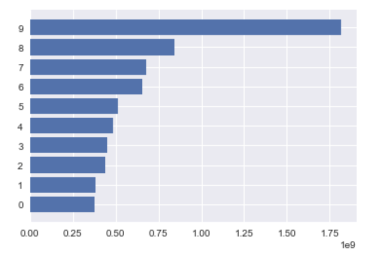
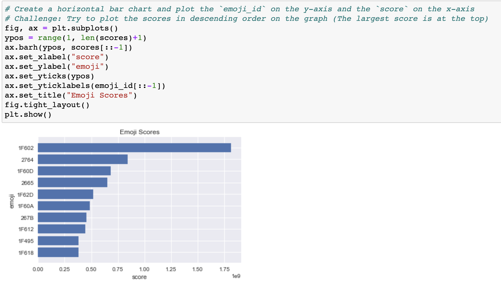
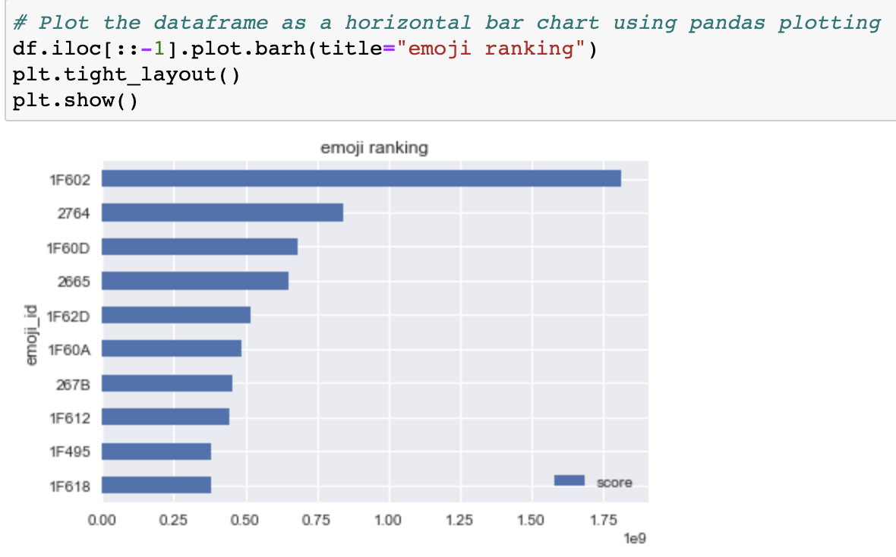
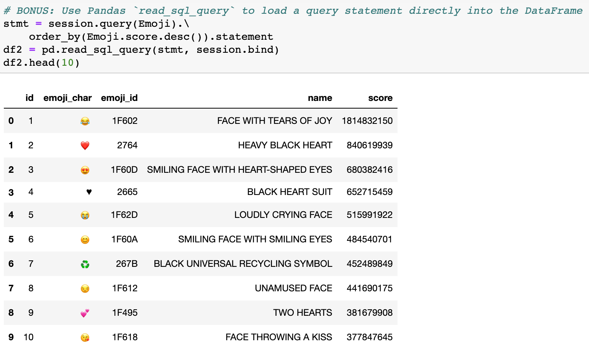
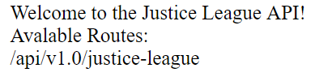

# Module 9 Class 2: Working with Flask to Create a Web Application 

## Overview

Before class, walk through this week's Challenge assignment in office hours; then, in class, the students will learn to create a Flask web application, connect the app to a SQL database using SQLAlchemy, and render data onto a webpage.

The main focus of today's class is to have the students connect to a SQL database using SQLAlchemy, retrieve data into Python objects using SQLAlchemy, create a Flask API web app,  connect the Flask app to a SQL database, and render the data onto a webpage. 

## Learning Objectives

By the end of class, students will be able to:

* Connect to a database using SQLAlchemy
* Use Flask to create and run a server 
* Retrieve data from a database using GET requests
* Execute database queries on behalf of the client
* Return jsonified query results from API endpoints and populate a webpage 

- - -

## Instructor Notes

The activities in this class will complement Lessons **9.4.1: Incorporate Flask into Data Analysis** through **9.5.6: Statistics Route**. The students will benefit from these activities if they‘ve progressed through these lessons, which cover the following concepts, techniques, and tasks:  

* Create a Flask web application with API routes
* Jsonify data from a SQL database
* Render jsonified data to a webpage through the Flask application


## Slides

[SQLAlchemy Day 2 slideshow](https://docs.google.com/presentation/d/1TbU28y1xrItfWk9UkxIo6u5nXXx0RRoHkmPYpyaWWlY/edit?usp=sharing)

## Student Resources

Share the following [activity resources](https://2u-data-curriculum-team.s3.amazonaws.com/data-viz-online-lesson-plans/09-Lessons/9-2-Student_Resources.zip) with the students. 

- - - 

## Before Class

### 0. Office Hours

| Activity Time: 0:30       |  Elapsed Time:     -0:30  |
|---------------------------|---------------------------|

<details>
  <summary><strong>📣 Instructor Do: Challenge Instruction Walkthrough</strong></summary>

Let the students know that the first few minutes of Office Hours will include a walkthrough of the Challenge requirements and rubric, as well as helpful tips they need in order to be successful.

Open the Challenge in Canvas and go through the high-level instructions and requirements with your class. Be sure to check for understanding.

Open the Rubric in Canvas and go through the Mastery column with your class, and show how it maps back to the requirements for each deliverable. Be sure to check for understanding.

Review the following tips to ensure clarity on the Challenge:

Overall, this Challenge is one of the less difficult challenges. The first part of the assignment, **Deliverable 1: Determine the Summary Statistics for June**, requires the students to filter the `Measurement` table in the `hawaii.sqlite` database to retrieve all the temperatures for the month of June as a list, create a DataFrame from the list, and generate the summary statistics from the DataFrame.

The students should not find the tasks in this challenge to be difficult because they have already covered how to filter the SQLite table, save the query results to a DataFrame, and generate summary statistics. Therefore, we have not provided any hints for the students. 

We have provided the students with [starter code](../../../01-Assignments/09-Surfs_Up/Resources/SurfsUp_Challenge_starter_code.ipynb) to help them get going.

  * First, they'll need to write a query that filters the `date` column from the `Measurement` table to retrieve all the temperatures for the month of June.

  * Then, they'll need to convert the June temperatures to a list and create a DataFrame from the list of June temperatures.

  * After creating a DataFrame, they'll need to generate the summary statistics from the DataFrame. 

The second part of the challenge, **Deliverable 2: Determine the Summary Statistics for December**, requires them to filter the `Measurement` table in the `hawaii.sqlite` database to retrieve all the temperatures for the month of December as a list, create a DataFrame from the list, and generate the summary statistics from the DataFrame. 

For this part of the challenge, they'll need to refactor their code to get all the temperatures for the month of December, and perform the same steps as in Deliverable 1 to generate the summary statistics.

In the [starter code](../../../01-Assignments/09-Surfs_Up/Resources/SurfsUp_Challenge_starter_code.ipynb), we have added steps after Deliverable 1 where students will need to add code to complete this part of the Challenge. 

For **Deliverable 3: A written report for the statistical analysis**, the students will be writing a report in the repository README.md file based on their analysis, just like they did in the previous modules.

In the **Results** section, the students need to provide a bulleted list with three major points from the two analysis deliverables. They are encouraged to use images to support their results.

In the **Summary** section, the students need to provide a high-level summary of the results and two additional queries that they would perform to gather more weather data for June and December. Here are some examples of additional queries they could perform:
  * What are the summary statistics for each station? And, is one location in particular more suitable for a new surf and ice cream shop business based on this data?
  * Does June or December have more rainy days? 
  * What is the precipitation for each station for June and December? Can certain locations be ruled out for a new surf and ice cream shop business based on this data?

Encourage your class to begin the Challenge as soon as possible, if they haven’t already, and to use the Learning Assistants channel and the remainder of Office Hours with their instructional team for help as they progress through their work. If they feel like they need context to understand documentation or instructions throughout the week, this is where they can get it.

Open the floor to discussion and ensure to answer any questions they may have about the Challenge requirements before moving onto other areas of interest.

</details>

<details>
  <summary><strong>📣  Instructor Do: Office Hours</strong></summary>

For the remaining time, remind the students that this is their time to ask questions and get assistance from their instructional staff as they’re learning new concepts and working on the Challenge assignment.

Expect that students may ask for assistance. For example: 

* Challenge assignment 
* Further review on a particular subject
* Debugging assistance
* Help with computer issues
* Guidance with a particular tool

</details>


- - - 

## During Class 

### 1. Getting Started

| Activity Time:       0:10 |  Elapsed Time:      0:10  |
|---------------------------|---------------------------|

<details>
  <summary><strong>📣 1.1 Instructor Do: Foundation Setting (0:05)</strong></summary>

* Welcome students to class.

* Direct students to post individual questions in the Zoom chat to be addressed by you and your TAs at the end of class.

* Open the slideshow and use slides 1-7 to walk through the foundation setting with your class.

* **This Week - SQL:** Talk through the key skills that students will learn this week, and let them know that they are continuing to build on their data analyst skills. 

* **Today's Objectives:** Now, outline the concepts covered in today's lesson. Remind students that they can find the relevant activity files in the “Getting Ready for Class” page in their course content. 

</details>

<details>
  <summary><strong>🎉 1.2 Everyone Do: Check-In (0:05)</strong></summary>

* Ask the class the following questions and call on students for the answers:

    * **Q:** How are you feeling about your progress so far?

    * **A:** We are adding to our SQL skill set. It's important to look back and see what we accomplished, and acknowledge that it's a lot! It’s also okay to feel overwhelmed as long as you don’t give up. The more you practice, the more comfortable you'll be coding.
    
    * **Q:** How comfortable do you feel with this topic? 

    * **A:** Let's do "fist to five" together. If you are not feeling confident, hold up a fist (0). If you feel very confident, hold up an open hand (5).

</details>


<sub>[Having issues with this section? Report a bug!](https://bit.ly/3qUXKe8)</sub>


### 2. Emoji Plotting

| Activity Time:       0:15 |  Elapsed Time:      0:25  |
|---------------------------|---------------------------|

<details>
  <summary><strong>🎉 2.1 Everyone Do: Emoji Plotting (0:15)</strong></summary>

* For this activity, students will pick up where they left off in the previous class: learning how to create a plot based upon the data stored within a SQLite database. Using what they have learned so far, and SQLAlchemy's documentation, they should be able to accomplish this task.

* Make sure the students can download and open the [instructions](Activities/01-Evr_EmojiPlotting/README.md), the [Evr_Plotting_starter.ipynb](Activities/01-Evr_EmojiPlotting/Unsolved/Evr_Plotting_starter.ipynb) file, and the [Resources](Activities/01-Evr_EmojiPlotting/Resources) from the AWS link.  

* Go over the [instructions](Activities/01-Evr_EmojiPlotting/README.md) with the students and answer any questions they may have.

* Have the students work on completing the "Setup," "Explore Database," and "Reflect Database and Query" sections for 5-7 minutes. Make sure to check in to see how the students are progressing.

* Once time is up, ask for volunteers to help you write the query to get the Emoji data. 

* If there are no volunteers, copy the code from the [Evr_Plotting.ipynb](Activities/01-Evr_EmojiPlotting/Solved/Evr_Plotting.ipynb) solution, add it to the appropriate cell in the `Evr_Plotting_starter.ipynb` file, and make sure to discuss the following points:

  * We use `session.query()` to begin our query and then pass `emoji_char`, `emoji_id`, and `score` inside the parentheses; then, we `order_by()` the descending `Emoji.score` and retrieve all the queried data. 

    ```python
    results = session.query(Emoji.emoji_char, Emoji.emoji_id, Emoji.score).\
    order_by(Emoji.score.desc()).all()
    ```

  * The "Top 10" `emoji_id` and `scores` are retrieved from the query by using list comprehensions to unpack the tuples from the `results` variable. 

    ```python
    emoji_id = [result[1] for result in results[:10]]
    scores = [int(result[2]) for result in results[:10]]
    ```

* Next, ask for volunteers to help write the code to plot the emoji score in descending order. If there are no volunteers, copy the code below to show them how to create a basic horizontal bar chart. 

  ```python
  fig, ax = plt.subplots()
  ypos = range(len(scores))
  ax.barh(ypos, scores[::-1])
  ax.set_yticks(ypos)
  plt.show()
  ```

  

  * Point out that to plot the results in descending order, we apply Python list slicing, `[::-1]`, to reverse the order of the list. 

* By modifying the code for plotting, we can make the chart more informative. 

    

* Next, ask for volunteers to help you write the code to load the top 10 results into a Pandas DataFrame. If there are no volunteers, copy the code below and point out the following: 

  ```python
  df = pd.DataFrame(results[:10], columns=['emoji_char', 'emoji_id', 'score'])
  df.set_index('emoji_id', inplace=True, )
  df
  ```

  * The top 10 results are retrieved using list slicing for the first 10 items; the columns of interest are added; and then the index is set to the `emoji_id`.  

* To plot the DataFrame in descending order, the order of the DataFrame is reversed using `iloc[::-1]`, and then the DataFrame is plotted with `plot.barh()`, with an appropriate title. 

    

* For the bonus, the `session.query()` is used to get all the data, which is then sorted in descending order by `Emoji.score`. The `statement` attribute is applied to the results, which will apply labels to all columns automatically.  

* Next, the statement variable, `stmt`, and the `session.bind` parameters are passed in the `read_sql_query()` function to create the DataFrame. 

    

  * Point out that we are using `session.bind` instead of `conn` where `conn = engine.connect()` because we have already made the connection to the database using `session = Session(engine)`. 

* Ask the class the following questions and call on students for the answers:
    
    * **Q:** Where have we used this before?

    * **A:** Plotting data from a SQLAlchemy query was covered in Lesson 9.3.4.

    * **Q:** What can we do if we don't completely understand this?

    * **A:** We can refer to the lesson plan and reach out to the instructional team for help.


* Send out the [Evr_Plotting.ipynb](Activities/01-Evr_EmojiPlotting/Solved/Evr_Plotting.ipynb) solution file for students to refer to later.

* Answer any questions before proceeding to the next activity.

</details>

<sub>[Having issues with this activity? Report a bug!](https://bit.ly/3qTPM54)</sub>

- - -

### 3. Hello, Web

| Activity Time:       0:30 |  Elapsed Time:      0:55  |
|---------------------------|---------------------------|

<details>
  <summary><strong>📣 3.1 Instructor Do: Introduction to Flask (0:10)</strong></summary>

* You can use slides 9-16 to introduce this demonstration.

* Remind students that the Internet is built on a model of *clients* requesting data from *servers*.

* Remind students that whoever asks for information is called a "client".

* Point out that, when a person uses an API to fetch data, we tend to consider the *person* the client.

  * Point out that, *strictly speaking*, this isn't accurate: A *program* makes the request on behalf of the person.

  * Point out that a **browser** is an example of a program that makes requests on behalf of a user.

* Point out that the same holds true for servers: A *server* is simply a process running on a remote machine that listens for, and knows how to respond to, incoming requests.

  * The point to emphasize is that a server is essentially *just a program*.

* Explain that, when we create an API for others to use, the code they write acts as a *client* to our API server.

  * Point out that we have no control over the code that our consumers write.

  * Point out that this means that, as API developers, **we do not write client code**.

* Emphasize that this means we will focus on writing the code that runs the server.

  * Remind students that this is the code responsible for retrieving and returning whatever data that users request.

* Explain that [Flask](http://flask.pocoo.org/) is the tool that we'll use to implement our server.

  * Explain that Flask is an extremely intuitive library that makes it easy to develop APIs for distributing our data.

* Remind students that servers are programs that *listen* for *requests* to particular *URLs*, or **endpoints**.

  * Explain that Flask makes it easy to create and start a server, and to define its endpoints: It takes fewer than 10 lines of code to define a functional index route!

* Open up [02-Ins_First_Steps_with_Flask/Solved/app.py](Activities/02-Ins_First_Steps_with_Flask/Solved/app.py) and explain the following:

  ```python     
  # 1. import Flask
  from flask import Flask

  # 2. Create an app, being sure to pass __name__
  app = Flask(__name__)

  # 3. Define what to do when a user goes to the index route
  @app.route("/")
  def home():
      print("Server received request for 'Home' page...")
      return "Welcome to my 'Home' page!"

  # 4. Define what to do when a user goes to the /about route
  @app.route("/about")
  def about():
      print("Server received request for 'About' page...")
      return "Welcome to my 'About' page!"

  # 5. 
  if __name__ == "__main__":
    app.run(debug=True)
  ```

* Explain that, to create a server, we simply import `Flask` (`#1`) and use it as a factory to create an `app` (`#2`).

  * Explain that, for our purposes, passing `__name__` to `Flask` is essentially mandatory. 

  * [This is an important detail](http://flask.pocoo.org/docs/0.12/quickstart/#a-minimal-application), but it's outside the scope of today's lesson: Try not to get sidetracked if students inquire about this line of code. 
  
    * For those inquiring minds, you can mention that this line of code ensures that the module was executed by us and not imported from another script. When we execute the script, Python assigns the name, `__name__`, to the script. If it is imported, it assigns the name of the `.py` file. If this statement is `True`, then `app.run()` is executed. This small piece of code allows the programmer to have control of the script, and not someone else. 

* Run the `app.py` from the terminal to show the students how the app is running on `http://127.0.0.1:5000`. 

* Open up the URL and explain how we use `@app.route` to associate an endpoint/URL (`/`, or `/about`) with the result of a function call (of `home` or `about`, respectively).

* Take a moment to go to each route in the browser again.

  * Point out that, in the *terminal*, we see the results of the `print` message *but no trace of the string we `return` to the client*.

  * Point out that, in the browser, we see the string the request handler *returns* *but no trace of the call to `print`*.

  * Use these insights to illustrate and emphasize the relationship between the *client*, which receives a request handler's return value, and the *server*, where the functions associated with the response to a request are actually executed.

* Finally, remind students about using `if __name__ == "__main__"` to define the "main" behavior of our executed file.

  * Explain that `app.run` is all we need to do to *start* the development server.

  * Explain that passing `debug=True` makes development *much* easier, but emphasize that, in production, best practices demand that `debug` *must **always** be false*.

* Send out the [02-Ins_First_Steps_with_Flask/Solved/app.py](Activities/02-Ins_First_Steps_with_Flask/Solved/app.py) file for students to refer to later.

* Ask the class the following questions and call on students for the answers:

    * **Q:** Where have we used this before?

    * **A:** Creating a Flask app with routes and running a Flask app were covered in Lesson 9.4.3.

    * **Q:** How does this activity equip us for the Challenge?

    * **A:** We won't need to create a Flask app with routes to complete the Challenge, but it’s good to have this skill in our tool belt.  

    * **Q:** What can we do if we don't completely understand this?

    * **A:** We can refer to the lesson plan and reach out to the instructional team for help.

* Take a moment to address any questions before moving on.

</details>

<details>
  <summary><strong>📣 3.2 Instructor Do: JSON APIs with jsonify (0:05)</strong></summary>

* You can use slides 18-25 to introduce this demonstration.

* All of the routes that were written in the previous activity have returned *string* responses.

* The APIs we've dealt with in this course do *not* return raw text; instead, they return JSON data.

* Fortunately, Python dictionaries map naturally to JSON.

  * Flask has a built-in method, called `jsonify`, to automatically convert a dictionary into a properly formatted JSON response.

  * Explain that although `jsonify` is not necessary as of Flask 1.1.0, it is still good practice to use `jsonify` to ensure the response is always treated appropriately.

  * However, we must `jsonify` Python lists, including a list of dictionaries as we will see later.

* Remind students that routes must return HTTP responses.

  * This means we can't simply return the dictionary itself.

  * We can use `jsonify` to create an HTTP response with the dictionary data we want to send back to the client.

* Open [03-Ins_Jsonify/Solved/app.py](Activities/03-Ins_Jsonify/Solved/app.py).

  ```python
  from flask import Flask, jsonify

  app = Flask(__name__)

  hello_list = ["Hello", "World!"]
  hello_dict = {"Hello": "World!"}
  
  @app.route("/")
  def home():
    return "Hi"
  
  @app.route("/normal")
  def normal():
    return str(hello_list)

  @app.route("/jsonified")
  def jsonified_list():
    return jsonify(hello_list)

  @app.route("/dict")
  def dictionary():
    return hello_dict

  if __name__ == "__main__":
      app.run(debug=True)
  ```

* Import `jsonify` in addition to Flask.

* The `/normal` route simply returns `hello_dict`, with no call to `jsonify`; however, Flask converts the dictionary to JSON for us.

* Run `app.py`, then navigate to `localhost:5000/normal` to demonstrate how Flask automatically jsonified the dictionary.

* Navigate to `/jsonified` and point out the working response when calling `jsonify` on a Python list.

  

* Navigate to `/dict` and point out the working response for a dictionary.

  

* Send out the [03-Ins_Jsonify/Solved/app.py](Activities/03-Ins_Jsonify/Solved/app.py) file for students to refer to later.

* Take a moment to answer any questions before moving on to the student activity.

</details>

<details>
  <summary><strong>🎉 3.3 Everyone Do: Hello, Web (0:15)</strong></summary>

* For this activity, students will create a Flask app that has three routes that render information about themselves. 

* Make sure the students can download and open the [instructions](Activities/04-Evr_Hello_Web/README.md) and the starter [app.py](Activities/04-Evr_Hello_Web/Unsolved/app.py) file from the AWS link.  

* Go over the [instructions](Activities/04-Evr_Hello_Web/README.md) with the students and answer any questions they may have.

* Have the students start working on their solutions for 5 minutes.

* Once time is up, open the unsolved [app.py](Activities/04-Evr_Hello_Web/Unsolved/app.py) and ask for volunteers to help you write the code to import Flask and create the app. 

  * Remind them that these statments are going to boilerplate for creating a Flask app.

    ```python
    # 1. Import Flask
     from flask import Flask

     # 2 Create an app
     app = Flask(__name__)
    ```

* Next, ask for a volunteer to help you create the static or index route. 

* If there is no volunteer, copy the code below and add it to the unsolved solution file, and make sure to point out that the index route is created as follows:

  ```python
  # 3. Define static routes
  @app.route("/")
  def index():
    return "Hello, world!"
  ```  

* Next, ask for a volunteer to help you create the `/about` route.

* If there is no volunteer, copy the code below and add it to the unsolved solution file, and make sure to point out that the `/about` route can be created as follows:

  ```python
  # 4. Define the about route
  @app.route("/about")
  def about():
    name = "Peleke"
    location = "Tien Shan"

    return f"My name is {name}, and I live in {location}."
  ```  

* Finally, ask if anyone can help write the code for the `/contact` route. 

* If there is no volunteer, copy the code below and add it to the unsolved solution file, and make sure to point out that the `/contact` route can be created as follows:

  ```python
  # 5. Define the contact route
  @app.route("/contact")
  def contact():
    email = "peleke@example.com"

    return f"Questions? Comments? Complaints? Shoot an email to {email}."
  ```  

* Lastly, we close the program with the executing the `main` module. 

  ```python
    if __name__ == "__main__":
      app.run(debug=True)
  ```

* Next, run the `app.py` file and go to each route, explaining that for each route:

  * We use the `@app.route` **decorator** to define a route.

  * We then define functions, `def index()`, `def about()`, and `def contact()`, to describe how the server should respond to requests to the corresponding endpoint.

  * We can use whatever names we want for these functions, which are often called **request handlers**.
  
  * Each of these endpoints simply returns a string.

* Ask the class the following questions and call on students for the answers:
    
    * **Q:** Where have we used this before?

    * **A:** Running a Flask app was covered in Lesson 9.4.3.

    * **Q:** What can we do if we don't completely understand this?

    * **A:** We can refer to the lesson plan and reach out to the instructional team for help.

* Send out the solved [app.py](Activities/04-Evr_Hello_Web/Solved/app.py) solution file for students to refer to later.

* Answer any questions before proceeding to the next activity.

</details>

<sub>[Having issues with this activity? Report a bug!](https://bit.ly/3aajvjr)</sub>

### 4. Justice League - jsonify

| Activity Time:       0:15 |  Elapsed Time:      1:10  |
|---------------------------|---------------------------|


<details>
  <summary><strong>🎉 4.1 Everyone Do: Justice League jsonify (0:15)</strong></summary>

* Make sure the students can download and open the [instructions](Activities/05-Evr_Justice_League_Jsonify/README.md) and the starter [app.py](Activities/05-Evr_Justice_League_Jsonify/Unsolved/app.py) file from the AWS link.  

* Explain that for this activity, the students need to create a server configured to send welcome text at its index endpoint, and JSON data at its `api/v1.0/justice-league` endpoint.

* Run [Activities/05-Evr_Justice_League_Jsonify/Solved/app.py](Activities/05-Evr_Justice_League_Jsonify/Solved/app.py) and navigate to `localhost:5000/` in your browser to demonstrate the index route.

  

* Navigate to `localhost:5000/api/v1.0/justice-league` in your browser to demonstrate the API route.

  

* Go over the [instructions](Activities/05-Evr_Justice_League_Jsonify/README.md) with the students and answer any questions they may have.

* Have the students start working on their solutions for 5-7 minutes.

* Once time is up, open the unsolved [app.py](Activities/05-Evr_Justice_League_Jsonify/Unsolved/app.py) and ask for volunteers to help you write the code to create the welcome route and the `api/v1.0/justice-league` route. 

* If there is no volunteer, copy the code below, add it to the unsolved solution file, and make sure to point out that we've defined a list of character dictionaries, called `justice_league_members`, in the beginning of the file.

  ```python
    @app.route("/api/v1.0/justice-league")
    def justice_league():
        """Return the justice league data as json"""

        return jsonify(justice_league_members)
  ```

* Next, ask for a volunteer to help you create the index (`"/"`) route.

* If there is no volunteer, copy the code below and add it to the unsolved solution file, and make sure to point out that the index route,  `/`, can be created as follows:

  ```python
    @app.route("/")
    def welcome():
      return (
        f"Welcome to the Justice League API!<br/>"
        f"Available Routes:<br/>"
        f"/api/v1.0/justice-league"
    )
  ```

* Have everyone run their `app.py` file to make sure it is working. Troubleshoot any issues before moving on. 

* Explain the following:

  * For the index route, we simply open the browser URL to `http://127.0.0.1:5000`. 
  
  * To implement the `/api/v1.0/justice-league` route, we simply define a route that returns `jsonify(justice_league_members)`. 

  * We are using `jsonify` specifically because APIs should return JSON, and we want to ensure our code turns our dictionary into a JSON response.

  * Our endpoint starts with `/api` to indicate to consumers that the response will contain *data*.

  * By convention, the `/api` route should *always* return data (JSON, in this case).

  * **Q:** Ask the students to explain why we would want to use `jsonify` in our `/api/v1.0/justice-league` route.

  * **A:** When we use `jsonify`, our data will be formatted as JSON data, which is the preferred delivery format over HTTP from a GET request. 

  * Point out that we've defined a list called `justice_league_members`.

  * This data will be stored in memory when we run our server. This list serves as a "database" of sorts because, after all, it contains our application's data!

  * Point out that "real" applications are typically connected to a *database* because they run more data than can be loaded into memory.

  * **Q:** Ask the students if they have any ideas about how you can hook this application up to a database.

  * **A:** Explain that if we simply replace the code where we define `justice_league_members` with code to connect to a SQLAlchemy database, we can turn this server into a truly *database-backed API*!

  * Explain that we'll proceed in two steps:

    * Use variable paths to collect "user input."

    * Connect the application to a database.

* Send out the solved [app.py](Activities/05-Evr_Justice_League_Jsonify/Solved/app.py) solution file for students to refer to later.

* Answer any questions before proceeding to the next activity.

</details>

<sub>[Having issues with this activity? Report a bug!](https://bit.ly/3abnkFh)</sub>

- - -

### 5. Routes With Variable Rules

| Activity Time:       0:20 |  Elapsed Time:      1:30  |
|---------------------------|---------------------------|

<details>
  <summary><strong>📣 5.1 Instructor Do: Routes with Variable Paths (0:05)</strong></summary>

* You can use slides 29-32 to introduce this demonstration.

* Explain that in the previous activity, the `/api/v1.0/justice-league` API is only capable of returning the *entire* Justice League dataset.

* It would be better if users could specify a particular character of interest.

* Explain that, ideally, consumers would be able to specify a character of interest in the URL, and then expect either:

  * A JSON response with the character data if it's in the data set; or

  * A JSON response with error information, indicating that the server couldn't find the character that the user requested.

* Run [Activities/06-Ins_Variable_Rule/Solved/app.py](Activities/06-Ins_Variable_Rule/Solved/app.py), then navigate to [localhost:5000](http:127.0.0.1/). The root path lists the available routes. Visit each route below and contrast the results:

  * [/api/v1.0/justice-league](http:127.0.0.1:5000/api/v1.0/justice-league)

  * [/api/v1.0/justice-league/Arthur%20Curry](http://127.0.0.1:5000/api/v1.0/justice-league/Arthur%20Curry)

* The response at the second endpoint is *just* the data for Aquaman, *without* the rest of the data in `justice_league_members`.

* Explain that `%20` is how we represent the space character within a URL.

* Open [Activities/06-Ins_Variable_Rule/Solved/app.py](Activities/06-Ins_Variable_Rule/Solved/app.py) and point out that we've added a route.

```python
@app.route("/api/v1.0/justice-league/<real_name>")
def justice_league_character(real_name):
    """Fetch the Justice League character whose real_name matches
       the path variable supplied by the user, or a 404 if not."""

    canonicalized = real_name.replace(" ", "").lower()
    for character in justice_league_members:
        search_term = character["real_name"].replace(" ", "").lower()

        if search_term == canonicalized:
            return character

    return {"error": f"Character with real_name {real_name} not found."}, 404
```

* Send out the [06-Ins_Variable_Rule/Solved/app.py](Activities/06-Ins_Variable_Rule/Solved/app.py) file for students to refer to later.

* Ask the class the following questions and call on students for the answers:

    * **Q:** Where have we used this before?

    * **A:** Creating Flask routes was covered in Lessons 9.5.3 through 9.5.6. 

    * **Q:** How does this activity equip us for the Challenge?

    * **A:** We won't need to create a Flask app with routes to complete the Challenge, but it’s good to have this skill in our tool belt.  

    * **Q:** What can we do if we don't completely understand this?

    * **A:** We can refer to the lesson plan and reach out to the instructional team for help.

* Take a moment to address any questions before moving on to the student activity.

</details>

<details>
  <summary><strong>✏️ 5.2 Students Do: Routes with Variable Rules (0:10)</strong></summary>

* In this exercise, the students will create API routes with using a variable path that will allow someone to get information for a specific character based on their "superhero" name.

* Make sure the students can download and open the [instructions](Activities/07-Stu_Variable_Rule/README.md) and the starter [app.py](Activities/07-Stu_Variable_Rule/Unsolved/app.py) file from the AWS link. 

* Go over the instructions in the README.

* Run [07-Stu_Variable_Rule/Solved/app.py](Activities/07-Stu_Variable_Rule/Solved/app.py) and demonstrate its `/api/v1.0/justice-league/superhero/<superhero>` endpoint by visiting  [localhost:5000/api/v1.0/justice-league/superhero/superman](http://127.0.0.1:5000/api/v1.0/justice-league/superman) (**but try to keep the URL hidden**).

* Point out that this route is functionally identical to the `<real_name>` route from before, but it allows users to specify the desired value of the character's `superhero` key instead.

* Take a moment to answer any questions before dividing the students into breakout groups of 3-5. They should work on the solution by themselves but can reach out to others in their group for tips.

* Let students know that they may be asked to share and walk through their work at the end of the activity.

</details>

<details>
  <summary><strong>⭐ 5.3 Review: Routes with Variable Rules (0:05)</strong></summary>

* Once time is complete, ask for volunteers to share their solution. Remind them that it is perfectly alright if they didn't complete the activity. 

* To encourage participation, you can ask the students to help you write the code for the API route to get info for a specific character based on their "superhero" name.  

* If there are no volunteers, open up the solution [07-Stu_ReflectingOnSQL/Solved/app.py](Activities/07-Stu_Variable_Rule/Solved/app.py) and go through the code, explaining the points below:

  * The new route is identical to the `<real_name>` route from the instructor demonstration; the only difference is that we substitute `<real_name>` with `<superhero>`, and we add `superhero` before defining the parameter to capture.

  * Explain that we must extend the URL, or else the `<real_name>` and `<superhero>` routes will overlap.

  * Explain that as an alternative to defining the two *specific* routes above, we could simply define a route that takes *two* variable rules: `<key>` and `<value>`.

    ```python
    @app.route("/api/v1.0/justice-league/<key>/<value>")
    def justice_league_arbitrary_key(key, value):
        """Fetch the Justice League character whose <key> attribute has
          the value <value>."""

        for character in justice_league_members:
            if character[key] == value:
                return character

        return {"error": f"Character with key '{key}' with value '{value}' not found."}, 404
    ```

  * Point out that this generalizes the pattern evident in the preceding endpoints by abstracting the hard-coded values `real_name` and `superhero` from the URL.

* Optionally, spend a few minutes discussing the advantages and disadvantages of each approach.

* Send out the [07-Stu_ReflectingOnSQL/Solved/app.py](Activities/07-Stu_Variable_Rule/Solved/app.py) solution file for students to refer to later.

* Take a moment to answer any questions before moving on.

</details>

<sub>[Having issues with this activity? Report a bug!](https://bit.ly/2KWS4kB)</sub>

- - - 

### 6. Chinook Database Analysis

| Activity Time:       0:25 |  Elapsed Time:      1:55  |
|---------------------------|---------------------------|

<details>
  <summary><strong>📣 6.1 Instructor Do: Flask with ORM (0:10)</strong></summary>

* You can use slides 35-38 to introduce this demonstration.

* Remind students that any useful API must make queries against data sets that are too large to load into memory.

* Explain that we will now see how to perform ORM queries within their Flask routes.

* Start by running the [08-Ins_Flask_with_ORM/Solved/app.py application](Activities/08-Ins_Flask_with_ORM/Solved/app.py) and open the app in the browser [here](http:127.0.0.1:5000/). The root path will list the available routes. Visit each route and show the results.

  * [/api/v1.0/names](http:127.0.0.1:5000/api/v1.0/names)

  * [/api/v1.0/passengers](http://127.0.0.1:5000/api/v1.0/passengers)

* Next, open the [08-Ins_Flask_with_ORM/Solved/app.py](Activities/08-Ins_Flask_with_ORM/Solved/app.py) file and walk through the code.

* Explain that we start by initializing our database connection and reflecting our tables by using `automap_base`.

* Show that our root route, `/`, shows the available API routes for our application.

* Move on to the `/api/v1.0/names` route and show how queries can be performed in the route function. This query will be executed each time that we visit the route.

* Explain that we use `list` and `np.ravel` to unpack the list of tuples into a regular list of names. Feel free to replace `jsonify(all_names)` with `jsonify(results)` to show what this looks like before converting to a list.

* Next, show the `/api/v1.0/passengers` route and explain that, here, we are extracting the results into a list of dictionaries containing the `name`, `age`, and `sex` of each passenger.

* Finally, explain that we can return the JSON representation for this list of dictionary data using jsonify.

* Send out the [08-Ins_Flask_with_ORM/Solved/app.py](Activities/08-Ins_Flask_with_ORM/Solved/app.py) file for students to refer to later.

* Ask the class the following questions and call on students for the answers:

    * **Q:** Where have we used this before?

    * **A:** Creating Flask routes was covered in Lessons 9.5.3 through 9.5.6, and `np.ravel` was covered in Lesson 9.5.4. 

    * **Q:** What can we do if we don't completely understand this?

    * **A:** We can refer to the lesson plan and reach out to the instructional team for help.

* Take a moment to address any questions before moving on to the student activity.

</details>

<details>
  <summary><strong>🎉 6.2 Everyone Do: Chinook Database Analysis (0:15)</strong></summary>

* This is the final activity for the Advanced Data Storage and Retrieval Unit. The goal of this activity is to give students additional practice in analysis of databases using the SQLAlchemy ORM. Encourage the students to take their time and ask plenty of questions as they go through this.

* Explain that the students will be analyzing invoice data from the [Chinook database on GitHub](https://github.com/lerocha/chinook-database).

* Explain to the students that they will design SQLAlchemy ORM queries to answer specific questions about the invoice data.

* Make sure the students can download and open the [instructions](Activities/09-Evr_Chinook_Db_Analysis/README.md), the SQLite file in the [Resources](Activities/09-Evr_Chinook_Db_Analysis/Resources) folder, and the starter [Evr_Chinook_starter.ipynb](Activities/09-Evr_Chinook_Db_Analysis/Unsolved/Evr_Chinook_starter.ipynb) file from the AWS link. 

* Go over the [instructions](Activities/09-Evr_Chinook_Db_Analysis/README.md) with the students and answer any questions they may have.

* Have the students work for 5-7 minutes on importing their dependencies and using SQLAlchemy ORM to reflect and map the tables. Make sure to check in to see how the students are progressing.

* Once time is up, open the [Evr_Chinook_starter.ipynb](Activities/09-Evr_Chinook_Db_Analysis/Unsolved/Evr_Chinook_starter.ipynb) file and ask for volunteers to help you import the dependencies and use SQLAlchemy ORM to reflect and map the tables.

* If there are no volunteers, copy the code for these steps from the [Evr_Chinook.ipynb](Activities/09-Evr_Chinook_Db_Analysis/Solved/Evr_Chinook.ipynb) solution and add it to the appropriate cells in the `Evr_Chinook_starter.ipynb` file, making sure to discuss the following points:

  * Explain that the `import warnings` and `warnings.filterwarnings('ignore')` cell is included to ignore the warning about using `Decimal` types with SQLite.

  * Explain that we will continue to use `automap_base` to reflect our database tables.

  * Show that we create an engine to the database file `chinook.sqlite`.

  * Explain that our reflection results show that there are many tables available in the chinook dataset, as can be seen in the [model diagram](https://web.archive.org/web/20170608221426/http://chinookdatabase.codeplex.com/wikipage?title=Chinook_Schema&referringTitle=Home). However, we will only be using the `invoices` and `invoice_items` tables from this database.

  * Show the students that we start by saving a reference to the `invoices` table as `Invoices` and the `invoice_items` table as `Items`. 

* Next, ask for volunteers to help you create the `Metadata` and `Table` object to describe the `Invoices` and `Items` tables, and retrieve the columns from these tables. 

* If there are no volunteers, copy the code for these steps from the `Evr_Chinook.ipynb` solution and add it to the appropriate cells in the `Evr_Chinook_starter.ipynb` file, making sure to discuss the following points:

  * First, we create a metadata object to hold the reflected table schema. 

  * Then, we create the table objects using `autoload=True` and `autoload_with=engine` to define the columns for each table. 

  * Finally, we print out the columns from each table using the `columns.keys()` methods on each table object.

* Answer any questions before moving on. 

* Next, walk through how to create each query and explain the following:

  * To list all of the countries found in the invoices table, we use `groupby()` on the `BillingCountry` and select `Invoices.BillingCountry` to get a list of the billing countries in the table. We can also achieve this result using the `distinct` function.

  * To list the invoices totals for each billing country and sort the output in descending order, we expand on the first query by calculating the sum of the invoice total per country, `func.sum(Invoices.Total)`, and using `order_by()` to order the results by `Invoices.Total` in descending order. **Note:** we use the `desc()` function to sort in descending order.

  * To list all of the billing postal codes for the USA, we query the `BillingPostalCode` and return the billing postal codes for the USA by filtering the `BillingCountry` and then grouping by `BillingPostalCode`.

  * In order to calculate the item totals for the USA, we will need to join the `Invoices` and `Items` table by `InvoiceId` to filter by billing country. Show the students the relationship between the two tables using the database model [here](https://web.archive.org/web/20170608221426/http://chinookdatabase.codeplex.com/wikipage?title=Chinook_Schema&referringTitle=Home).

  * The final query calculates the item totals per `BillingPostalCode`. This query also requires an implicit join using `InvoiceId` and then filters by country. We group the results by `BillingPostalCode` and then order by the item totals in descending order.

* Send out the solved [Evr_Chinook.ipynb](Activities/09-Evr_Chinook_Db_Analysis/Solved/Evr_Chinook.ipynb) solution file for students to refer to later.

* Answer any questions before ending class.

</details>

<sub>[Having issues with this activity? Report a bug!](https://bit.ly/36nufKf)</sub>

- - -


### 7. Ending Class 

| Activity Time:       0:05 |  Elapsed Time:      2:00  |
|---------------------------|---------------------------|

<details>
  <summary><strong>📣  7.1 Instructor Do: Review </strong></summary>

* Before ending class, review the skills that were covered today and mention where in the module these skills are used: 
  * Plotting data from a SQLAlchemy query was covered in **Lesson 9.3.4**.
  * Creating a Flask app was covered in **Lesson 9.4.3**.
  * Running a Flask app was covered in **Lesson 9.4.3**.
  * Creating API routes was covered in **Lesson 9.4.3** and **Lessons 9.5.3-9.5.6**. 

* Let the students know that they should complete **Lesson 10.1.1: Install Your Tools** before next week so they don't have to install splinter, webdriver manager, bs4, and Mongo in class.

* Answer any questions the students may have.

</details>

<sub>[Having issues with this section? Report a bug!](https://bit.ly/2Yn5Gsx)</sub>

- - - 

© 2021 Trilogy Education Services, LLC, a 2U, Inc. brand.  Confidential and Proprietary.  All Rights Reserved.
