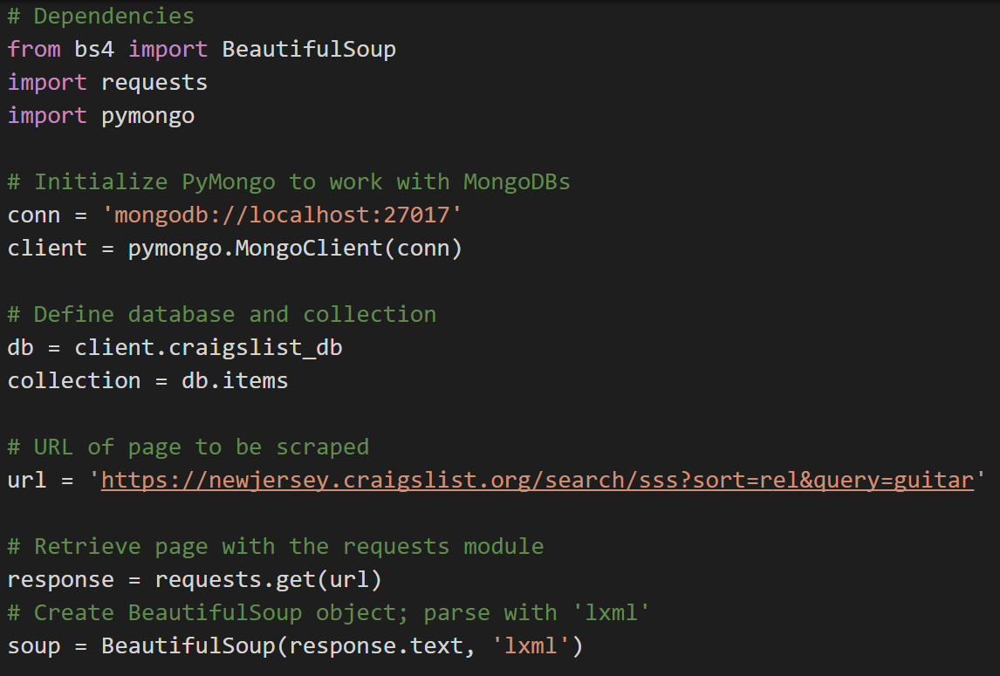
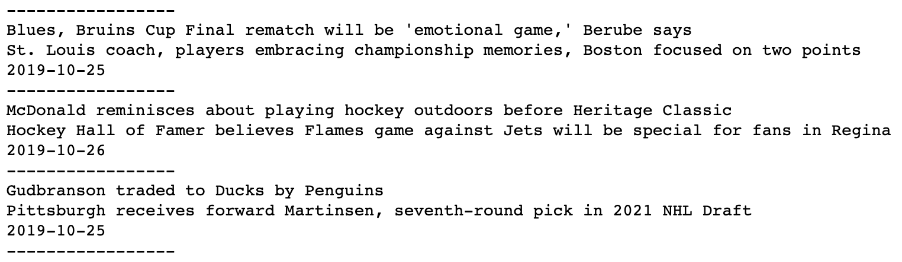
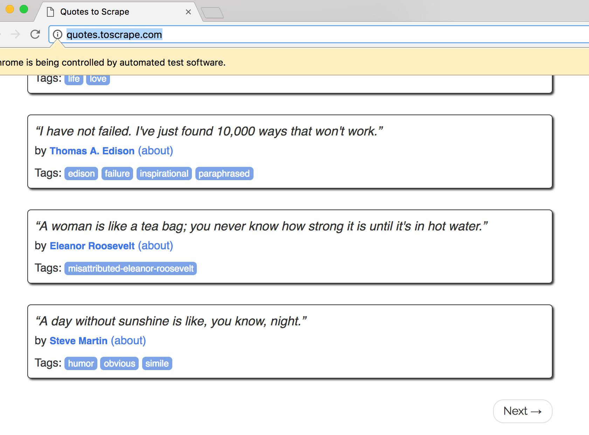

# Module 10 Class 1: Mission to Mars - Web Scraping with HTML/CSS

## Overview

This week, we will be introducing web scraping. In this unit, students will first learn the basic setup of webpages with HTML and CSS. They will then learn how to use Beautiful Soup to navigate the HTML in order to scrape out the contents that they want. Then, students will expand on this skill by using the Splinter library to automate the process and store their results in a Mongo database.

In today's class, students will need to make sure that the web-driver manager is installed into their virtual environments. They can do so by running `pip install webdriver_manager` in their environment.

## Learning Objectives

By the end of class, students will be able to:

* Read HTML
* Scrape websites with Beautiful Soup
* Store scraped data in a Mongo database
* Automate scraping using Splinter

- - -

## Instructor Notes

* The activities in this class will complement Lessons **10.1.1: Install Your Tools** through **10.3.6: Export to Python**.  The students will benefit from these activities if they‘ve progressed through these lessons, which cover the following concepts, techniques, and tasks:

* Using HTML elements

* Inspecting webpages with Chrome developer tools

* Scraping websites with Beautiful Soup

* Using Splinter to automate web scraping


## Slides

[Web Scraping Day 1 slideshow](https://docs.google.com/presentation/d/1RIIOaGg2FORoF1H4MbmAYkx2lyNacE_ESFYwl41T4q4/edit#slide=id.gab17893448_0_2766)

## Student Resources

Share the following [activity resources](https://2u-data-curriculum-team.s3.amazonaws.com/data-viz-online-lesson-plans/10-Lessons/10-1-Student_Resources.zip) with the students.


- - -

## Before Class

### 0. Office Hours

| Activity Time: 0:30       |  Elapsed Time:     -0:30  |
|---------------------------|---------------------------|

<details>
  <summary><strong> 📣 0.1 Instructor Do: Office Hours</strong></summary>

* Before you begin class, hold office hours. Office hours should be driven by students. Encourage students to take full advantage of office hours by reminding them that this is their time to ask questions and get assistance from instructional staff as they learn new concepts.

* Expect that students may ask for assistance. For example:

  * Further review on a particular subject
  * Debugging assistance
  * Help with computer issues
  * Guidance with a particular tool

</details>

- - -

## During Class

### 1. Getting Started

| Activity Time:       0:15 |  Elapsed Time:      0:15  |
|---------------------------|---------------------------|

<details>
  <summary><strong>📣 1.1 Instructor Do: Foundation Setting (0:10)</strong></summary>

* Welcome students to class.

* Direct students to post individual questions in the Zoom chat to be addressed by your and/or your TAs at the end of class.

* Open the slideshow and use slides 1-9 to walk through the foundation setting with your class.

* **Big Picture:** This is an opportunity to zoom out and see the big picture of where they are in the program. Take a moment to mention some real-world examples illustrating the value of what they're learning this week.

* **Program Pointers:** Talk through some of the key logistical things that will help students stay on track. This is an opportunity to speak to what students may need when they're at this particular point of the program.

* **This Week - Web Scraping:** Talk through the key skills students will be learning this week. Let students know they will be learning about webpage layouts with HTML and CSS, and how to scrape this data using Beautiful Soup and Splinter.

* **This Week's Challenge:** For this week's Challenge, let the students know that they'll be creating a web app that displays images of Mars’ hemispheres, complete with titles. The students will need to obtain this information by scraping a website using Splinter and Beautiful Soup then storing the data inside a Mongo database.

* **Career Connection:** Let students know how they will be using the skills covered this week throughout their careers. It's important for them to know the "why." Give examples of when they may be used in work or when you have used those skills in your workplace.

* **How to Succeed This Week:** Remind your students that they may have moments of frustration this week as they learn something complex. These moments are great for deepening their knowledge. Use the side material to outline some of the topics that they may find tricky in this module. Consider sharing something about your personal learning journey. It helps students to recognize that everyone starts somewhere and that they are not alone.

* **Today's Objectives:** Now, outline the concepts that will be covered in today's lesson. Remind students that they can find the relevant activity files in the “Getting Ready for Class” page in their course content.

</details>

<details>
  <summary><strong>🎉  1.2 Everyone Do: Check-In (0:05)</strong></summary>

* Ask the class the following questions and call on students for answers:

    * **Q:** How are you feeling about your progress so far?

    * **A:** We are starting to build your skillset. It’s also okay to feel overwhelmed as long as you don’t give up.

    * **Q:** How comfortable do you feel with this topic?

    * **A:** Let's do "fist to five" together. If you are not feeling confident, hold up a fist (0). If you feel very confident, hold up an open hand (5).

</details>

<sub>[Having issues with this activity? Report a bug!](https://bit.ly/3asxu4e)</sub>

### 2. Beautiful Soup

| Activity Time:       0:25 |  Elapsed Time:      0:40  |
|---------------------------|---------------------------|

<details>
  <summary><strong>📣 2.1 Instructor Do: Introduction to Beautiful Soup (0:05)</strong></summary>

* Let the class know that today will serve as a brief introduction to Python's Beautiful Soup library, an extremely powerful, albeit strangely named, tool for web scraping.

* Open the slideshow and use slides 10-18 to facilitate welcoming the class while covering the following points:

  * Up to this point, the class has been forced to rely on analyzing web APIs and pre-existing data sets. After today, however, students will know how to collect data from web resources that do not offer a full and convenient way to access to their data.

  * Beautiful Soup has to be installed before Python can use it. To do this, simply run `pip install bs4` within the terminal.

* You may use slides 18-25 to accompany this activity.

* For this demonstration, open up [01-Ins_SoupIntro](Activities/01-Ins_SoupIntro/Solved/IntroToSoup.ipynb) within Jupyter Notebook, going through the code within line by line with the class and answering any questions that students may have.

  * The line `from bs4 import BeautifulSoup as bs` is used to import the Beautiful Soup library into the application.

  * In this example, Beautiful Soup will be working with some basic HTML that is stored as a string. Let the class know that this is being used instead of an external HTML file at the moment.

  * A Beautiful Soup object is parsed/created using `bs(html_string, 'html.parser')`, and the object returned is assigned to the `soup` variable.

  * Remind students that the DOM, or Document Object Model, is a tree whose structure is defined by the nesting of tags. Beautiful Soup looks through this tree and then converts it to a specialized object equipped with powerful methods for traversing and searching the HTML for attributes, text, etc.

  * The `type(soup)` method being used confirms that the `soup` object created is indeed a BeautifulSoup object.

  * The `prettify()` method of the Beautiful Soup library is then used to return a formatted version of the object that is easier to read.

    

* Now, demonstrate how different parts of the HTML can be extracted using dot notation.

  * Begin by extracting the title element of the HTML document using `soup.title`. This returns the entire HTML element, including the tags themselves.

  * If the developer wants to collect only the text contained within the title element and nothing else, they can simply add `.text` to the end of their call. This will return the string surrounded by whitespace.

  * The text can be further cleaned by adding `.strip()` onto the end of the chain. Now, the text value will be on its own.

    

* Demonstrate to the class how the HTML's body can be collected, referenced, and printed to the screen.

  * Using `soup.body`, Python developers can print out the entire body of an HTML file with each element's tags included. Adding `.text` and `.strip()` to the end of the chain will further parse down the values that are returned.

  * Using the line `soup.body.p.text`, the text for only the first paragraph will be collected. Adding `.strip()` to the end of this chain will remove the whitespace as well.

    

  * The `find_all(<ELEMENT>)` method returns a list containing all of the HTML elements of a specific type. As such, every paragraph (`<p>`) element on a page can be collected using `soup.body.find_all('p')`.

  * Index numbers can then be used to access the paragraph elements in a targeted fashion, which allows developers to target more than the first instance of an element.

    

* Answer whatever questions students may have before moving on to the next activity.

</details>

<details>
  <summary><strong>✏️ 2.2 Students Do: CNN Soup (0:15)</strong></summary>

* In this activity, students will take their first web-scraping steps by taking an external HTML file, parsing it, and then printing out specific elements to the console.

* Start by opening the [template.html](Acitivities/02-Stu_CNNSoup/Resources/template.html) file in your browser and inspect the page with the DevTools to the show the HTML structure of the top ten headlines. In the inspector show the students the headlines are contained inside `<td></td>` tags and also contain child `<a></a>` tags, which is what will be needed to find in this activity.

* Show the students what their final output will look like.

  

* Make sure the students can download and open the [instructions](Activities/02-Stu_CNNSoup/README.md) and the [starter code](Activities/02-Stu_CNNSoup/Unsolved/Stu_CNN-Unsolved.ipynb) for this activity.

* Answer any questions before breaking the students out into groups.

* Divide students into groups of 3-5. They should work on the solution by themselves, but they can talk to others in their group to get tips.

* Let students know that they may be asked to share and walk through their work at the end of the activity.

</details>

<details>
  <summary><strong>⭐ 2.3 Review: CNN Soup (0:05)</strong></summary>

* Once time is up, ask for a volunteer to walk through their solution.

* To encourage participation, you can open the [starter code](Activities/02-Stu_CNNSoup/Unsolved/Stu_CNN-Unsolved.ipynb) and ask students to start scraping the HTML file.

* If there are no volunteers, open up [Stu_CNN.ipynb](Activities/02-Stu_CNNSoup/Solved/Stu_CNN.ipynb) within Jupyter Notebook and go through the code line by line with the class, answering any questions students may have and hitting upon the following points:

  * Start by creating the Beautiful Soup object.

  ```python
  # Create a Beautiful Soup object
  soup = bs(html, 'lxml')
  ```

  * Finding the `title` of the document is simple: use `soup.title.text` and the HTML file's title element will be collected.

  * To print all the paragraphs, `soup.find_all('p')` can be used before looping over the results to print their text to the console.

    

  * The final part is trickier. First review the HTML structure of the headline list in the DOM using the element inspector in DevTools. Then describe how to drill through the DOM:

    * Users should initially find all `td` elements in the HTML document and then, as they loop over them, select only cells that contain a child `anchor` element.

  * Note the use of short-circuit logic to check if `td.a` and `td.a.text` exist. The element must pass these two tests in order for its contents to be added to the headlines list.

  * Finally, since other headlines later in the page may have been caught by our code, we only loop through the first 10 to ensure we're only displaying what we targeted:

    

* Send out the [Stu_CNN.ipynb](Activities/02-Stu_CNNSoup/Solved/Stu_CNN.ipynb) notebook for students to review later.

* Answer any questions before moving on to the next activity.

</details>

<sub>[Having issues with this activity? Report a bug!](https://bit.ly/2MgYlbK)</sub>

### 3. Website Scraping

| Activity Time:       0:50 |  Elapsed Time:      1:30  |
|---------------------------|---------------------------|

<details>
  <summary><strong>📣 3.1 Instructor Do: Craig's Wishlist (0:05)</strong></summary>

* Open the slide show and use slides 29-32 to present this unit to the class.

* Explain to the class that so far they have only parsed HTML strings with Beautiful Soup. Now it is time to scrape a live website! The first site we will scrape is `craigslist.com` to find the perfect gift for a friend.

  * The goal will be to scrape the results for an item, such as a guitar, on Craigslist and return each relevant listing's title, price, and URL.

* You may use slides 32-37 to accompany this activity.

* Next, open up [Ins_Craigslist.ipynb](Activities/03-Ins_Craigslist/Solved/Ins_Craigslist.ipynb) and go through the code with the class, answering whatever questions students may have.

  * Explain how the `requests` module is used to obtain the HTML object. Beautiful Soup then parses the returned object and converts it for further use.

  ```python
  # Dependencies
  from bs4 import BeautifulSoup
  import requests

  # URL of page to be scraped
  url = 'https://newjersey.craigslist.org/search/sss?sort=rel&query=guitar'

  # Retrieve page with the requests module
  response = requests.get(url)

  # Create BeautifulSoup object; parse with 'html.parser'
  soup = BeautifulSoup(response.text, 'html.parser')
  ```

  * The Beautiful Soup object is then pretty-printed to the console for analysis. This allows the developer to search through the source code and find elements that they wish to grab.

  * Another method of examining the HTML is to navigate to the webpage itself and open up its source within the inspector.

  * Through analysis of the HTML code, we  find that the desired data is stored within the HTML as a list item whose class is "result-row". The title of the item also takes the form of an anchor element whose class is "result-title".

    

  * The listing price can also be found within a `span` element whose class is `result-price`.

  * To retrieve the contents of these elements, a `find_all('li', class_='result-row')` method can be called on the `soup` object.

  * Print out all of the `results`, and a Python list of all the Craigslist listings from the query will be printed to the console.

    

  * By iterating through the listings, we can then pull specific information from the Beautiful Soup object.

  * Each listing's title can be gathered using `result.find('a', class_='result-title")`, their prices can be collected with `result.a.span.text`.

  * Point out that an elements attributes are accessed suing square-bracket notation. Then show that links can be retrieved by accessing the "href" attribute of each listing using `result.a["href"]`.

  ```python
  # results are returned as an iterable list
  results = soup.find_all('li', class_="result-row")

  # Loop through returned results
  for result in results:
      # Error handling
      try:
          # Identify and return title of listing
          title = result.find('a', class_="result-title").text
          # Identify and return price of listing
          price = result.a.span.text
          # Identify and return link to listing
          link = result.a['href']

          # Print results only if title, price, and link are available
          if (title and price and link):
              print('-------------')
              print(title)
              print(price)
              print(link)
      except AttributeError as e:
          print(e)
  ```

* Displaying the results being collected is as simple as printing the data to the console as they are collected.

* Answer whatever questions the class may have before moving on to the next activity.

</details>

<details>
  <summary><strong>✏️ 3.2 Everyone Do: Reddit Scraper (0:20)</strong></summary>

* In this activity, students will scrape the Python Reddit for potentially interesting content. They will also have to filter for threads with 20 or more comments in them.

* Display what the final output of the activity to the students.

  

* The students will work independently for the first 10-15 minutes before participating in student-led live coding.

* Make sure the students can download and open the [instructions](Activities/04-Evr_RedditScrape/README.md) and the [starter code](Activities/04-Evr_RedditScrape/Unsolved/Stu_Reddit_Scraper.ipynb) for this activity.

* Before beginning, open up the [Programmer-Humor.html](Activities/04-Evr_RedditScrape/Solved/Programmer-Humor.html) in Chrome inspector and spend a minute or so parsing the information needed for this scraping activity. Explain:

  * Even though there is no CSS file attached to create the layout, the class names are still included in the HTML.

  * We can still search for class tags in the HTML file.

* Let the students work on their solution in the main classroom for 10 minutes, then open the [starter code](Activities/04-Evr_RedditScrape/Unsolved/Stu_Reddit_Scraper.ipynb) and ask for a volunteer to find class 'top-matter'.

    ```python
    results = soup.find_all('div', class_='top-matter')
    ```

* Then, ask for a volunteer to loop through the results to retrieve the thread title and access its contents.

  ```python
  # Retrieve the thread title
  title = result.find('p', class_='title')


  # Access the thread's text content
  title_text = title.a.text
  ```

* Repeat the process of asking for a volunteer to complete the try-except block.

  ```python
  try:
      # Access the thread with CSS selectors
      thread = result.find('li', class_='first')

      # The number of comments made in the thread
      comments = thread.text.lstrip()

      # Parse string, e.g. '47 comments' for possible numeric manipulation
      comments_num = int(comments.split()[0])

      # Access the href attribute with bracket notation
      link = thread.a['href']

      # Run if the thread has 20 or more comments
      if (comments_num >=20 ):
          print('\n-----------------\n')
          print(title_text)
          print('Comments:', comments_num)
          print(link)
  except AttributeError as e:
      print(e)
  ```

* Send the students the [reddit scrape solution file](Activities/04-Evr_RedditScrape/Solved/Stu_Reddit_Scraper.ipynb) for review later.

* Answer any questions before moving on.
</details>


<details>
  <summary><strong>📣 3.4 Instructor Do: Mongo Scraping (0:05)</strong></summary>

* You may use slides 42-46 to accompany the beginning of this next activity.

* Open up [Ins_MongoScraping.ipynb](Activities/05-Ins_MongoScraping/Solved/Ins_MongoScraping.ipynb) and use these examples to show how to translate the results of a web scraper to a MongoDB database. Be sure to cover the following points:

  * The application starts out by importing the relevant dependencies, initializing Pymongo, and defining the MongoDB database and collection.

  * Explain that, instead of `html.parser`, the `lxml` parser is being used. Send out [this link](https://www.crummy.com/software/BeautifulSoup/bs4/doc/#installing-a-parser), which provides a table with information on the various parsers available to Beautiful Soup. Explain that some parsers are more flexible with parsing HTML than others.

  * Students may need to install the `lxml` module with `pip install lxml` from their console in order for this parser to function.

    

  * Much of the code is similar to the earlier example from Craigslist. Explain that as the application loops through the results of the `soup` object, it is simply gathering the information into a dictionary and then posting it to the MongoDB database.

    

  * After the application has pushed all the scraped data into the MongoDB database, this can be verified by querying the database and printing out all the results to the console.

    

  * Alternatively, the user could also query the database from the console ... if they really wanted to.

    

* Run through the code one more time with the class, having students explain the function of each code block to the best of their ability.

* Answer whatever questions students may have before moving onto the next activity.

</details>

<details>
  <summary><strong>✏️ 3.5 Students Do: Hockey Headers (0:15)</strong></summary>

* In this activity, students will scrape the news page of the NHL website for articles and then post the title/header of each article to MongoDB.

* Make sure the students can download and open the [instructions](Activities/06-Stu_HockeyHeaders/README.md) and the [starter code](Activities/06-Stu_HockeyHeaders/Unsolved/Stu_Hockey.ipynb) for this activity.

* Display what the final output of the activity to the students.

  

* Answer any questions before breaking the students out into groups.

* Divide students into groups of 3-5. They should work on the solution by themselves, but they can talk to others in their group to get tips.

* Let students know that they may be asked to share and walk through their work at the end of the activity.

</details>

<details>
  <summary><strong>⭐ 3.6 Review: Hockey Headers (0:05)</strong></summary>

* Once time is up, ask for a volunteer to walk through their solution.

* To encourage participation, you can open the [starter code](Activities/06-Stu_HockeyHeaders/Unsolved/Stu_Hockey.ipynb) and ask students to set up the Mongo database and start scraping the website.

* If there are no volunteers, open up [Stu_Hockey.ipynb](Activities/06-Stu_HockeyHeaders/Solved/Stu_Hockey.ipynb) within Jupyter Notebook and go through the code line by line with the class, answering any questions students may have and hitting upon the following points:

  * The main focus of this activity is for students to post scraped data into MongoDB. Start by initializing PyMongo to work with MongoDB, then define the database and collection.

  ```python
  # Initialize PyMongo to work with MongoDBs
  conn = 'mongodb://localhost:27017'
  client = pymongo.MongoClient(conn)

  # Define database and collection
  db = client.nhl_db
  collection = db.articles
  ```

  * Set the URL, then use the requests module and Beautiful Soup to retrieve the information from the page.

  ```python
  # URL of page to be scraped
  url = 'https://www.nhl.com/news'

  # Retrieve page with the requests module
  response = requests.get(url)
  # Create BeautifulSoup object; parse with 'html.parser'
  soup = BeautifulSoup(response.text, 'html.parser')
  ```

  * Loop over the results to get the date.

  ```python
  # loop over results to get article data
  for result in results:
      # scrape the article header
      header = result.find('h1', class_='article-item__headline').text

      # scrape the article subheader
      subheader = result.find('h2', class_='article-item__subheader').text

      # scrape the datetime
      datetime = result.find('span', class_='article-item__date')['data-date']

      # get only the date from the datetime
      date = datetime.split('T')[0]
  ```

  * Create a dictionary and insert it into MongoDB.

  ```python
      # Dictionary to be inserted into MongoDB
      post = {
          'header': header,
          'subheader': subheader,
          'date': date,
      }

      # Insert dictionary into MongoDB as a document
      collection.insert_one(post)
  ```

  * Finally, display the records from the MongoDB database.

  ```python
  # Display the MongoDB records created above
  articles = db.articles.find()
  for article in articles:
      print(article)
  ```

* Answer any question before moving on to the next activity.

</details>

<sub>[Having issues with this activity? Report a bug!](https://bit.ly/2YwLKUh)</sub>

### 4. Splinter

| Activity Time:       0:25 |  Elapsed Time:      1:55  |
|---------------------------|---------------------------|

<details>
  <summary><strong>📣 4.1 Instructor Do: Introduction to Splinter (0:10)</strong></summary>

* Open the slide show and use slides 50-55 to present this unit to the class.

* **Important:** Have students install the web-driver manager into their virtual environments.

  ```bash
  pip install webdriver_manager
  ```

* Up to this point, students have used Beautiful Soup to scrape one static page at a time.

  * Point out that, often, developers can only access interesting parts of a website after engaging in some kind of interaction with it.

  * Point out that, typically, these interactions are pretty easy to automate: logging in, filling out and submitting forms, etc.

  * Explain that when the data is "buried" behind such dynamic interactions, a web driver can be used to write scripts for the browser!

  * Explain that this allows developers to simulate user interactions programmatically and scrape multiple pages along the way.

* Go to [http://quotes.toscrape.com/](http://quotes.toscrape.com/), a sample page to practice web scraping. At the bottom is a “Next” button. Explain that the application we are using will use Splinter to click these buttons and scrape each page.

    

* You can use slides 56-59 to accompany this activity.

* Open up [Ins_Splinter.ipynb](Activities/07-Ins_Splinter/Solved/Ins_Splinter.ipynb) and explain that Splinter is a Python module that automates browser actions such as visiting a URL, filling fields, and clicking buttons. It can be a very useful tool in the web scraper's arsenal!

  * From the notebook, run the code, then show the results to the class.

    

  * Each quote on a page is displayed along with its page number.

* Walk through the code with the class, explaining the application line by line.

  * As usual, the application starts by importing all of the dependencies needed.

  * The web-driver manager imports `ChromeDriverManager`, which is set up and used to create an instance of a Splinter browser. `False` is passed for the `headless` option, which means that the browser's actions will be displayed in a Chrome window so that the process can be seen.

  ```python
  executable_path = {'executable_path': ChromeDriverManager().install()}
  browser = Browser('chrome', **executable_path, headless=False)
  ```

  * The specified URL is then accessed and visited.

  ```python
  url = 'http://quotes.toscrape.com/'
  browser.visit(url)
  ```

  * Explain that for each page, developers will need to parse and display that site's contents, i.e. quotes. The browser then needs to click the “Next” button to proceed onto the next page to collect the next collection of quotes.

  * Open the Chrome inspector to identify the element that the application will need to click.

    

  * Navigate to [Splinter's documentation](https://splinter.readthedocs.io/en/latest/elements-in-the-page.html) and inform the class that Splinter offers various ways of interacting with the page, including clicking an element by its text.

  * The next part is a `for` loop with five iterations that uses Beautiful Soup to parse the page by collecting all the quotes in that location.

  * Additionally, after printing all the quotes on a page, the application clicks on the “Next” button with Splinter's `links.find_by_partial_text()` method and then chains the `.click()` method to click on the “Next” button.

  ```python
  for x in range(1, 6):

      html = browser.html
      soup = BeautifulSoup(html, 'html.parser')

      quotes = soup.find_all('span', class_='text')

      for quote in quotes:
          print('page:', x, '-------------')
          print(quote.text)

      browser.links.find_by_partial_text('Next').click()
  ```

  * Finally, explain that there are 10 total pages on this practice website, but that this application arbitrarily chose 5 as the number of pages to cycle through.

* Answer any questions that students may have before moving on to the next activity.

</details>

<details>
  <summary><strong>✏️ 4.2 Everyone Do: Splinter (0:15)</strong></summary>

* In this exercise, students are asked to use Splinter to do more scraping of the quotes website.

* The students will work independently for the first 5 minutes before participating in student-led live coding.

* Make sure the students can download and open the [instructions](Activities/08-Evr_Splinter/README.md) and the [starter file](Activities/08-Evr_Splinter/Unsolved/Stu_Splinter.ipynb) for this activity from the AWS link.

* Let the students work on their solution in the main classroom for 5 minutes, then open the [starter file](Activities/08-Evr_Splinter/Unsolved/Stu_Splinter.ipynb) and ask for volunteers to help you code the setup.

  ```python
  # HTML object
  html = browser.html
  # Parse HTML with Beautiful Soup
  soup = BeautifulSoup(html, 'html.parser')
  # Retrieve all elements that contain book information
  articles = soup.find_all('article', class_='product_pod')
  ```

* Next, have a volunteer help you code how to iterate through each book.

  ```python
  # Iterate through each book
  for article in articles:
      # Use Beautiful Soup's find() method to navigate and retrieve attributes
      h3 = article.find('h3')
      link = h3.find('a')
      href = link['href']
      title = link['title']
      print('-----------')
      print(title)
      print('http://books.toscrape.com/' + href)
  ```

* Finally, have a volunteer help you code how to click on the “Next” button on each page.

  ```python
  # Click the 'Next' button on each page
  try:
      browser.links.find_by_partial_text('next').click()

  except:
      print("Scraping Complete")
  ```

* Send out the [solution file](Activities/08-Evr_Splinter/Solved/Stu_Splinter.ipynb) so they can review later.

* Answer any questions before ending class.

</details>

<sub>[Having issues with this activity? Report a bug!](https://bit.ly/3oBHblV)</sub>

### 5. Ending Class

| Activity Time:       0:05 |  Elapsed Time:      2:00  |
|---------------------------|---------------------------|

<details>
  <summary><strong>📣  5.1 Instructor Do: Review </strong></summary>

* Before ending class, review the skills that were covered today and mention where these skills are taught in the module.
  * Using HTML elements was covered in **Lesson 10.1.1**.
  * Using Chrome developer tools was covered in **Lesson 10.2.2**.
  * Scraping with Splinter and Beautiful Soup was covered in **Lesson 10.3.1** and **Lesson 10.3.2**.
  * Storing data in MongoDB was covered in **Lesson 10.4.1**.

* Answer any questions the students may have.

* Finally, encourage your class to begin the Challenge as soon as possible, if they haven’t already, and to use the Learning Assistants channel and prescheduled Office Hours with their instructional team for help as they progress through their work. If they feel like they need context to understand documentation or instructions throughout the week, this is where they can get it.

</details>

<sub>[Having issues with this section? Report a bug!](https://bit.ly/39Bcc5d)</sub>

---

© 2021 Trilogy Education Services, LLC, a 2U, Inc. brand.  Confidential and Proprietary.  All Rights Reserved.
