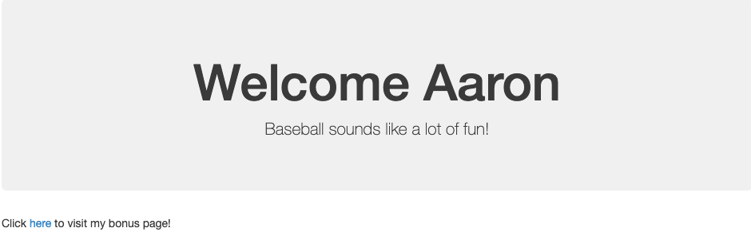

# Module 10 Class 2: Template Rendering

## Overview

Before class, walk through this week's Challenge assignment in office hours. In this class, the students will render templates with Flask and combine data from web scraping to display on a webpage.

## Learning Objectives

By the end of class, students will be able to:

* Render templates with Flask.
* Use PyMongo to save data to a Mongo database.
* Use Flask, web scraping, and PyMongo to create a webpage.

- - -

## Instructor Notes

* The activities in this class will complement Lessons **10.5.1: Use Flask to Create a Web App** through **10.6.1: Customize the Appearance**.  The students will benefit from these activities if they‘ve progressed through these lessons, which cover the following concepts, techniques, and tasks:

  * Importing Flask
  * Rendering templates
  * Refactoring code to match web routes
  * Scraping a webpage and creating a dictionary to store results
  * Storing data with PyMongo

## Slides

[Webscraping Day 2 Slideshow](https://docs.google.com/presentation/d/11rrb3wXF6AFwQA4vm9e7wFuCef4QUR4Dgd3eWax3Mw4/edit#slide=id.gab17893448_0_2766)

## Student Resources

Share the following [activity resources](https://2u-data-curriculum-team.s3.amazonaws.com/data-viz-online-lesson-plans/10-Lessons/10-2-Student_Resources.zip) with the students.


- - -

## Before Class

### 0. Office Hours

| Activity Time: 0:30       |  Elapsed Time:     -0:30  |
|---------------------------|---------------------------|

<details>
  <summary><strong>📣 Instructor Do: Challenge Instruction Walkthrough</strong></summary>

Let the students know that you’ll walk through the Challenge requirements and rubric during the first few minutes of Office Hours, while also providing helpful tips to ensure they know exactly what they need in order to be successful.

Open the Challenge in Canvas and go through the high-level instructions and requirements with your class. Be sure to check for understanding.

Open the Rubric in Canvas, go through the Mastery column with the class, and show how it maps back to the requirements for each deliverable. Be sure to check for understanding.

Review the following tips to ensure clarity on the Challenge:

For **Deliverable 1: Scrape Full-Resolution Mars Hemisphere Images and Titles**, navigate to the [Mars Hemisphere](https://astrogeology.usgs.gov/search/results?q=hemisphere+enhanced&k1=target&v1=Mars) website to show the students what they will be scraping. Then, open up the [Mission to Mars starter code](../../../01-Assignments/10-Mission-to-Mars/Resources/Mission_to_Mars_Challenge_starter_code.ipynb) and show the students the commented steps they will be adding code to complete the Challenge.

For **Deliverable 2: Updates the Web App with Mars Hemisphere Images and Titles**, they will use their knowledge of Python and HTML to update a Mongo database and display the contents on a webpage containing the information collected in Deliverable 1 as well as the full-resolution image and title for each hemisphere image.

Open and run the [Module 10 app.py](../../../01-Assignments/10-Mission-to-Mars) and run it in your terminal. Then, navigate to `12.7` to demonstrate what students will be creating.

For **Deliverable 3: Add Bootstrap 3 Components**, the learners will update the web app to make it mobile responsive and add two additional Bootstrap 3 components to make it stand out.

Using the webpage from Deliverable 2, show how it is also mobile responsive by using the DevTools.

  * Click on the Toggle Device Toolbar icon to open the UI that enables you to simulate responsiveness.

  * Choose a device to test your webpage.

Explain to students that they will then choose two other Bootstrap 3 components from this [list](https://getbootstrap.com/docs/3.3/css/).

Encourage your class to begin the Challenge as soon as possible, if they haven’t already, and to use the Learning Assistants channel and the remainder of Office Hours with their instructional team for help as they progress through their work. If they feel like they need context to understand documentation or instructions throughout the week, this is where they can get it.

Open the floor to discussion and be sure to answer any questions they may have about the Challenge requirements before moving on to other areas of interest.

</details>

<details>
  <summary><strong>📣  Instructor Do: Office Hours</strong></summary>

For the remaining time, remind the students that this is their time to ask questions and get assistance from their instructional staff as they’re learning new concepts and working on the Challenge assignment.

Expect that students may ask for assistance with the following:

* Challenge assignment
* Further review on a particular subject
* Debugging assistance
* Help with computer issues
* Guidance with a particular tool

</details>


- - -

## During Class

### 1. Getting Started

| Activity Time:       0:10 |  Elapsed Time:      0:10  |
|---------------------------|---------------------------|

<details>
  <summary><strong>📣 1.1 Instructor Do: Foundation Setting (0:05)</strong></summary>

* Welcome students to class.

* Direct students to post individual questions in the Zoom chat to be addressed by you and your TAs at the end of class.

* Open the slideshow and use slides 1-8 to walk through the foundation setting with your class.

* **This Week - Web Scraping:** Talk through the key skills that students will learn this week, and let them know that they are continuing to build on their data analyst skills.

* **Today's Objectives:** Now, outline the concepts covered in today's lesson. Remind students that they can find the relevant activity files in the “Getting Ready for Class” page in their course content.

</details>

<details>
  <summary><strong>🎉 1.2 Everyone Do: Check-In (0:05)</strong></summary>

* Ask the class the following questions and call on students for the answers:

    * **Q:** How are you feeling about your progress so far?

    * **A:** We are adding to our Python skill set. It's important to look back and see what we’ve accomplished, and acknowledge that it's a lot! It’s also okay to feel overwhelmed as long as you don’t give up. The more you practice, the more comfortable you'll be coding.

    * **Q:** How comfortable do you feel with this topic?

    * **A:** Let's do "fist to five" together. If you are not feeling confident, hold up a fist (0). If you feel very confident, hold up an open hand (5).

</details>

<sub>[Having issues with this section? Report a bug!](https://bit.ly/36sGO7d)</sub>

### 2. String Rendering

| Activity Time:       0:35 |  Elapsed Time:      0:45  |
|---------------------------|---------------------------|

<details>
  <summary><strong>📣 2.1 Instructor Do: Intro To Flask Render (0:15)</strong></summary>

* You can use slides 9-12 to accompany this activity.

* This demonstration introduces the basics of rendering a template with Flask.

* To begin, navigate to the [solved](Activities/01-Ins_Render_String/Solved) directory and run `python app.py`, then visit `http://127.0.0.1:5000/` in your browser.

* Next, open [app.py](Activities/01-Ins_Render_String/Solved/app.py) and change the value of the `text` argument inside `render_template`.

  * Restart the application to show that the text rendered on the page has changed.

  * Emphasize that we did _not_ change the HTML.

* Explain that using **templates** allows us to dynamically configure what is displayed in a "preconfigured" (i.e., templated) webpage.

  * Point out that the value of `text` is determined dynamically: we could set it equal to the result of a function call or _database query_, for example, and generate webpages that reflect the result of the query or function call.

* Remind students that a major impetus for the use of templates is that it allows us to keep our webpage markup separate from our server logic.

  * Explain that Flask expects templates to be stored in a top-level directory called `templates`.

```python
/app.py
/templates
    /index.html
```

* Begin by opening `templates/index.html`.

* Point out the line containing `{{ text }}`.

  * Explain that the double brackets mark a place where we can "plug in" a variable value for `text`.

**Example `index.html`**

```html
<body>
  <div>
    <!-- Render our data -->
    <h1>{{ text }}</h1>
  </div>
</body>
```

* Remind students that we can change what is displayed in `{{ text }}` by updating the code on our server.

* Open `app.py` and emphasize the following.

  * We must either import `render_template` from `flask` or refer to it as `flask.render_template`.

  * We call `render_template` with _only_ the filename of the template we want to render. This is possible because we've adhered to the convention of placing our templates in the `templates` directory.

  * We pass the string `"Serving up cool text from the Flask server!"` as a _keyword argument_ to `render_template`. Point out that the keyword, `text`, corresponds to the value we placed in double brackets in `index.html`. This is how the server knows what data to use to "fill out" the template.

* Make sure to point where this file lives and where it looks for files to render.

**Example `app.py`**

```python
# Dependencies
from flask import Flask, render_template

# Create Flask app
app = Flask(__name)


# Create a route that renders the index.html template and takes in the static string "hurricanes are a comin".
@app.route("/")
def echo():
    return render_template("index.html", text="Serving up cool text from the Flask server!!")
```

* Take a moment to demonstrate the application again, then address any remaining questions before moving on.

</details>

<details>
  <summary><strong>✏️ 2.2 Students Do: Rendering a String with Flask (0:15)</strong></summary>

* Next, proceed with the student exercise. In this exercise, the students will use Flask to render a welcome message on their page.

* Navigate to the [solved](Activities/02-Stu_Render_String/Solved) directory and run `python app.py`, then visit `http://127.0.0.1:5000/` in your browser to display what students will be creating.



* Make sure the students can download and open the [instructions](Activities/02-Stu_Render_String/README.md), the [starter code](Activities/02-Stu_Render_String/Unsolved/app.py), and [templates](Activities/02-Stu_Render_String/Unsolved/templates/) from the AWS link.

* Go over the instructions with the students and answer any questions before breaking the students out in groups.

* Divide students into groups of 3 to 5. They should work on the solution by themselves but can reach out to others in their group for help.

* Let students know that they may be asked to share and walk through their work at the end of the activity.

</details>

<details>
  <summary><strong>⭐ 2.3 Review: Rendering a String (0:05)</strong></summary>

* Once time is up, ask for volunteers to walk through their solution. Remind them that it is perfectly alright if they didn't finish the activity.

* To encourage participation, you can open the [starter code](Activities/02-Stu_Render_String/Unsolved/app.py) and ask the students to create the Flask application.

* If there are no volunteers, open [app.py](Activities/02-Stu_Render_String/Solved/app.py) and go through the code, explaining the following:

  * Import libraries and set up the Flask app.

  * A name and hobby variable are declared then used later in the templates.

  * One route is set to the `/` URL. This will return the `index.html` template as well as the name and hobby variables used on the webpage.

  * A second route is set to the `/bonus` URL. This will return the `bonus.html` template along with the same variables as the other route.

* Next, open the [index.html](Activities/02-Stu_Render_String/Solved/templates/index.html) file and [bonus.html](Activities/02-Stu_Render_String/Solved/templates/bonus.html) file in an editor, explaining:

  * The variables are placed inside curly brackets and passed from the Flask app.

  * A link to the route `bonus`, which will hit the route on the back end to render the `bonus.html` template.

  * A similar approach is taken on the `bonus.html` page, but this time a link is added to route back to `/`.

* Answer any questions before moving on.

</details>

<sub>[Having issues with this section? Report a bug!](https://bit.ly/39DQwFD)</sub>

### 3. Rendering lists and Dictionaries

| Activity Time:       0:25 |  Elapsed Time:      1:10  |
|---------------------------|---------------------------|

<details>
  <summary><strong>📣 3.1 Instructor Do: Rendering a List and a Dictionary (0:05)</strong></summary>

* You can use slides 14-15 to accompany this activity.

* In your terminal, change into the [Solved](Activities/03-Ins_Render_List_and_Dictionary/Solved) directory and run `python app.py`.

* Explain to them that the setup is the same as rendering a string, but we will be manipulating a list instead of a simple string value. We are working our way up to rendering data from a Mongo database, and this will give you more practice with the basics.

* The main difference in this activity is that we will be looping through the elements of a list. Open `app.py` to show that a list can be passed and returned to a template.

```python
def index():
    team_list = ["Jumpers", "Dunkers", "Dribblers", "Passers"]
    return render_template("index.html", list=team_list)
```

* Next, open the `index.html` and explain that a new syntax will allow a `for` loop to go through the list on the front end. This `for` loop will go through the list passed in the back end and create a new `<li>` for each name in the list.

```python

  <li>{{ name }}</li>

```

* Emphasize that for code we are going to render on the page, we use the syntax: `{{ this will be displayed }}`.

  * In particular, emphasize the double brackets, `{{...}}`.

* For code, such as a loop, we use ``

  * In particular, emphasize the "percent brackets", ``.

  * Explain that "percent brackets" are used to implement logic within our templates.

  * Explain that to end a `for` loop, `` must be added at the end. Everything in between the percent brackets will be added to the webpage with each iteration of the loop.

* Identify the loop versus the `name` argument that will be rendered.

* Next, comment out the code for lists, uncomment the code for dictionaries, and restart the server.

* Explain that we access the dictionary values by using dot notation.

**Example `app.py`**

```python
def index():
    player_dictionary = {"player_1": "Jessica",
                         "player_2": "Mark"}
    return render_template("index.html", dict=player_dictionary)
```

**Example `index.html`**

```html
<ul style="list-style: none;">
    <li>{{ dict.player_1 }}</li>
    <li>{{ dict.player_2 }}</li>
</ul>
```

* Check to ensure that students understand how we are accessing our data.

  * Point out the "formula" for retrieving data via dot notation: `<dict_name>.<key>`.

* Answer any questions before moving on to the student activity.

</details>

<details>
  <summary><strong>✏️ 3.2 Everyone Do: Rendering a List and a Dictionary (0:20)</strong></summary>

* First, demo what the students should be creating by running [04-Evr_Render_List_and_Dict/app.py](Activities/04-Evr_Render_List_and_Dict/Solved/app.py) and going to local host on your browser.

* Make sure the students can download and open the [instructions](Activities/04-Evr_Render_List_and_Dict/README.md), [starter code](Activities/04-Evr_Render_List_and_Dict/Unsolved/app.py), and [templates](Activities/04-Evr_Render_List_and_Dict/Solved/templates) files from the AWS link.

* Go over the instructions with the students, then let the students work on their solution for 5 to 7 minutes.

* When time is up, open up the [starter code](Activities/04-Evr_Render_List_and_Dict/Unsolved/app.py) and ask for volunteers to create the Flask app.

* If there are no volunteers, open up [04-Evr_Render_List_and_Dict/app.py](Activities/04-Evr_Render_List_and_Dict/Solved/app.py) and go through the code, explaining as you go:

  * Create and set up a Flask instance.

  ```python
  # create instance of Flask app
  app = Flask(__name__)
  ```

  * Next, create a list of dictionaries passed to the route.

  ```python
  # List of dictionaries
  dogs = [{"name": "Fido", "type": "Lab"},
          {"name": "Rex", "type": "Collie"},
          {"name": "Suzzy", "type": "Terrier"},
          {"name": "Tomato", "type": "Retriever"}]
  ```

  * Create a route that will return an `index.html` and a list of dictionaries.

  ```python
  # create route that renders index.html template
  @app.route("/")
  def index():

      return render_template("index.html", dogs=dogs)
  ```

* After the Flask app has been created, open the [index.html template](Activities/04-Evr_Render_List_and_Dict/Unsolved/templates/index.html) and ask for volunteers to create the template for rendering the list of dictionaries.

* If there are no volunteers, open up [04-Evr_Render_List_and_Dict/index.html](Activities/04-Evr_Render_List_and_Dict/Solved/templates/index.html) and go through the code, explaining as you go:

  * Set up a `for` loop with the percent bracket notation.

  * Looping through a list of dictionaries is the same as any other list. Combine the dot notation to access a dictionary with the `for` loop to display both the name and the type.

  ```html
    
      <li style="color:blue">{{ dog.name }} who is a {{ dog.type }}</li>
    
  ```

  * Finally, inline CSS is used here. Note that using a separate CSS file will also work as long as it's referenced correctly.

* Send out the [rendering list and dictionary solution](Activities/04-Evr_Render_List_and_Dict/Solved/) for students to review later.

* Answer any questions before moving on to the next activity.

</details>

<sub>[Having issues with this section? Report a bug!](https://bit.ly/3cvEjVr)</sub>

### 4. Scraping and Rendering

| Activity Time:       0:45 |  Elapsed Time:      1:55  |
|---------------------------|---------------------------|

<details>
  <summary><strong>📣 4.1 Instructor Do: Scrape, Save, and Render Data (0:15)</strong></summary>

* You can use slides 17-18 to accompany this activity.

* This is the culminating activity where they will scrape a URL, insert the data into Mongo, query it on the server, and render the query results on the page.

* **Note:** Make sure that PyMongo is installed with `pip install Flask-PyMongo`.

* Switch to the [solved directory](Activities/05-Ins_Scrape_And_Render/Solved) and run `python app.py`.

* Open up `http://localhost:5000/` and click the Find Awesome Deals button.

* This button calls our `scrape_craigslist.py` file, which does just that: Scrape Craigslist and save the results to a Mongo database.

* After you scrape, your path will say `/scrape`. Click Back to go back to the index route to see the data that was scraped.

* Open [app.py](Activities/05-Ins_Scrape_And_Render/Solved/app.py) and go through the code, explaining:

  * There is a new library being used, called `flask_pymongo`. Documentation can be found at <https://flask-pymongo.readthedocs.io/en/latest/>. As defined by the docs, _Flask-PyMongo bridges Flask and PyMongo, so that you can use Flask’s normal mechanisms to configure and connect to MongoDB._

  * There are similarities here to previous examples but also a few key differences that you should review.

  ```python
  from flask import Flask, render_template, redirect
  from flask_pymongo import PyMongo

  app = Flask(__name__)

  # Use flask_pymongo to set up mongo connection
  app.config["MONGO_URI"] = "mongodb://localhost:27017/app"
  mongo = PyMongo(app)

  # Or set inline
  # mongo = PyMongo(app, uri="mongodb://localhost:27017/app")

  @app.route('/')
  def index():
      # find one document from our mongo db and return it.
      listings = mongo.db.listings.find_one()
      # pass that listing to render_template
      return render_template("index.html", listings=listings)

  # set our path to /scrape
  @app.route("/scrape")
  def scraper():
      # create a listings database
      listings = mongo.db.listings
      # call the scrape function in our scrape_craigslist file. This will scrape and save to mongo.
      listings_data = scrape_craigslist.scrape()
      # update our listings with the data that is being scraped.
      listings.update(
          {},
          listings_data,
          upsert=True
      )
      # return a message to our page so we know it was successful.
      return redirect("/", code=302)
  ```

* Next, open [scrape_craigslist.py](Activities/05-Ins_Scrape_And_Render/Solved/scrape_craigslist.py) and go through the code, explaining:

  * Import dependencies that allow for web scraping.

  * The `init_browser` function initializes the webdriver to use Chrome.

  ```python
  def init_browser():
      executable_path = {'executable_path': ChromeDriverManager().install()}
      return Browser("chrome", **executable_path, headless=False)
  ```

  * The scraped function retrieves the HTML page then parses with Beautiful Soup.

  ```python
  def scrape():
      browser = init_browser()
      listings = {}

      url = "https://raleigh.craigslist.org/search/hhh?max_price=1500&availabilityMode=0"
      browser.visit(url)

      html = browser.html
      soup = BeautifulSoup(html, "html.parser")
  ```

  * The scrape function will retrieve a headline, price, and neighborhood data from the Beautiful Soup object.

  ```python
    # Build our dictionary for headline, price and neighborhood from our scraped data.
    listings["headline"] = soup.find("a", class_="result-title").get_text()
    listings["price"] = soup.find("span", class_="result-price").get_text()
    listings["hood"] = soup.find("span", class_="result-hood").get_text()
  ```

  * Finally, this object will be stored in a dictionary.

  ```python
  # Return our dictionary
  return listings
  ```

* Take a moment to emphasize how we add keys to dictionaries, as we do with `listings` towards the end of `scrape`.

</details>

<details>
  <summary><strong>✏️ 4.2 Everyone Do: Scrape and Render (0:30)</strong></summary>

* In this activity, students will scrape Costa Rica weather data into a Mongo database.

* Demo the activity by running the [app.py](Activities/06-Evr_Scrape_Weather/Solved/app.py) file in the terminal and navigating to localhost in a browser. Explain to students that every time the button is clicked, the weather in Costa Rica will be scraped, stored in a database, and returned to the webpage.

* Make sure the students can download and open the [instructions](Activities/06-Evr_Scrape_Weather/README.md), the [starter app file](Activities/06-Evr_Scrape_Weather/Unsolved/app.py), the [starter scrape file](Activities/06-Evr_Scrape_Weather/Unsolved/scrape_costa.py), and the [template starter file](Activities/06-Evr_Scrape_Weather/Unsolved/templates/index.html) from the AWS link.

* Go over the instructions with the students, then let the students work on their solution for 5 to 7 minutes.

* When time is up, start by opening the [starter scrape file](Activities/06-Evr_Scrape_Weather/Unsolved/scrape_costa.py) and ask students to help you write the code to scrape the temperature data.

* If there are no volunteers, open up the  [scrape_costa.py](Activities/06-Evr_Scrape_Weather/Solved/scrape_costa.py) file and go through the code, explaining:

  * The `init_browser` function is used to initialize the browser.

  * The `scrape_info` function contains all the code to scrape the website and return a Python dictionary of the data.

  * The sleep timer is used to wait for the page to load.

    ```python
    time.sleep(1)
    ```

  * The average temperatures are located in a div tag with the id, `weather`.

    ```python
    avg_temps = soup.find('div', id='weather')
    ```

  * The min and max temperatures can be found by searching for the strong tags within the weather div.

    ```python
    # Get the min avg temp
    min_temp = avg_temps.find_all('strong')[0].text

    # Get the max avg temp
    max_temp = avg_temps.find_all('strong')[1].text
    ```

  * For the bonus, the image src is a relative path that needs to be joined with the base URL.

    ```python
    # BONUS: Find the src for the sloth image
    relative_image_path = soup.find_all('img')[2]["src"]
    sloth_img = url + relative_image_path
    ```

  * A dictionary is used to store the values found during scraping.

    ```python
    # Store data in a dictionary
    costa_data = {
        "sloth_img": sloth_img,
        "min_temp": min_temp,
        "max_temp": max_temp
    }
    ```

  * The browser can be closed after all of the data has been scraped.

  ```python
  # Close the browser after scraping
  browser.quit()
  ```

  * Finally, the data is returned as a Python dictionary.

    ```python
    # Return results
    return costa_data
    ```

* Next, open the [starter app file](Activities/06-Evr_Scrape_Weather/Unsolved/app.py) and the [starter scrape file](Activities/06-Evr_Scrape_Weather/Unsolved/scrape_costa.py), and ask students to help you code the routes for the webpage.

* If there are no volunteers, open the [app.py](Activities/06-Evr_Scrape_Weather/Solved/app.py) file and explain the following:

  * A database connection is made using PyMongo.
    ```python
    # Use PyMongo to establish Mongo connection
    mongo = PyMongo(app, uri="mongodb://localhost:27017/weather_app")
    ```

  * The first route will default to the `index.html` page.

  * The data for the homepage is retrieved from the Mongo database collection.

  * The Flask `render_template` function is used to insert the temperature data into the homepage.

    ```python
    # Route to render index.html template using data from Mongo
    @app.route("/")
    def home():

        # Find one record of data from the mongo database
        destination_data = mongo.db.collection.find_one()

        # Return template and data
        return render_template("index.html", vacation=destination_data)
    ```

  * The `/scrape` route is used to scrape the external webpage and store the data in Mongo.

    ```python
    # Route that will trigger the scrape function
    @app.route("/scrape")
    def scrape():

        # Run the scrape function
        costa_data = scrape_costa.scrape_info()

        # Update the Mongo database using update and upsert=True
        mongo.db.collection.update({}, costa_data, upsert=True)

        # Redirect back to home page
        return redirect("/")
    ```

* Next, open up the [template starter file](Activities/06-Evr_Scrape_Weather/Unsolved/templates/index.html) and ask students to help you write the code for the template.

* If there are no volunteers, open the [index.html](Activities/06-Evr_Scrape_Weather/Solved/templates/index.html) file to show how the data is inserted into the HTML using the templating system.

  ```html
  
  <h2>The typical weather in Costa Rica is:</h2>
  <h3>Max Temp: {{ vacation.max_temp }}</h3>
  <h3>Min Temp: {{ vacation.min_temp }}</h3>
  ```

* Encourage students to rework this problem as it will help them with the homework assignment.

* Send out the [solution files](Activities/06-Evr_Scrape_Weather/Solved/) for students to review later.

* Answer any questions before ending class.

</details>

<sub>[Having issues with this section? Report a bug!](https://bit.ly/2MssJzE)</sub>

### 5. Ending Class

| Activity Time:       0:05 |  Elapsed Time:      2:00  |
|---------------------------|---------------------------|

<details>
  <summary><strong>📣  5.1 Instructor Do: Review </strong></summary>

* Before ending class, review the skills that were covered today and mention where in the module these skills are used:
  * Rendering templates on a webpage was covered in **Lesson 10.5.1**.
  * Integrating MongoDB Into a web app was covered in **Lesson 10.5.3**.
  * Customizing the appearance of the web app was covered in **Lesson 10.6.1**.

* Answer any questions the students may have.

</details>

<sub>[Having issues with this section? Report a bug!](https://bit.ly/3css6kp)</sub>

- - -

© 2021 Trilogy Education Services, LLC, a 2U, Inc. brand.  Confidential and Proprietary.  All Rights Reserved.
