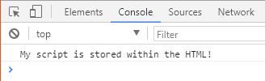

# Module 11 Class 1: JavaScript Fundamentals

## Overview

This week, we will be introducing the JavaScript programming language. In this unit, students will learn how to use JavaScript objects and arrays, including how to store and retrieve their data.

In today's class, students will initialize variables and determine their data types, perform calculations, and use JavaScript functions and conditional statements to retrieve data from arrays and objects.  

## Learning Objectives

By the end of class, students will be able to:
 
* Understand the basics of JavaScript
* Understand the different types of variables and objects in JavaScript
* Create and use JavaScript functions
* Convert JavaScript functions to arrow functions
* Use repetition and conditional statements


- - -

## Instructor Notes

* The activities in this class will complement Lessons **11.0.1: Creating Dynamic Content** through **11.4.2: Practice Using for Loops in JavaScript**.  The students will benefit from these activities if they‘ve progressed through these lessons, which cover the following concepts, techniques, and tasks:  

* Using the Chrome console. 
* Initializing variables, `var`, `let`,`const`, and arrays
* Understanding array structure
* Understanding JavaScript objects
* Creating and using JavaScript functions
* Performing calculations using JavaScript
* Understanding and using arrow functions
* Using `for` loops

## Instructor Prep

* Welcome to JavaScript week! Since students have a strong background in Python at this point, the first part of the lesson moves quickly as it assumes basic programming knowledge. Students will leverage their existing knowledge of Python to help grasp JavaScript fundamentals.

* Despite the syntactic similarities between Python and JavaScript, students who are encountering JavaScript for the first time may experience some initial discomfort.

  * Explain that learning a new syntax can certainly feel like learning a whole new language, and that's exactly what we're doing! We don't expect you to be JavaScript masters! All of this information is iterative, and your skills will only improve with time and practice. If it becomes overwhelming, take advantage of office hours to spend time with the instructional staff to help get you moving in the right direction. Please don't be afraid to reach out for help! We are all here for your success.

* Some students may also wonder at some point how JavaScript relates to data analytics, especially those who are not interested in web development. Remind them that JavaScript is a very powerful and marketable skill.

  * Let them know that learning how to build functional web applications with HTML, CSS, and JavaScript will open up a world of possibility for presenting our data! Many of the libraries that we will use for visualizations are JavaScript libraries, making it an essential skill for some of our more interactive visualizations.

* As students learn JavaScript, they'll find themselves needing to juggle a few tasks, including keeping track of code across multiple documents. They will likely experience some frustration. Again, let them know that they aren't expected to learn all of JavaScript in one week. Instead, this week will be a thorough introduction to the topic.

## Slides

[JavaScript Day 1 slideshow](https://docs.google.com/presentation/d/1Ch2JmQpVVi-7sv76qVzn_NL2lhBp8QbKovJkMWgRrkQ/edit?usp=sharing)

## Student Resources

Share the following [activity resources](https://2u-data-curriculum-team.s3.amazonaws.com/data-viz-online-lesson-plans/11-Lessons/11-1-Student_Resources.zip) with the students. 


- - - 

## Before Class

### 0. Office Hours

| Activity Time: 0:30       |  Elapsed Time:     -0:30  |
|---------------------------|---------------------------|

<details>
  <summary><strong> 📣 0.1 Instructor Do: Office Hours</strong></summary>

* Before you begin class, hold office hours. Office hours should be driven by students. Encourage students to take full advantage of office hours by reminding them that this is their time to ask questions and get assistance from instructional staff as they learn new concepts.

* Expect that students may ask for assistance. For example: 

  * Further review on a particular subject
  * Debugging assistance
  * Help with computer issues
  * Guidance with a particular tool

</details>

- - - 

## During Class 

### 1. Getting Started

| Activity Time:       0:15 |  Elapsed Time:      015  |
|---------------------------|---------------------------|

<details>
  <summary><strong>📣 1.1 Instructor Do: Foundation Setting (0:10)</strong></summary>

* Welcome students to class.

* Direct students to post individual questions in the Zoom chat to be addressed by you or your TAs at the end of class.

* Open the slideshow and use slides 1-12 to walk through the foundation setting with your class. 

* **Big Picture:** This is an opportunity to zoom out and see the big picture of where they are in the program. Take a moment to mention some real-world examples that show the value of what they’re learning this week.

* **Program Pointers:** Talk through some of the key logistical things that will help students stay on track. This is an opportunity to speak to what students may need when they're at this particular point of the program. 

* **This Week - JavaScript:** Talk through the key skills students will be learning this week. Let the students know that they will be learning JavaScript. The primary focus of the Day 1 activities is to reinforce the online content by covering JavaScript fundamentals. On Day 2, the students will apply what they’ve learned from Day 1 and manipulate JavaScript objects to populate a webpage.   

* **This Week's Challenge:** For this week's Challenge, let the students know that they'll create four more search parameters in addition to the date filter they created in the module, one for the city, the state, the country, and the shape of the UFO. Using JavaScript, they will create two new functions, one to save the element, value, and id of the filter that was changed, and then one function to filter the UFO dataset with the search criteria and update the webpage. 

* **Career Connection:** Let students know how they will use the skills covered this week throughout their careers. It's important for them to know the "why." Give examples of when they may be used in work or when you have used those skills in your workplace. 

* **How to Succeed This Week:** Remind your students that they may have moments of frustration this week as they learn something complex. These moments are great for deepening their knowledge. Use the side material to outline some of the topics that they may find tricky in this module. Consider sharing something about your personal learning journey. It helps students to recognize that everyone starts somewhere and that they are not alone.

* **Today's Objectives:** Now, outline the concepts that will be covered in today's lesson. Remind students that they can find the relevant activity files in the “Getting Ready for Class” page in their course content.  

</details>

<details>
  <summary><strong>🎉  1.2 Everyone Do: Check-In (0:05)</strong></summary>

* Ask the class the following questions and call on students for answers:

    * **Q:** How are you feeling about your progress so far?

    * **A:** We are starting to build your skillset. It’s also okay to feel overwhelmed as long as you don’t give up.

    * **Q:** How comfortable do you feel with this topic?  

    * **A:** Let's do "fist to five" together. If you are not feeling confident, hold up a fist (0). If you feel very confident, hold up an open hand (5).

</details>

<sub>[Having issues with this activity? Report a bug!](https://bit.ly/372qgTN)</sub>

- - -

### 2. From Python to JavaScript

| Activity Time:       0:30 |  Elapsed Time:      0:45  |
|---------------------------|---------------------------|

<details>
  <summary><strong>📣 2.1 Instructor Do: A Quick Intro to JavaScript (0:05)</strong></summary>

* Today, we'll dive into a new language: JavaScript! Use slides 13 - 26 to cover this activity.

* Explain that JavaScript shares many similarities with Python, but there are also a number of differences, including typical usage and syntax.

* Walk through slides 14 - 23 and explain why JavaScript is important for your career in data:

  * Just as important as the ability to crunch numbers is the ability to convey information to a wider audience, and JavaScript is the language of the web.

  * JavaScript makes it possible to create interactive webpages and visualizations.

  * JavaScript is often used to place API calls to cloud data and services.

  * JavaScript also enables websites to send and receive data from a server, to respond to a user's actions on the page, and to dynamically modify HTML elements.

  * With JavaScript, it is possible to build interactive sites that do not require use of the command line interface. For example, data analytics students from this program have used JavaScript to build internal tools and even client-facing dashboards.

  * JavaScript is everywhere. Even machine learning has been made available for the web browser: [https://js.tensorflow.org/](https://js.tensorflow.org/).

  * Bottom line: JavaScript is a very marketable and in-demand skill for any data position.

* Use slides 24 - 26 and share the following tips for learning JavaScript:

  * First, learning JavaScript will take much longer than a single week.

  * Focus on the small stuff and mastery will grow over time.

  * Don't stay stuck, ask for help!

  * Review, practice, utilize office hours, get help, and don't give up!

* Send out the following files to be used as reference guides as students progress through JavaScript:

  * [Student Guide](../StudentGuide.md)

  * [JavaScript Data Functions](../Supplemental/JavaScript_Data_Functions.pdf)

  * [JavaScript Reference Guide](../Supplemental/JavaScript_Reference_Guide.pdf)

  * [ES6 Reference Guide](../Supplemental/ES6_Reference_Guide.pdf)

</details>

<details>
  <summary><strong>📣 2.2 Instructor Do: Running JavaScript (0:05)</strong></summary>

* Since JavaScript is the language of the web, its code is commonly associated with HTML and can be found **inside** HTML documents.

* You can use slides 27 - 30 to go over this activity.

* Open up [01-Ins_JavaScript/Solved/script-within.html](Activities/01-Ins_JavaScript/Solved/script-within.html) with a text editor and go over the code with the class.

  * The JavaScript code is placed between a pair of `script` tags inside of the HTML file. This means the code will run when the webpage has loaded.

    

  * The `console.log()` function allows the developer to print out a message to a web browser's built-in console. This message can be viewed by opening up the inspector and navigating to the console tab.

  * Load up [01-Ins_JavaScript/Solved/script-within.html](Activities/01-Ins_JavaScript/Solved/script-within.html) within the browser and open the inspector's console to show the class the message that is printed.

    

* Now, open up [01-Ins_JavaScript/Solved/script-outside.html](Activities/01-Ins_JavaScript/Solved/script-outside.html) with a text editor and go over this code with the class.

  * If the JavaScript code is located in an external file, then we must add the URL to the JavaScript file. To reference the URL of the file we use the `src` attribute.  

  * The `app.js` file contains the same code that was in the `<body> </body>` tag of the previous exmaple.  
  
    

  * The opening `type="text/javascript"` is removed since JavaScript is the default language for HTML5 and modern browsers.

    

  * The HTML file **links** to an external JavaScript file named `app.js`, but the HTML file itself does not contain JavaScript code.

  * The `app.js` file is in the same directory as the `index.html` file.  If `app.js` were inside a directory called `static`, the `src` would contain the appropriate path to that file: `<script src="static/app.js">`.

* Next, open [Activities/01-Ins_JavaScript/Solved/app.js](Activities/01-Ins_JavaScript/Solved/app.js), whose code is:

  ```js
  console.log("My script is stored outside of the HTML!");
  ```

  * The code inside this external file will run as if it were included within the HTML itself. The console message from the developer will be printed as soon as the webpage loads.

* Load up [01-Ins_JavaScript/Solved/script-outside.html](Activities/01-Ins_JavaScript/Solved/script-outside.html) within the browser and open the inspector's console to show the class the message that is printed.

* Let the class know that using external JavaScript files is far more common than writing JavaScript into the HTML itself because using external files allows developers to easily reuse code.

  * When the same code is used on multiple sites or HTML pages, it makes sense to have the JavaScript code separated into its own `js` file.

  * If necessary, reiterate that linking an external JavaScript file inside the HTML file is essentially the same as copying and pasting the code inside the `<script>` tags.

* Emphasize that when more than one external script file is referenced inside the HTML document, the order matters!

  * For example, if a variable that is declared in one JavaScript file is used inside another, the file in which it is declared first must be referenced first in the HTML document.

* Answer whatever questions students may have before moving on to the next activity.

</details>

<details>
  <summary><strong>🎉 2.3 Everyone Do: From Python to JavaScript (0:15)</strong></summary>

* For this activity, the class will work their way through some of the introductory Python scripts and translate them into JavaScript code. Make sure to point out the similarities and differences between these two programming languages while going over the code.

* Make sure the students can download and open the following files from the AWS link:
  * The [1-HelloVariableWorld](Activities/02-Evr_Python_to_JavaScript/Unsolved/1-HelloVariableWorld) folder, which contains the following files:
    * [python_hello_variable_world.py](Activities/02-Evr_Python_to_JavaScript/Unsolved/1-HelloVariableWorld/python_hello_variable_world.py)
    * [hello-variable-world.js](Activities/02-Evr_Python_to_JavaScript/Unsolved/1-HelloVariableWorld/hello-variable-world.js) 
    * [hello-variable-world.html](Activities/02-Evr_Python_to_JavaScript/Unsolved/1-HelloVariableWorld/hello-variable-world.html)
  * The [2-ConditionalCheck](Activities/02-Evr_Python_to_JavaScript/Unsolved/1-HelloVariableWorld) folder, which contains the following files:
    * [python_conditional_check.py](Activities/02-Evr_Python_to_JavaScript/Unsolved/2-ConditionalCheck/python_conditional_check.py)
    * [conditional-check.js](Activities/02-Evr_Python_to_JavaScript/Unsolved/2-ConditionalCheck/conditional-check.js)
    * [conditional-check.html](Activities/02-Evr_Python_to_JavaScript/Unsolved/2-ConditionalCheck/conditional-check.html)

* First, before opening up anything, explain that JavaScript and Python are logically and syntactically similar, so many of the skills learned with Python will translate into JavaScript.

* You can use slides 31 - 36 to go over a few of the similarities between Python and JavaScript. 

* Explain that the following code examples will be sent out to use as a reference for future activities.

* When coding these activities, open up the original Python script next to the JavaScript code. This way, students can easily compare and contrast the two languages.

* Open `python_hello_variable_world.py` with a text editor and tell the class that our first task will be to translate this simple Python script into JavaScript.

* Open `hello-variable-world.js` with a text editor. Live code the solution with the class, using the solved version as a guide.

* Highlight the following points:

  * All variables in JavaScript must be initialized using the `var <Variable Name> = <Value>` syntax. This is in contrast to Python, where variables can be declared without the `var` keyword.

  * Just like Python, JavaScript will automatically determine the data type assigned to a variable.

  ```js
  // Create a variable called "name" that holds a string
  var fullName = "Homer Simpson";

  // Create a variable called "country" that holds a string
  var country = "United States";

  // Create a variable called "age" that holds an integer
  var age = 26;

  // Create a variable called "hourlyWage" that holds an integer
  var hourlyWage = 15;
  ```

  * Every line in JavaScript ends with a semicolon. Although this is not technically a requirement for the language, JavaScript programmers conventionally use a semicolon to conclude a statement.

  * In Python, Booleans are capitalized. In JavaScript, they are lowercase.

    ```js
      var satisfied = true;
    ```

  * In JavaScript, a string template literal is similar to a Python f-string.

    ```python
    # Python f-string
    print(f"Hello, {full_name}!")
    ```

    ```js
    // JavaScript string template literal
    console.log(`Hello ${fullName}!`);
    ```

  * In Python, the variable is enclosed within curly brackets: `{name}`.

  * In JavaScript, the variable is enclosed within curly brackets preceded by the dollar sign: `${name}`.

  * In Python f-string, the string is preceded by the letter `f`.

  * In JavaScript, the string is enclosed by backticks.

  * It is not necessary to cast a variable when printing out an integer alongside strings using JavaScript. The language will automatically cast the integer as a string without explicit instruction.

    ```js
    console.log(`You are ${age} years old.`);
    console.log(`You make ${dailyWage} dollars per day.`);
    ```

  * Just like in Python, JavaScript strings can be converted into numerical values.

  * In Python, a number in string format can be converted, or typecast, into a numeric format.

    ```python
    hourly_wage = 15
    weekly_hours = "40"
    weekly_wage = hourly_wage * int(weekly_hours)
    ```

  * The `int()` function is used here to transform a Python string into an integer.

  * In JavaScript, the same operation is performed with the `parseInt()` method:

    ```js
    var weeklyWage = hourly_wage * parseInt(weekly_hours);
    ```

  * A similar operation can be performed with `parseFloat()` for decimals.

* Open up the HTML file within the browser and show the class the outputs for this application.

  

* Send out the [02-Evr_Python_to_JavaScript/Solved/1-HelloVariableWorld/hello-variable-world.js](Activities/02-Evr_Python_to_JavaScript/Solved/1-HelloVariableWorld/hello-variable-world.js) file for students to refer to later.

* You can use slides 37 - 41 to help with the second live code. 

* Next, for the live code, open `python_conditional_check.py` and the unsolved `conditional-check.js` file. Live code the Python-to-JavaScript conversion with the class.

* Highlight the following points:

  * Conditionals in JavaScript and Python are fairly similar. Both languages will conditionally execute code based on a boolean expression.

  * JavaScript uses curly brackets to define blocks of code. This is equivalent to how Python uses whitespace and indentation to define a block of code.

  * Although it is not necessary to indent code blocks in JavaScript, it is still good practice to do so for readability.

    ```js
    if (x === 1) {
      console.log("x is equal to 1");
    }
    ```

  * JavaScript uses `===` to denote strict equality.

  * Python combines boolean expressions using logical statements such as `and` and `or`. The JavaScript equivalent of `and` is `&&`, while the `or` equivalent is `||`.

    ```js
    // Checks for two conditions to be met using &&
    if (x === 1 && y === 10) {
      console.log("Both values returned true");
    }

    // Checks if one or both conditions are met using ||
    if (x < 45 || y < 5) {
      console.log("One or both conditions are true");
    }
    ```

  * JavaScript uses `if`...`else if`...`else` to chain conditionals. This is equivalent to `if`...`elif`...`else` in Python.

    ```js
    if (y < 5) {
      console.log("x is less than 10 and y is less than 5");
    }
    else if (y === 5) {
      console.log("x is less than 10 and y is equal to 5");
    }
    else {
      console.log("x is less than 10 and y is greater than 5");
    }
    ```

  * And finally, JavaScript conditional statements can also be nested.

    ```js
    if (x < 10) {
      if (y < 5) {
        console.log("x is less than 10 and y is less than 5");
      }
      else if (y === 5) {
        console.log("x is less than 10 and y is equal to 5");
      }
      else {
        console.log("x is less than 10 and y is greater than 5");
      }
    }
    ```

* Send out the [02-Evr_Python_to_JavaScript/Solved/2-ConditionalCheck/conditional-check.js](Activities/02-Evr_Python_to_JavaScript/Solved/2-ConditionalCheck/conditional-check.js) file for students to refer to later.

* Ask the class the following questions and call on students for the answers:

    * **Q:** Where have we used this before?

    * **A:** Initializing variables was covered in Lesson 11.2.1.

    * **Q:** How does this activity equip us for the Challenge?

    * **A:** We will need to create variables in the Challenge. 

    * **Q:** What can we do if we don't completely understand this?

    * **A:** We can refer to the lesson plan and reach out to the instructional team for help.

* Answer any questions before moving on to the next activity.

</details>

<sub>[Having issues with this activity? Report a bug!](https://bit.ly/3a5K6zt)</sub>

- - -

### 3. JavaScript Arrays

 Activity Time:  0:20 |  Elapsed Time: 1:05  |
|----------------------|----------------------|

<details>
<summary><strong> 📣 3.1 Instructor Do: Variables, Arrays, and Objects (0:05)</strong></summary>

* A client wants you to gather information about San Francisco using JavaScript. Therefore, we will create variables, arrays, and objects to hold information about San Francisco.

* Now, open the [Activities/03-Ins_Var_Array_Obj/Solved/static/js/app.js](Activities/03-Ins_Var_Array_Obj/Solved/static/js/app.js) file and walk through the code. 

* Explain that JavaScript is case sensitive, meaning it considers uppercase and lowercase words to be different.

* Provide an example of assigning variables STATE and state, and show how when you console log the variables they are truly different.

```javascript
let STATE = "CA"
let state = "ca"

console.log(STATE)
console.log(state)

```

* Review that JavaScript allows the following variable types we're familiar with by showing these examples:

  * String 

  ```javascript 
  let city = "San Francisco";
  ```

  * Integer

  ```javascript 
  let zip = 94123;
  ```

  * Float

  ```javascript 
  let latitude = 37.77;
  let longitude = -122.43
  ```

  * Boolean

  ```javascript 
  let inCalifornia = true;
  ```

* Explain that JavaScript also allows the use of arrays, similar to Python lists. Explain that arrays are enclosed by square brackets `[]` and can contain any number of values or variables of any data type. 

* Let's store the client’s desired information, Zip Code 94123 and city of San Francisco, in an array to have it stored in a second manner.

```javascript
let cityArray = [ "San Francisco", 94123, [37.77, -122.43], inCalifornia ];
```

* When dealing with JavaScript Object Notation (JSON), it is common to encounter JavaScript objects inside of an array.

* Explain that a JavaScript object is similar to a Python dictionary, but with a semicolon after the closing curly bracket `};`.

* JavaScript objects follow the same key-value pair structure.

* Now, we'll create a third item to hold the same desired information as a JavaScript object.

  ```javascript
  let cityObject = {city: "San Francisco",
              zip: 94123,
              location: [37.77, -122.43],
              inCalifornia: true};
  ```

* We could also have created the JavaScript object by using the variables defined earlier for the values.

  ```javascript
  let cityObject = {city: city,
              zip: zip,
              location: location,
              inCalifornia: inCalifornia};
  ```

* Lastly, open up the HTML file with Chrome and show the class the outputs for this application in the Inspector. 

* Send out the [03-Ins_Var_Array_Obj/Solved](Activities/03-Ins_Var_Array_Obj/Solved) folder for students to refer to later.

* Ask the class the following questions and call on students for the answers:

    * **Q:** Where have we used this before?

    * **A:** Variables and arrays were covered in Lesson 11.2.1, and JavaScript objects were covered in Lesson 11.2.3.

    * **Q:** How does this activity equip us for the Challenge?

    * **A:** We will need to create variables to reference JavaScript objects in the Challenge. 

    * **Q:** What can we do if we don't completely understand this?

    * **A:** We can refer to the lesson plan and reach out to the instructional team for help.

* Answer any questions before moving on to the student activity.

</details>

<details>
  <summary><strong>🎉 3.2 Everyone Do: JavaScript Arrays (0:15)</strong></summary>

* This activity will allow students to work with JavaScript arrays. Discuss the parallels to Python lists where appropriate. Encourage students to follow along as you code, and make sure to pause frequently to allow them to catch up.

* Make sure the students can download and open the following files from the AWS link:
  * The [arrays.js](Activities/04-Evr_JavaScript_Arrays/Unsolved/arrays.js) file.
  * The [index.html](Activities/04-Evr_JavaScript_Arrays/Unsolved/index.html) file.
  * The [styles.css](Activities/04-Evr_JavaScript_Arrays/Unsolved/styles.css) file.

* You can use slides 44 - 48 to go over this activity. 

* Second, open the unsolved [arrays.js](Activities/04-Evr_JavaScript_Arrays/Unsolved/arrays.js) file, and live code the solution. Be sure to show the output of each code snippet in the Chrome Inspector console.

* Highlight the following points:

  * JavaScript arrays are quite similar to Python lists.

    ```js
    var lettersArray = ["a", "b", "c", "d"];
    ```

  * JavaScript arrays, like Python lists, hold items in an ordered fashion.

  * Arrays are mutable: it is possible to, for example, add items to an array.

  * Arrays can hold items of different data types, such as integers and strings. They can even hold other arrays.

  * Like Python, an element in an array can be accessed by its **index**:

    ```js
    var firstLetter = lettersArray[0];
    var secondLetter = lettersArray[1];
    ```

    

  * In Python, the `append()` method is used to add an item to a list. In JavaScript, the **`push()`** method is used:

    ```js
    lettersArray.push("e");
    ```

  * The letter "e" is added to the end of the letters array.

  * To return a portion of an array, the **`slice()`** method is used.

    ```js
    // Returns all the elements starting at index position 1 in the array
    var slicedArray1 = lettersArray.slice(1);
    ```

  * It is possible to specify the first and last index positions to slice.

    ```js
    var slicedArray2 = lettersArray.slice(0, 3);
    var slicedArray3 = lettersArray.slice(1, 3);
    ```

  * `slice(0,3)` returns three items, at index 0, 1, and 2.
  * `slice(1,3)` returns two items, at index 1 and 2.

    

  * Similar to `join` in Python, the **`.join()`** method in JavaScript joins the items in an array into a single string.

    ```js
    var joinedArray = lettersArray.join(", ");
    ```

  * The join function takes a delimiter as its argument. In the first example, the items of the array will be joined by a comma and space, and in the second example (commented out), by three asterisks.

  * Optional point: in Python, the delimiter is placed first, e.g., `" ".join(mylist)`.

    

* Strings in JavaScript, like their Python counterparts, are indexed:

  ```js
  var soundOfMusic = "The hills are alive with the sound of music";
  console.log(soundOfMusic[0]);
  console.log(soundOfMusic[5]);
  ```

  

* `split()` is the opposite of `join()`. That is, it splits a string with a delimiter and returns an array of substrings.

  ```js
  var soundArray = soundOfMusic.split(" ");
  ```

  * The above splits the string where a space is found and returns the split fragments in an array.

  

* Send out the [04-Evr_JavaScript_Arrays/Solved](Activities/04-Evr_JavaScript_Arrays/Solved) folder for students to refer to later.

* Answer any questions before moving on to the next activity.

</details>

<sub>[Having issues with this activity? Report a bug!](https://bit.ly/3a64cts)</sub>

- - -

### 4. Movie Scores

| Activity Time:       0:25 |  Elapsed Time:      1:30  |
|---------------------------|---------------------------|

<details>
  <summary><strong>📣 4.1 Instructor Do: for Loops (0:05)</strong></summary>

* You can use slides 50 - 52 to go over this activity.

* In this demonstration, you will review how to use `for` loops in JavaScript. 

* Open the unsolved activity [Activities/05-Ins_For_Loops/Unsolved/static/js/index.js](Activities/05-Ins_For_Loops/Unsolved/static/js/index.js).

* Live code this activity and pause frequently for students to catch up.

* First, refresh students on how to set up a `for` loop in JavaScript. 

  ```javascript
  for (var i = 0; i < 10; i++) {
    console.log("Iteration #", i);
    }

  ```

* Next, refresh students on the use of a traditional `for` loop to iterate through an array:

  ```javascript

  // Looping through an array
  var students = ["Johnny", "Tyler", "Bodhi", "Pappas"];

  for (var i = 0; i < students.length; i++) {
    printName(students[i]);
  }
  ```

* Send out the [Activities/05-Ins_For_Loops/Solved](Activities/05-Ins_For_Loops/Solved) folder for students to refer to later.

* Ask the class the following questions and call on students for the answers:

    * **Q:** Where have we used this before?

    * **A:** Using `for` loops was covered in Lesson 11.4.1 and Lesson 11.4.2. 

    * **Q:** How does this activity equip us for the Challenge?

    * **A:** We will need to loop through arrays to complete the Challenge. 

    * **Q:** What can we do if we don't completely understand this?

    * **A:** We can refer to the lesson plan and reach out to the instructional team for help.

* Answer any questions before moving on to the student activity.

</details>

<details>
  <summary><strong>✏️ 4.2 Students Do: Movie Scores  (0:15)</strong></summary>

* In this activity, students will use `for` loops and conditional statements with comparison operators to determine how many good, okay, and bad movies there are in the movie score array. They will also determine the average movie score rating. 

* Make sure the students can download and open the following files from the AWS link:
  * The [instructions](Activities/06-Stu_Movie_Scores_Array/README.md)
  * The [index_starter.js](Activities/06-Stu_Movie_Scores_Array/Unsolved/static/js/index_starter.js) file.
  * The [index.html](Activities/06-Stu_Movie_Scores_Array/Unsolved/index.html) file.

* Go over the instructions in the README, and then divide students into breakout groups of 3-5. They should work on the solution by themselves but can reach out to others in their group for tips.

* Let students know that they may be asked to share and walk through their work at the end of the activity.

</details>

<details>
  <summary><strong>⭐ 4.3 Review: Movie Scores (0:05)</strong></summary>

* Once time is complete, ask for volunteers to share their solution. Remind them that it is perfectly alright if they didn't complete the activity. 

* To encourage participation, you can ask the students to help you write the `for` loop with the conditional statements to populate the `goodMovies`, `okMovies`, and `badMovies` arrays.

* If there are no volunteers, open up the solution [Activities/06-Stu_Movie_Scores_Array/Solved/index.html](Activities/06-Stu_Movie_Scores_Array/Solved/index.html) in a browser, and also open an inspector to display the results. Then, open [Activities/06-Stu_Movie_Scores_Array/Solved/static/js/index.js](Activities/06-Stu_Movie_Scores_Array/Solved/static/js/index.js) in a text editor. Walk through the code and explain:

* Empty arrays are used to store the movie types: `goodMovies`, `okMovies`, and `badMovies`.

* A `for` loop is used to iterate over each score in `movieScores`.

* The total sum of movie scores is calculated by adding the score to the sum during each loop. This is used later to calculate the average. Note: Consider showing that this expression is equivalent to `sum = sum + score;`.

  ```js
  sum += score;
  ```

* `if` statements are used to determine which array to add or `push` the score.

* Finally, we can use the array lengths to determine how many movies are in each category.

  ```js
  var numGoodMovies = goodMovieScores.length;
  var numOkMovies = okMovieScores.length;
  var numBadMovies = badMovieScores.length;
  ```

* Send out the [Activities/06-Stu_Movie_Scores_Array/Solved](Activities/06-Stu_Movie_Scores_Array/Solved) folder for students to refer to later.

* Answer any questions before proceeding to the next activity.

</details>

<sub>[Having issues with this activity? Report a bug!](https://bit.ly/2LItQuW)</sub>

- - -

### 5. Statistics Functions

| Activity Time:       0:25 |  Elapsed Time:      1:55  |
|---------------------------|---------------------------|

<details>
  <summary><strong>📣 5.1 Instructor Do: Functions (0:05)</strong></summary>

* In this demonstration, you will compare and contrast the differences and similarities between Python and JavaScript functions. 

* You can use slides 56 - 62 before using the Chrome Inspector to show the output of the `functions.js` file. 

* Next, open the Python [functions.py](Activities/07-Ins_Functions/Solved/functions.py) file and JavaScript [functions.js](Activities/07-Ins_Functions/Solved/static/js/functions.js) file, and compare and contrast the two files by highlighting the following:

  * In Python, functions are declared with the `def` keyword followed by the name of the function, and then some code to perform a task.
  
  * In JavaScript, functions are declared with the `function` keyword followed by the name of the function and an open curly bracket `{ `, then code is added to perform some task, which is closed by adding a semicolon at the end. The function is closed by adding a closed curly bracket ` }` after the semicolon.

    ```js
    function printHello() {
      console.log("Hello there!");
    }
    ```

  * JavaScript functions can be defined with parameters.

    ```js
    function addition(a, b) {
      return a + b;
    }
    ```

  * Functions must be called to execute the code.

    ```js
    printHello();
    console.log(addition(44, 50));
    ```

  * Arrays can be passed to functions.

    ```js
    function listLoop(userList) {
      for (var i = 0; i < userList.length; i++) {
        console.log(userList[i]);
      }
    }

    var friends = ["Sarah", "Greg", "Cindy", "Jeff"];
    listLoop(friends);
    ```

  * Functions can call other functions.

    ```js
    // Functions can call other functions
    function doubleAddition(c, d) {
      var total = addition(c, d) * 2;

      return total;
    }

    // Log results of doubleAddition function
    console.log(doubleAddition(3, 4));
    ```

  * Finally, JavaScript also has several internal functions.

    ```js
    // Javascript built in functions
    var longDecimal = 112.34534454;
    var roundedDecimal = Math.floor(longDecimal);
    console.log(roundedDecimal);
    ```

* Send out the [Activities/07-Ins_Functions/Solved](Activities/07-Ins_Functions/Solved) folder for students to refer to later.

* Ask the class the following questions and call on students for the answers:

    * **Q:** Where have we used this before?

    * **A:** Functions were covered in Lesson 11.3.2 and Lesson 11.3.3.

    * **Q:** How does this activity equip us for the Challenge?

    * **A:** We will use functions to complete the Challenge. 

    * **Q:** What can we do if we don't completely understand this?

    * **A:** We can refer to the lesson plan and reach out to the instructional team for help.

* Answer any questions before moving on to the student activity.

</details>

<details>
  <summary><strong>✏️ 5.2 Students Do: Statistics Functions (0:15)</strong></summary>

* In this activity, students will use the movie array from the **06-Stu_Movie_Scores_Array** and create functions that will return statistical values from the `movieScore` array.

* Make sure the students can download and open the following files from the AWS link:
  * The [instructions](Activities/08-Stu_Stats_Functions/README.md)
  * The [app_starter.js](Activities/08-Stu_Stats_Functions/Unsolved/static/js/app_starter.js) file.
  * The [index.html](Activities/08-Stu_Stats_Functions/Unsolved/index.html) file.

* Go over the instructions in the README, and then divide students into breakout groups of 3-5. They should work on the solution by themselves but can reach out to others in their group for tips.

* Let students know that they may be asked to share and walk through their work at the end of the activity.

</details>

<details>
  <summary><strong>⭐ 5.3 Review Statistics Functions (0:05)</strong></summary>

* Once time is complete, ask for volunteers to share their solution. Remind them that it is perfectly alright if they didn't complete the activity. 

* To encourage participation, you can ask the students to help you write the code for each function. 

* If there are no volunteers, open up the [index.html](Activities/08-Stu_Stats_Functions/Solved/index.html) in a browser and then open the Chrome Inspector console to display the results. Next, open the [app.js](Activities/08-Stu_Stats_Functions/Solved/static/js/app.js) file in a text editor. Highlight the following points as you show the code for each function. 

  * The `mean` function accepts an array as an argument. This function iterates over the array, sums the values, and then divides by the length of the array.

    ```js
    function mean(arr) {
      var total = 0;
      for (var i = 0; i < arr.length; i++) {
        total += arr[i];
      }
      var meanValue = total / arr.length;

      return meanValue;
    }
    ```

* Once you show the solution to the `mean` function, ask for a volunteer to help you write the code for the `variance` function. If there are no volunteers, go over the following: 

  * The `variance` function calculates the mean and then subtracts the mean from each number, squaring the result and then averaging the square differences.

    ```js
    function variance(arr) {
      var meanValue = mean(arr);
      var total = 0;

      for (var i = 0; i < arr.length; i++) {
        total += (arr[i] - meanValue) ** 2;
      }
      var varianceValue = total / arr.length;
      return varianceValue;
    }
    ```

* Lastly, ask for a volunteer to help you write the code for the `standardDeviation` function. If there are no volunteers, go over the following: 

  * The `standardDeviation` function gets the variance value from the `variance` function and then calculates the square root of the variance.

    ```js
    function standardDeviation(arr) {
      var varianceValue = variance(arr);
      var standardDeviationValue = Math.sqrt(varianceValue);

      return standardDeviationValue;
    }
    ```

* Let students know that this activity was challenging, but there are statistical libraries that they can leverage in the future.

* Send out the [Activities/08-Stu_Stats_Functions/Solved](Activities/08-Stu_Stats_Functions/Solved) folder for students to refer to later.

* Answer any questions before ending class.

</details>

<sub>[Having issues with this activity? Report a bug!](https://bit.ly/3tMmEza)</sub>

---
  
### 6. Ending Class 

| Activity Time:       0:05 |  Elapsed Time:      2:00  |
|---------------------------|---------------------------|

<details>
  <summary><strong>📣  6.1 Instructor Do: Review </strong></summary>

* Before ending class, review the skills that were covered today and mention where in the module these skills are used: 
  * Variables and arrays were covered in **Lesson 11.2.1**.
  * JavaScript Objects were covered in **Lesson 11.2.3**.
  * Functions were covered in **Lesson 11.3.2** and **Lesson 11.3.3**.
  * Using `for` loops was covered in **Lesson 11.4.1** and **Lesson 11.4.2**.

* Answer any questions the students may have.

</details>

<sub>[Having issues with this section? Report a bug!](https://bit.ly/2MMNmqK)</sub>

---

© 2021 Trilogy Education Services, LLC, a 2U, Inc. brand.  Confidential and Proprietary.  All Rights Reserved.
