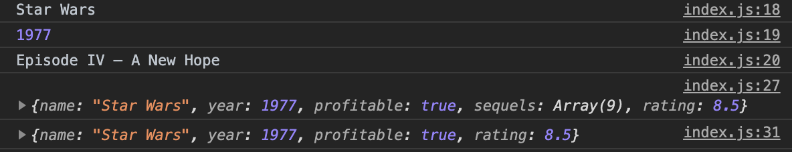
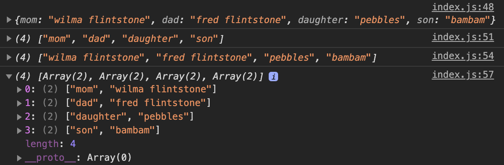
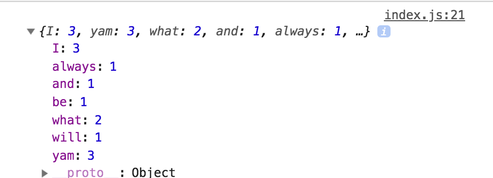
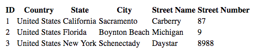
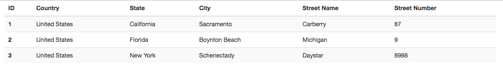

# Module 11 Class 2: JavaScript Objects and DOM Manipulation

## Overview

Before class, walk through this week's Challenge assignment in office hours; then, in class, the students will delve further into JavaScript as they learn to perform more sophisticated operations and data manipulation. Then, they’ll learn how to manipulate the HTML DOM with `D3.js`. 

The main areas of focus for today's class are to have students access, create, update, and iterate over JavaScript objects, use JavaScript to populate and filter data structures based on user input, and apply these changes to a webpage using the `D3.js` library to dynamically manipulate DOM elements. 

## Learning Objectives

By the end of class, students will be able to:

* Use `forEach()` and callback functions
* Create, update, and iterate JavaScript objects.
* Understand the basic structure of a Bootstrap HTML table
* Use `D3.js` for basic DOM manipulation
* Populate and filter tables using static data structures
* Use D3 to attach events to DOM elements
* Dynamically manipulate the DOM through events

- - -

## Instructor Notes

The activities in this class will complement Lessons **11.5.1: Introduction to Dynamic Tables** through **11.6.3: Customize the Page with CSS**. The students will benefit from these activities if they‘ve progressed through these lessons, which cover the following concepts, techniques, and tasks:  

* Using `forEach()` and callback functions
* Creating, updating, and iterating over JavaScript objects
* Attach and manipulate the DOM with `D3.js`


## Slides

[JavaScript Day 2 slideshow](https://docs.google.com/presentation/d/1cszXu4SisNsk9IaLzrK3St0GDNWmZZ3Ob5igAn2jVmY/edit?usp=sharing)

## Student Resources

Share the following [activity resources](https://2u-data-curriculum-team.s3.amazonaws.com/data-viz-online-lesson-plans/11-Lessons/11-2-Student_Resources.zip) with the students. 

- - - 

## Before Class

### 0. Office Hours

| Activity Time: 0:30       |  Elapsed Time:     -0:30  |
|---------------------------|---------------------------|

<details>
  <summary><strong>📣 Instructor Do: Challenge Instruction Walkthrough</strong></summary>

Let the students know that the first few minutes of Office Hours will include a walkthrough of the Challenge requirements and rubric, as well as helpful tips they need in order to be successful.

Open the Challenge in Canvas and go through the high-level instructions and requirements with your class. Be sure to check for understanding.

Open the Rubric in Canvas and go through the Mastery column with your class, and show how it maps back to the requirements for each deliverable. Be sure to check for understanding.

Review the following tips to ensure clarity on the Challenge:

* For this Challenge, they'll need to modify their `index.html` file to remove the list element that creates the button, and then create four new list elements for the additional search criteria. 

* Next, they'll need to modify their `app.js` file to accommodate the new search parameters. To help the learners, we have provided [starter code](../../../01-Assignments/11-UFOs/Resources/ufo_starterCode.js) that has comments as to where the learners will need to add code to complete the Challenge. 

  * After they create the variable that will keep track of all the filters as a JavaScript object, they'll need to modify the event listener on line 62, which detects changes on each input element created in the `index.html` file and calls the `updateFilters();` function. 

  * Then, they'll need to write code in the `updateFilters();` function to hold all the values and ids of the filters that were changed through user input in the variable created in Step 1. If learners have a difficult time with this part, we have provided a video to help them get started.

  * Next, they'll need to write code in the `filterTable();` function to filter the dataset based on the search criteria that is stored in the filters object. In this function, they'll need to use the `forEach([key, value])` as they are looping through the filters, and then they’ll use the `filter` method to filter the table data based on the value for the row's property.

  * Finally, they'll need to rebuild the table based on the filtered data. 

For **Deliverable 2: A written report on the UFO analysis**, the students will be writing a report in the repository README.md file based on their analysis, just like they have done in the previous modules.

In the **Results** section, the students need to walk through how the new webpage can use the new search criteria. Encourage them to use images of the webpage during the filtering process to support their explanation.

In the **Summary** section, the students need to describe one drawback of this new design and two recommendations for further development.

Encourage your class to begin the Challenge as soon as possible, if they haven’t already, and to use the Learning Assistants channel and the remainder of Office Hours with their instructional team for help as they progress through their work. If they feel like they need context to understand documentation or instructions throughout the week, this is where they can get it.

Open the floor to discussion and ensure to answer any questions they may have about the Challenge requirements before moving on to other areas of interest.

</details>

<details>
  <summary><strong>📣  Instructor Do: Office Hours</strong></summary>

For the remaining time, remind the students that this is their time to ask questions and get assistance from their instructional staff as they’re learning new concepts and working on the Challenge assignment.

Expect that students may ask for assistance. For example: 

* Challenge assignment 
* Further review on a particular subject
* Debugging assistance
* Help with computer issues
* Guidance with a particular tool

</details>


- - - 

## During Class 

### 1. Getting Started

| Activity Time:       0:10 |  Elapsed Time:      0:10  |
|---------------------------|---------------------------|

<details>
  <summary><strong>📣 1.1 Instructor Do: Foundation Setting (0:05)</strong></summary>

* Welcome students to class.

* Direct students to post individual questions in the Zoom chat to be addressed by you and your TAs at the end of class.

* Open the slideshow and use slides 1-7 to walk through the foundation setting with your class.

* **This Week - JavaScript:** Talk through the key skills that students will learn this week, and let them know that they are building on their web visualization skills. 

* **Today's Objectives:** Now, outline the concepts covered in today's lesson. Remind students that they can find the relevant activity files in the “Getting Ready for Class” page in their course content. 

</details>

<details>
  <summary><strong>🎉 1.2 Everyone Do: Check-In (0:05)</strong></summary>

* Ask the class the following questions and call on students for the answers:

    * **Q:** How are you feeling about your progress so far?

    * **A:** We are adding to our JavaScript skill set. It's important to look back and see what we’ve accomplished, and acknowledge that it's a lot! It’s also okay to feel overwhelmed as long as you don’t give up. The more you practice, the more comfortable you'll be coding.
    
    * **Q:** How comfortable do you feel with this topic? 

    * **A:** Let's do "fist to five" together. If you are not feeling confident, hold up a fist (0). If you feel very confident, hold up an open hand (5).

</details>

<sub>[Having issues with this section? Report a bug!](https://bit.ly/2Ng4iFW)</sub>

- - -

### 2. Movie Scores forEach

| Activity Time:       0:20 |  Elapsed Time:      0:30  |
|---------------------------|---------------------------|

<details>
  <summary><strong>🎉 2.1 Everyone Do: forEach and Callbacks (0:20)</strong></summary>

* In this activity, the students will compare the traditional `for` loop with the `forEach()` method. Although both loop over an array, a `for` loop will repeat until a specified condition is met, while `forEach()` will call a function once for each element.

* Make sure the students can download and open the following files from the AWS link:
  * The [instructions](Activities/01-Evr_Movie_Score_forEach/README.md)
  * The [index_starter.js](Activities/01-Evr_Movie_Score_forEach/Unsolved/index_starter.js) file.
  * The [index.html](Activities/01-Evr_Movie_Score_forEach/Unsolved/index.html) file.

* You can use slides 9 - 11 to introduce students to the `forEach()` method.

* Open the [Activities/01-Evr_Movie_Score_forEach/Solved/index.js](Activities/01-Evr_Movie_Score_forEach/Solved/index.js) file and live code this activity, pausing frequently so students can follow along.

* First, show how to create a basic function then open the console and show them the output.

  ```javascript
  function printName (name) {
      console.log(name);
  };

  printName("Todd");
  ```

* **Q:** Ask the students how to create a traditional `for` loop to iterate through an array called `students`.

* **A:** If students are stuck, give them hints from the following code.

  ```javascript
  var students = ["Yancy", "Lydia", "Essie", "Gregori", "Hans", "Victoria"]
  for (var i = 0; i < students.length; i++) {
    printName(students[i]);
  }
  ```

* Now, show the students how to iterate through the same array using the `forEach()` method.

  ```javascript
  students.forEach(printName);
  ```

* Remind students that with `forEach()`, a function is called and performs an action on each element in the array.

* Point out that the temporary variable `i` is no longer needed.

* Additionally, explain that an anonymous `inline function` can be utilized instead of declaring a separate function.

  ```javascript
  students.forEach(function(name) {
    console.log(name);
  });
  ```

* Let the students know that the anonymous `function` is also referred to as a Callback function. A Callback function is one that is passed as an argument to another function that is to be "called back" at a later time. 

* Open [Activities/01-Evr_Movie_Score_forEach/Unsolved/index.html](Activities/01-Evr_Movie_Score_forEach/Unsolved/index.html) in a browser, and also open an inspector to display the results. Then, open [Activities/01-Evr_Movie_Score_forEach/Unsolved/index_starter.js](Activities/01-Evr_Movie_Score_forEach/Unsolved/index_starter.js) in a text editor and have the students help you with replacing the traditional `for` loop with `forEach()`.

* If students are struggling, replace the traditional `for` loop with the following:

    ```javascript
    movieScores.forEach(function(score) {
    // Add each score to the ratings count
    sum += score;
    ```

* Explain the following: 

  * A variable holding the ratings count is no longer necessary because we now have a function performing the same task.

  * This function takes each rating score and adds it to the variable `sum`.

  * Next, the conditional statements are nested inside the `forEach()` method.

  * The remainder of the original code is untouched.

* Send out the [Activities/01-Evr_Movie_Score_forEach/Solved](Activities/01-Evr_Movie_Score_forEach/Solved/) folder for students to refer to later.

* Ask the class the following questions and call on students for the answers:
    
    * **Q:** Where have we used this before?

    * **A:**  The `forEach()` method was covered in Lesson 11.5.2.

    * **Q:** What can we do if we don't completely understand this?

    * **A:** We can refer to the lesson plan and reach out to the instructional team for help.


* Answer any questions before proceeding to the next activity.

</details>

<sub>[Having issues with this activity? Report a bug!](https://bit.ly/2MK1pNL)</sub>

- - - 

### 3. Word Frequency Counter

| Activity Time:       0:30 |  Elapsed Time:      1:00  |
|---------------------------|---------------------------|

<details>
  <summary><strong>📣 3.1 Instructor Do: JavaScript Objects (0:10)</strong></summary>

* You can use slides 12 - 17 to present this activity.

* Explain to students that JavaScript objects are similar to Python dictionaries. Assure students that their ample experience with Python dictionaries as well as parsing and dealing with JSON data (JavaScript Object Notation) will serve them well today.

* Take a moment to **summarize** some things we know about Python dictionaries:

  * They **organize** information in `key` and `value` pairings.

  * Unlike lists, key-value pairs are **unordered**.

  * The `key` is used to **access** the `value`.

* Open [index.html](Activities/02-Ins_JavaScript_Objects/Solved/index.html) in a browser and [index.js](Activities/02-Ins_JavaScript_Objects/Solved/index.js) with a text editor.

* Explain that JavaScript objects look very similar to Python dictionaries.

  ```javascript
  let movie = {
    name: "Star Wars",
    year: 1977,
    profitable: true,
    sequels: ["Episode IV – A New Hope ",
   "Episode V – The Empire Strikes Back", 
   "Episode VI – Return of the Jedi", 
   "Episode I – The Phantom Menace", 
   "Episode II – Attack of the Clones ", 
   "Episode III – Revenge of the Sith", 
   "Episode VII – The Force Awakens ", 
   "Episode VIII – The Last Jedi", 
   "Episode IX – The Rise of Skywalker"]
  };
  ```

  * Each `key` can hold any one of the data types as its `value`, including a string, a boolean, or an array. It can even hold an object.

* To retrieve a `value` from the object, both **dot** notation and **bracket** notation can be used for the `key`. However, the **dot** notation is preferred.

  ```javascript
  console.log(movie.name);
  console.log(movie.year);
  console.log(movie.sequels[0]);
  ```

  ```javascript
  console.log(movie["name"]);
  ```

* Show that, much like in Python, a property can be added to a JavaScript object simply by specifying a key and assigning it a value:

  ```javascript
  movie.rating = 8.5;
  console.log(movie);
  ```

* Show that key-value pairs can also be deleted:

  ```javascript
  delete movie.sequels;
  console.log(movie);
  ```

* Show the updated object in the browser:

  

* Similar to Python, it's possible to test whether a `key`, or a `property`, exists in an `object`:

  ```javascript
  if (movie.rating !== undefined) {
    console.log("This movie has a rating!");
  }
  ```

  * If the `movie` object has a `property` named "rating," the console prints the statement.

* Finally, demonstrate how to loop through an object.

  ```javascript
  for (const prop in movie) {
    console.log(movie[prop]);
  }
  ```

  * This code loops through the key-value pairs of the `movie` object.

  * The variable `prop` represents the object's key in each iteration.

  * During each iteration in this `for` loop, the value of the key-value pair is printed to the console with `movie[prop]`.

* Explain that JavaScript has several more built-in methods to manipulate objects. Here, the object is a cartoon family:

  ```javascript
  var people = {
    mom: "wilma flintstone",
    dad: "fred flintstone",
    daughter: "pebbles",
    son: "bambam"
  };
  console.log(people);
  ```

* Explain that `Object.keys()` displays all the `keys` of an object.

  ```javascript
  console.log(Object.keys(people));
  ```

  * The method takes the name of the object as its argument.

* Similarly, show that `Object.values()` displays all the `values` of an object.

  ```javascript
  console.log(Object.values(people));
  ```

* Finally, show that to access both keys and values, `Object.entries()` can be used:

  ```javascript
  console.log(Object.entries(people));
  ```

  * Each key-value pair is returned inside an array.

* As you show the results in the console, briefly reiterate the methods outlined above:

  

* Send out the [02-Ins_JavaScript_Objects/Solved](Activities/02-Ins_JavaScript_Objects/Solved/) folder for students to refer to later.

* Ask the class the following questions and call on students for the answers:

    * **Q:** Where have we used this before?

    * **A:** JavaScript objects were covered in Lesson 11.2.3.

    * **Q:** How does this activity equip us for the Challenge?

    * **A:** We will use functions to complete the Challenge. 

    * **Q:** What can we do if we don't completely understand this?

    * **A:** We can refer to the lesson plan and reach out to the instructional team for help.

* Answer any questions before moving on to the student activity.

</details>

<details>
  <summary><strong>✏️ 3.2 Students Do: Word Frequency Counter (0:15)</strong></summary>

* In this activity, students will create a function in JavaScript that uses the `forEach()` method to count the number of occurrences of each word in a string. 

* Make sure the students can download and open the following files from the AWS link:
  * The [instructions](Activities/03-Stu_Word_Counter_Objects/README.md)
  * The [index_starter.js](Activities/03-Stu_Word_Counter_Objects/Unsolved/index_starter.js) file.
  * The [index.html](Activities/03-Stu_Word_Counter_Objects/Unsolved/index.html)
 file.

* Go over the instructions in the README, and then divide students into breakout groups of 3-5. They should work on the solution by themselves but can reach out to others in their group for tips.

* Let students know that they may be asked to share and walk through their work at the end of the activity.

</details>

<details>
  <summary><strong>⭐ 3.3 Review Word Frequency Counter (0:05)</strong></summary>

* Once time is complete, ask for volunteers to share their solution. Remind them that it is perfectly alright if they didn't complete the activity. 

* To encourage participation, you can ask the students to help you write the code for the function. 

* If there are no volunteers, open up the solved [index.html](Activities/03-Stu_Word_Counter_Objects/Solved/index.html) in a browser and then open the Chrome Inspector console to display the results. Next, open the solved [index.js](Activities/03-Stu_Word_Counter_Objects/Solved/index.js) file in a text editor. 

* Explain that the function should print an object like this to the console:

  

  * Each word in the string is a `key` in this object, and the frequency of its appearance is the `value`.

* Next, explain that the string is split into an array of words.

  ```javascript
  var stringArray = myString.split(" ");
  ```

  * An empty space is used as the delimiter. That is, the string is split wherever an empty space is found.

* Next, explain that an empty object is declared. This will hold each word and its word count as key-value pairs:

  ```javascript
  var wordFrequency = {};
  ```

* Explain that the `forEach()` method iterates over the array of words.

  ```javascript
  stringArray.forEach(function(currentWord){
    // If the word has been seen before...
    if (wordFrequency[currentWord] !== undefined) {
      // Add one to the counter
      wordFrequency[currentWord] += 1;
    }
    else {
      // Set the counter at 1
      wordFrequency[currentWord] = 1;
    }

  });
  ```

  * If the word in the current iteration exists in the `wordFrequency` object, its count is increased by 1.

  * If it does not yet exist in the object, it is added to it, and its word frequency is set to 1 (since it is being seen for the first time).

* Finally, the `wordFrequency` object is printed to the console.

* Send out the [03-Stu_Word_Counter_Objects/Solved](Activities/03-Stu_Word_Counter_Objects/Solved/) folder for students to refer to later.

* Answer any questions before moving on to the next activity.

</details>

<sub>[Having issues with this activity? Report a bug!](https://bit.ly/3qmAW7z)</sub>

- - - 

### 4. HTML and D3 Tables

| Activity Time:       0:25 |  Elapsed Time:      1:25  |
|---------------------------|---------------------------|

<details>
  <summary><strong>📣 4.1 Instructor Do: HTML Tables (0:05)</strong></summary>

* You can use slides 21 - 24 to present this activity to the class.

* Explain that data tables have their own HTML syntax.

* Demo the activity solution in the browser, then open [table.html](Activities/04-Ins_HTML_table/Solved/table.html) in an editor to explain the following points about HTML tables:

  

  * A table is created using a pair of `table` tags.

  * Each row of the table is created using `tr` tags.

  * For header rows, a special `th` tag is used to denote the header cells.

  * `td` tags are used to define table cells. `td` stands for [Table Data](https://www.w3schools.com/html/html_tables.asp) and represents each cell of data in the table.

  * The nesting here is important. You always have table cells (`td`) within rows (`tr`).

* Explain that we can use Bootstrap to create visually appealing data tables.

* Send out the link to the [Bootstrap Tables Documentation](https://getbootstrap.com/docs/3.3/css/#tables) for students to use as a reference.

* Next, demo the Bootstrap solution in the browser and open [bootstrap-table.html](Activities/04-Ins_HTML_table/Solved/table-bootstrap.html) in an editor to explain the following points about HTML tables:

  

  * Bootstrap adds additional table classes to the HTML tags to style the table.

  * Bootstrap tables also use `thead` and `tbody` tags to separate the table header code from the table body code.

  * Explain that within `thead`, the header is still defined using a `tr` row with `th` tags for header cells.

  * Explain that `tbody` uses one `tr` tag per row, with `td` tags for each data cell.

* Explain that manually building HTML tables can become a tedious task, but we can use JavaScript to automate this process, as we'll cover next.

* Send out the [06-Ins_HTML_table/Solved/](Activities/04-Ins_HTML_table/Solved/) folder for students to refer to later.

* Ask the class the following questions and call on students for the answers:

    * **Q:** Where have we used this before?

    * **A:** HTML elements were covered in Lesson 11.2.4, and Bootstrap components were covered in Lesson 11.6.1.

    * **Q:** How does this activity equip us for the Challenge?

    * **A:** We will need to be familiar with HTML elements to complete the Challenge. 

    * **Q:** What can we do if we don't completely understand this?

    * **A:** We can refer to the lesson plan and reach out to the instructional team for help.

* Answer any questions before moving on to the student activity.

</details>


<details>
  <summary><strong>🎉 4.2 Everyone Do: D3 Table (0:20)</strong></summary>

* In this activity, students will use D3 to select data and build a raw table

* Make sure the students can download and open the following files from the AWS link:
  * The [index_starter.js](Activities/05-Evr_D3_Table/Unsolved/index_starter.js) file.
  * The [data.js](Activities/05-Evr_D3_Table/Unsolved/data.js) file.
  * The [index.html](Activities/05-Evr_D3_Table/Unsolved/index.html) file.

* Open the [index.html](Activities/05-Evr_D3_Table/Unsolved/index.html) file and show the starter code for the table.

* Show the data structure for the weather report in `data.js`.

* Open the [index_starter.js](Activities/05-Evr_D3_Table/Unsolved/index_starter.js) file and live code each step with the class. Highlight the following points:

  * Use `console.log` at each step to verify the format and structure of the data.

  * Each weather report is stored as an array of objects, so the first step is to iterate through that array with `forEach`.

    ```javascript
    data.forEach(function(weatherReport) {
      console.log(weatherReport);
    });
    ```

  * Each weather report needs its own row in the table.

    ```javascript
    data.forEach(function(weatherReport) {
      console.log(weatherReport);
      var row = tbody.append("tr");
    });
    ```

  * `Object.entries` can be used to create an array of key-value pairs for each weather report object.

    ```javascript
    data.forEach(function(weatherReport) {
      console.log(weatherReport);
      var row = tbody.append("tr");

      Object.entries(weatherReport).forEach(function([key, value]) {
        console.log(key, value);
      });
    });
    ```

  * A cell for each value can then be appended to the row.

    ```javascript
    data.forEach(function(weatherReport) {
      console.log(weatherReport);
      var row = tbody.append("tr");
      Object.entries(weatherReport).forEach(function([key, value]) {
        console.log(key, value);
        // Append a cell to the row for each value in
        // the weather report object
        var cell = tbody.append("td");
        cell.text(value);
      });
    });
    ```

  * Finally, we can refactor the code to use arrow functions.

    ```javascript
    data.forEach((weatherReport) => {
      var row = tbody.append("tr");
      Object.entries(weatherReport).forEach(([key, value]) => {
        var cell = tbody.append("td");
        cell.text(value);
      });
    });
    ```

* Explain that this code snippet will be a key part of the Challenge solution.

* Send out the [05-Evr_D3_Table/Solved](Activities/05-Evr_D3_Table/Solved/) folder for students to refer to later.

* Answer any questions before moving on.

</details>

<sub>[Having issues with this activity? Report a bug!](https://bit.ly/3rKOOsb)</sub>


- - - 

### 5. On Change

| Activity Time:       0:30 |  Elapsed Time:      1:55  |
|---------------------------|---------------------------|

<details>
  <summary><strong>📣 5.1 Instructor Do: D3 Event Listeners (0:10)</strong></summary>

* You can use slides 27 - 34 to present this lesson to the class.   

* Explain that the activities so far have selected or appended elements in the HTML. This code is executed when the browser is loaded. What makes JavaScript really interesting is that it can listen for user events on the page and execute code when these events are detected. This provides an incredibly powerful mechanism for building dynamic and interactive applications.

* Inform the class that several event types are supported by the browser, including:

  * `click`

  * `change`

  * `keydown`

  * `keyup`

  * `scroll`

  * `pointerenter`

  * `pointerleave`

  * and many more!

* Send out a reference to [web events](https://developer.mozilla.org/en-US/docs/Web/Events).

* Before demonstrating any syntax, explain that events have:

  * A target: a reference to the object that dispatched the event.

  * A handler: a function that should be executed in response to the event occurring.

* Open [Activities/06-Ins_Event_Listeners/Solved/index.html](Activities/06-Ins_Event_Listeners/Solved/index.html).

* Click the **Click Me!** button to show the dynamic nature of the button click.

* Open the Chrome Inspector window and demonstrate the different functions available in [Activities/06-Ins_Event_Listeners/Solved/index.js](Activities/06-Ins_Event_Listeners/Solved/index.js).

* Explain the following:

  * Event handlers are just normal functions that you call when an event occurs.

    ```javascript
    // This function is triggered when the button is clicked
    function handleClick() {
      console.log("Hi, button1 was clicked!");

      // We can use D3 to see the object that dispatched the event
      console.log(d3.event.target);
    }
    ```

  * Events are attached using the `.on()` function in d3.

    ```javascript
    button1.on("click", handleClick);
    ```

  * The event target is the object that triggered the event. This can be referenced with `d3.event.target`.

  * Event handlers can also be defined inline.

    ```javascript
    button2.on("click", function() {
      console.log("Hi, button2 was clicked!");
      console.log(d3.event.target);
    });
    ```

  * Event handlers are just normal functions that can execute code or call other functions.

    ```javascript
    button3.on("click", function() {
      console.log("Hi, button3 was clicked!");
      console.log(d3.event.target);
      d3.select(".giphy-me").html("");
    });
    ```

  * Input elements can trigger change events. The value of the element can be referenced with `d3.event.target.value`.

    ```javascript
    inputField.on("change", function() {
      var newText = d3.event.target.value;
      console.log(newText);
    });
    ```

* Send out the [06-Ins_Event_Handlers/Solved/](Activities/06-Ins_Event_Listeners/Solved/) folder for students to refer to later.

* Ask the class the following questions and call on students for the answers:

    * **Q:** Where have we used this before?

    * **A:** HTML elements were covered in Lesson 11.2.4, and Bootstrap components were covered in Lesson 11.6.1.

    * **Q:** How does this activity equip us for the Challenge?

    * **A:** We will need to be familiar with HTML elements to complete the Challenge. 

    * **Q:** What can we do if we don't completely understand this?

    * **A:** We can refer to the lesson plan and reach out to the instructional team for help.

* Answer any questions before moving on to the student activity.

</details>

<details>
  <summary><strong>✏️ 5.2 Students Do: On Change (0:15)</strong></summary>

* In this activity, students will use D3 to reverse the input text and display it on the page.

* You can use slides 35 - 36 to introduce this student activity. 

* Make sure the students can download and open the following files from the AWS link:
  * The [instructions](Activities/07-Stu_onChange/README.md)
  * The [app_starter.js](Activities/07-Stu_onChange/Unsolved/static/js/app_starter.js) file
  * The [index.html](Activities/07-Stu_onChange/Unsolved/index.html)
 file

* Go over the instructions in the README, and then divide students into breakout groups of 3-5. They should work on the solution by themselves but can reach out to others in their group for tips.

* Let students know that they may be asked to share and walk through their work at the end of the activity.

</details>

<details>
  <summary><strong>⭐ 5.3 Review: On Change (0:05)</strong></summary>

* Once time is complete, ask for volunteers to share their solution. Remind them that it is perfectly alright if they didn't complete the activity. 

* To encourage participation, you can ask the students to help you write the code for the function. 

* If there are no volunteers, open up the solved [index.html](Activities/07-Stu_onChange/Solved/index.html) in a browser, and then open the Chrome Inspector console to display the results. Next, open the solved [app.js](Activities/07-Stu_onChange/Solved/static/js/app.js) file in a text editor and be sure to point out the following:

  * We first need to select the input and output elements that we need to monitor or update.

    ```javascript
    var text = d3.select("#text");
    var output = d3.select(".output");
    ```

  * At the end of our file, we use the `.on()` method to detect changes to the input field. Then, pass in a call to the `handleChange` function. 

    ```javascript
    text.on("change", handleChange);
    ```

  * We select the text directly from the event target.

    ```javascript
    let inputText = d3.event.target.value;
    ```

  * Then, pass the `inputText` variable into the `reverseString` function.

  * After reversing the string, we use `.text()` to set the output `h1` text as the reversed text.

    ```javascript
    output.text(reversedInput);
    ```

* If time permits, cover the bonus and explain the following:

  * Before we append any new `li` tags, `.html("")` is used to clear any old `li` tags.

  * We use `Object.entries(frequencyCounts)` to create an array of key-value pairs where the key is the character and the value is the count.

  * We can then iterate over that array using `forEach`.

  * Finally, we append each `word: count` pair as a new `li` element.

    ```javascript
    var li = output.append("li").text(`${key}: ${value}`);
    ```

* Send out the [Activities/07-Stu_onChange/Solved](Activities/07-Stu_onChange/Solved) folder for students to refer to later.

* Answer any questions before ending class.

</details>

<sub>[Having issues with this activity? Report a bug!](https://bit.ly/3aPQLgs)</sub>

- - -

### 6. Ending Class 

| Activity Time:       0:05 |  Elapsed Time:      2:00  |
|---------------------------|---------------------------|

<details>
  <summary><strong>📣  6.1 Instructor Do: Review </strong></summary>

* Before ending class, review the skills that were covered today and mention where in the module these skills are used: 
  * JavaScript objects were covered in **Lesson 11.2.3**.
  * HTML elements were covered in **Lesson 11.2.4**.
  * The `forEach()` method was covered in **Lesson 11.5.2**.
  * Adding filters using `d3.select()` was covered in **Lesson 11.5.3**. 
  * Adding event listeners using `on()` was covered in **Lesson 11.5.4**. 
  * Using Bootstrap components was covered in **Lesson 11.6.1**. 

* Answer any questions the students may have.

</details>

<sub>[Having issues with this section? Report a bug!](https://bit.ly/3aao8vk)</sub>

- - - 

© 2021 Trilogy Education Services, LLC, a 2U, Inc. brand.  Confidential and Proprietary.  All Rights Reserved.