# Module 12 Class 1: Plotly Basics

## Overview

This week, we will be introducing `Plotly.js`, a JavaScript visualization library. Students will learn to use Plotly and JavaScript to create an interactive data visualization for the web.

In today's class, students will use Plotly to create basic plots. Then, they will transform their plots using the JavaScript `filter()`, `map()`, `sort()`, and `slice()` methods. Finally, they will use arrow functions to shorten the syntax of their functions.

## Learning Objectives

By the end of class, students will be able to:

* Create basic plots, including box and pie charts, with Plotly.
* Use the following JavaScript methods to transform their plots:
 * map
 * filter
 * slice
 * sort
* Create anonymous functions with the arrow function.

- - -

## Instructor Notes

* The activities in this class will complement Lessons **12.1.1: Organizing Your Tools** through **12.2.2 Practicing JavaScript Methods**.  The students will benefit from these activities if they‘ve progressed through these lessons, which cover the following concepts, techniques, and tasks:

* Creating basic plots
* Adding data to a trace object
* Using `filter()`, `map()`, and arrow functions.
* Using the `slice()` and `sort()` methods.

## Slides

[Plotly Day 1 slideshow](https://docs.google.com/presentation/d/1KaaCyZ79HO0gfQKAhvPh1M4S_2YDl7up-cutLyQEQZo/edit?usp=sharing)

## Student Resources

Share the following [activity resources](https://2u-data-curriculum-team.s3.amazonaws.com/data-viz-online-lesson-plans/12-Lessons/12-1-Student_Resources.zip) with the students.

- - -

## Before Class

### 0. Office Hours

| Activity Time: 0:30       |  Elapsed Time:     -0:30  |
|---------------------------|---------------------------|

<details>
 <summary><strong> 📣 0.1 Instructor Do: Office Hours</strong></summary>

* Before you begin class, hold office hours. Office hours should be driven by students. Encourage students to take full advantage of office hours by reminding them that this is their time to ask questions and get assistance from instructional staff as they learn new concepts.

* Expect that students may ask for assistance. For example:

 * Further review on a particular subject
 * Debugging assistance
 * Help with computer issues
 * Guidance with a particular tool

</details>

- - -

## During Class

### 1. Getting Started

| Activity Time:       0:15 |  Elapsed Time:      0:15  |
|---------------------------|---------------------------|

<details>
 <summary><strong>📣 1.1 Instructor Do: Foundation Setting (0:10)</strong></summary>

* Welcome students to class.

* Direct students to post individual questions in the Zoom chat to be addressed by you and/or your TAs at the end of class.

* Open the slideshow and use slides 1-12 to walk through the foundation setting with your class.

* **Big Picture:** This is an opportunity to zoom out and see the big picture of where they are in the program. Take a moment to mention some real-world examples illustrating the value of what they're learning this week.

* **Program Pointers:** Talk through some of the key logistical things that will help students stay on track. This is an opportunity to speak to what students may need when they're at this particular point of the program.

* **This Week - Plotly.js:** Talk through the key skills students will be learning this week. Let the students know that they will be using JavaScript with the Plotly library to create data visualizations on the web.

* **This Week's Challenge:** For this week's Challenge, let the students know that they'll be creating a webpage complete with multiple plots that represent the biodiversity of belly button bacteria. The students will need to create a horizontal bar chart, a bubble chart, and a gauge chart, all on a customized dashboard on a webpage.

* **Career Connection:** Let students know how they will be using the skills covered this week throughout their careers. It's important for them to know the "why." Give examples of when they may be used in work or when you have used those skills in your workplace.

* **How to Succeed This Week:** Remind your students that they may have moments of frustration this week as they learn something complex. These moments are great for deepening their knowledge. Use the side material to outline some of the topics that they may find tricky in this module. Consider sharing something about your personal learning journey. It helps students recognize that everyone starts somewhere and that they are not alone.

* **Today's Objectives:** Now, outline the concepts that will be covered in today's lesson. Remind students that they can find the relevant activity files in the “Getting Ready for Class” page in their course content.

</details>

<details>
 <summary><strong>🎉  1.2 Everyone Do: Check-In (0:05)</strong></summary>

* Ask the class the following questions and call on students for answers:

   * **Q:** How are you feeling about your progress so far?

   * **A:** Let them know that we are starting to build their skillset. It’s also okay to feel overwhelmed as long as you don’t give up.

   * **Q:** How comfortable do you feel with this topic?

   * **A:** Let's do "fist to five" together. If you are not feeling confident, hold up a fist (0). If you feel very confident, hold up an open hand (5).

</details>

<sub>[Having issues with this activity? Report a bug!](https://bit.ly/3acKI6i)</sub>

- - -

## 2. Welcome & Basic Plots with Plotly

| Activity Time:       0:35 |  Elapsed Time:      0:50  |
|---------------------------|---------------------------|

<details>
 <summary><strong>📣 2.1 Instructor Do: Why Plotly, and Goals (0:05)</strong></summary>

* Explain that the aim of this unit is for students to learn how to build interactive visualizations.

* You can use slides 14-17 to introduce this next section. Cover the following points in your discussion:

 * Data professionals not only need to analyze and draw conclusions based on data, but they also need to visualize the data to allow their audience to draw the same conclusions. Interactivity helps with this.

 * A JavaScript visual library like Plotly offers attractive data visualizations that can be disseminated to a wide audience.

* Emphasize that this week will be an opportunity for students to strengthen their JavaScript skills.

 * Learning JavaScript is a journey filled with challenges, but completing that journey can be incredibly rewarding.

 * A data professional with a strong JavaScript background can create powerful data stories by building interactivity into customer-facing visualizations.

* Send out the following article, which talks about the power of [interactive visualizations](https://www.forbes.com/sites/benkerschberg/2014/04/30/five-key-properties-of-interactive-data-visualization/).

* Walk through today's learning outcomes and class objectives.

</details>>

<details>
 <summary><strong>📣 2.2 Instructor Do: Basic Plots with Plotly (0:10)</strong></summary>

* In this activity, you will demonstrate the basic plots available with the Plotly library.

* Open [index.html](Activities/01-Ins_Basic_Plots/Solved/index.html) in your browser:

 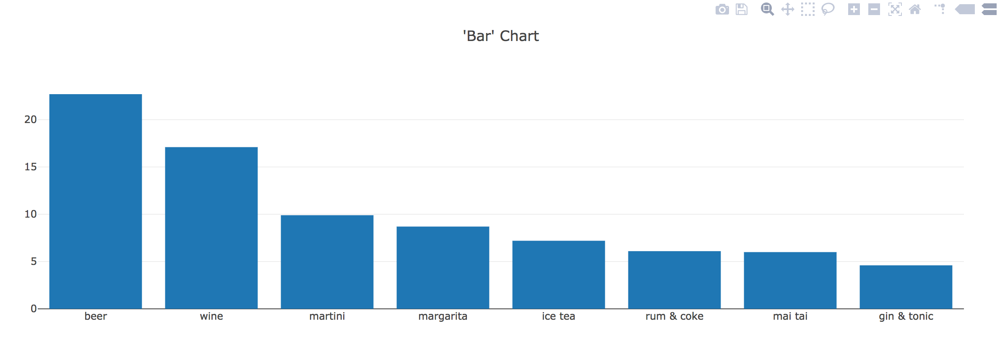

 * This is a bar chart plotting various types of drinks against the percentages of drinks ordered at a bar.

* Now open [plots.js](Activities/01-Ins_Basic_Plots/Solved/plots.js):

 ```javascript
 var trace1 = {
   x: ["beer", "wine", "martini", "margarita",
    "ice tea", "rum & coke", "mai tai", "gin & tonic"],
   y: [22.7, 17.1, 9.9, 8.7, 7.2, 6.1, 6.0, 4.6],
   type: "bar"
 };

 var data = [trace1];

 var layout = {
   title: "'bar' chart"
 };

 Plotly.newPlot("plot", data, layout);
 ```

* Show the students the code and explain that in Plotly, the term `trace` refers to an object that contains (1) data to be plotted and (2) specifications for plotting.

* Ask the class what `trace1` consists of:

 * Data for the x-axis stored as a key-value pair: **x** is the key, and an array of drink names is the value.

 * Data for the y-axis stored as a key-value pari: **y** is the key, and an array of drink order percentages is the value.

 * A specification for the type of the chart: **type** is the key, and "bar" is the value.

* Point out that in `var data = [trace1];`, `trace1` is enclosed in an array. The function we're passing it to expects trace objexts to be enclosed in an array, in case we need to pass in several different trace objects. In this case, we only have on trace objext, but it still needs to be saved in an array so we can pass it to the function.

 * Including multiple traces in the array will allow visualizing multiple traces in the same chart, which we will show later.

* Next, in the code is a layout object that contains title as a key and "Bar Chart" as its value. We'll use this to add a title to our visualization.

* Then, point out that in the last line of the script, we use the `plotly.newplot()` method to plot our chart. It takes three arguments:

 * The first, `"plot"`, refers to the `id` of the `div` where the plot will be displayed.

 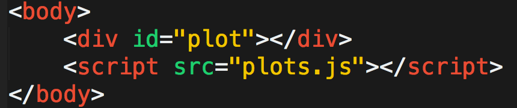

 * The second argument, `data`, refers to the trace.

 * The last argument, `layout`, is optional and refers, in this case, to the title displayed in the chart.

* Next, comment out the code from Part 1 and uncomment the code from Part 2 in `plots.js`. Reload `index.html`. Bring to students' attention that we've now added labels for the x-axis and y-axis.

 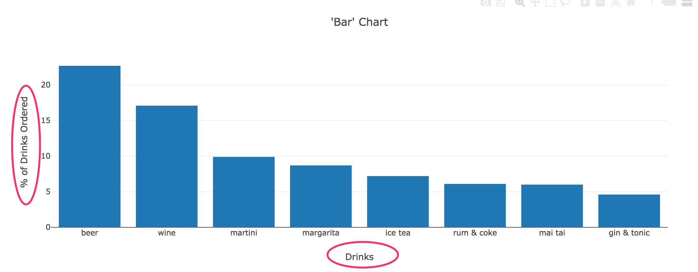

* Open the JavaScript code and explain that we have simply added `xaxis` and `yaxis` specifications to the `layout` object:

 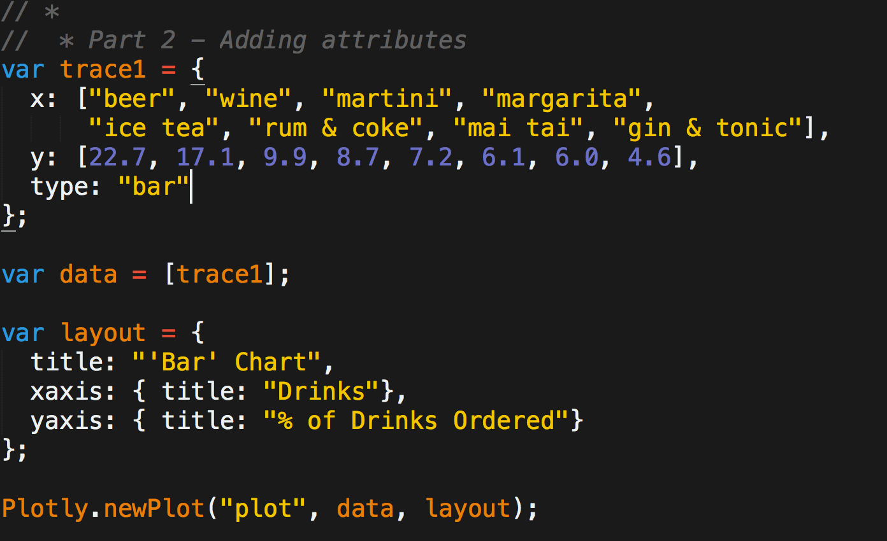

* Next, comment out the code from Part 2 and uncomment the code from Part 3. Load `index.html` again:

 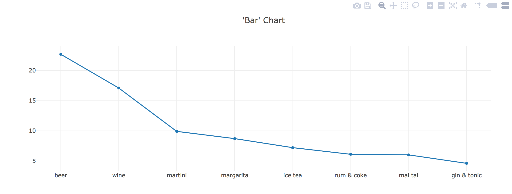

* Open the code file and explain that in the code, we've removed the `xaxis` and `yaxis` entries from the layout object, and we've changed `type` to "line" in the the `trace1` object. The change in the `type` is responsible for the primary change in the visualization.

 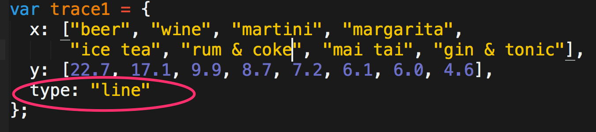

* Next, ask the class whether we can change the specification to type: "pie" to create a pie chart. Comment-out code section 3, uncomment code section 4, and show the revised `trace1` object to the class. Refresh the browser, and show that it doesn't work. Obviously, changing type to "pie" in the `trace1` object isn't enough to create a pie chart.

* Uncomment the code in Part 5 and reload the page. We get a pie chart!

 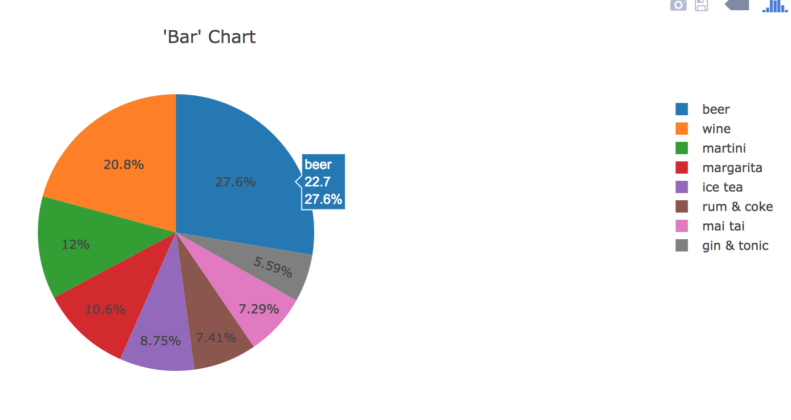

* Send out the link to the [pie chart documentation](https://plot.ly/javascript/pie-charts/) and ask the class how they might fix the broken pie chart.

* Show the code to the class:

 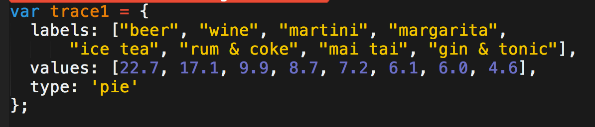

 * In `trace1`, instead of `x` and `y`, we use the keys `labels` and `values`.

 * We also specify the type of chart as `'pie'`.

* Send out the [01-Ins_Basic_Plots](Activities/01-Ins_Basic_Plots/Solved/) files for students to refer to later.

* Ask the class the following questions and call on students for the answers:

   **Q:** Where have we used this before?

   **A:** We created basic plots in Lessons 12.1.3 and 12.1.4 .

   **Q:** How does this activity equip us for the Challenge?

   **A:** We will need to create different types of charts to display bacterial data.

   **Q:** What can we do if we don't completely understand this?

   **A:** We can refer to the lesson plan and look over the reference guide on common commands.

* Send out the [solution files](Activities/01-Ins_Basic_Plots/Solved/) for students to review later.

* Answer any questions before moving on.

</details>

<details>
 <summary><strong>✏️  2.3 Student Do: A Flicker of the Eye (0:15)</strong></summary>

* In this activity, students will create a Plotly bar chart that shows the relationship between eye color and the frequency of eye flickers.

* Open up the [index.html](Activities/02-Stu_First_Chart/Solved/index.html) in the browser to show the students the bar chart they will be creating.

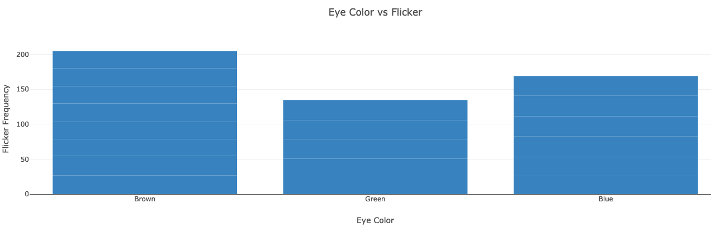

* Make sure the students can download and open the [instructions](Activities/02-Stu_First_Chart/README.md) and the [starter code](Activities/02-Stu_First_Chart/Unsolved) from the AWS link.

* Go over the instructions with the students and answer any questions before breaking the students out in groups.

* Divide students into groups of 3-5. They should work on the solution by themselves, but they can talk to others in their group to get tips.

* Let students know that they may be asked to share and walk through their work at the end of the activity.

</details>

<details>
 <summary><strong>⭐ 2.4 Review: A Flicker of the Eye (0:05)</strong></summary>

* Once time is up, ask for volunteers to walk through their solution. Remind them that it is perfectly alright if they didn't finish the activity.

* To encourage participation, you can open the [starter code](Activities/02-Stu_First_Chart/Unsolved/plots.js) and ask the students to help you create the trace.

* Continue this process for the rest of the code.

* If there are no volunteers, open up the [solution file](Activities/02-Stu_First_Chart/Solved/plots.js) and review it line by line with the class, answering whatever question students may have.

* Key points to cover over the course of the discussion:

 * Create the trace by setting the x value, y value, and type of chart.

 ```javascript
 // create the trace
 var trace1 = {
   x: eyecolor,
   y: eyeflicker,
   type: "bar"
 };
 ```

 * Store the trace in an array for the plot.

 ```javascript
 // create the data array for the plot
 var data = [trace1]
 ```

 * Set the labels.

 ```javascript
 // define the plot layout
 var layout = {
   title: "eye color vs flicker",
   xaxis: { title: "eye color" },
   yaxis: { title: "flicker frequency" }
 };
 ```

 * Plot the chart.

 ```javascript
 // plot the chart to a div tag with id "bar-plot"
 plotly.newplot("bar-plot", data, layout);
 ```

* Explain that the plot has the following quirk: we have multiple data points for each eye color, but Plotly does not plot them all. It plots their aggregate and only includes the last value listed for each eye color in the hover label.

 * For example, for "brown," the final flicker value listed in the CSV file is 24.5.

* Explain that a more meaningful way to plot this data may be to take the average flicker value for each eye color.

* Send out the [solution files](Activities/02-Stu_First_Chart/Solved/) for students to review later.

* Answer any questions before moving on.

</details>

<sub>[Having issues with this activity? Report a bug!](https://bit.ly/3pcXF4l)</sub>

- - -

### 3. Filtering

| Activity Time:       0:35 |  Elapsed Time:      1:25  |
|---------------------------|---------------------------|

<details>
 <summary><strong>📣 3.1 Everyone Do: Filter/Map/Arrow Warm-Up (0:15)</strong></summary>

* Provide an overview of the activity: we will review and then use `filter()`, `map()`, and arrow functions to create a bar chart with Plotly.

* Encourage students to code along using the [starter code](Activities/03-Evr_Filter_Warmup/Unsolved/).

* Open the [data.js](Activities/03-Evr_Filter_Warmup/Solved/data.js) file and show that the `topmovies` array has 10 objects.

* Open [index.html](Activities/03-Evr_Filter_Warmup/Solved/index.html) in a browser and show that there are fewer than 10 bars in the bar chart. When we filter `topmovies` for an `imdbrating` that is higher than 8.9, only 4 of the top 10 movies are displayed.

 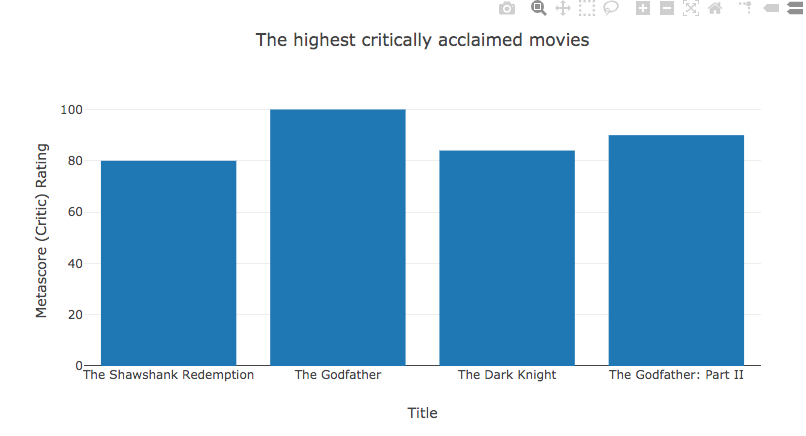

* Open the unsolved [plot.js](Activities/03-Evr_Filter_Warmup/Unsolved/plot.js) and code out the `filter()` method. Explain that it is used to create a custom filtering function that returns movies with an IMDB rating higher than 8.9.

   ```js
  // 1. Use the filter method to create a custom filtering function
  //  that returns the movies with a rating greater than 8.9

  function filterMovieRatings(movie) {
    return movie.imdbRating > 8.9;
  }

  // 2. Use filter() to pass the function as its argument
  var filteredMovies = topMovies.filter(filterMovieRatings);

  //  Check to make sure your are filtering your movies.
  console.log(filteredMovies);
   ```

* Next, review the map() method, which can be used to create new arrays. The map() method creates new arrays from the title and metascore properties of each object in the filtered dataset. Point out that we're using an arrow function as the callback of each map() function.

  ```js
  // 3. Use the map method with the arrow function to return all the filtered movie titles.
  var titles = filteredMovies.map(movies =>  movies.title);

  //  Check your filtered movie titles
  console.log(titles);

  // 4. Use the map method with the arrow function to return all the filtered movie metascores.
  var ratings = filteredMovies.map(movies => movies.metascore);

  //  Check your filtered metascores.
  console.log(ratings);
  ```

* Walk through the `var trace` object.

 ```javascript
 // 5. create your trace.
 var trace = {
   x: titles,
   y: ratings,
   type: "bar"
 };
 ```

 * We assign the `titles` array to the x-axis and the `ratings` array to the y-axis.

 * We specify the type of chart as a bar plot with `type: "bar"`.

* Remind students that:

 * `var data = [trace];` is an array of trace objects. It could hold many trace objects, but in this case, it only hold one, which we've simply named trace.

 * `var layout` defines the plot layout.

 * `Plotly.newPlot()` plots the chart and takes the arguments.

 * `"bar-plot"` refers to the `id` of the `div` where the plot will be displayed.

 * `data` refers to the trace.

 * `layout` refers to the title and axis titles displayed in the chart.

 ```javascript
  // 6. Create the data array for our plot
  var data = [trace];

  // 7. Define our plot layout
  var layout = {
    title: "The highest critically acclaimed movies",
    xaxis: { title: "Title" },
    yaxis: { title: "Metascore (Critic) Rating"}
  };

  // 8. Plot the chart to a div tag with id "bar-plot"
  Plotly.newPlot("bar-plot", data, layout);
 ```

* Ask the class the following questions and call on students for the answers:

 **Q:** Where have we used this before?

 **A:** We functional JavaScript methods in Lesson 12.2.1.

 **Q:** How does this activity equip us for the Challenge?

 **A:** We will use the `filter()` and `map()` methods to grab the desired sample numbers and match their `id`.

 **Q:** What can we do if we don't completely understand this?

 **A:** We can refer to the lesson plan and look over the reference guide on common commands.

 * Send out the [solution files](Activities/03-Evr_Filter_Warmup/Solved/) for students to review later.

* Answer any questions before moving on.

</details>

<details>
 <summary><strong>✏️ 3.2 Student Do: Fastest-Growing Cities (0:15)</strong></summary>

* In this activity, students will use functional programming techniques to plot cities with the fastest-growing populations.

* Open up the [index.html](Activities/04-Stu_Filter_Warmup/Solved/index.html) in the browser to demonstrate what students will be creating.

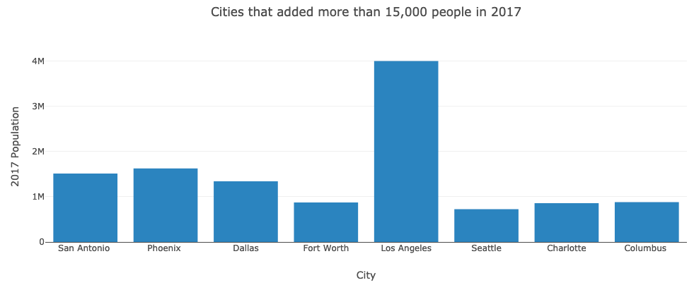

* Make sure the students can download and open the [instructions](Activities/04-Stu_Filter_Warmup/README.md) and the [starter code](Activities/04-Stu_Filter_Warmup/Unsolved) files from the AWS link.

* Go over the instructions with the students and answer any questions before breaking them out in groups.

* Divide students into groups of 3-5. They should work on the solution by themselves but can reach out to others in their group to get tips.

* Let students know that they may be asked to share and walk through their work at the end of the activity.

</details>

<details>
 <summary><strong>⭐ 3.3 Review: Fastest-Growing Cities (0:05)</strong></summary>

* Once time is up, ask for volunteers to walk through their solution. Remind them that it is perfectly alright if they didn't finish the activity.

* Explain to students that this was a somewhat challenging activity, as it required using functional programming techniques.

* To encourage participation, you can open the [starter code](Activities/04-Stu_Filter_Warmup/Unsolved/plot.js) and ask the students to help you write the code to filter for cities with a population-growth value higher than 15000.

* Continue this process with the rest of the code. If there are no volunteers, open the [solution](Activities/04-Stu_Filter_Warmup/Solved/plot.js) and review it with the class, answering any questions that students may have.

* Key points to cover when discussing the activity:


 * The `filtercities` function is used to filter values higher than `15000`:

 ```javascript
  // 1. Use the filter method to create a custom filtering function
  //  that returns the cities with a population increase greater than 15,000.

  function filterCities(city) {
    return parseInt(city.Increase_from_2016) > 15000;
  }

  // 2. Use filter() to pass the function as its argument
  var filteredCities = top15Cities.filter(filterCities);

  //  Check to make sure your filtered your cities.
  console.log(filteredCities);
 ```

 * The `map()` method is used with an arrow function to return the city name and population for all of the filtered cities.

 ```javascript
  // 3. Use the map method with the arrow function to return all the filtered cities.
  var cities = filteredCities.map(city => city.City);

  //  Check your filtered cities
  console.log(cities);

  // 4. Use the map method with the arrow function to return all the filtered cities population.
  var population = filteredCities.map(city => city.population);

  //  Check the populations of your filtered cities
  console.log(population);
 ```

 * `city => city.city` is a shortcut to `function(city) {return city.city;}`

 * `city => city.population` is a shortcut to `function(city) {return city.population;}`

  * Mention that arrow functions don't completely replace standard functions in JavaScript, as they don't contain an important (and often confusing) keyword named "this", but for our purposes here, they are fine to use because they're shorter to write.

* Next, explain how `trace` is structured:

   ``` js
   var trace = {
    x: cities,
    y: population,
    type: "bar"
   };
   ```

 * `x` becomes the cities array of `city.city` values, and `y` becomes the population array of `city.population` values.

 * The type of chart is specified with `type: "bar"`.

* The rest of the code should be familiar to students, but answer any questions before moving on.

 ```javascript
  // 6. Create the data array for our plot
  var data = [trace];

  // 7. Define our plot layout
  var layout = {
    title: "Cities that added more than 15,000 people in 2017",
    xaxis: { title: "City" },
    yaxis: { title: "2017 Population"}
  };

  // 8. Plot the chart to a div tag with id "bar-plot"
  Plotly.newPlot("bar-plot", data, layout);
 ```

* If time permits, go over the [bonus](Activities/04-Stu_Filter_Warmup/Solved/bonus) question and explain the following:

 * Using `parseint()`, we can create two arrays, one that has the 2016 population and one that has the increase in population for each of the filtered cities.

   ``` js
    // Bonus challenge.
    //  Create a chart of the rate of growth (% of 2016 populations) of the filtered cities.
    //  Plot the chart to a div tag with id "rate-bar-plot"

    var pop_rate = filteredCities.map(city => {
      // get the city's 2016 population
      var pop2016 = parseInt(city.population) - parseInt(city.Increase_from_2016);

      var increase = parseInt(city.Increase_from_2016);

      return 100 * increase / pop2016;
    });
   ```

 * In `trace2`, the `x` becomes the `cities` array, and the `y` becomes the population rate, `pop_rate`, and we specify the type of chart, `type: "bar"`.

   ``` js
   var trace2 = {
    x: cities,
    y: pop_rate,
    type: "bar"
   };
   ```

 * Finally, we add `trace2` to our plot.

 ```javascript
 //  Create the data2 array for our plot
 var data2 = [trace2];

 // Define our plot layout
 var layout = {
   title: "Cities that added more than 15,000 people in 2017",
   xaxis: { title: "City" },
   yaxis: { title: "Population Growth Rate (%)"}
 };

 // Plot the chart to a div tag with id "rate-bar-plot"
 Plotly.newPlot("rate-bar-plot", data2, layout);
 ```

* Send out the [solution files](Activities/04-Stu_Filter_Warmup/Solved/) for students to review later.

* Answer any questions before moving on.

</details>

<sub>[Having issues with this activity? Report a bug!](https://bit.ly/2OoN3ma)</sub>

- - -

### 4. Sorting and Slicing

| Activity Time:       0:30 |  Elapsed Time:      1:55  |
|---------------------------|---------------------------|

<details>
 <summary><strong>📣 4.1 Instructor Do: Sorting and Slicing (0:10)</strong></summary>

* In this demonstration, you'll be reviewing sorting and slicing.

* Open the [index.html](Activities/05-Ins_Sort_Slice/Solved/index.html) in a browser and bring up the console to display the results.

* Open [sorting.js](Activities/05-Ins_Sort_Slice/Solved/sorting.js) and go over the following points:

 * When working with data, it will often be necessary to sort it in either ascending or descending order.

 * To sort an array in JavaScript, we call its `sort()` method.

 ```javascript
 // Sort an array in ascending order
 var numArray = [3, 2, 1]
 numArray.sort()

 console.log('Sorted numArray', numArray)
 ```

 * By default, `sort()` will arrange values in ascending order. We can pass in the `compareFunction` as a callback function to specify how we want the array to be sorted.

 ```javascript
 // Sort the array in descending order
 var numArray = [1, 2, 3];
 numArray.sort(function compareFunction(firstNum, secondNum) {
   // resulting order is (3, 2, 1)
   return secondNum - firstNum;
 });
 ```

 * This will also work to sort in ascending order.

 ```javascript
 // Sort the array in ascending order with a callback function
 var numArray3 = [3, 2, 1];
 numArray3.sort(function compareFunction(firstNum, secondNum) {
   // resulting order is (1, 2, 3)
   return firstNum - secondNum;
 });

 console.log('Ascending sorted numArray3 with callback', numArray3);
 ```

* Explain that `compareFunction` compares two values at a time.

 * In this example, `compareFunction` first compares 1 and 2. The arguments `firstNum` and `secondNum` are arbitrary names, but there must be two arguments.

 * This function returns `firstNum - secondNum`. In this case, since `firstNum`, 3, is greater than `secondNum`, 2, it returns a positive number.

 * If the compare function returns a _positive_ number for a given pair of numbers `[firstNum, secondNum]`, it will put them in the _reverse order_ in the final array: `[secondNum, firstNum]`.

 * Likewise, if the compare function returns a _negative_ number for a given pair `[firstNum, secondNum]`, it will preserve their order in the output array: `[firstNum, secondNum]`.

 * The `compareFunction` continues to compare two values in the array at a time.

* Emphasize that `sort()` modifies the array it's called on _in place_. Also point out that it is often safer to sort a _copy_ of an array rather than the input itself.

* Finally, explain the `reverse()` method: it simply reverses the order of an array.

* Open the [index.html](Activities/05-Ins_Sort_Slice/Solved/index.html) in your editor and uncomment out the slicing example. Then, open it in a browser to display the output.

* Next, open the [slicing.js](Activities/05-Ins_Sort_Slice/Solved/slicing.js) file and discuss the following.

 ```js
 var names = ["Jane", "John", "Jimbo", "Jedediah"];
 var left = names.slice(0, 2);
 ```

 * The `slice()` method is similar to slicing a list in Python: it allows cutting a subsection of a JavaScript array.

 * `slice()` produces _shallow_ copies, meaning that it does not affect the original array.

 * `slice()` takes two arguments: the first is the index position of the subsection, and the second is the index position up to which the slicing will take place.

 * In this case, slicing begins at index position 0 and continues up to, but not including, index position 2.

* Send out the [solution files](Activities/05-Ins_Sort_Slice/Solved/) for students to review later.

* Answer any questions before moving on.

</details>

<details>
 <summary><strong>✏️ 4.2 Student Do: Slice, Dice, and Sort (0:15)</strong></summary>

* In this exercise, students will practice sorting and slicing, and then use those skills to create a bar chart of the top 10 most popular Greek gods.

* Open the [index.html](Activities/06-Stu_Sort_Slice/Solved/index.html) in a browser to show them what they will be creating.

* Make sure the students can download and open the [instructions](Activities/06-Stu_Sort_Slice/README.md) and the [starter code](Activities/06-Stu_Sort_Slice/Unsolved/) from the AWS link.

* Let students know the **Practice** will use [sliceSort.js](Activities/06-Stu_Sort_Slice/Unsolved/sliceSort.js) and the **Horizontal Bar Chart** will use [plots.js](Activities/06-Stu_Sort_Slice/Unsolved/plots.js).

* Go over the instructions with the students and answer any questions before breaking the students out in groups.

* Divide students into groups of 3-5. They should work on the solution by themselves, but they can talk to others in their group to get tips.

* Let students know that they may be asked to share and walk through their work at the end of the activity.

</details>

<details>
 <summary><strong>⭐ 4.3 Review: Slice, Dice, and Sort (0:05)</strong></summary>

* Once time is up, ask for volunteers to walk through their solution. Remind them that it is perfectly alright if they didn't finish the activity.

* To encourage participation, you can open [sliceSort.js](Activities/06-Stu_Sort_Slice/Unsolved/sliceSort.js) and ask the students to help you create the code to slice and sort.

* Repeat this process for each example. If there are no volunteers, open up the [sliceSort.js solution](Activities/06-Stu_Sort_Slice/Solved/sliceSort.js) and review it line by line with the class, answering whatever questions that students may have.

* Key points to cover over the course of discussions are:

 ```js
 var sorted = numArray.sort(function sortFunction(a, b) {
    return b - a;
 });
 ```

 * The `sort()` method calls another function as an argument.

 * The custom `sortFunction()` here compares two numbers at a time and returns `b - a`.

 * If the custom function returns a positive number, it _reverses_ the order of the two numbers. That is, if `a` is 1 and `b` is 100, `b - a` is a positive number, so the order is reversed.

* Next, explain sorting with an arrow function:

 ```js
 var sortedByArrow = numArray.sort((a, b) => b - a);
 ```

 * Instead of a named custom function, the syntax here is more straightforward and elegant.

 * It still takes `a` and `b` as its arguments and returns `b - a` to sort an array in descending order.

* Explain that `reverse()` reverses the order of an array.

 ```js
 var reversedArray = sortedByArrow.reverse();
 ```

* Explain that slicing from index position 0 of an array up to, but not including, index position 5, yields the first 5 elements of an array:

 ```js
 var sliced = sortedAscending.slice(0, 5);
 ```

* Now, move on to the chart. Open [index.html](Activities/01-Ins_Basic_Plots/Unsolved/index.html) in a browser and the [unsolved plot.js](Activities/01-Ins_Basic_Plots/Unsolved/plots.js) in your text editor, and ask for volunteers to help you create the plot.

* If there are no volunteers, open [index.html](Activities/01-Ins_Basic_Plots/Solved/index.html) and inform students that the chart is horizontal, sorted, and sliced.

* Next, open [data.js](Activities/06-Stu_Sort_Slice/Unsolved/data.js) and point out that the `data` is an array of objects.

* Finally, open the [solved plot.js](Activities/01-Ins_Basic_Plots/Solved/plots.js) file and review it with the class.

* Keep points to cover are:

 * The objects were sorted by using the `greekSearchResults` property.

 ```js
 var sortedByGreekSearch = data.sort((a, b) => b.greekSearchResults - a.greekSearchResults);
 ```

* Explain that `slice()` and `reverse()` are used to select the first 10 elements of the sorted dataset and then reverse their order:

 ```js
 slicedData = sortedByGreekSearch.slice(0, 10);
 reversedData = slicedData.reverse();
 ```

 * The array was reversed to accommodate Plotly's plotting conventions: it builds a horizontal bar chart from the bottom to top.

 * The array can be sorted in ascending order instead.

* Point out that `orientation: h` in `trace1` creates a horizontal bar chart.

 **Note:** Remind students that they had to consult the Plotly documentation for this activity, and that Plotly's documentation is straightforward to use.

* Explain that we can set the size of the margins in the `layout` object.

* Send out the [solution files](Activities/06-Stu_Sort_Slice/Solved/) for students to review later.

* Answer any questions before moving on.

</details>

<sub>[Having issues with this activity? Report a bug!](https://bit.ly/3tRamp9)</sub>

- - -

### 5. Ending Class

<details>
 <summary><strong>📣  5.1 Instructor Do: Review </strong></summary>

* Before ending class, review the skills that were covered today and mention where these skills are taught in the module.
  * Creating basic plots was covered in **Lesson 12.1.3** and **Lesson 12.1.4**.
  * Functional JavaScript methods were covered in **Lesson 12.2.1**.
  * The `slice()` and `map()` methods were covered in **Lesson 12.2.2**.

* Answer any questions the students may have.

* Finally, encourage your class to begin the challenge as soon as possible, if they haven’t already, and to use the learning assistants channel and pre-scheduled office hours with their instructional team for help as they progress through their work. If they feel like they need context to understand documentation or instructions throughout the week, this is where they can get it.

</details>

<sub>[Having issues with this activity? Report a bug!](https://bit.ly/3aYsODI)</sub>

---

© 2021 Trilogy Education Services, LLC, a 2U, Inc. brand.  Confidential and Proprietary.  All Rights Reserved.
