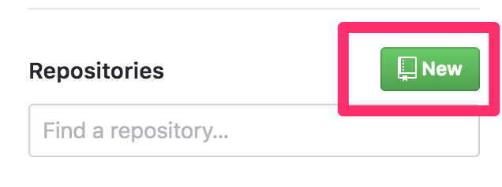
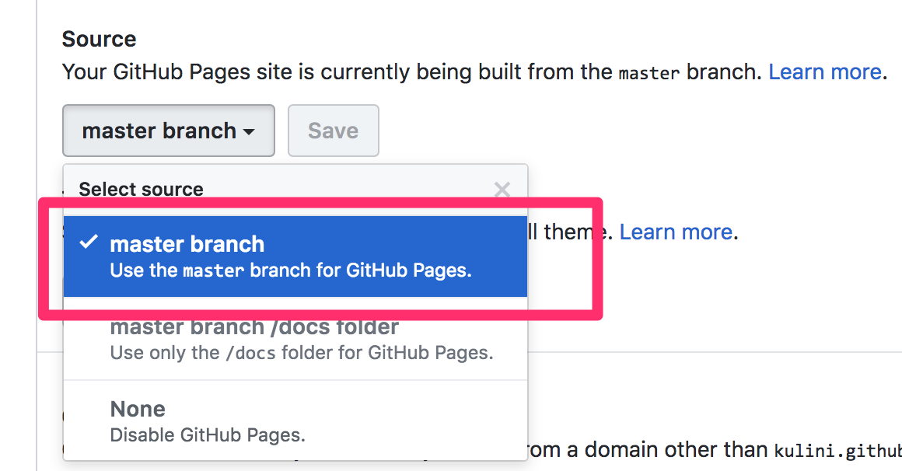

# Module 12 Class 2: Events, D3, and GitHub Pages

## Overview

Before class, walk through this week's Challenge assignment in office hours. In class, the students will expand on their chart-building skills: they’ll have their webpages respond to events, they’ll retrieve data using `D3.json`, and they’ll deploy their work to GitHub Pages.

## Learning Objectives

By the end of class, students will be able to:

* Add multiple traces to their plots
* Use events to dynamically change their webpage
* Use `D3.json()` to load in data from an outside source.
* Deploy a webpage to Github Pages

- - -

## Instructor Notes

* The activities in this class will complement Lessons **12.3.1: Inspect an API call with D3.json()** through **12.5.1: Deploy the Project to GitHub Pages**.  The students will benefit from these activities if they‘ve progressed through these lessons, which cover the following concepts, techniques, and tasks:

   * Using multiple traces
   * Adding event listeners to their webpage
   * Retrieving data with `D3.json()`
   * Deploying to GitHub Pages

## Slides

[Plotly Day 2 slideshow](https://docs.google.com/presentation/d/1UE935bz1uEC0GudToPujptVFCKoHvtHbl4FdBcfW_CQ/edit?usp=sharing)

## Student Resources

Share the following [activity resources](https://2u-data-curriculum-team.s3.amazonaws.com/data-viz-online-lesson-plans/12-Lessons/12-2-Student_Resources.zip) with the students.


- - -

## Before Class

### 0. Office Hours

| Activity Time: 0:30       |  Elapsed Time:     -0:30  |
|---------------------------|---------------------------|

<details>
 <summary><strong>📣 Instructor Do: Challenge Instruction Walkthrough (0:10) </strong></summary>

Let the students know that you’ll walk through the Challenge requirements and rubric during the first few minutes of Office Hours, while also providing helpful tips to ensure they know exactly what they need in order to be successful.

Open the Challenge in Canvas and go through the high-level instructions and requirements with your class. Be sure to check for understanding.

Open the Rubric in Canvas, go through the Mastery column with the class, and show how it maps back to the requirements for each deliverable. Be sure to check for understanding.

Review the following tips to ensure clarity on the Challenge:

For **Deliverable 1: Create a Horizontal Bar Chart**, students will be using their knowledge of JavaScript, Plotly, and `D3.js` to create a horizontal bar chart to display bacterial species. They will do so on a webpage with a dropdown menu where users can select individual IDs.

Go over the [Module 12 Belly Button Bar Chart solution](../../../01-Assignments/12-BellyButton/Challenge_Solution/BellyButton_bar_chart_solution.js) and compare it to the [Belly Button Bar Chart starter code](../../../01-Assignments/12-BellyButton/Resources/BellyButton_bar_chart_starter_code.js). Show the students the commented steps where they will be adding code to complete the Challenge.

For **Deliverable 2: Create a Bubble Chart**, students will use the same knowledge to create a bubble chart.

Go over the [Module 12 Belly Button Bubble Chart solution](../../../01-Assignments/12-BellyButton/Challenge_Solution/BellyButton_bubble_chart_solution.js) and compare it to the [Belly Button Bubble Chart starter code](../../../01-Assignments/12-BellyButton/Resources/BellyButton_bubble_chart_starter_code.js). Show the students the commented steps where they will be adding code to complete the Challenge.

For **Deliverable 3: Create a Gauge Chart**, students will take a similar approach to create a gauge chart that displays the weekly washing-frequency value as a measure from 0 to 10 on a progress bar.

Go over the [Module 12 Belly Button Gauge Chart solution](../../../01-Assignments/12-BellyButton/Challenge_Solution/charts_solution.js) and compare it to the [Belly Button Gauge Chart starter code](../../../01-Assignments/12-BellyButton/Resources/BellyButton_gauge_starter_code.js). Show the students the commented steps where they will be adding code to complete the Challenge.

For **Deliverable 4: Customize the Dashboard**, students will use their knowledge of HTML and Bootstrap to customize the webpage for their dashboard. They will select three customizations from a list and add them to their webpage.

Encourage your class to begin the Challenge as soon as possible, if they haven’t already, and to use the Learning Assistants channel and the remainder of Office Hours with their instructional team for help as they progress through their work. If they feel like they need context to understand documentation or instructions throughout the week, this is where they can get it.

Open the floor to discussion and be sure to answer any questions they may have about the Challenge requirements before moving on to other areas of interest.

</details>

<details>
 <summary><strong>📣  Instructor Do: Office Hours (0:20)</strong></summary>

For the remaining time, remind the students that now is the time to ask questions and get assistance from their instructional staff as they’re learning new concepts and working on the Challenge assignment.

Expect that students may ask for assistance with the following:

* Challenge assignment
* Further review on a particular subject
* Debugging assistance
* Help with computer issues
* Guidance with a particular tool

</details>


- - -

## During Class

### 1. Getting Started

| Activity Time:       0:10 |  Elapsed Time:      0:10  |
|---------------------------|---------------------------|

<details>
 <summary><strong>📣 1.1 Instructor Do: Foundation Setting (0:05)</strong></summary>

* Welcome students to class.

* Direct students to post individual questions in the Zoom chat to be addressed by you and your TAs at the end of class.

* Open the slideshow and use slides 1-8 to walk through the foundation setting with your class.

* **This Week - Plotly:** Talk through the key skills that students will learn this week, and let them know that they are continuing to build on their data analyst skills.

* **Today's Objectives:** Now, outline the concepts covered in today's lesson. Remind students that they can find the relevant activity files in the “Getting Ready for Class” page in their course content.

</details>

<details>
 <summary><strong>🎉 1.2 Everyone Do: Check-In (0:05)</strong></summary>

* Ask the class the following questions and call on students for the answers:

   * **Q:** How are you feeling about your progress so far?

   * **A:** We are adding to our data visualization skill set. It's important to look back and see what we accomplished, and acknowledge that it's a lot! It’s also okay to feel overwhelmed as long as you don’t give up. The more you practice, the more comfortable you'll be coding.

   * **Q:** How comfortable do you feel with this topic?

   * **A:** Let's do "fist to five" together. If you are not feeling confident, hold up a fist (0). If you feel very confident, hold up an open hand (5).

</details>

<sub>[Having issues with this activity? Report a bug!](https://bit.ly/2OtvO3b)</sub>

- - -

### 2. Multiple Traces

| Activity Time:       0:25 |  Elapsed Time:      0:35  |
|---------------------------|---------------------------|

<details>
 <summary><strong>📣 2.1 Instructor Do: Plotting Multiple Traces (0:05)</strong></summary>

* You may use slides 9-11 to accompany this activity.

* Open [Activities/01-Ins_Multi_Trace/Solved/index.html](Activities/01-Ins_Multi_Trace/Solved/index.html) in your browser to show the class a chart with two traces:

 

* Explain that there are two line plots of randomly generated numbers (because they're generated randomly, the numbers may differ from those in this screenshot).

* Open [Activities/01-Ins_Multi_Trace/Solved/plots.js](Activities/01-Ins_Multi_Trace/Solved/plots.js). If time allows, discuss the `random` generator function:

 ```js
 function randomNumbersBetween0and9(n) {
   var randomNumberArray = [];
   for (var i = 0; i < n; i++) {
    var randomNumber = Math.floor(Math.random() * 10);
    randomNumberArray.push(randomNumber);
   }
   return randomNumberArray;
 }
 ```

 * The function takes a number, `n`, as its argument, which will determine the size of the array.

 * First, an empty array is created.

 * During each iteration of a `for` loop, a random real number (i.e., inclusive of decimal values) from 0 through 1 (i.e., exclusive of 1), is generated with `Math.random()`. That value is then multiplied by 10, and the result is then rounded down to the nearest integer with `Math.floor()`. That gives us a number between 0 and 9, inclusive.

* Next, walk through the rest of the code:

 ```javascript
 // Create our first trace
 var trace1 = {
   x: [1, 2, 3, 4, 5],
   y: randomNumbersBetween0and9(5),
   type: "scatter"
 };

 // Create our second trace
 var trace2 = {
   x: [1, 2, 3, 4, 5],
   y: randomNumbersBetween0and9(5),
   type: "scatter"
 };

 // The data array consists of both traces
 var data = [trace1, trace2];

 // Note that we omitted the layout object this time
 // This will use default parameters for the layout
 Plotly.newPlot("plot", data);
 ```

 * We create two traces that use the `randomNumbersBetween0and9` function to create 5 y-values, which are plotted against the same x-axis.

 * Both `trace1` and `trace2` are assigned to an array called data and charted as a scatter plot. Notice that we're passing in two trace objects here, unlike one trace object, as was done during Day 1. This is why the objects must be passed to `Plotly.newPlot()` in an array: to allow for multiple trace objects.

 * In the last line of the code, we see two arguments: `"plot"` and `data`. A third argument could be used to specify the layout, but it is omitted. The layout, therefore, follows Plotly's default settings.

* Send out the [solution files](Activities/01-Ins_Multi_Trace/Solved/) for the students to refer to later.

</details>

<details>
 <summary><strong>✏️ 2.2 Student Do: Multiple Traces (0:15)</strong></summary>

* You may use slides 12-13 to accompany this activity.

* Next, proceed with the student exercise. In this exercise, students will use functional programming techniques to create a Plotly chart with multiple traces.

* Open the [index.html](Activities/../Activities/02-Stu_Multi_Trace/Solved/index.html) file in your browser to display what they will be creating.

)

* Make sure the students can download and open the [instructions](Activities/02-Stu_Multi_Trace/README.md) and the [starter code](Activities/02-Stu_Multi_Trace/Unsolved) from the AWS link.

* Go over the instructions with the students and answer any questions before breaking them out into groups.

* Divide students into groups of 3 to 5. They should work on the solution by themselves but can reach out to others in their group for help.

* Let students know that they may be asked to share and walk through their work at the end of the activity.


</details>

<details>
 <summary><strong>⭐ 2.3 Review: Multiple Traces Activity (0:05)</strong></summary>

* Once time is up, ask for volunteers to walk through their solution. Remind them that it is perfectly alright if they didn't finish the activity. You may use slides 14-20 to accompany this activity.

* To encourage participation, you can open the [starter plot.js](Activities/02-Stu_Multi_Trace/Unsolved) file and ask the students to help you write the code to create the traces for the plot.

* Continue this process for the remainder of the code.

* If there are no volunteers, open up [solved plot.js](Activities/02-Stu_Multi_Trace/Solved/plots.js) and go over the solution file line by line with the class, answering whatever questions students may have.

* Key points to cover are:

 * This was a fairly challenging activity, as it requires using functional programming techniques.

 * For the first trace, which deals with Greek gods, defining the x-axis points can be done by using `map()` to return the `pair` value from the dataset.


 ```javascript
 var trace1 = {
 x: data.map(row => row.pair),
 y: data.map(row => row.greekSearchResults),
 text: data.map(row => row.greekName),
 name: "Greek",
 type: "bar"
 };
 ```

 * Here, `row => row.pair` is essentially a shortcut for writing `function (row) {return row.pair;}`.

 * `map()` is used to create a new array containing just the `pair` property of each row in the dataset.

 * `x` becomes an array of `row.pair` values.

  * The next line of code works similarly. It uses `map()` to create a new array of the `greekSearchResults` for each row in the dataset, and it assigns that array to the y variable.

 * The second trace deals with Roman gods. Everything here is analogous to trace 1:

 ```javascript
 // Trace 2 for the Roman Data
 var trace2 = {
   x: data.map(row => row.pair),
   y: data.map(row => row.romanSearchResults),
   text: data.map(row => row.romanName),
   name: "Roman",
   type: "bar"
 };
 ```

 * Similar to what students have seen before, the rest of the plot is created by storing the traces in an array, creating a layout, and plotting.

 ```javascript
 // Combining both traces
 var traceData = [trace1, trace2];

 // Apply the group barmode to the layout
 var layout = {
   title: "Greek vs Roman gods search results",
   barmode: "group"
 };

 // Render the plot to the div tag with id "plot"
 Plotly.newPlot("plot", traceData, layout)
 ```

* Answer any questions before moving on.

</details>

<sub>[Having issues with this activity? Report a bug!](https://bit.ly/3qhy2Rp)</sub>

- - -

### 3. Click & Dropdown Events

| Activity Time:       0:35 |  Elapsed Time:      1:10  |
|---------------------------|---------------------------|

<details>
 <summary><strong>🎉 3.1 Instructor Do: An Eventful Click (0:05)</strong></summary>

* For a brief refresher on event handling, everyone will print the value of a dropdown menu item when it is selected. You may use slides 21-27 to accompany this activity.

* This activity will cover the events on the DOM, and it will show how the webpage reacts when events happen on the page.

* Open [index.html](Activities/03-Ins_Events_Review/Solved/index.html) in a webpage, then open the console to demonstrate that changing the dropdown menu item prints two items to the console:

 * The `id` of the dropdown menu element

 * `option1` or `option2`, depending on which item is selected

* Open [index.html](Activities/03-Ins_Events_Review/Solved/index.html) in an editor and explain the code:

 ```html
   <select id="selectOption">
    <option value="option1">Menu Option 1</option>
    <option value="option2">Menu Option 2</option>
 </select>
 ```

 * The dropdown menu is created with `<select>`.

 * Each dropdown menu item is created with an `<option>` with a `value` property.

 * The `id` of the dropdown menu is `selectOption`.

* Next, open `script.js` and walk through the code:

 ```js
  // Use D3 to create an event handler
  d3.selectAll("body").on("change", updatePage);

  function updatePage() {
    // Use D3 to select the dropdown menu
    var dropdownMenu = d3.select("#selectOption");
    // Assign the dropdown menu item ID to a variable
    var dropdownMenuID = dropdownMenu.property("id");
    // Assign the dropdown menu option to a variable
    var selectedOption = dropdownMenu.property("value");

    console.log(dropdownMenuID);
    console.log(selectedOption);
  };
 ```

 * D3 is used to select the document `body` and create an event handler that calls `updatePage()` when a change takes place.

 * The dropdown menu's `id` and `value` properties are assigned to variables, and then logged to the console.

* Summarize the major points of this demo:

 * A dropdown menu is created in the HTML document.

 * A D3 event handler calls a custom function to print the dropdown menu's properties to the console.

* Answer any questions before moving on.

</details>

<details>
 <summary><strong>📣 3.2 Instructor Do: Dropdown Events and Plotly (0:05)</strong></summary>

* In this section, you will expand on using events by demonstrating how to use them on the DOM to modify plots. You may use slides 28-30 to accompany this activity.

* Open [index.html](Activities/04-Ins_Dropdown_Events/Solved/index.html) in the browser and use the dropdown menu to toggle between two datasets:

 

* Note that selecting a different dataset will re-render the plot on the screen.

* Next, open [plots.js](Activities/04-Ins_Dropdown_Events/Solved/plots.js) and explain the code:

 * By calling the `init()` function, a default dataset is displayed when the page is rendered:

 ```js
 function init() {
 data = [{
    x: [1, 2, 3, 4, 5],
    y: [1, 2, 4, 8, 16] }];
 Plotly.newPlot(LINE, data);
 }
 ```

 * The `init()` function is called at the end of the script file.

 * Otherwise, everything in this function should be familiar. It renders a simple line chart in Plotly.

* Explain event handling: when a change takes place to the dropdown menu, the `updatePlotly()` function is called.

 ```js
 d3.selectAll("#selDataset").on("change", updatePlotly);
 ```

* Explain `function updatePlotly()`:

 ```js
 var dropdownMenu = d3.select("#selDataset");
 var dataset = dropdownMenu.property("value");
 ```

 * The dropdown menu is selected using D3 and then assigned to a variable, `dropdownMenu`.

 * The value of the dropdown menu item is also assigned to a variable, `dataset`.

* Explain that, after initializing `x` and `y` as empty arrays, their values are selected depending on the `value` of the dropdown-menu selection:

  ```js
    // Initialize x and y arrays
    var x = [];
    var y = [];

    if (dataset === 'dataset1') {
      x = [1, 2, 3, 4, 5];
      y = [1, 2, 4, 8, 16];
    }

    else if (dataset === 'dataset2') {
      x = [10, 20, 30, 40, 50];
      y = [1, 10, 100, 1000, 10000];
   }
 ```

* Next, explain that when a change takes place in the DOM, instead of drawing a new plot in Plotly, the existing one is restyled:

 ```js
 Plotly.restyle("plot", "x", [x]);
 Plotly.restyle("plot", "y", [y]);
 ```

* Send students the link to the [Plotly documentation]([https://plot.ly/javascript/plotlyjs-function-reference/#plotlyrestyle](https://plot.ly/javascript/plotlyjs-function-reference/#plotlyrestyle)) and give them a minute or two to review it.

 * According to the documentation, restyling an existing plot is faster than drawing a new one.

 * In this code, only the `x` and `y` arrays are modified.

* Summarize the key points of this example:

 * A default plot is rendered on the page.

 * A change takes place in the DOM when a dropdown menu item is selected.

 * A function is triggered with the DOM element's value as its argument.

 * The function uses Plotly's `restyle()` method to modify an existing plot.

* Answer any questions before moving on.

</details>

<details>
 <summary><strong>✏️ 3.3 Student Do: A Musical Pie (0:20)</strong></summary>

* In this activity, students will enhance their event-handling chops by creating a dynamic pie chart using Plotly. When a country is selected from the dropdown menu, its dataset will be displayed in the browser.

* You may use slides 31-32 for this activity.

* Open the [index.html](Activities/05-Stu-Event_Final/Solved/index.html) file in your browser to display what they will be creating.


* Make sure the students can download and open the [instructions](Activities/05-Stu-Event_Final/README.md) and the [starter code](Activities/05-Stu-Event_Final/Unsolved) from the AWS link.

* Go over the instructions with the students and answer any questions before breaking them out in groups.

* Divide students into groups of 3 to 5. They should work on the solution by themselves but can reach out to others in their group for help.

* Let students know that they may be asked to share and walk through their work at the end of the activity.

</details>

<details>
 <summary><strong>⭐ 3.4 Review: A Musical Pie (0:05)</strong></summary>

* Once time is up, ask for volunteers to walk through their solution. Remind them that it is perfectly alright if they didn't finish the activity.

* To encourage participation, you can open the [starter code](Activities/05-Stu-Event_Final/Unsolved) and ask the students to help you write the code to create the array and display the plot.

* Continue this process for the remainder of the code.

* If there are no volunteers, open up [solution folder](Activities/05-Stu-Event_Final/Solved) and go over the solution file line by line with the class, answering whatever questions students may have.

* In the [index.html](Activities/05-Stu-Event_Final/Solved/index.html), explain:

 ```html
   <select id="selDataset">
      <option value="us">United States</option>
      <option value="uk">UK</option>
      <option value="canada">Canada</option>
   </select>
 ```

 * `<select>` and `<option>` tags are used to create a dropdown menu.

 * The `value` attribute of each `option` specifies the country whose data will be selected and visualized.

* Open [data.js](Activities/05-Stu-Event_Final/Solved/data.js) and explain the structure of the dataset:

 ```js
 var data = {
 us: {
    Spotify: 19,
    Soundcloud: 5,
    Pandora: 8,
    Itunes: 30
 },
 ```

 * The objects are nested within an object by country.

 * From these objects, arrays of subscriber numbers and music provider labels will need to be created for Plotly.

* Open [plots.js](Activities/05-Stu-Event_Final/Solved/plots.js) and explain how to create the needed arrays:

 ```js
 var us = Object.values(data.us);
 var uk = Object.values(data.uk);
 var canada = Object.values(data.canada);
 ```

 * `Objects.values()` are used to create arrays of subscriber numbers by country.

 * Because the objects are nested, it is possible to use the dot notation to specify the country, e.g., `data.us`.

 ```js
 var labels = Object.keys(data.us);
 ```

 * Similarly, an array of music provider labels is created with `Object.keys()`.

  ```javascript
  // Create an array of music provider labels
  var labels = Object.keys(data.us);
  ```

* Explain that `init()` displays the default U.S. pie chart:

 ```js
 function init() {
   var data = [{
    values: us,
    labels: labels,
    type: "pie"
   }];

   var layout = {
    height: 600,
    width: 800
   };

   Plotly.newPlot("pie", data, layout);
 }

 init();
 ```

* Explain that on change of the dropdown menu, the function `getData()`, is called:

 ```js
 d3.selectAll("#selDataset").on("change", getData);
 function getData() {
    var dropdownMenu = d3.select("#selDataset");
    var dataset = dropdownMenu.property("value");
    var data = [];

    if (dataset == 'us') {
      data = us;
    }
    else if (dataset == 'uk') {
      data = uk;
    }
    else if (dataset == 'canada') {
      data = canada;
    }
    updatePlotly(data);
 }
 ```

 * D3 is used to assign the dropdown menu and the dropdown menu selection to variables.

 * An empty array is initialized.

 * Then, the data array that matches the country is selected and passed on as an argument of the `updatePlotly()` function.

* Answer any questions before moving on.

</details>

<sub>[Having issues with this activity? Report a bug!](https://bit.ly/3tSY6V1)</sub>

- - -

### 4. D3.json

| Activity Time:       0:25 |  Elapsed Time:      1:35  |
|---------------------------|---------------------------|

<details>
 <summary><strong>📣 4.1 Instructor Do: D3.json (0:05)</strong></summary>

* For this next activity, students will learn how `D3.js` provides a function to fetch JSON data from APIs on the web.

* Visit the [SpaceX API](https://api.spacexdata.com/v2/launchpads) to show the JSON data.

* Open [plots.js](Activities/06-Ins_D3_JSON/Solved/demo.js) in your editor and go through the code, highlighting:

 ```javascript
 const url = "https://api.spacexdata.com/v2/launchpads";

 d3.json(url).then(function(data) {
    console.log(data);
 });
 ```

 * `d3.json` is very similar to Python `requests.get`.

 * `d3.json` returns a JavaScript promise: it places an API call to the `url`; once it's available, the callback function prints it to the console.

* Use the second example to explain the concept of promises in JavaScript:

 ```javascript
 const dataPromise = d3.json(url);
 console.log("Data Promise: ", dataPromise);
 ```

 * The data from a promise is only available inside of the `.then` function.

 * The `dataPromise` variable is assigned a promise of future data, but the data must be accessed inside of the `.then` function.

* Send out the [solution files](Activities/06-Ins_D3_JSON/Solved/) for students to refer to later.

* Answer any questions before moving on to the next activity.

</details>

<details>
 <summary><strong> 🎉 4.2 Everyone Do: Dynamically Selected City Forecasts (0:20)</strong></summary>

* In this exercise, the students will all code together to design a dynamic plot that reads the city from the user form.

**Note:** Remember to replace the API key with your own. Remind students when going through this example to do the same. The open weather map API key was used in previous modules.

* Open up the [index.html](Activities/07-Evr_Weather_Dynamic/Solved/index.html) file in the browser.


* Make sure the students can download and open the [instructions](Activities/07-Evr_Weather_Dynamic/README.md) and the [starter code](Activities/07-Evr_Weather_Dynamic/Unsolved) files from the AWS link.

* Go over the instructions with the students, then let the students work on their solution for 5 to 7 minutes.

* When time is up, open the [starter plots.js](Activities/07-Evr_Weather_Dynamic/Unsolved/plots.js) file and ask students to help you write the code to handle the input from the form.

* Continue this process for the rest of the code.

* If there are no volunteers, open up the [solved folder](Activities/07-Evr_Weather_Dynamic/Solved/) and go over the solution with the class, answering whatever questions students may have.

* Demonstrate the solved [index.html](Activities/07-Evr_Weather_Dynamic/Solved/index.html) in the browser.

* Open the solved [plots.js](Activities/07-Evr_Weather_Dynamic/Solved/plots.js) in your text editor.

* Explain the overall structure of the solution:

 * First, we attach a click handler to the `#submit` button, configuring it to execute `handleSubmit` whenever a user clicks on it.

 * `d3.select("#submit").on("click", handleSubmit);`

* Explain the code in `handleSubmit()`.

 ```js
   function handleSubmit() {
   var city = d3.select("#cityInput").node().value;
   d3.select("#cityInput").node().value = "";
   buildPlot(city);
   }
 }
 ```

* When called, it:

 * Collects the user's selected city from the form.

 * Clears the form by resetting the input's `value` attribute to the empty string.

 * Calls `buildPlot` with the user's selected `city` name.

* Open the console and explain the data that needs to be extracted:

 

 * The values of interest are those listing the times and temperatures.

* Explain that to create arrays of the times and temperatures, `map()` can be used on the JSON response:

 ```js
   var times = data.list.map(x => x.dt_txt);
   var temps = data.list.map(x => x.main.temp);
 ```

 * `map()` can be used to extract the item at a given position from each array.

* Send out the [solution](Activities/07-Evr_Weather_Dynamic/Solved) folder for students to review later.

* Answer any questions before moving on.

</details>

<sub>[Having issues with this activity? Report a bug!](https://bit.ly/3aciqcf)</sub>

- - -

### 5. GitHub Pages

| Activity Time:       0:20 |  Elapsed Time:      1:55  |
|---------------------------|---------------------------|

<details>
 <summary><strong>📣 5.1 Everyone Do: Deployment to GitHub Pages (0:20)</strong></summary>

* In this activity, students will follow along to deploy a webpage on GitHub Pages. You may use slides 36-43 to accompany this activity.

* Make sure the students have the [Activities/08-Evr_Github_Pages/Solved](Activities/08-Evr_Github_Pages/Solved) folder and encourage them to use it to follow along with the deployment.

* Inform students that they will need to deploy this week's Challenge to GitHub Pages.

 * The data for the homework will be in a JSON file.

 * Students will use the `d3.json()` method to fetch data from the JSON file and visualize it.

 * They will need to upload the JSON file to GitHub, along with the HTML and JavaScript script files.

* Explain the benefits of deploying a Plotly visualization with a data file:

 * It makes a publicly available data visualization available that is much more visually appealing than a published Jupyter Notebook.

 * The ability to read in data from local files means that data sources aren't limited to placing API calls.

* Navigate to the Solved directory and show the Plotly project structure:

 * The data is contained in a JSON file.

 

 * Because `data.json` is an external file, the data in it cannot be pulled directly into the JavaScript file.

 * Instead, it must be fetched from a server.

* Take a moment to explain the relative path of the `data.json` file.

 * As `plotly.js` must be able to access the contents of `data.json`, it must navigate to the `data` directory and then to `data.json`.

 * In `plotly.js`, the file path is entered as the argument of the `json` method: `d3.json("data/data.json")`.

 * Previously, URLs of APIs were placed as an argument to fetch data. Now, the JSON file is accessed instead.

* Navigate to the Solved directory from the CLI and start a local server with `python -m http.server`. Then, go to `localhost:8000` in your browser.

 

* In the next segment, demonstrate how to deploy an existing project to GitHub Pages.

* First, create a new repository in GitHub.

 * Go to the GitHub website and create a new repository by clicking **New**. Choose a unique name for the repo and make note of it.

 

 * The repository must be made public in order to be deployed to GitHub Pages.

 

 * To clone the repository to your computer start by navigating to where you want to store your project. Then clone the repository by copying the GitHub as shown in the image below, and then enter `git clone <url>` in the CLI. This will initialize the repo locally without any content yet.

 

* Next we'll copy the files to the GitHub repo.

* Copy and past the HTML, JavaScript, and JSON files from the Solved folder in the repository (i.e. the folder you just created).

* Next, push the project to GitHub.

 * Navigate to the directory of the repository.

 * Copy and paste the HTML, JavaScript, and JSON files from the Solved folder into the repository.

 * `git add .`

 * `git commit -m "<your message here>"`

 * `git push origin main`

* Next, go to the project page on GitHub and click on **Settings** to configure for deployment.

 

 * Under Settings, go to GitHub Pages and select **main branch**.

 

 * Click **Save**.

* The project should now be deployed to GitHub Pages.

 

 * The URL of the deployed page is `<account name>.github.io/<project name>`.

 * The deployment should be relatively quick but may take up to several minutes.

* Make sure all students were able to successfully deploy their webpage before ending class.

</details>

<sub>[Having issues with this activity? Report a bug!](https://bit.ly/3rNuHtv)</sub>

- - -

### 6. Ending Class

| Activity Time:       0:05 |  Elapsed Time:      2:00  |
|---------------------------|---------------------------|

<details>
 <summary><strong>📣  6.1 Instructor Do: Review </strong></summary>

* Before ending class, review the skills that were covered today and mention where in the module these skills are used:
 * Using event listeners was covered in **Lesson 12.4.1**.
 * Loading in a JSON file with `D3.json()` was covered in **Lesson 12.3.2**.
 * Deploying to GitHub Pages was covered in **Lesson 12.5.1**.

* Answer any questions the students  may have.

</details>

<sub>[Having issues with this section? Report a bug!](https://bit.ly/3tRqOFO)</sub>

---

© 2021 Trilogy Education Services, LLC, a 2U, Inc. brand.  Confidential and Proprietary.  All Rights Reserved.
