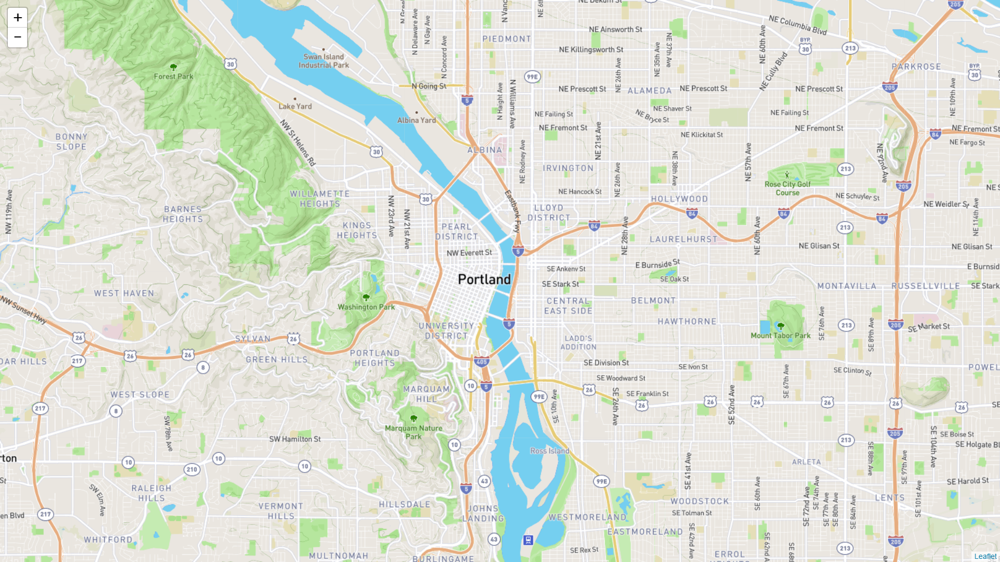

# Module 13 Class 1: Creating Maps with Leaflet

## Overview

This week, we will be introducing the JavaScript library Leaflet. In this unit, students will use JavaScript and the `D3.js` library to retrieve coordinates from GeoJSON data and use the Leaflet library to plot geographical data on a Mapbox map through an API request.

In today's class, students will learn to render geographical maps and add interactive elements, including markers and circle markers that have varying radii based on the data. 

## Learning Objectives

By the end of class, students will be able to:

* Use the Leaflet library with a Mapbox API key to create geographical maps
* Use the Leaflet library to add markers to a map 
* Iterate through an array using JavaScript, and add data to a map 
* Use layers and layer controls to add interactivity to maps

- - -

## Instructor Notes

* The activities in this class will complement Lessons **13.0.1: Visualizing Earthquake Data** through **13.4.3: Map Lines**.  The students will benefit from these activities if they‘ve progressed through these lessons, which cover the following concepts, techniques, and tasks:  

* Creating a Mapbox API key 
* Rendering a map on a local server
* Adding a marker to a map
* Adding circle markers to a map and modifying the radius
* Binding a popup with text to a marker
* Iterating through an array and creating markers for each object
* Adding two maps to a map using layer controls
* Using the Chrome console to troubleshoot 


## Instructor Prep

**Why is it useful to map out data geographically?**

Your datasets should be visualized and explained in ways that suit the data’s context and the interests of the stakeholders. Oftentimes, the geography of the data is highly relevant. For example, a marketing stakeholder would need to know about the popularity of their product in specific states to understand how to best move forward with their campaigns.

## Slides

[Leaflet Day 1 slideshow](https://docs.google.com/presentation/d/1Coot88w0SNUHb3wfCzYNvKnDXmjgdI3hcszFUeNSo0c/edit?usp=sharing)

## Student Resources

Share the following [activity resources](https://2u-data-curriculum-team.s3.amazonaws.com/data-viz-online-lesson-plans/13-Lessons/13-1-Student_Resources.zip) with the students. 


- - - 

## Before Class

### 0. Office Hours

| Activity Time: 0:30       |  Elapsed Time:     -0:30  |
|---------------------------|---------------------------|

<details>
  <summary><strong> 📣 0.1 Instructor Do: Office Hours</strong></summary>

* Before you begin class, hold office hours. Office hours should be driven by students. Encourage students to take full advantage of office hours by reminding them that this is their time to ask questions and get assistance from instructional staff as they learn new concepts.

* Expect that students may ask for assistance. For example: 

  * Further review on a particular subject
  * Debugging assistance
  * Help with computer issues
  * Guidance with a particular tool

</details>

- - - 

## During Class 

### 1. Getting Started

| Activity Time:       0:15 |  Elapsed Time:      0:15  |
|---------------------------|---------------------------|

<details>
  <summary><strong>📣 1.1 Instructor Do: Foundation Setting (0:10)</strong></summary>

* Welcome students to class. 

* Before you get started, congratulate the students on making it halfway through the course! Tell them to give themselves a huge round of applause on Zoom.

* Direct students to post individual questions in the Zoom chat to be addressed by you or your TAs at the end of class.

* Open the slideshow and use slides 1 - 12 to walk through the foundation setting with your class. 

* **Big Picture:** This is an opportunity to zoom out and see the big picture of where they are in the program. Take a moment to mention some real-world examples that show the value of what they’re learning this week.

* **Program Pointers:** Talk through some of the key logistical things that will help students stay on track. This is an opportunity to speak to what students may need when they're at this particular point of the program. 

* **This Week - Leaflet.js:** Talk through the key skills students will be learning this week. Let the students know that they will be using the JavaScript library Leaflet. The primary focus of the Day 1 activities is to reinforce the online content: the basics of how to render a map from a local server, how to populate maps with data, and how to add interactivity to maps using JavaScript. On Day 2, the students will apply what they’ve learned from Day 1 and parse GeoJSON data to add features to maps.   

* **This Week's Challenge:** For this week's Challenge, let the students know that they'll be adding tectonic plate data and earthquakes with a magnitude greater than 4.5 to the map they’ve created; then they’ll add a third type of map of map layer of their choice.

* **Career Connection:** Let students know how they will use the skills covered this week throughout their careers. It's important for them to know the "why." Give examples of when they may be used in work or when you have used those skills in your workplace. 

* **How to Succeed This Week:** Remind your students that they may have moments of frustration this week as they learn something complex. These moments are great for deepening their knowledge. Use the side material to outline some of the topics that they may find tricky in this module. Consider sharing something about your personal learning journey. It helps students to recognize that everyone starts somewhere and that they are not alone.

* **Today's Objectives:** Now, outline the concepts that will be covered in today's lesson. Remind students that they can find the relevant activity files in the “Getting Ready for Class” page in their course content.  

</details>

<details>
  <summary><strong>🎉  1.2 Everyone Do: Check-In (0:05)</strong></summary>

* Ask the class the following questions and call on students for answers:

    * **Q:** How are you feeling about your progress so far?

    * **A:** We are continuing to build your skillset by reinforcing the JavaScript skills you have been using. It’s also okay to feel overwhelmed as long as you don’t give up.

    * **Q:** How comfortable do you feel with this topic? 

    * **A:** Let's do "fist to five" together. If you are not feeling confident, hold up a fist (0). If you feel very confident, hold up an open hand (5).

</details>

<sub>[Having issues with this activity? Report a bug!]()</sub>

- - -

### 2. City Marker Map

| Activity Time:       0:40 |  Elapsed Time:      0:55  |
|---------------------------|---------------------------|

<details>
  <summary><strong>🎉 2.1 Instructor Do: Basic Leaflet Map  (0:10)</strong></summary>

* You can use slides 13 - 15 to assist you with this section.

* Open up and send out the [Leaflet.js webpage](http://leafletjs.com/) URL, and have students visit the website on their computers. Remind the students that this URL is available in **Lesson 13.2.3**.  Encourage them to take a look around, as this is the library we will be using for the majority of the module. 

* To get all students up to speed at creating a basic map, have the class follow along with you as you run through the code used to build the Leaflet map found in [01-Ins_Basic_Map/Solved/index.html](Activities/01-Ins_Basic_Map/Solved/index.html). Open it up and demonstrate creating a map with a single marker. Let the students know that this is the most basic map you can make with Leaflet, and it will be our entry point to the wonderful world of geospatial data visualization!

  

* Open the `logic.js` file in your editor and walk through the key aspects of the code together:

  * **Map Object:**

    * `L.map` accepts two arguments:

      1. The first is the `id` of the HTML element that Leaflet should insert the map into.

      2. The second is an object containing initial options for the new map ("center" and "zoom," in this example).

  * **Tile Layer:**

    * Explain to students that a tile layer is like the background image of our map. Currently, our tile layer is the only thing we see when we open the basic map. Leaflet doesn't provide us with a tile layer fresh out of the box. Instead, it gives us the option to use various tile-layer APIs. Here, we're using the Mapbox API. We configure our tile layer by:

      1. Passing in a formatted `queryURL` to the `tileLayer` method.

      2. Then, we add our layer to our map with the `addTo` method. We will invoke this method whenever we want to add something to a map!

* Send the link to the Leaflet Quick Start Guide: [https://leafletjs.com/examples/quick-start/](https://leafletjs.com/examples/quick-start/). 

* Together as a class, walk through the steps of setting up a basic map with Leaflet.

* Make sure the students can download and open the [index.html](Activities/01-Ins_Basic_Map/Unsolved/index.html) file and the unsolved [logic.js](Activities/01-Ins_Basic_Map/Unsolved/logic.js) file from the AWS link. 

* Have the students check that the `index.html` file has the following:

  * The Leaflet CSS and JavaScript libraries links.
  * A `<div>` element with an `id` of `map`. This is where our map will be inserted.
  * Two JavaScript files are referenced: the first, `config.js`, holds the API key, and the second, `logic.js`, holds the JavaScript map code.

    


* Next, have them open the unsolved `logic.js` file and write, or copy and paste, the following code into your `logic.js` file. Explain each of these steps as you live code them:

   ```js
   var myMap = L.map("map", {
     center: [45.52, -122.67],
     zoom: 13
   });
   ```

   * The map object is defined with the `L.map` method.

   * The argument, `"map"`, is the `id` of the container into which the map should be inserted. It points to the `div` with the `id` `map` that we just created.

   * The argument, wrapped in curly brackets, is an object containing an initial configuration. It sets the initial coordinates of the `center` property.

   * The zoom level is set with the `zoom` property.

* Add a tile layer to the map.

   * The tile layer is the map image shown in the background.

    ```js
    L.tileLayer("https://api.mapbox.com/styles/v1/{id}/tiles/{z}/{x}/{y}?access_token={accessToken}", {
      attribution: "© <a href='https://www.mapbox.com/about/maps/'>Mapbox</a> © <a href='http://www.openstreetmap.org/copyright'>OpenStreetMap</a> <strong><a href='https://www.mapbox.com/map-feedback/' target='_blank'>Improve this map</a></strong>",
      tileSize: 512,
      maxZoom: 18,
      oomOffset: -1,
      id: "mapbox/streets-v11",
      accessToken: API_KEY
    }).addTo(myMap);
    ```

   * In the `accessToken` property, the `API_KEY`, or the token, is supplied by an external `config.js` file.

* Before moving on, make sure that students have created a free account with [Mapbox](https://mapbox.com) and [generated a token](https://www.mapbox.com/studio/account/tokens/) to get started. Let the students know that they were instructed to create a free account and generate a token in **Lesson 13.2.1**.

  * If some students don't have an account or an API key, send out the [Mapbox](https://mapbox.com) link.  
  
* Have students explore the different [Mapbox styles](https://docs.mapbox.com/api/maps/#styles) that are available:

   

* Explain that the API token is held in `config.js`.

   

* In the HTML file, it must be referenced before `logic.js`.

* Finally, we need to give our map some CSS styling to make it visible on the page. The following CSS will allow our map to take up the entire page.

    

* Now, have the students open the HTML file in their browser. Yay, we have a map!

    

* Spend some time troubleshooting any problems students may have. If they can't set up a map properly, they won't be able to do **ANYTHING** else in class today. Use this opportunity to have students who were able to create the map help those who were not..

</details>

<details>
  <summary><strong>📣 2.2 Instructor Do: Add Markers to the Map (0:05)</strong></summary>

* You can use slides 15 - 17 to assist you with this section.

* Using [02-Ins_Markers/Solved/index.html](Activities/02-Ins_Markers/Solved/index.html) as a guide, show students how we can add a marker to the previous map by creating a `marker` object.

   ```js
   L.tileLayer("https://api.mapbox.com/styles/v1/{id}/tiles/{z}/{x}/{y}?access_token={accessToken}", {
     attribution: "© <a href='https://www.mapbox.com/about/maps/'>Mapbox</a> © <a href='http://www.openstreetmap.org/copyright'>OpenStreetMap</a> <strong><a href='https://www.mapbox.com/map-feedback/' target='_blank'>Improve this map</a></strong>",
     tileSize: 512,
     maxZoom: 18,
     zoomOffset: -1,
     id: "mapbox/streets-v11",
     accessToken: API_KEY
   }).addTo(myMap);

   var marker = L.marker([45.52, -122.67], {
     draggable: true,
     title: "My First Marker"
   }).addTo(myMap);
   ```

  * The `addTo()` method is used to add each map layer.

* We pass in starting coordinates for this marker and then any of the options detailed in the [Leaflet marker documentation](http://leafletjs.com/reference-1.0.3.html#marker-option). In this case, we made the marker `draggable` and added a `title` that appears when you hover over it.

    

* Note that we call the `addTo()` method on our new marker object to add it to the map.

* Another useful feature that Leaflet gives us is the ability to add popups to our markers. Using the `bindPopup()` method, we can add information to our marker that will appear when we click it.

    

* Here's what our finished map will look like:

    

* Send out the [02-Ins_Markers/Solved](Activities/02-Ins_Markers/Solved) folder for students to refer to later.

* Ask the class the following questions and call on students for the answers:

    * **Q:** Where have we used this before?

    * **A:** 
      * Creating a Mapbox account and generating a API key was covered in Lesson 13.2.1.
      * Creating an HTML page and CSS file was covered in Lesson 13.2.3.
      * Adding the Leaflet CSS and JavaScript libraries links was covered in Lesson 13.2.3.
      * Adding `<div>` element with an `id` of `map` was covered in Lesson 13.2.3.
      * Creating a CSS file was covered in Lesson 13.2.3.
      * Adding the API key to the `config.js` file was covered in Lesson 13.2.4.
      * Creating a `logic.js` file was covered in Lesson 13.2.4.
      * Adding a map object was covered in Lesson 13.2.4.
      * Adding a tile layer for our map was covered in Lesson 13.2.4.
      * Adding the JavaScript tags to the HTML page was covered in Lesson 13.2.4.


    * **Q:** How does this activity equip us for the Challenge?

    * **A:** We will need to use these techniques to complete the Challenge.

    * **Q:** What can we do if we don't completely understand this?

    * **A:** We can refer to the lesson plan and reach out to the instructional team for help.

* Take a moment to address any questions before moving on to the student activity.

</details>
<details>
  <summary><strong>✏️ 2.3 Students Do: City Marker Map (0:20)</strong></summary>

* In this exercise, students will be plotting markers for various US Cities using Leaflet. 

* You can use slides 18 - 20 to assist you with this section.

* Make sure the students can download and open the [Stu_City_Markers/Unsolved](Activities/03-Stu_City_Markers/Unsolved) folder from the AWS link, which includes the following:
  * The [instructions](Activities/03-Stu_City_Markers/README.md)
  * The [index.html](Activities/03-Stu_City_Markers/Unsolved/index.html) file
  * The [logic.js](Activities/03-Stu_City_Markers/Unsolved/logic.js) file
  * The [config.js](Activities/03-Stu_City_Markers/Unsolved/config.js) file 
  * The [style.css](Activities/03-Stu_City_Markers/Unsolved/style.css) file

* Go over the instructions in the README.

* Take a moment to answer any questions before dividing the students into breakout groups of 3-5. They should work on the solution by themselves but can reach out to others in their group for tips.

* Let students know that they may be asked to share and walk through their work at the end of the activity.

</details>

<details>
  <summary><strong>⭐ 2.4 Review: City Marker Exercise (0:05)</strong></summary>

* Once time is complete, ask for volunteers to share their solution. Remind them that it is perfectly alright if they didn't complete the activity. 

* To encourage participation, ask students to share their map. The map should look similar to this:

  
  

* Next, ask the students to help you write the code to create a marker for each city with a popup containing its name and population.  

* If there are no volunteers, open [03-Stu_City_Markers/Solved](Activities/03-Stu_City_Markers/Solved) and make sure to highlight key concepts from this activity, and ask students the following:

  * **Q:**  Why do we add the `L.marker` method to the `for` loop?

  * **A:** As we iterate through the array, we can get the location of each city and bind the popup marker.

  * **Q:** What's `bindPopup()` for?

  * **A:** The `bindPopup` method attaches popups to marker objects. Point out how we can insert HTML and CSS inside of the `bindPopup` method.

  * **Q:** What about the `addTo` method? What do we use that for? What argument does it take?

  * **A:** Here, we're using the `addTo` method to add markers to the map.

    * Scroll back up to where `myMap` is defined to help students understand how all the code ties together.

  * **Q:** What argument does `L.marker` seem to receive?

  *  **A:** The coordinates for the new marker. Even though we're creating markers with a loop in this example, the first argument of the `L.marker` method is still an array of coordinates used to plot the marker. 

* Send out the [03-Stu_City_Markers/Solved](Activities/03-Stu_City_Markers/Solved) folder for students to refer to later.

* Answer any questions before proceeding to the next activity.

</details>

<sub>[Having issues with this activity? Report a bug!]()</sub>

- - - 


### 3. World Cup Visualized

| Activity Time:       0:30 |  Elapsed Time:      1:25  |
|---------------------------|---------------------------|

<details>
  <summary><strong>📣 3.1 Instructor Do: City Population Visualized (0:10)</strong></summary>

* You can use slides 21 - 23 to assist you to demonstrate this unit to the class. 

* In this demonstration, you're going to show the students how to create a circle marker with a radius proportional to the population of each city. 

* Open [04-Ins_City_Population/](Activities/04-Ins_City_Population/Solved/index.html) and demonstrate the new visualization.

  * We've replaced each marker from the City Markers activity with a vector layer whose size is proportional to the population of the city it represents.

  * We can control the size of a circle vector layer by adjusting its `radius`. In this case, we're setting the `radius` in pixels, with this ratio: the population divided by 40. We're dividing by 40 so that the vector layers will all fit on the screen.

  

  (More populous cities have a larger map presence)


* Ask the class the following questions and call on students for the answers:

    * **Q:** Where have we used this before?

    * **A:** We created a map with circle markers in Lesson 13.4.2.

    * **Q:** How does this activity equip us for the Challenge?

    * **A:** We will need to create circle markers on the earthquake map to complete the Challenge.

    * **Q:** What can we do if we don't completely understand this?

    * **A:** We can refer to the lesson plan and reach out to the instructional team for help.

* Take a moment to address any questions before moving on to the student activity.

* Feel free to show students the code for this activity and give them a chance to ask any questions they may have now, but **don't send out the code until after they have completed their next exercise.**

* Inform students that in their next activity, they will be creating a similar visualization themselves.


</details>

<details>
  <summary><strong>👥 3.2 Partners Do: World Cup Visualized (0:15)</strong></summary>

* You can use slides 24 and 25 to assist you with this section

* In this activity, students will create graduated circle maps to represent the total all-time 3-point wins for the top-ten winningest countries in the FIFA World Cup up until 2018. 

* Make sure the students can download and open the [05-Par_Country_World_Cup](Activities/05-Par_Country_World_Cup/Unsolved) folder from the AWS link, which includes the following:
  * The [instructions](Activities/05-Par_Country_World_Cup/README.md)
  * The [index.html](Activities/05-Par_Country_World_Cup/Unsolved/index.html) file
  * The [logic.js](Activities/05-Par_Country_World_Cup/Unsolved/logic.js) file
  * The [config.js](Activities/05-Par_Country_World_Cup/Unsolved/config.js) file 
  * The [style.css](Activities/05-Par_Country_World_Cup/Unsolved/style.css) file

* Go over the instructions in the README, then open up the solved [index.html](Activities/05-Par_Country_World_Cup/Solved/index.html) file in the browser to show the students what the final map should look like.

* Answer any questions before breaking the students out in pairs. 

* Let students know that their group may be asked to share and walk through their work at the end of the activity.

</details>

<details>
  <summary><strong>⭐ 3.3 Review: World Cup Visualized (0:05)</strong></summary>

* Once time is complete, ask for a group to walk through their solution. Remind them that it is perfectly alright if they didn't complete the activity. 

* To encourage participation, you can open the unsolved [logic.js](Activities/05-Par_Country_World_Cup/Unsolved/logic.js) file and ask the students to help you write the code to loop through the countries array. 

* If there are no volunteers, open up the solved [logic.js](Activities/05-Par_Country_World_Cup/Solved/logic.js) file and walk through the code with the class, answering any student questions.

* The key concepts to discuss for this activity:

  * Inside the `for` loop, we use conditional statements to determine the color of our circles based on the number of points. 
  
  * The `fillColor: ` value is the `color` of the circle.
  
  * We adjust the `radius` of our circle marker based on the total all-time 3-point wins.

  * Lastly, we use a popup to display the country's name and points.

* Send out the [05-Par_Country_World_Cup/Solved](Activities/05-Par_Country_World_Cup/Solved) folder for students to refer to later.

* Answer any questions before proceeding to the next activity.

</details>

<sub>[Having issues with this activity? Report a bug!](https://bit.ly/2VapQ75)</sub>

- - -

### 4. Adding More Layers

| Activity Time:       0:30 |  Elapsed Time:      1:55  |
|---------------------------|---------------------------|

<details>
  <summary><strong>📣 4.1 Instructor Do: Layer Groups & Layer Controls (0:10)</strong></summary>

* You can use slides 26 - 29 to assist you to demonstrate this unit to the class. 

* So far, we've only been using one layer with our maps through the Mapbox API. Anything that is added to the map is a layer. It's also possible to use multiple layers with the same map. We can toggle between layers by using **layer control**.

* Some students may not have covered layer groups and layer controls. Let them know that they are covered in Lesson 13.5.4 and that the following exercises will help them.

* Navigate to [The Layer Group and Layers Control](http://leafletjs.com/examples/layers-control/) example in the Leaflet documentation.

  

* Demonstrate to students how we can switch between a "Streets" and a "Grayscale" layer by toggling the Layers Control. Most students may have seen this type of functionality while using Google Maps or other similar services.

  * Leaflet has two types of layers:

    1. **Base Layers:** These are mutually exclusive to one another (only one can be visible at a time). In this example, they are the "Streets" and "Grayscale" layers. We can only see one or the other at a time, never both. One and only one of these must always be visible.

    2. **Overlays:** These go **over** the base layers and can be turned off entirely. In this example, the overlay layer contains the city markers.

  * We can group our markers together to create a new overlay layer with **layer groups**. This allows us to toggle related markers on or off as a group.

  

* Now, open the [06-Ins_Layers/Solved/index.html](Activities/06-Ins_Layers/Solved/index.html) file in the browser and show the students how the layer control works: click on the layer control and then toggle between the light and dark map, and toggle off the `Cities` layer. 

  

* Next, walk the class through the [06-Ins_Layers/Solved/logic.js](Activities/06-Ins_Layers/Solved/logic.js) code and point out that the markers are created the same way as in the previous activities up to this point. Then, instead of applying the markers directly to the map one at a time, we can add these markers to a layer group called `cityLayer`.

  ```javascript
  // An array which will be used to store created cityMarkers
  var cityMarkers = [];

  for (var i = 0; i < cities.length; i++) {
    // loop through the cities array, create a new marker, push it to the cityMarkers array
    cityMarkers.push(
      L.marker(cities[i].location).bindPopup("<h1>" + cities[i].name + "</h1>")
    );
  }

  // Add all the cityMarkers to a new layer group.
  // Now we can handle them as one group instead of referencing each individually
  var cityLayer = L.layerGroup(cityMarkers);
  ```

* Next, we create our tile layers for our two maps, `light` and `dark`. 

  ```javascript
  // Define variables for our tile layers
  var light = L.tileLayer("https://api.mapbox.com/styles/v1/mapbox/{id}/tiles/{z}/{x}/{y}?access_token={accessToken}", {
    attribution: "Map data &copy; <a href=\"https://www.openstreetmap.org/\">OpenStreetMap</a> contributors, <a href=\"https://creativecommons.org/licenses/by-sa/2.0/\">CC-BY-SA</a>, Imagery © <a href=\"https://www.mapbox.com/\">Mapbox</a>",
    maxZoom: 18,
    id: "light-v10",
    accessToken: API_KEY
  });

  var dark = L.tileLayer("https://api.mapbox.com/styles/v1/mapbox/{id}/tiles/{z}/{x}/{y}?access_token={accessToken}", {
    attribution: "Map data &copy; <a href=\"https://www.openstreetmap.org/\">OpenStreetMap</a> contributors, <a href=\"https://creativecommons.org/licenses/by-sa/2.0/\">CC-BY-SA</a>, Imagery © <a href=\"https://www.mapbox.com/\">Mapbox</a>",
    maxZoom: 18,
    id: "dark-v10",
    accessToken: API_KEY
  });
  ``` 

* Then, a baseMaps layer is created to hold the two maps, and our overlay object is created to hold our layer group, `cityLayer`.

  ```javascript
  // Only one base layer can be shown at a time
  var baseMaps = {
    Light: light,
    Dark: dark
  };

  // Overlays that may be toggled on or off
  var overlayMaps = {
    Cities: cityLayer
  };
  ```

*  Finally, we add the layers to the map object and pass our map layers into our layer control. 

  ```javascript
  // Create map object and set default layers
  var myMap = L.map("map", {
    center: [46.2276, 2.2137],
    zoom: 6,
    layers: [light, cityLayer]
  });

  // Pass our map layers into our layer control
  // Add the layer control to the map
  L.control.layers(baseMaps, overlayMaps).addTo(myMap);

  ```

* Inform students that they should explore the [Leaflet documentation for layer controls](http://leafletjs.com/examples/layers-control/) for the next activity. It contains helpful examples that they may help them complete the activity.

* Send out the [06-Ins_Layers/Solve/Solved](Activities/06-Ins_Layers/Solve/Solved) folder for students to refer to later.

* Ask the class the following questions and call on students for the answers:

    * **Q:** Where have we used this before?

    * **A:** We worked with layer groups and layer controls in Lesson 13.5.4.

    * **Q:** How does this activity equip us for the Challenge?

    * **A:** We will need to create layer groups and layer controls to complete the Challenge.

    * **Q:** What can we do if we don't completely understand this?

    * **A:** We can refer to the lesson plan and reach out to the instructional team for help.

* Answer any questions before proceeding to the student activity.

</details>

<details>
  <summary><strong>🎉 4.2 Everyone Do: Adding More Layers (0:20)</strong></summary>

* For this activity, we will return to our US cities map and refactor the code to use layer groups and a layer control. In doing so, we will be able to represent the population for the entire state as well as the city.

* Make sure the students can download and open the [07-Evr_City_Population_Layers/Unsolved](Activities/07-Evr_City_Population_Layers/Unsolved) folder from the AWS link, which includes the following:
  * The [instructions](Activities/07-Evr_City_Population_Layers/README.md)
  * The [index.html](Activities/07-Evr_City_Population_Layers/Unsolved/index.html) file
  * The [logic.js](Activities/07-Evr_City_Population_Layers/Unsolved/logic.js) file
  * The [config.js](Activities/07-Evr_City_Population_Layers/Unsolved/config.js) file 
  * The [style.css](Activities/07-Evr_City_Population_Layers/Unsolved/style.css) file

* Go over the instructions in the README.

* Open the [index.html](Activities/07-Evr_City_Population_Layers/Solved/index.html) file in the browser and show the students what they are creating. 

  

* Next, have everyone open the unsolved [logic.js](Activities/07-Evr_City_Population_Layers/Unsolved/logic.js) file and ask for volunteers to help you add the code to create two separate layer groups, one for `stateMarkers` and one for the `cityMarkers`.

* If there are no volunteers, show them that we can create layer groups from markers by running the `L.layerGroup` method and passing in an array of layers we want to group.

  ```javascript
    var states = L.layerGroup(stateMarkers);
    var cities = L.layerGroup(cityMarkers);
  ```

* Next, ask for volunteers to help you add the code to create a `baseMaps{}` object to contain the `streetmap` and `darkmap`, and create an `overlayMaps{}` object to contain the "State Population" and "City Population" layers.

* If there are no volunteers, show them that we define our base maps and overlay maps by creating objects and passing them into the `L.control.layers` method. This creates labels used to identify the different layers in the layer control.

  ```javascript
    // Create a baseMaps object
    var baseMaps = {
      "Street Map": streetmap,
      "Dark Map": darkmap
    };
    
    // Create an overlay object
    var overlayMaps = {
      "State Population": states,
      "City Population": cities
      };
  ```

* Finally, ask for volunteers to help you add the code to modify the map object, `L.map()`, so that it will have the `streetmap`, `states`, and `cities` layers, and add code to create the layer control, containing our `baseMaps` and `overlayMaps` that are added to the map. 

* If there are no volunteers, show them how to define a `layers` property to our map's configuration, and describe the layers we want to be active when the map is loaded.

  ```javascript
  // Define a map object
  var myMap = L.map("map", {
    center: [37.09, -95.71],
    zoom: 5,
    layers: [streetmap, states, cities]
  });

  // Pass our map layers into our layer control
  // Add the layer control to the map
  L.control.layers(baseMaps, overlayMaps, {
    collapsed: false
  }).addTo(myMap);

  ```

* Congratulate the class for completing this activity. This map allows us to get a quick look at what portion of a state's population lives in its largest city! We can see that, in addition to having the largest population, New York City also has the largest percentage of its state's population. Fun Fact: over 40% of New York state's population lives in New York City!

* Send out the [07-Evr_City_Population_Layers/Solved](Activities/07-Evr_City_Population_Layers/Solved) folder for students to refer to later.

* Answer any questions before ending class.

</details>

<sub>[Having issues with this activity? Report a bug!](https://bit.ly/3e0JHOB)</sub>

- - - 


### 5. Ending Class 

| Activity Time:       0:05 |  Elapsed Time:      2:00  |
|---------------------------|---------------------------|

<details>
  <summary><strong>📣  5.1 Instructor Do: Review </strong></summary>

* Before ending class, review the skills that were covered today and mention where in the module these skills are used: 
  * Creating a Mapbox account and generating an API key was covered in **Lesson 13.2.1**.
  * Creating and editing an HTML page and a CSS file was covered in **Lesson 13.2.3**.
  * Adding the Leaflet CSS and JavaScript libraries links was covered in **Lesson 13.2.3**.
  * Adding the API key to the `config.js` file was covered in **Lesson 13.2.4**.
  * Creating a `logic.js` file was covered in **Lesson 13.2.4**.
  * Adding a map object and tile layer was covered in **Lesson 13.2.4**.
  * Creating a basic map was covered in **Lesson 13.2.4**.
  * Creating a map with circle markers was covered in **Lesson 13.4.2**.


* Answer any questions the students may have.

</details>

<sub>[Having issues with this section? Report a bug!](https://bit.ly/3kIv9Wd)</sub>

---

© 2021 Trilogy Education Services, LLC, a 2U, Inc. brand.  Confidential and Proprietary.  All Rights Reserved.