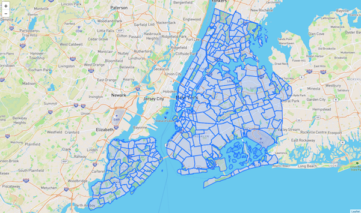
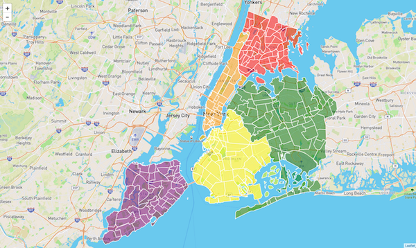

# Module 13 Class 2: Mapping GeoJSON Data

## Overview

Before class, walk through this week's Challenge assignment in office hours; then, in class, the students will delve further into using the JavaScript library Leaflet to make dynamic and interactive maps. The main focus of today's class is accessing GeoJSON data from an external source, then iterating over the GeoJSON data and creating a dynamic, interactive map. 

## Learning Objectives

By the end of class, students will be able to:

* Use external GeoJSON data to populate a map
* Modify the layer controls to add interactivity to maps

- - -

## Instructor Notes

The activities in this class will complement Lessons **13.5.1: Overview of GeoJSON Data** through **13.6.5: Add a Legend to the Map**. The students will benefit from these activities if they‘ve progressed through these lessons, which cover the following concepts, techniques, and tasks:  

* Read GeoJSON data with the `d3json()` method
* Create maps from GeoJSON data with `L.geoJSON()`
* Access different types of geographical features in the GeoJSON file
* Use a `baseMaps` object to reference a base layer
* Create multiple overlays for our maps


## Slides

[Leaflet Day 2 slideshow](https://docs.google.com/presentation/d/1zcmIhW5LCQPKbyZew5_-IBztNMI7eesPBVOi4s2na6g/edit?usp=sharing)

## Student Resources

Share the following [activity resources](https://2u-data-curriculum-team.s3.amazonaws.com/data-viz-online-lesson-plans/13-Lessons/13-2-Student_Resources.zip) with the students. 

- - - 

## Before Class

### 0. Office Hours

| Activity Time: 0:30       |  Elapsed Time:     -0:30  |
|---------------------------|---------------------------|

<details>
  <summary><strong>📣 Instructor Do: Challenge Instruction Walkthrough</strong></summary>

Let the students know that the first few minutes of Office Hours will include a walkthrough of the Challenge requirements and rubric, as well as helpful tips they need in order to be successful.

Open the Challenge in Canvas and go through the high-level instructions and requirements with your class. Be sure to check for understanding.

Open the Rubric in Canvas and go through the Mastery column with your class, and show how it maps back to the requirements for each deliverable. Be sure to check for understanding.

The first part of the assignment, **Deliverable 1: Add Tectonic Plate Data**, requires students to make a `d3.json()` call to plot tectonic plate GeoJSON LineString data. 

* We have provided the [tectonic plate starter code](../../../01-Assignments/13-Mapping_Earthquakes/Resources/tectonic_plate_starter_logic.js) to assist them. The starter code contains all the code used to plot the earthquake data on the two maps in this module.

For the tectonic plate data, they'll need to:

  * Add a second layer group variable for the tectonic plate data.

  * Add a reference to the tectonic plate data to the overlay object, so the earthquake data and tectonic plate data are selected. 

  * Style the lines with a color and weight that will make them stand out on all maps.

For the second part of the assignment, **Deliverable 2: Add Major Earthquake Data**, they'll need to add data for major earthquakes - those with  data with a magnitude of 4.5 or greater to the map. This data will be populated on the map along with the weekly earthquake data and the tectonic plate data.

For this part of the Challenge, they'll have to copy and refactor some of the code used to plot the weekly earthquake data. To help them, we have provided the [major earthquake starter code](../../../01-Assignments/13-Mapping_Earthquakes/Resources/major_eq_starter_logic.js).

For the major earthquake data, they'll need to:

  * Add a third layer group variable for the major earthquake data.

  * Add a reference to the major earthquake data to the overlay object, so all the data are selected. 

  * Change the `getColor()` function to use only three colors for the following earthquake magnitude ranges: less than or equal to 4.5, greater than 4.5 but less than 5, and greater than or equal to  5.

  * Use the same parameters in the `getRadius()` function.

  * When plotting the major earthquake data, they'll need to create a circleMarker that is styled and has a popup marker displaying the magnitude and location of the earthquake.

For the third part of the assignment, **Deliverable 3: Add an Additional Map**, the learners will need to add a third map style of their own choice to the earthquake map.

This task should not be that challenging since they already added map styles to the map tile layer in the module

They'll have to choose a map from the Mapbox style options, and then make sure that all the earthquake data and tectonic plate data are displayed on all maps on the webpage.

Encourage your class to begin the Challenge as soon as possible, if they haven’t already, and to use the Learning Assistants channel and the remainder of Office Hours with their instructional team for help as they progress through their work. If they feel like they need context to understand documentation or instructions throughout the week, this is where they can get it.

Open the floor to discussion and be sure to answer any questions they may have about the Challenge requirements before moving on to other areas of interest.

</details>

<details>
  <summary><strong>📣  Instructor Do: Office Hours</strong></summary>

For the remaining time, remind the students that this is their time to ask questions and get assistance from their instructional staff as they’re learning new concepts and working on the Challenge assignment.

Expect that students may ask for assistance. For example: 

* Challenge assignment 
* Further review on a particular subject
* Debugging assistance
* Help with computer issues
* Guidance with a particular tool

</details>


- - - 

## During Class 

### 1. Getting Started

| Activity Time:       0:10 |  Elapsed Time:      0:10  |
|---------------------------|---------------------------|

<details>
  <summary><strong>📣 1.1 Instructor Do: Foundation Setting (0:05)</strong></summary>

* Welcome students to class.

* Direct students to post individual questions in the Zoom chat to be addressed by you and your TAs at the end of class.

* Open the slideshow and use slides 1-7 to walk through the foundation setting with your class.

* **This Week - Leaflet.js** Talk through the key skills that students will learn this week, and let them know that they are building on their web visualization skills. 

* **Today's Objectives:** Now, outline the concepts covered in today's lesson. Remind students that they can find the relevant activity files in the “Getting Ready for Class” page in their course content. 

</details>

<details>
  <summary><strong>🎉 1.2 Everyone Do: Check-In (0:05)</strong></summary>

* Ask the class the following questions and call on students for the answers:

    * **Q:** How are you feeling about your progress so far?

    * **A:** We are building on our JavaScript and Leaflet skill set. It's important to look back and see what we accomplished, and acknowledge that it's a lot! It’s also okay to feel overwhelmed as long as you don’t give up. The more you practice, the more comfortable you'll be coding.
    
    * **Q:** How comfortable do you feel with this topic? 

    * **A:** Let's do "fist to five" together. If you are not feeling confident, hold up a fist (0). If you feel very confident, hold up an open hand (5).

</details>

<sub>[Having issues with this section? Report a bug!](https://bit.ly/3osCfkf)</sub>

- - -

### 2. GeoJSON

| Activity Time:       0:30 |  Elapsed Time:      0:40  |
|---------------------------|---------------------------|

<details>
  <summary><strong>📣 2.1 Instructor Do: What is GeoJSON? (0:10)</strong></summary>

* You can use slides 8 - 19 to help you demonstrate this section to the class.

* Inform students that the maps they have created are good for learning purposes, but for most applications we build, we are going to be pulling from an existing or external dataset hosted on a website. 

* The format of the existing or external dataset we will be using today is **GeoJSON**. GeoJSON is the easiest way to deliver geographical data.

* In Lesson 13.6.1, the students accessed GeoJSON earthquake data from the USGS. Open up the GeoJSON earthquake data for the [last hour](http://earthquake.usgs.gov/earthquakes/feed/v1.0/summary/all_hour.geojson) in your browser. You can send out this link so students can follow along. 

* This is a GeoJSON document depicting all of the earthquakes that have taken place globally within the past hour.

* Explain that GeoJSON is an open-standard format for representing simple geographical features along with their non-spatial attributes, using JSON.

  * Geographical features are represented by coordinates and can have other properties attached to them.

  * The different types of features are:

    1. Point

    2. LineString

    3. Polygon

    4. MultiPoint

    5. MultiLineString

    6. MultiPolygon

* **Q:** Ask the students what type of geographical feature the GeoJSON earthquake data is.

* **A:** It is "Point" type. 

  

* Using the Leaflet `geoJSON` method, we can feed the features data, unmodified, and the `geoJSON` method will know what kind of marker to make and where to place it.

* Demonstrate how the data the class is viewing contains a set of geographical coordinates as well as a list of properties for each point. [The USGS Documentation](http://earthquake.usgs.gov/data/comcat/data-eventterms.php) goes into detail about the meaning of each property.

* Assure students that they won't need to worry about each abbreviation for this activity. For now, we just want to plot the time and location of each earthquake.

  
 

* Inform students that Leaflet has a GeoJSON method that can be used to process and create markers using GeoJSON data as is, without any modifications. Encourage them to explore the Leaflet documentation to discover exactly how to handle GeoJSON with Leaflet.

* Ask the class the following questions and call on students for the answers:

    * **Q:** Where have we used this before?

    * **A:** We mapped GeoJSON data in Lessons 13.5.1 through 13.5.6, and mapped earthquake data in Lesson 13.6.1.

    * **Q:** How does this activity equip us for the Challenge?

    * **A:** We will need to access and map GeoJSON tectonic plate data and major earthquake data to complete the Challenge.

    * **Q:** What can we do if we don't completely understand this?

    * **A:** We can refer to the lesson plan and reach out to the instructional team for help.

* Answer any questions before proceeding to the student activity.

</details>

<details>
  <summary><strong>🎉 2.2 Everyone Do: GeoJSON activity (0:20)</strong></summary>

* You can use slides 20 and 21 to introduce this activity.

* For this activity, students will be working with GeoJSON data to plot occurrences of earthquakes.

* Make sure the students can download and open the [02-Evr_Geo-Json/Unsolved](Activities/02-Evr_Geo-Json/Unsolved) folder from the AWS link, which includes the following:
  * The [instructions](Activities/02-Evr_Geo-Json/README.md)
  * The [index.html](Activities/02-Evr_Geo-Json/Unsolved/index.html) file
  * The [logic.js](Activities/02-Evr_Geo-Json/Unsolved/logic.js) file
  * The [config.js](Activities/02-Evr_Geo-Json/Unsolved/config.js) file 
  * The [style.css](Activities/02-Evr_Geo-Json/Unsolved/style.css) file

* Go over the instructions in the README.

* Open the solved [index.html](Activities/02-Evr_Geo-Json/Solved/index.html) file in the browser to show them what the final map will look like. 

  

* Now, have everyone open the unsolved [logic.js](Activities/02-Evr_Geo-Json/Unsolved/logic.js) file.

* Ask for volunteers to help you write the code for steps 1 - 8 to complete the solution. If there are no volunteers, then copy the code from the solved [logic.js](Activities/02-Evr_Geo-Json/Solved/logic.js) file and explain the following, while pausing for the students to catch up:

  * First, inside the `d3.json` GET request, we create the `createFeatures` function and pass in the `data.features` object. 

    ```javascript
      // 1. Send the data.features object to the createFeatures function 
      createFeatures(data.features);
    ```
  * Let them know that it may be counterintuitive to create the `createFeatures` function before we define what it does. If this is confusing for them, then they can write the `createFeatures` function first.  

  * Now, we can create the `createFeatures` function, where we rename the `data.features` object as `earthquakeData`. 

    ```javascript
      //  2. Create the createFeatures function to hold the data.features object
      function createFeatures(earthquakeData) {
    ``` 

  * Then, inside the `createFeatures` function, we define what the function does for each features array and we give each feature a popup. 

    ```javascript
    // 3. Define a function we want to run once for each feature in the features array
    // 4. Give each feature a popup describing the place and time of the earthquake
    function onEachFeature(feature, layer) {
      layer.bindPopup("<h3>" + feature.properties.place +
        "</h3><hr><p>" + new Date(feature.properties.time) + "</p>");
    }
    ``` 
  * Next, we create the GeoJSON layer containing the features array on the `earthquakeData` object, then we run the `onEachFeature` function for each piece of data in the array. 

    ```javascript
    // 5. Create a GeoJSON layer containing the features array on the earthquakeData object
    // 6. Run the onEachFeature function once for each piece of data in the array
    var earthquakes = L.geoJSON(earthquakeData, {
      onEachFeature: onEachFeature
      });
    ``` 
  * Then, we send our `earthquakes` variable, which will be a layer on the map, to the `createMap` function. 

    ```javascript
      createMap(earthquakes);
      }
    ``` 

  * Finally, we create the `createMap` function with the `earthquakes` variable and place the map layers, base maps, overlay object, map object, and layer control inside the function. 

* Before moving on, check to see if the students are able to open the `index.html` file using the Python server, `python -m http.server`. 

* Send out the [02-Evr_Geo-Json/Solved](Activities/02-Evr_Geo-Json/Solved) folder for students to refer to later.

* Answer any questions before proceeding to the next activity.

</details>

<sub>[Having issues with this activity? Report a bug!](https://bit.ly/2UOVUhV)</sub>

- - -

### 3. NYC Neighborhoods

| Activity Time:       0:25 |  Elapsed Time:      1:05  |
|---------------------------|---------------------------|

<details>
    <summary><strong>🎉 3.1 Everyone Do: NYC Neighborhoods (0:25)</strong></summary>

* You can use slides 22 - 24 to introduce this activity.

* Next, we will be diving right into an example that uses some advanced Leaflet/GeoJSON functionality.

* Make sure the students can download and open the [02-Evr_Geo-Json/Unsolved](Activities/03-Evr_BasicNYCBoroughs/Unsolved) folder from the AWS link, which includes the following:
  * The [instructions](Activities/03-Evr_BasicNYCBoroughs/README.md)
  * The [index.html](Activities/03-Evr_BasicNYCBoroughs/Unsolved/index.html) file
  * The [nyc.geojson](Activities/03-Evr_BasicNYCBoroughs/Unsolved/static/data/nyc.geojson) data
  * The four [logic.js](Activities/03-Evr_BasicNYCBoroughs/Unsolved/static/js/) files
  * The [config.js](Activities/03-Evr_BasicNYCBoroughs/Unsolved/static/js/config.js) file 
  * The [style.css](Activities/03-Evr_BasicNYCBoroughs/Unsolved/static/css/style.css) file

* Go over the instructions in the README.

* We are going to be building a map of New York City that is broken down by boroughs and neighborhoods. Students will first make a basic map of the data, and then we will learn to spice it up as a class.

* Open the solved [index.html](Activities/03-Evr_BasicNYCBoroughs/Solved/index.html) file in the browser to show them what the first map will look like. 

  

**NOTE: There are 4 different JavaScript files you will be working with. Simply switch your HTML file to use a different `logic.js` file to access the different steps.**

* Now, have everyone open the unsolved [logic.js](Activities/03-Evr_BasicNYCBoroughs/Unsolved/static/js/logic.js) file.

* Let them know that the code to build this map will have the two boilerplate sections that they have been using up to this point, "creating a map object" and "adding a tile layer."

  ```javascript
  // Creating a map object
  var myMap = L.map("map", {
    center: [40.7128, -74.0059],
    zoom: 11
  });

  // Adding a tile layer
  L.tileLayer("https://api.mapbox.com/styles/v1/{id}/tiles/{z}/{x}/{y}?access_token={accessToken}", {
    attribution: "© <a href='https://www.mapbox.com/about/maps/'>Mapbox</a> © <a href='http://www.openstreetmap.org/copyright'>OpenStreetMap</a> <strong><a href='https://www.mapbox.com/map-feedback/' target='_blank'>Improve this map</a></strong>",
    tileSize: 512,
    maxZoom: 18,
    zoomOffset: -1,
    id: "mapbox/streets-v11",
    accessToken: API_KEY
  }).addTo(myMap);
  ```
* Next, we will assign a path to the `nyc.geojson` data to the `link` variable, and then use `d3.json()` to get the GeoJSON data.  

  ```javascript
  // If data.beta.nyc is down comment out this link
  var link = "http://data.beta.nyc//dataset/0ff93d2d-90ba-457c-9f7e-39e47bf2ac5f/resource/" +
  "35dd04fb-81b3-479b-a074-a27a37888ce7/download/d085e2f8d0b54d4590b1e7d1f35594c1pediacitiesnycneighborhoods.geojson";
  
  // Use this link to get the geojson data.
  //var link = "static/data/nyc.geojson";

  // Get our GeoJSON data using d3.json
  d3.json(link, function(data) {
    // Creating a GeoJSON layer with the retrieved data
    L.geoJson(data).addTo(myMap);
  });
  ```

* The `nyc.geojson` data can be found on a NYC community data site: [BetaNYC](http://data.beta.nyc/dataset/pediacities-nyc-neighborhoods).

  * If students want to use the direct link, it can be found [here](http://data.beta.nyc//dataset/0ff93d2d-90ba-457c-9f7e-39e47bf2ac5f/resource/35dd04fb-81b3-479b-a074-a27a37888ce7/download/d085e2f8d0b54d4590b1e7d1f35594c1pediacitiesnycneighborhoods.geojson).

  * Just like the last example, we have an array of features. Each feature is an object that contains properties (in this case, neighborhood information) and geometry (where it fits on the map).

  * **Note:** If the website is down, use the `nyc.geojson` file. To do so, run the following steps:

    * Make sure the link to data.beta.nyc is commented out in all the `logic.js` files.

      ```js
      // If data.beta.nyc is down comment out this link
      var link = "http://data.beta.nyc//dataset/0ff93d2d-90ba-457c-9f7e-39e47bf2ac5f/resource/" +
      "35dd04fb-81b3-479b-a074-a27a37888ce7/download/d085e2f8d0b54d4590b1e7d1f35594c1pediacitiesnycneighborhoods.geojson";
      ```

    * Make sure the link to the local file is commented.

      ```js
      // Uncomment this link local geojson for when data.beta.nyc is down
      // var link = "static/data/nyc.geojson";
      ```

* Run `python -m http.server` in the folder where your `index.html` file is located.

* Now we have our map! It's not terribly descriptive, however, so let's add some custom styling with the second map.

* Next, have everyone open the unsolved [logic2.js](Activities/03-Evr_BasicNYCBoroughs/Unsolved/static/js/logic2.js) file and tell them to copy over the code from the `logic.js` file. 

* In this file, we are going to change the colors of the features of our map. 

* For our style object, we are going to change the `fillColor` to pink, the border color will be white, and we'll make some modifications to the opacity and weight of the lines. 

  ```javascript
  // Our style object
  var mapStyle = {
    color: "white",
    fillColor: "pink",
    fillOpacity: 0.5,
    weight: 1.5
  };
  ```

* Send out the code for the style object, then have the student open the `index.html` file in the browser. Make sure that they change the `<script>` tag to access the `logic2.js` file.

* Check on the progress of the students and make sure everyone can render the second map. 

* Let them know that there is another way to set the style of a feature, so open up the next version of the map logic in [logic3.js](./Activities/03-Evr_BasicNYCBoroughs/Solved/static/js/logic3.js). 

  * In this version, we are passing in a `chooseColor` function that can style individual features based on their properties.

    ```javascript
    function chooseColor(borough) {
      switch (borough) {
      case "Brooklyn":
        return "yellow";
      case "Bronx":
        return "red";
      case "Manhattan":
        return "orange";
      case "Queens":
        return "green";
      case "Staten Island":
        return "purple";
      default:
        return "black";
      }
    }
    ```

    * In our `chooseColor` function, we are using a `switch` statement to return a different color based on the borough that is associated with the neighborhood.
    
    * **Q:** Ask the students why we pass the `borough` property in the function. 
  
  * **A:** If we look back at the GeoJSON, we can see that each feature has the `borough` property, which can be accessed through `feature.properties.borough`.

  * To style the boroughs, we assign the `chooseColor` function to the `fillColor` property and pass in the `feature.properties.borough` object. 

  * Each feature is styled using this function, so all of our boroughs will be color coded!

    

* The last step in completing our map will be to add some interaction. Specifically, we will be adding mouse events using the `onEachFeature` option. You can find the code that includes this option in [logic4.js](./Activities/03-Evr_BasicNYCBoroughs/Solved/static/js/logic4.js).

* This code is a bit more challenging, so walk the students through as you are live coding.

  * In the `d3.json()` method, we are using the `onEachFeature` that will call the provided  anonymous function on every feature, essentially looping through all of the neighborhoods. This is useful because we want to bind some mouse events to all of our neighborhoods.

  * First, we want to bind a popup so that, when we click on a neighborhood, we can see its name and the borough name.

  * We also have access to a number of events we can subscribe to. We are going to set events to trigger on `mouseover`, `mouseout`, and `click`. On `mouseover` and `mouseout`, we want to change the opacity of the feature so that it has a nice highlight effect.

  * Our `click` function calls the `fitBounds()` function on our clicked feature.

* Check with your students to see if there are any questions. Answer them all to the best of your ability before moving on.

</details>

<sub>[Having issues with this activity? Report a bug!](https://bit.ly/2XjYPAD)</sub>

- - -

### 4. Make Your Own Map

| Activity Time:       0:30 |  Elapsed Time:      1:35  |
|---------------------------|---------------------------|

<details>
  <summary><strong>📣  4.1 Groups Do: Make Your Own Map (0:30)</strong></summary>

* You can use slides 25 and 26 to introduce this activity.

* For this activity, students will be creating a data visualization story by plotting one or more of the following provided Boston GeoJSON datasets. 

* Make sure the students can download and open the [04-Grp_DataViz_Story/Unsolved](Activities/04-Grp_DataViz_Story/Unsolved) folder from the AWS link, which includes the following:
  * The [instructions](Activities/04-Grp_DataViz_Story/README.md).
  * The [GeoJSON data files](Activities/04-Grp_DataViz_Story/Unsolved/static/data)
  * The [index.html](Activities/04-Grp_DataViz_Story/Unsolved/index.html) file
  * The [logic.js](Activities/04-Grp_DataViz_Story/Unsolved/static/js/logic.js) file
  * The [config.js](Activities/04-Grp_DataViz_Story/Unsolved/static/js/config.js) file 
  * The [style.css](Activities/04-Grp_DataViz_Story/Unsolved/static/css/style.css) file

* Go over the instructions in the README. 

* Take a moment to answer any questions before dividing the students into groups of 4 - 6 students per group, class attendance permitting. Each group should have about 5 minutes to present their work in the next activity. 

* Let the students know that they will be presenting their visualizations in the next activity.

* As the students are working on their maps, check in with their progress and assist them if necessary. 

* We have provided solutions for some maps in the [04-Grp_DataViz_Story/Solved](Activities/04-Grp_DataViz_Story/Solved) folder. 

**NOTE: There are different JavaScript logic files for some suggested maps. Switch your HTML file to use a different `logic.js` file to access the different maps.**

  * The [logic1.js](Activities/04-Grp_DataViz_Story/Solved/static/js/logic1.js) file maps the Neighborhoods with public Wi-Fi locations.
  * The [logic2.js](Activities/04-Grp_DataViz_Story/Solved/static/js/logic2.js) file maps the Neighborhoods with electrical charging stations.
  * The [logic3.js](Activities/04-Grp_DataViz_Story/Solved/static/js/logic3.js) file maps the police districts in color with the police stations.
  * The [logic4.js](Activities/04-Grp_DataViz_Story/Solved/static/js/logic4.js) file maps the fire districts in color with the fire department locations.
  * The [logic5.js](Activities/04-Grp_DataViz_Story/Solved/static/js/logic5.js) file maps the public Wi-Fi locations.


</details>

<sub>[Having issues with this activity? Report a bug!]()</sub>

- - -

### 5. Present Your Map

| Activity Time:       0:20 |  Elapsed Time:      1:55  |
|---------------------------|---------------------------|

<details>
  <summary><strong>📣  5.1 Everyone Do: Map Presentation (0:20)</strong></summary>

* You can use slides 27 -30 to introduce this activity.

* For this activity, the groups will be presenting their data visualization story. 

* Allow no more than 5 minutes for each group. If there are more groups than time available for presenting, please adjust time in the previous activity. 

* Have one student present for the group, but make sure all students are contributing to the presentation or can answer the following questions:
  * Why did you choose the datasets you did for your story?
  * How did you map the data?
  * What does the mapped data show the viewer? 

* Answer any questions before ending class.


</details>

<sub>[Having issues with this activity? Report a bug!]()</sub>


- - -


### 6. Ending Class 

| Activity Time:       0:05 |  Elapsed Time:      2:00  |
|---------------------------|---------------------------|

<details>
  <summary><strong>📣  6.1 Instructor Do: Review </strong></summary>

* You can use slides 31 - 33 to assist you in ending class. 

* Before ending class, review the skills that were covered today and mention where in the module these skills are used: 
  * Mapping GeoJSON data was covered in **Lessons 13.5.1 through 13.5.6**.
  * Mapping earthquake data was covered in **Lesson 13.6.1**.
  * Adding a style to the map was covered in **Lesson 13.6.2**.
  * Adding color to the map was covered in **Lesson 13.6.3**.
  * Adding an additional overlay was covered in **Lesson 13.6.4**.

* Answer any questions the students may have.

</details>

<sub>[Having issues with this section? Report a bug!](https://bit.ly/35EOCT5)</sub>

- - -

© 2021 Trilogy Education Services, LLC, a 2U, Inc. brand.  Confidential and Proprietary.  All Rights Reserved.