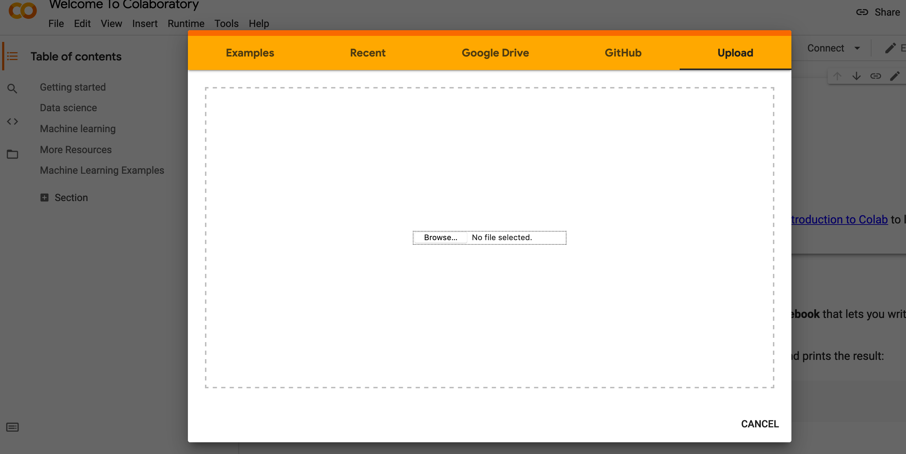

# Module 16 Class 1: PySpark Fundamentals

## Overview

This week, we will be introducing **Big Data**. In this unit, students will learn about big data and Spark, an engine for large-scale data processing. Students will use the Python version of Spark, PySpark, to manipulate data; they will then be introduced to Cloud concepts and Amazon Web Services.

In today's class, students will make sure they can connect to Google Colab. Then, they'll learn about the basics of Pyspark, including how to read in data, store it in PySpark DataFrames, and perform transformations and actions on the DataFrames.

## Learning Objectives

By the end of class, students will be able to:

* Get up and running with Google Colab Notebook
* Understand how Spark works
* Store a dataset in a PySpark DataFrame
* Filter DataFrames
* Work with dates in data and plot results

- - -

## Instructor Notes

* The activities in this class will complement Lessons **16.1.1: What is Big Data?** through **16.4.3: Spark Functions**.  The students will benefit from these activities if they‘ve progressed through these lessons, which cover the following concepts, techniques, and tasks:

* Big data overview
* Spark architecture
* Google Colab Notebooks
* Spark DataFrames and Datasets
* Spark transformations and actions


## Slides

[Big Data Day 1 slideshow](https://docs.google.com/presentation/d/112bzlvJGmH1DyrwItGCFSzEjKjiZHNaRoicxt_YJOk0/edit?ts=604be333#slide=id.gc35463efd6_0_114)

## Student Resources

Share the following [activity resources](https://2u-data-curriculum-team.s3.amazonaws.com/data-viz-online-lesson-plans/16-Lessons/16-1-Student_Resources.zip) with the students.

- - -

## Before Class

### 0. Office Hours

| Activity Time: 0:30       |  Elapsed Time:     -0:30  |
|---------------------------|---------------------------|

<details>
 <summary><strong> 📣 0.1 Instructor Do: Office Hours</strong></summary>

* Before you begin class, hold office hours. Office hours should be driven by students. Encourage students to take full advantage of office hours by reminding them that this is their time to ask questions and get assistance from instructional staff as they learn new concepts.

* Expect that students may ask for the following:

 * Further review on a particular subject
 * Debugging assistance
 * Help with computer issues
 * Guidance with a particular tool

</details>

- - -

## During Class

### 1. Getting Started

| Activity Time:       0:15 |  Elapsed Time:      0:15  |
|---------------------------|---------------------------|

<details>
 <summary><strong>📣 1.1 Instructor Do: Foundation Setting (0:10)</strong></summary>

* Welcome students to class.

* Direct students to post individual questions in the Zoom chat to be addressed by you and/or your TAs at the end of class.

* Open the slideshow and use slides 1-11 to walk through the foundation setting with your class.

* **Big Picture:** This is an opportunity to zoom out and see the big picture of where they are in the program. Take a moment to mention some real-world examples illustrating the value of what they're learning this week.

* **Program Pointers:** Talk through some of the key logistical things that will help students stay on track. This is an opportunity to speak to what students may need when they're at this particular point of the program.

* **This Week - Big Data:** Talk through the key skills students will be learning this week. Let the students know that they will be using PySpark and Google Colab Notebooks to learn how Spark works with big data.

* **This Week's Challenge:** For this week's Challenge, let the students know they’ll be working with a customer-review dataset from Amazon. The students will perform ETL using PySpark, and they’ll connect to an AWS RDS instance. Students will then determine if Vine reviews show bias toward being more favorable.

* **Career Connection:** Let students know how they will be using the skills covered this week throughout their careers. It's important for them to know the "why." Give examples of when they may be used in work or when you have used those skills in your workplace.

* **How to Succeed This Week:** Remind your students that they may have moments of frustration this week as they learn something complex. These moments are great for deepening their knowledge. Use the side material to outline some of the topics that they may find tricky in this module. Consider sharing something about your personal learning journey. It helps students to recognize that everyone starts somewhere and that they are not alone.

* **Today's Objectives:** Now, outline the concepts that will be covered in today's lesson. Remind students that they can find the relevant activity files in the “Getting Ready for Class” page in their course content.

</details>

<details>
 <summary><strong>🎉  1.2 Everyone Do: Check-In (0:05)</strong></summary>

* Ask the class the following questions and call on students for answers:

   * **Q:** How are you feeling about your progress so far?

   * **A:** We are starting to build your big-data skillset. It’s also okay to feel overwhelmed as long as you don’t give up.

   * **Q:** How comfortable do you feel with this topic?

   * **A:** Let's do "fist to five" together. If you are not feeling confident, hold up a fist (0). If you feel very confident, hold up an open hand (5).

</details>

<sub>[Having issues with this section? Report a bug!](https://bit.ly/3t5sGti)</sub>

- - -

### 2. Intro to Spark

| Activity Time:       0:20 |  Elapsed Time:      0:35  |
|---------------------------|---------------------------|

<details>
 <summary><strong> 📣 2.1 Instructor Do: Spark Overview (0:10)</strong></summary>

* Help students identify the significant differences between Hadoop (mrjob) and Spark. You may use slides 13-20 to accompany this activity. Be sure to mention the following:

 * Hadoop is a buzzword in the big-data industry, but many businesses are relying on Spark to solve their big-data problems. Spark runs on Hadoop, but it doesn't have to.

 * According to its website, Spark is "a fast and general engine for large-scale data processing."

 * Spark uses scripts from real programming languages, has a rich ecosystem, and is very scalable.

 * Spark uses in-memory computation instead of a disk-based solution, which means it doesn't need to talk to the Hadoop Distributed File System (HDFS) each time; instead, Spark retains as much as it can in memory.

 * Spark uses lazy evaluation, which delays the evaluation of an expression until its value is needed.

</details>

<details>
 <summary><strong> 📣 2.2 Everyone Do: Set Up Google Colab (0:10)</strong></summary>

* Students will need a Google account to use Google Colab Notebooks. If they do not have an account already, encourage them to sign up for one.

* Once you confirm that all students have a Google account, navigate to [Google Colaboratory](https://colab.research.google.com/notebooks/welcome.ipynb). Then, explain the following:

 * We will use **Cloud-based notebooks** to run Spark.

 * Google Colaboratory or Colab are Google-hosted notebooks.

 * These cloud-based notebooks allow for easy installation of Spark and the use of cloud computing power.

 * They are similar to the Jupyter Notebooks we run locally.

* Instruct students to open a new notebook by clicking *File* on the top left and select **New Notebook**.


* Explain that these notebooks will be saved in a folder called **Colab Notebooks** in Google Drive. Navigate to [Google drive](https://www.google.com/drive/) in a sepearte tab and select *Go to Google Drive*

 

* Then, show students the **Colab Notebooks** folder.


* A new tab will launch with a new notebook. The functionality is very similar to using Jupyter Notebook, except everything is now hosted online.

* Notebooks can be uploaded directly to Colab. Follow the steps to upload the [spark_dataframe_basics.ipnyb](Activities/03-Ins_Pyspark_DataFrames_Basics/Solved/spark_dataframe_basics.ipynb) file.

 1. From the Colab notebook you just opened, click **File** then **Upload notebook**.

 

 2. You can upload the file by either dragging it in the `spark_dataframe_basics.ipnyb` file into the box that pops up to upload, or by using the controls to select the file from your computer.



* Make sure all students are up and running with Colab Notebooks before moving on to the next section.

</details>

<sub>[Having issues with this section? Report a bug!](https://bit.ly/3ewgTQC)</sub>

- - -

### 3. Spark DataFrames

| Activity Time:       0:30 |  Elapsed Time:      1:05  |
|---------------------------|---------------------------|

<details>
 <summary><strong> 📣 3.1 Instructor Do: PySpark DataFrame Basics (0:10)</strong></summary>

* In this demonstration, you will introduce students to the basics of working with PySpark in Google Colab Notebooks. You may use slides 23-33 to accompany this activity.

* Open [spark_dataframe_basics.ipnyb](Activities/03-Ins_Pyspark_DataFrames_Basics/Solved/spark_dataframe_basics.ipynb) in a Colab Notebook.

* Explain that when using Colab, each notebook will need to install Spark and create a SparkSession. Start by explaining the first two code blocks:

 * The first block of code may seem scary, but all it is doing is installing Spark in our Colab environment. Installation only takes a few seconds, and it  saves the hassle of configuring Spark locally.

 * **Note** that Spark is constantly being updated and the version used in the code below may be outdated. If you run into installation issues, visit the [Spark distribution](http://www-us.apache.org/dist/spark/) to find the most recent version of Spark 2.X.X, then update the version in the variable below. You will need to update this for all notebooks.

 

 

 * In the second block of code, a SparkSession is created to control your Spark Application. Before interacting with Spark, a session is started and the app is named; this can be any name, but it is usually good to associate the app with what you are doing.

 ```python
 # Start Spark session
 from pyspark.sql import SparkSession
 spark = SparkSession.builder.appName("DataFrameBasics").getOrCreate()
 ```

 * Remind students that these two blocks of code will need to be run with every new notebook that will use Spark. The only thing that will change will be the app name.

* Now that Spark has been installed in the notebook and a session has been started, continue to explain the rest of the code:

 * Spark can create DataFrames manually.

 ```python
 # Create DataFrame manually
 dataframe = spark.createDataFrame([
                                  (0, "Here is our DataFrame"),
                                  (1, "We are making one from scratch"),
                                  (2, "This will look very similar to a Pandas DataFrame")
 ], ["id", "words"])

 dataframe.show()
 ```

 * Since Colab is hosted in the cloud, it’s much easier to read datasets directly from the cloud as well, compared to reading from your local files. In this code block, Colab will pull data from Amazon's Simple Storage Service (S3). This boilerplate code can be used to read other public files hosted on Amazon's services.

 ```python
 # Read in data from S3 Buckets
 from pyspark import SparkFiles
 url = "https://s3.amazonaws.com/dataviz-curriculum/day_1/food.csv"
 spark.sparkContext.addFile(url)
 df = spark.read.csv(SparkFiles.get("food.csv"), sep=",", header=True)
 ```

 * Similar to Pandas, Spark has a mechanism for reading data and storing it as a DataFrame.

 * Conceptually, Spark DataFrames are similar to Pandas DataFrames, but with Spark, the data is distributed.

 * Spark DataFrames organize data in a column-and-row format in which each column represents a variable, and each row represents a data point.

 * Spark DataFrames take in data from a variety of sources, apply transformations, and collect and display data.

 * When loading JSON data, the schema may not always be correct, so Spark allows you to import types and manually set the schema.

 * Data access and manipulation in Spark are very similar to Pandas.

 * `StructField` takes in the column's name, defines the data type, and takes in a Boolean. This is necessary because JSON files need to have the schema set manually.

 ```python
 # Import struct fields that we can use
 from pyspark.sql.types import StructField, StringType, IntegerType, StructType

 # Next we need to create the list of struct fields
 schema = [StructField("food", StringType(), True), StructField("price", IntegerType(), True),]
 schema

 # Pass in our fields
 final = StructType(fields=schema)
 final
 ```

 * Spark uses the `show()` method to display the data from DataFrames.

 ```python
 # Read our data with our new schema
 dataframe = spark.read.csv(SparkFiles.get("food.csv"), schema=final, sep=",", header=True)
 dataframe.show()
 ```

 * Spark can access the DataFrame in many different ways:

```python
dataframe['price']

type(dataframe['price'])

dataframe.select('price')

type(dataframe.select('price'))

dataframe.select('price').show()
```

 * Columns can be manipulated using the `withColumn()` method.

 ```python
 # Add new column
 dataframe.withColumn('newprice', dataframe['price']).show()
 ```

 * Columns can be renamed using `withColumnRenamed()`.

 ```python
 # Update column name
 dataframe.withColumnRenamed('price','newerprice').show()
 ```

 * Column data can be changed.

```python
# Double the price
dataframe.withColumn('doubleprice',dataframe['price']*2).show()

# Add a dollar to the price
dataframe.withColumn('add_one_dollar',dataframe['price']+1).show()

# Halve the price
dataframe.withColumn('half_price',dataframe['price']/2).show()
```

 * A list can be made out of columns with `collect()`.

 ```python
 # Collecting a column as a list
 dataframe.select("price").collect()
 ```

 * Use `toPandas()` to convert a PySpark DataFrame to a Pandas DataFrame. This should only be done for summarized or aggregated subsets of the original Spark DataFrame.

 ```python
 import pandas as pd
 pandas_df = dataframe.toPandas()
 ```

* Send out the [PySpark documentation](http://spark.apache.org/docs/latest/api/python/index.html) and the [spark_dataframe_basics.ipnyb](Activities/03-Ins_Pyspark_DataFrames_Basics/Solved/spark_dataframe_basics.ipynb) for students to review later.

</details>

<details>
 <summary><strong> ✏️ 3.2 Student Do: Demographic DataFrame Basics (0:15)</strong></summary>

* Next, proceed with the student exercise. In this exercise, students will use the basic features of PySpark DataFrames to analyze a CSV with demographic data.

* Open the [demographics.ipynb](Activities/04-Stu_Pyspark_DataFrames_Basics/Solved/demographics.ipynb) file in your Colab Notebook and scroll to the bottom to display what they will be creating.


* Make sure the students can download and open the [instructions](Activities/04-Stu_Pyspark_DataFrames_Basics/README.md), the [starter code](Activities/04-Stu_Pyspark_DataFrames_Basics/Unsolved/demographics.ipynb), and the [demographics.csv](Activities/04-Stu_Pyspark_DataFrames_Basics/Resources/demographics.csv) from the AWS link.

* Go over the instructions with the students and answer any questions before breaking the students out in groups.

* Divide students into groups of 3 to 5. They should work on the solution by themselves but can reach out to others in their group for help.

* Let students know that they may be asked to share and walk through their work at the end of the activity.

</details>

<details>
 <summary><strong> ⭐ 3.3 Review: Demographic DataFrame Basics (0:05)</strong></summary>

* Once time is up, ask for volunteers to walk through their solution. Remind them that it is perfectly alright if they didn't finish the activity.

* To encourage participation, you can open the [starter code](Activities/04-Stu_Pyspark_DataFrames_Basics/Unsolved/demographics.ipynb) and ask the students to help you write the code to get the column names and the first ten rows.

* Continue this process for the remainder of the code.

* If there are no volunteers, open up [demographics.ipynb](Activities/04-Stu_Pyspark_DataFrames_Basics/Solved/demographics.ipynb) in Colab and go over the solution file line by line with the class, answering whatever questions students may have.

* Key points to cover are:

 * Spark is installed and a SparkSession is started.

 ```python
 # Start Spark session
 from pyspark.sql import SparkSession
 spark = SparkSession.builder.appName("Demographics").getOrCreate()
 ```

 * `SparkFiles` is imported to read in a file, and a URL to the data is stored in a variable.

 ```python
 # Read in data from S3 Buckets
 from pyspark import SparkFiles
 url = "https://s3.amazonaws.com/dataviz-curriculum/day_1/demographics.csv"
 ```

 * Spark adds the file with `spark.sparkContext.addFile(url)`.

 * Use Spark to read in the data, separate it with commas, and take the header.

 ```python
 spark.read.csv(SparkFiles.get("demographics.csv"), sep=",", header=True)
 ```

 * Use `df.columns` to see the list of column names.

 * Using `show()` to get a summary of the DataFrame columns is similar to using the `head()` method in Pandas.

 * Use `describe()` and `printSchema()` to show the schema.

 * Show that we can select specific columns to `describe`.

   

 * Show that the `Salary` column can be renamed using `withColumnRenamed`.

 ```python
 # Rename the Salary column to `Salary (1k)` and show only this new column
 df = df.withColumnRenamed('Salary', 'Salary (1k)')
 df.select("Salary (1k)").show()
 ```

 * Show that we can add a new `Salary` column that multiplies each `Salary (1k)` column by 1,000.

   


* Send out the [solution file](Activities/04-Stu_Pyspark_DataFrames_Basics/Solved/demographics.ipynb) for students to review later.

* Answer any questions students may have before moving on to the next activity.

</details>

<sub>[Having issues with this section? Report a bug!](https://bit.ly/3qupqWU)</sub>

- - -

### 4. Filtering DataFrames

| Activity Time:       0:30 |  Elapsed Time:      1:35  |
|---------------------------|---------------------------|

<details>
 <summary><strong> 📣 4.1 Instructor Do: PySpark DataFrame Filtering (0:05)</strong></summary>

* In this activity, you will be reviewing how to filter PySpark DataFrames. You may use slides 37-40 to accompany this activity.

* Import [spark_filtering.ipynb](Activities/05-Ins_Pyspark_DataFrames_Filtering/Solved/spark_filtering.ipynb) into Colab and run the file.

* Explain the following:

 * Spark can order DataFrames by using the `orderBy()` method.

 * Pass in the column name and either `asc()` for ascending order or `desc()` for descending order.

 ```python
 # Order a DataFrame by ascending values
 df.orderBy(df["points"].asc()).show(5)

 # Order a DataFrame by descending values
 df.orderBy(df["points"].desc()).show(5)
 ```

 * Spark can import other helper functions as well. For example, `avg()` finds the average of the values in the input column.

 ```python
 # Import average function
 from pyspark.sql.functions import avg
 df.select(avg("points")).show()
 ```

 * The `filter()` method allows more data manipulation, similar to SQL's `WHERE` clause. Here, it is filtering for all wine that has a price lower than $20.

 ```python
 # Using filter
 df.filter("price<20").show()
 ```

 * The exact columns can be used by combining the `select` method with `filter`.

 ```python
 # Filter by price on certain columns
 df.filter("price<20").select(['points','country', 'winery','price']).show()
 ```

 * Similar to Pandas, Spark can compare multiple conditions using Python operators.

* Send out the [spark_filtering notebook](Activities/05-Ins_Pyspark_DataFrames_Filtering/Solved/spark_filtering.ipynb) for students to refer to later.

* Answer any questions before proceeding to the student activity.

</details>

<details>
 <summary><strong> ✏️ 4.2 Student Do: PySpark Demographic Filtering (0:20)</strong></summary>

* Next, proceed with the student exercise. In this activity, students will use the PySpark filtering functions to filter through the demographic dataset.

* Open the [demographics_filtered.ipynb](Activities/06-Stu_Pyspark_DataFrames_Filtering/Solved/demographics_filtered.ipynb) in Colab to display some of the tables they will be creating.

* Make sure the students can download and open the [instructions](Activities/06-Stu_Pyspark_DataFrames_Filtering/README.md) and the [starter code](Activities/06-Stu_Pyspark_DataFrames_Filtering/Unsolved/demographics_filtered.ipynb) from the AWS link.

* Go over the instructions with the students and answer any questions before breaking the students out in groups.

* Divide students into groups of 3 to 5. They should work on the solution by themselves but can reach out to others in their group for help.

* Let students know that they may be asked to share and walk through their work at the end of the activity.

</details>

<details>
 <summary><strong> ⭐ 4.3 Review: PySpark Demographic Filtering (0:05)</strong></summary>

* Once time is up, ask for volunteers to walk through their solution. Remind them that it is perfectly alright if they didn't finish the activity.

* To encourage participation, you can open the [starter code](Activities/06-Stu_Pyspark_DataFrames_Filtering/Unsolved/demographics_filtered.ipynb) and ask the students to help you write the code to get the occupation with the highest salary.

* Continue this process for the remainder of the code.

* If there are no volunteers, open up the [solution](Activities/06-Stu_Pyspark_DataFrames_Filtering/Solved/demographics_filtered.ipynb) file and review it line by line with the class, answering whatever questions students may have.

* Key points to cover are:

 * Use the `orderBy` method with `desc` to show the occupations and salaries in descending order to find the highest salary.

 ```python
 # What occupation had the highest salary?
 df.orderBy(df["Salary"].desc()).select("occupation", "Salary").limit(1).show()
 ```

 * We can leave out `desc` to get the values in ascending order to find the lowest salary.

 ```python
 # What occupation had the lowest salary?
 df.orderBy(df["Salary"]).select("occupation", "Salary").limit(1).show()
 ```

 * We can import functions such as `mean` to apply to our columns. This creates an aggregate view called `avg(Salary)`.

 ```python
 # What is the mean salary of this dataset?
 from pyspark.sql.functions import mean
 df.select(mean("Salary")).show()
 ```

 * We can apply `min` and `max` functions to the Salary column.

 ```python
 # What is the max and min of the Salary column?
 from pyspark.sql.functions import max, min
 df.select(max("Salary"), min("Salary")).show()
 ```

 * We can use a filter to show all occupations with salaries higher than $80,000.

   

 * We can use `groupBy` with an aggregation function to show the average age and height by academic degree type.

   

* Send out the [solution](Activities/06-Stu_Pyspark_DataFrames_Filtering/Solved/demographics_filtered.ipynb) for students to refer to later.

* Answer any questions before moving on to the next activity.

</details>

<sub>[Having issues with this section? Report a bug!](https://bit.ly/3ch0oVZ)</sub>

- - -

### 5. Dates and Plotting

| Activity Time:       0:20 |  Elapsed Time:      1:55  |
|---------------------------|---------------------------|

<details>
 <summary><strong> 📣 5.1 Instructor Do: PySpark DataFrame Dates (0:05)</strong></summary>

* In this demonstration, you will be reviewing how to handle data formats and plot data with PySpark. You may use slides 45-49 to accompany this activity.

* Import [spark_dates.ipynb](Activities/07-Ins_Pyspark_DataFrames_Dates/Solved/spark_dates.ipynb) into Colab.

* Walk students through the code and cover the following:

 * To avoid errors in reading the data, `inferSchema=True, timestampFormat="yyyy/MM/dd HH:mm:ss"` is used to tell Spark to infer the schema and use this format for handling timestamps.

 * It's common to encounter a variety of date and timestamp formats. Spark provides a functions library with date and timestamp conversion functions.

 * The `year` function is imported, which allows you to select the year from a timestamp column.

 ```python
 # Import date time functions
 from pyspark.sql.functions import year

 # Show the year for the date column
 df.select(year(df["date"])).show()
 ```

 * A new column storing only the year can be created.

 ```python
 # Save the year as a new column
 df = df.withColumn("year", year(df['date']))
 df.show()
 ```

 * With the new column, we can now group by the year and find the average precipitation.

 ```python
 # Find the average precipitation per year
 averages = df.groupBy("year").avg()
 averages.orderBy("year").select("year", "avg(prcp)").show()
 ```

 * The same can be done with the month function, except this time we’ll use the `max()` function.

 * The DataFrame can also be exported to a Pandas DataFrame.

 ```python
 # Import the summarized data to a pandas dataframe for plotting
 # Note: If your summarized data is still too big for your local memory then your notebook may crash

 pandas_df = averages.orderBy("month").select("month", "max(prcp)").toPandas()
 pandas_df.head()
 ```

 * From the Pandas DataFrame, we can use Matplotlib to chart the data.

 

 * Demonstrate the different methods that are parts of the date and time PySpark functions.

* Send out [spark_dates solution notebook](Activities/07-Ins_Pyspark_DataFrames_Dates/Solved/spark_dates.ipynb) for students to review later.

* Answer any questions before moving on to the next activity.

</details>

<details>
 <summary><strong> ✏️ 5.2 Everyone Do: Plotting Bigfoot (0:15)</strong></summary>

* In this exercise, students will use date formatting with PySpark to plot Bigfoot sightings.

* Open the [bigfoot.ipynb](Activities/08-Evr_Pyspark_Bigfoot/Solved/bigfoot.ipynb) file in a Colab Notebook and display the graph they will be creating.


* Make sure the students can download and open the [instructions](Activities/08-Evr_Pyspark_Bigfoot/README.md) and the [starter code](Activities/08-Evr_Pyspark_Bigfoot/Unsolved/bigfoot.ipynb) from the AWS link.

* Go over the instructions with the students, then let the students work on their solution for 5 to 7 minutes.

* When time is up, open the [starter code](Activities/08-Evr_Pyspark_Bigfoot/Unsolved/bigfoot.ipynb), then ask the students to help you write code to create a year column and to save it as 'Year'.

* Continue this process for the remainder of the code.

* If there are no volunteers, open up the [solution](Activities/08-Evr_Pyspark_Bigfoot/Solved/bigfoot.ipynb) in a Colab Notebook and go over the solution file line by line with the class, answering whatever questions students may have.


* Key points to cover include:

 * Import the functions needed to handle the year-date conversion.

 ```python
 # Import date time functions
 from pyspark.sql.functions import month, year
 ```

 * Create a new DataFrame with only the year, using the `withColumn` method and the `year` function.

 ```python
 # Create a new DataFrame with the column Year
 df.select(year(df["timestamp"])).show()
 ```

 * Show how the `year` function can be used to create a new Year column from the timestamp. This Year column can then be used to group, count, and order sightings per year.

 ```python
 # Find the total bigfoot sightings per year
 averages = df.groupBy("year").count()
 averages.orderBy("year").select("year", "count").show()
 ```

 * Take the aggregated data and convert it to a Pandas DataFrame

```python
# Import the summarized data to a pandas DataFrame for plotting
# Note: If your summarized data is still too big for your local memory then your notebook may crash
import pandas as pd
pandas_df = averages.orderBy("year").select("year", "count").toPandas()
pandas_df.head()
```

 * Clean the data with Pandas to get a "sightings" column.

 ```python
 # Clean the data and rename the columns to "year" and "sightings"
 pandas_df = pandas_df.dropna()
 pandas_df = pandas_df.rename(columns={"count": "sightings"})
 pandas_df.head()
 ```

 * Plot your DataFrame.

   

* Send out the [bigfoot solution](Activities/08-Evr_Pyspark_Bigfoot/Solved/bigfoot.ipynb) for students to refer to later.

* Answer any questions before ending class.

</details>

<sub>[Having issues with this section? Report a bug!](https://bit.ly/3ep5dPC)</sub>

- - -

### 6. Ending Class

| Activity Time:       0:05 |  Elapsed Time:      2:00  |
|---------------------------|---------------------------|

<details>
 <summary><strong>📣  6.1 Instructor Do: Review </strong></summary>

* Before ending class, review the skills that were covered today and mention where these skills are taught in the module.
 * Getting started with Google Colab Notebooks was covered in **Lesson 16.4.1**.
 * The basics of PySpark DataFrames were covered in **Lesson 16.4.2**.
 * Spark functions, transformations, and actions were covered in **Lesson 16.4.3**.

* Answer any questions the students may have.

* Finally, encourage your class to begin the Challenge as soon as possible, if they haven’t already, and to use the Learning Assistants channel and pre-scheduled Office Hours with their instructional team for help as they progress through their work. If they feel like they need context to understand documentation or instructions throughout the week, this is where they can get it.

</details>

<sub>[Having issues with this section? Report a bug!](https://bit.ly/3epRdp8)</sub>

---

© 2021 Trilogy Education Services, LLC, a 2U, Inc. brand.  Confidential and Proprietary.  All Rights Reserved.
