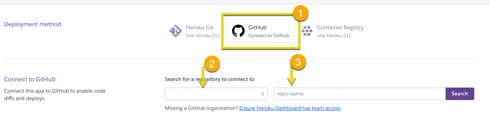
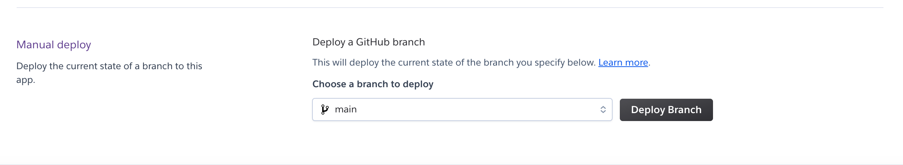
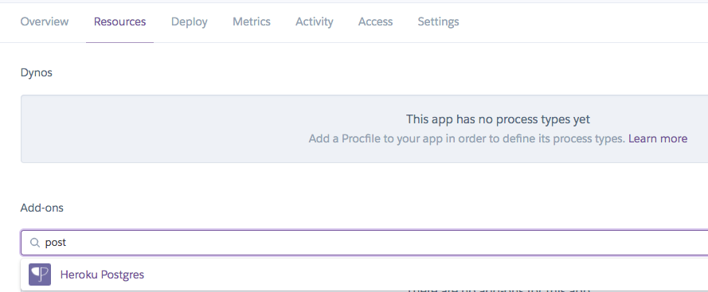
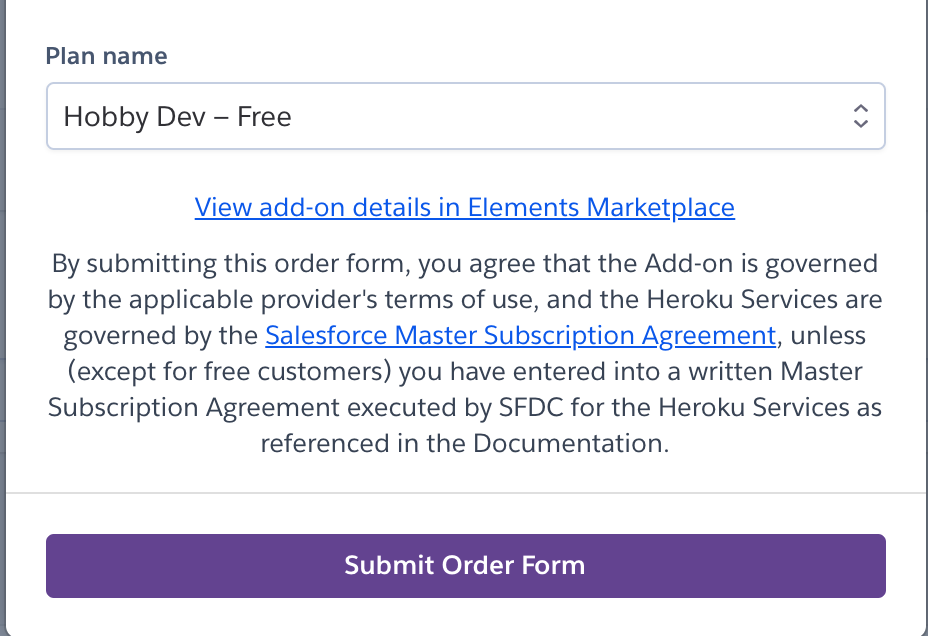
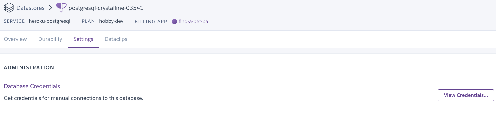
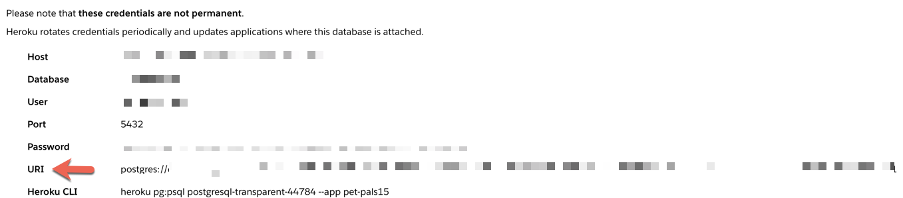

# Module 20-3 Class 2: Heroku Deployment and Project Work

## Overview

Today, teams will learn how to deploy a website using Heroku. This will help them deploy their final project application. For the second half of class, the teams will present the progress they've made on their project in a check-in with the instructor. 

For this week, all teams should be wrapping up the loose ends, such as making sure they can connect to the database, finalizing their dashboard, merging all PRs, conducting a final editorial review, and practicing their portion of the presentation. 

## Learning Objectives

By the end of class, students will be able to:

* Develop and deploy a website on Heroku

- - -

## Slides

[Project Week 3 Day 2](https://docs.google.com/presentation/d/1uBKaI_SgzVHdAXvKYBAMZlX3L9PPtTI2NlBEhiaUJ-c/edit?usp=sharing)

### Student Resources

Share the following [activity resources](https://2u-data-curriculum-team.s3.amazonaws.com/data-viz-online-lesson-plans/20-Lessons/M20-3-2-Student_Resources.zip) with the students. 

- - -

## Before Class

### 0. Office Hours

| Activity Time: 0:30       |  Elapsed Time:     -0:30  |
|---------------------------|---------------------------|

<details>
  <summary><strong>📣  Instructor Do: Office Hours</strong></summary>

Encourage students to take full advantage of office hours by reminding them that this is their time to ask questions and get assistance from instructional staff on their final project.

* Expect that students may ask for assistance with the following: 
  * Connecting to the database 
  * Finalizing their dashboard
  * Debugging
  * Issues with GitHub
  * Computer issues

</details>

<sub>[Having issues with this section? Report a bug!](https://bit.ly/3veFIFV)</sub>

- - - 

## During Class

### 1.  Getting Started

| Activity Time:       0:05 |  Elapsed Time:      0:05  |
|---------------------------|---------------------------|

<details>
  <summary><strong>📣 1.1 Instructor Do: Foundation Setting (0:05)</strong></summary>

* Welcome students to class.

* Direct students to post individual questions in the Zoom chat to be addressed by you and your TAs at the end of class.

* Open the slideshow and use slides 1 - 7 to walk through the foundation setting with your class. Then, you can use slides 8 - 14 as needed for the remaining activities. 

* **This Week - Final Project:** At the start of today’s class, all teams should have a topic and a dataset or datasets, and they should be completing EDA on the data and making significant progress with integrating their database. By the end of this week, EDA should be complete, the database should be integrated, and the visuals for the data story and a storyboard for the final dashboard should be created. 

* **Today's Objectives:** Now, outline the concepts covered in today's lesson. 

</details>

<sub>[Having issues with this section? Report a bug!](https://bit.ly/3sLWkmX)</sub>

- - - 

### 2. Group Project Check

| Activity Time:       0:15 |  Elapsed Time:      0:20  |
|---------------------------|---------------------------|

<details>
  <summary><strong>🎉  2.1 Everyone Do: Group Check-in (0:05)</strong></summary>

Open the [Zoom Polling](https://support.zoom.us/hc/en-us/articles/213756303-Polling-for-Meetings) feature or a [Poll Everywhere](http://www.polleverywhere.com), and launch a poll of the class to identify areas that they would like to review from this week's project week.

Poll Text:
* How are you feeling about the current state of your project?

  * It's ready for the next stage!
  * I'm a little stressed, but the project will be ready for the next stage in time.
  * One or two members are behind. I'm a little worried.
  * We are all behind on our parts. I'm really worried. Help!

* Use the results as a gauge for how the groups are feeling and keep the results in mind during check-ins.

</details>

<details>
    <summary><strong> 📣 2.2 Instructor Do: Slideshow (0:05)</strong></summary>

* You can use slides 8 - 11 to assist you with this activity.

* Use **slide 8** to explain that by this point, students should have the following completed, and if they do not, they need to make sure to get to this point as soon as possible or risk falling too far behind schedule.

* Use **slide 9** to remind the students that they may have to help others to prevent their project from falling behind schedule and that communicating among team members is vital to the completion of the project.

* Use **slide 10** to let the students know that for the first half of class, we will learn to deploy an application on Heroku; and the second half of class will be for project work, but it is also a good chance to get assistance with any issues. The instructional team will also go around to have the groups show their progress up to this point.

* Use **slide 11** to point out that when a member of the instructional staff approaches the group, students should be ready to discuss or show the progress they have made up to this point. This should be in the form of code (on GitHub), Google slides, or a storyboard they would show to a shareholder. The groups should be prepared to talk about their ML model, their database and its relationships, their dashboard, and where they should be by next week.

</details>

<details>
  <summary><strong> 📣 2.3 Instructor Do: Compare to Rubric (0:05)</strong></summary>

* One way to help teams stay on track is to compare the team's work to the third segment's rubric. Understanding how close they are to each deliverable will tell you a few things:

  * For example, if they aren't meeting any milestones, it could indicate that they're lost or stuck. It could also mean that they aren't very efficient with their time. This is a great opportunity to help realign strategies and goals as needed.

* Click [here](Resources/Segment_3_rubric.pdf) to view the rubric for the third segment.

</details>

<sub>[Having issues with this section? Report a bug!](https://bit.ly/2QMQ9lf)</sub>

- - -

### 3. Heroku Application Deployment

| Activity Time:       0:30 |  Elapsed Time:      0:50  |
|---------------------------|---------------------------|

<details>
  <summary><strong> 📣 3.1 Instructor Do: Heroku Application Deployment (0:30)</strong></summary>

* This Heroku activity is recommended to give students experience in deploying an application that they can then apply to their projects.

  * **Note:** If you have a preferred deployment method, you are more than welcome to share those with students and to send out third-party tutorials on those!

### Prerequisites

* Before you start, be sure to confirm the following:

  * All the students can download and open the [Heroku Deployment](Heroku_Deployment) folder from the AWS link. If not, share the folder with them. 
  
  * Everyone has signed up for a [Heroku](https://www.heroku.com) account.
  
  * Everyone has installed the [Heroku CLI tool](https://devcenter.heroku.com/articles/heroku-cli#download-and-install).

### Deploying an application

* In this activity, we will deploy an application called Pet Pals to Heroku. The application takes the name of a pet and plots its location on the map. The actual code for the application is not nearly as important as the steps for deploying it to Heroku. These steps can be repeated for your own applications.

* This process consists of:

  1. Creating a repo for the application.
  2. Preparing the application with additional configuration files (`Procfile` and `requirements.txt`)
  3. Creating the Heroku application
  4. Preparing the Heroku database

#### Part 1: Create a New Repo

* On Github, create a new repo called **Pet_Pals** and clone it to your desktop.

* Next, add the starter files from the [Heroku Deployment/Starter](Heroku_Deployment/Starter) folder to the **Pet_Pals** repo.

#### Part 2: Configuration Files

* Create a new conda environment for this app with the following code: 
  * All of our project dependencies will be installed in this environment.
  * **Note:** This should contain only python 3.7&mdash;and not anaconda.

    ```sh
    conda create -n pet_pals_env python=3.7
    ```

* Activate this new environment before proceeding.

  ```sh
  conda activate pet_pals_env
  ```

  * **Note:** If you run into issues, try the following command instead.  

    ```sh
    source activate pet_pals_env
    ```

* Next, install `gunicorn` using the command, `pip install gunicorn`. Explain to students that Gunicorn is a high-performance web server that can run their Flask app in a production environment.

* Because this app will be using Postgres, we will install `psycopg2` with `pip install psycopg2`. This will install `psycopg2` version 2.7.7. For future versions, i.e., 2.8, we will need to use `psycopg2-binary`. Install `psycopg2-binary` with `pip install psycopg2-binary`. 

* Install the remaining libraries into your new environment.

  ```sh
  pip install flask
  pip install flask-sqlalchemy
  pip install pandas
  ```

* Navigate to the folder that contains `initdb.py`, and run the following command to initialize the database:

  ```sh
  python initdb.py
  ```

* Next, to make the `run.sh` file executable, run the following command:

  ```sh
  chmod a+x run.sh
  ```

* You can test the application by running the following in your command line:

  ```sh
  ./run.sh
  ```

* Navigate to `127.0.0.1:5000` to view your webpage and test out the app before deploying on Heroku. 

* To see all the data in the database, navigate to the API, `http://127.0.0.1:5000/api/pals`.

* Next, stop the server so we can generate the `requirements.txt` file. This file is a list of the Python packages required to run the app. Heroku will use this file to install all of the app's dependencies.

  ```sh
  pip freeze > requirements.txt
  ```

  * **Important:** In the `requirements.txt` file, downgrade `SQLAlchemy` to `SQLAlchemy==1.3.23`. This will avoid the `NoSuchModuleError: Can't load plugin: sqlalchemy.dialects:postgres` error from appearing and preventing your app from running.  

* The final configuration file that we need is `Procfile`. This file is used by Heroku to run the app.

  ```sh
  touch Procfile
  ```

* Add the following code to the `Procfile`; this code will instruct Heroku how to run the app.
  
  ```sh  
  web: gunicorn pet_pals.app:app
  ```

  * In the code above, `pet_pals` is the name of the folder that contains your `app` as a python package (i.e., the name of the folder with the `__init__.py` file in it).

* Next, use git to `add`, `commit`, and `push` everything up to your repo.

#### Part 3: Creating the Heroku App

* Navigate to [Heroku](https://www.heroku.com), and log into your account.

* Once you are at the main dashboard, click **New** in the top right and select **Create a new app**.

  * Give your app an unique name, and leave the region as the default value.

* On Heroku, go to the **Deploy** section of your app's homepage, and follow the steps to deploy the app.

  * In the **Deployment method** section, select **GitHub**, and type your GitHub username in the **Search for a repository to connect to** field. (If you already have an app connected to GitHub you will see your name in this field.) 
  
  * Next, type “Pet_Pals” in the field that says **repo-name** or use the **Search** button to search for your pet-pals repo containing your code from the previous step.

    

  * Once the repo has been selected, click on **Connect**. 

    

  * Next, navigate to the **Manual deploy** section below, and click **Deploy Branch**.

    

  * Once you see the "Your app was successfully deployed" message, you can click on **View** to launch your Pet Pals webpage. 

    
  
    * **Note:** The database has not been set up yet, so there is one more step before it is fully functioning.


#### Part 4: Preparing the Database

* After creating a new app on Heroku, navigate to **Resources**:

  

  * Under **Add-ons**, search `Heroku Postgres`. Make sure to use the free version, then click **Submit Order Form**.

    

* Once **Heroku Postgres** is added as your database, click on **Heroku Postgres**.

  

* Click on the **Settings** tab, then click on **View Credentials...**.

  

* The connection string to the database should now be available in the **URI** field:

  

* Heroku will automatically assign this URI string to the `DATABASE_URL` environment variable that is used within `app.py`. The code that is already in `app.py` will be able to use that environment variable to connect to the Heroku database.

  ```python
  # DATABASE_URL will contain the database connection string:
  app.config['SQLALCHEMY_DATABASE_URI'] = os.environ.get('DATABASE_URL', '')
  # Connects to the database using the app config
  db = SQLAlchemy(app)
  ```

* The final step requires the Heroku CLI. If students do not have it installed, please have them follow the instructions for installing the [Heroku CLI](https://devcenter.heroku.com/articles/heroku-cli).

* After adding the database, the final step is to initialize the database. To do this, we use the heroku CLI. From the terminal, type the following, making sure to replace `<name of your app>` with the name of your app as it appears in Heroku:

  ```sh
  heroku run python initdb.py -a <name of your app>
  ```

  * **Note:** In the `initdb.py` file, we have commented out `db.drop_all()`. If you would like to drop all the data from the database, you can uncomment this line, push the changes to GitHub, **Deploy Branch** on Heroku, and run `heroku run python initdb.py -a <name of your app>` again. 

* Your database is now initialized, and you can open the application using `heroku open -a <name of your app>` from the terminal or from **Open App** on the webpage.

* **Note:** When adding the pet's longitude, make sure you enter the negative value; otherwise, the data won't be populated on the US map. 

</details>

<sub>[Having issues with this section? Report a bug!](https://bit.ly/3aBf56m)</sub>

- - -

### 4. Group Project Check-ins

| Activity Time:       1:05 |  Elapsed Time:      1:55  |
|---------------------------|---------------------------|


<details>
  <summary><strong> 📣 4.1 Instructor Do: Address the Topic (0:05)</strong></summary>

* Begin the check-in by encouraging the team to talk you through the progress they have made up to this point. They should have a draft of a presentation ready. As they are presenting, consider the following questions:

* Does the GitHub repo have a README.md with a description?
* Are all the PRs that contain working code merged?
* Has the final editorial review been conducted?
* Does the ML model do what it is supposed to do; if not, have you addressed this in your presentation?
* What are the limitations of the ML model? 
* Can you connect to the database?
* Do you have a static version of the application in case it is not working on Heroku?
* Does the storyboard describe the tools used and the interactive elements?

</details>

<details>
    <summary><strong> 📣 4.2 Instructor Do: Conduct Check-ins (0:55)</strong></summary>

* This week, you will be checking on the progress each team has made with their project. The teams should be in full flight on their projects and preparing for their deliverables. Be prepared for various challenges or roadblocks that each member may have.

* Create breakout rooms for each team. Have them continue working on their project, but also have them be ready to deliver their content for this segment. Make sure they are ready to address any problems they are having. If a team is not currently checking in with you, they should be focusing on their project goals for this segment.

* **Note:** The following times are only recommendations for each team's check-in (a total of 15 minutes per team). Based on the size of your cohort, you may need to adjust the timing as needed so every group has been assisted.

</details>

<details>
  <summary><strong> 📣 4.3 Instructor Do: Suggestions and Q&A (0:05)</strong></summary>

* Think of yourself as a stakeholder who is already aware of the objectives that need to be met this week. Based on your observations, provide feedback to the teams on what they've shown you so far. This is also a great time to answer questions from the team.

</details>

<sub>[Having issues with this section? Report a bug!](https://bit.ly/2Qro3MA)</sub>

- - - 

### 5. Ending Class 

| Activity Time:       0:05 |  Elapsed Time:      2:00  |
|---------------------------|---------------------------|

<details>
  <summary><strong>📣  5.1 Instructor Do: Project Progression&mdash;Next Steps (0:05) </strong></summary>

* Before ending class, use **slide 14** to let the teams know where they should be on their project timeline. 

* For the next class, the students should be working on the following:
   * Make sure the project README.md has a conclusion and all the visualizations.
   * All PRs that are vital to the project are merged.
   * All peer reviews are completed; all code meets the guidelines (e.g., PEP8 for Python); and code is clear, concise, and documented.
   * All the final touches on the dashboard and presentation have been made.

</details>

<sub>[Having issues with this section? Report a bug!](https://bit.ly/3vEPdyv)</sub>

- - - 

© 2021 Trilogy Education Services, LLC, a 2U, Inc. brand.  Confidential and Proprietary.  All Rights Reserved.
